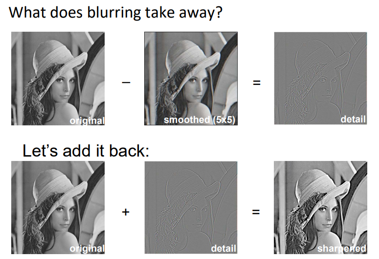
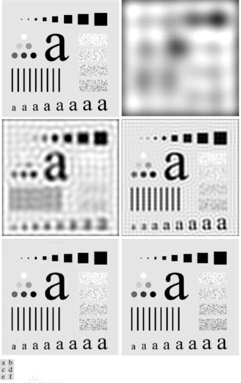
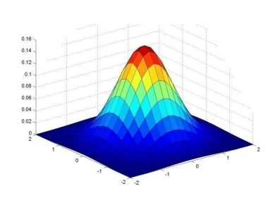
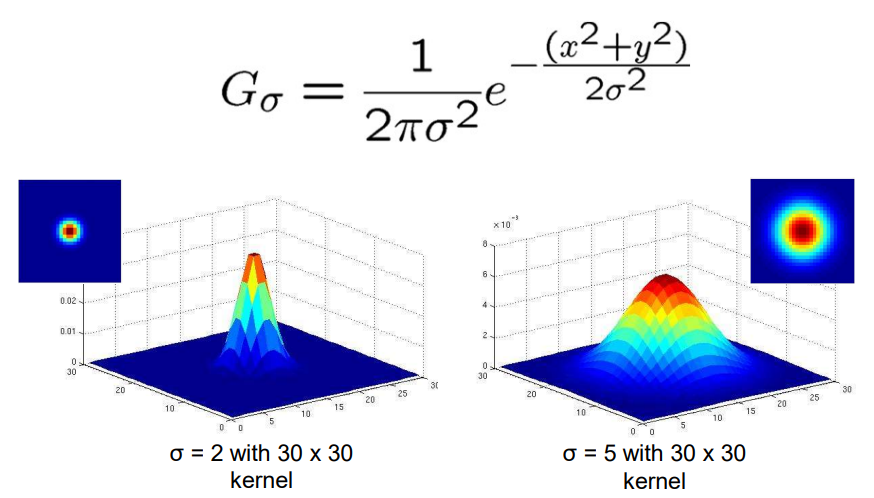
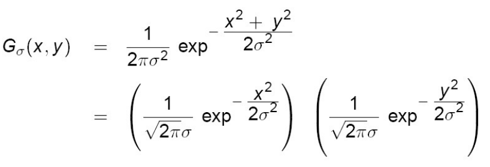
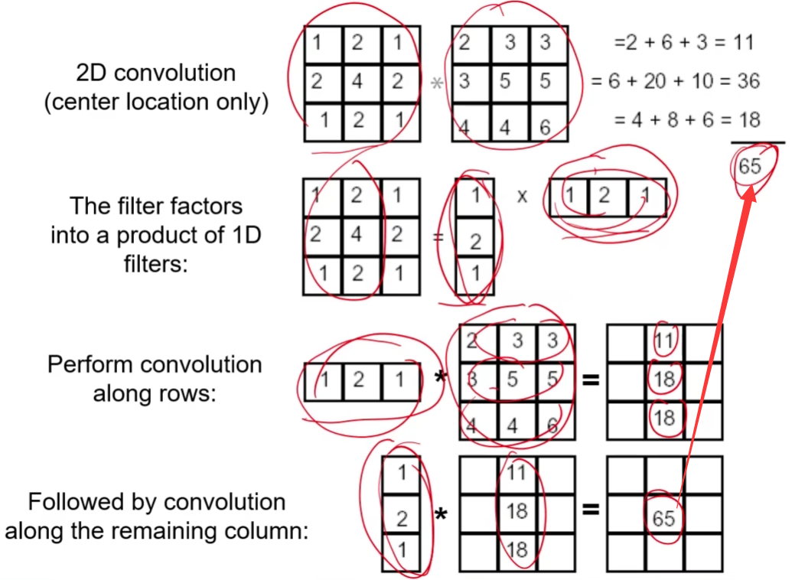
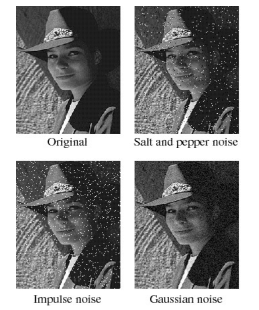

# 滤波器

- 卷积（Convolution）

- 滤波器（Filter，过滤器）

	过滤器可能是多维的。
	
- 卷积核（Kernel，Filter Kernel）

	一个数值矩阵。卷积核是二维的。

## 离散卷积

设 $\boldsymbol f$ 为图片矩阵，$\boldsymbol g$ 为 $m \times n$ 的卷积核，有卷积 $\boldsymbol  f \ast \boldsymbol  g$ 在某一处的运算（平移包含在卷积运算内）：
$$
(\boldsymbol  f \ast \boldsymbol  g)[m, n] =
\begin{cases}
\sum\limits_{i, j} \boldsymbol  f[m - i, n - j] \boldsymbol  g[i, j] \\ or \\
\sum\limits_{i, j} \boldsymbol  f[i, j] \boldsymbol  g[m - i, n - j]
\end{cases}
$$
$- i, -j$ 意味着要将卷积核**翻转（filpped）**后再相乘相加。

翻转即为：

- 上下翻转后再左右翻转，或左右翻转后再上下翻转。
- 也相当于旋转 180 度。

翻转示例：
$$
g = \ 

\begin{array}{|c|c|}
\hline
1 & 2 \\
\hline
3 & 4 \\
\hline
\end{array}

\ \stackrel{filp}{\longrightarrow} \ 

\begin{array}{|c|c|}
\hline
4 & 3 \\
\hline
2 & 1 \\
\hline
\end{array}
$$

注意：

- 这是矩阵形式的离散卷积。
- CNN 中的卷积无需翻转，因为 CNN 的 kernel 是机器学习的，学习前都是未知数，翻转没有区别。
- 没有翻转的卷积运算叫**相关（Correlation）**运算，权重叫相关系数。
- 实际使用时，许多 kernel 都是对称的，无需强调翻转。实际上，描述时常常直接描述翻转后的 kernel 。

为了使输入输出大小一种，通常会对原图做**边缘填充（padding）**。

## 简单核示例

### 原图

（Original）
$$
\begin{array}{|c|c|c|}
\hline
0 & 0 & 0\\
\hline
0 & 1 & 0\\
\hline
0 & 0 & 0\\
\hline
\end{array}
$$

### 平滑

（Blurring）
$$
{1 \over 9}
\begin{array}{|c|c|c|}
\hline
1 & 1 & 1\\
\hline
1 & 1 & 1\\
\hline
1 & 1 & 1\\
\hline
\end{array}
$$
使像素值变均匀，即图像平滑。

### 平移

（Moving）
$$
\begin{array}{|c|c|c|}
\hline
0 & 0 & 0\\
\hline
0 & 0 & 1\\
\hline
0 & 0 & 0\\
\hline
\end{array}
$$
该 kernel 可使图像向左平移。（将右边的像素移到左边）

### 锐化

（Sharpening）
$$
\begin{array}{|c|c|c|}
\hline
0 & 0 & 0\\
\hline
0 & 2 & 0\\
\hline
0 & 0 & 0\\
\hline
\end{array}
-
{1 \over 9}
\begin{array}{|c|c|c|}
\hline
1 & 1 & 1\\
\hline
1 & 1 & 1\\
\hline
1 & 1 & 1\\
\hline
\end{array}
$$
上图的 kernel 表示加强的原图减去平滑：

- 在像素差异小的区域，平滑后差别不大；在像素差异大的区域，平滑后边缘部分变化较大。
- 原图减去平滑后的图片即可得边缘。
- 将边缘在叠加到原图上，即得锐化结果，凸显了边缘。

### 震铃效应

- 震铃效应（ringing artifacts）

	输出图像在灰度剧烈变化处产生的震荡，就像扩散的波纹。

其中，a为原图，其它都出现不同程度的振铃效应。

振铃效应主要是 kernel 权值造成，即中心的权值与四周相近，导致远处强度大的灰度对远处产生了过大的影响。

## 高斯核

（Gaussian Kernel）

### 权值分配

高斯核中心的权值大，四周的权值小，按照二维高斯函数分布（高斯核函数）：

为了使图像亮度不衰减，高斯核将权值再做归一化，使其总和为 $1$ 。

高斯函数的方差 $\sigma$ 的大小决定了平滑的程度。

### 宽度选择

高斯函数边缘部分值特别小，相当于没有滤波的效果，故一般设定卷积核的一半宽度（half-width）为 $3\sigma$ ，在 $[-3\sigma,3\sigma]$ 内，高斯函数能包含绝大部分作用效果。

在实际编程中，使用 $(6\sigma + 1) \times (6\sigma + 1)$ 大小的卷积核即可。

### 特性

- 降噪

	高斯核主要滤出**高频（high-frequency）**信号（灰度变化幅度大）的部分（即噪声），不太改变低频（low-frequency）的部分。

- 重叠

	高斯核 $\boldsymbol G_{\sigma = 1}$ 和 $\boldsymbol G_{\sigma = 1}$ 依次作用在图片 $\boldsymbol I$ 上，相当于直接使用 $\boldsymbol G_{\sigma = \sqrt 2}$ 作用在 $\boldsymbol I$ 上：

$$
\boldsymbol G_{\sigma = b} (\boldsymbol G_{\sigma = a} \boldsymbol I) = 
\boldsymbol G_{\sqrt {a^2 + b^2} \sigma} \boldsymbol I
$$

- 分解

	二维高斯函数可以分解为一维 x 高斯函数和一维 y 高斯函数的乘积。

分解后卷积与未分解前卷积结果一致：

分解可以减少运算量，对于 $n \times n$ 的图片，使用 $m\times m$ kernel，有：

- 未分解乘法次数复杂度 $O(n^2m^2)$

	每个像素一个 kernel 有 $m^2$ 次乘法。（kernel 有 $9$ 格）

- 分解后乘法次数复杂度 $O(n^2m) = O(n^2m) + O(n^2m)$

	每个像素 x 方向 kernel  有 $m$ 次乘法，y 方向 kernel 有 $m$ 次乘法。（kernel 只有 $3$ 格）

## 噪声

- 椒盐噪声（Salt and Pepper Noise）

	随机黑像素或白像素点。

- 脉冲噪声（Impulse Noise）

	随机白噪声。

- 高斯噪声（Gaussian Noise）

	像素值 $p = p_{original} + p_{noise}$ 中，$p_{noise}$ 符合高斯概率分布的噪声。

处理噪声：

- 高斯核可以过滤方差（$\sigma$）相近的高斯噪声。

- 中值滤波器（Median FIlter）可以处理椒盐噪声。

	中值滤波器的结果是其范围内的中位数。（不是线性滤波器）

## 可视化

若要以灰度图可视化，对于负值或 $255$ 以上的像素值，一般有两种处理：

- 低于 $0$ 作为 $0$ ，高于 $255$ 作为 $255$ 。
- 归一化，然后划定显示的级别，从而确定以什么像素值输出。
