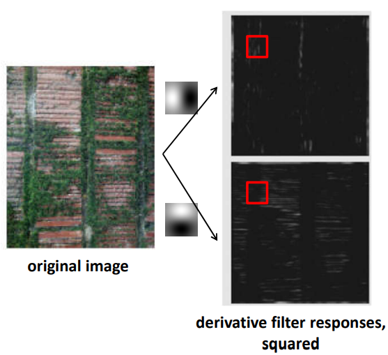
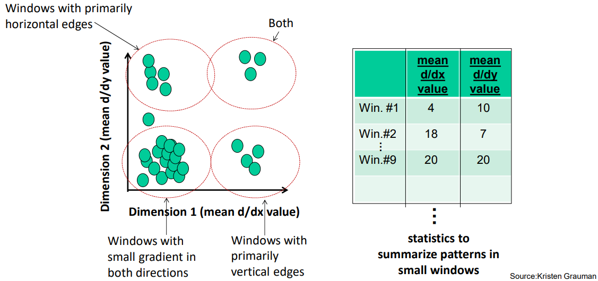
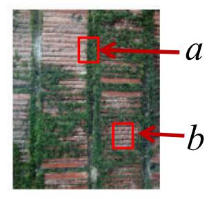
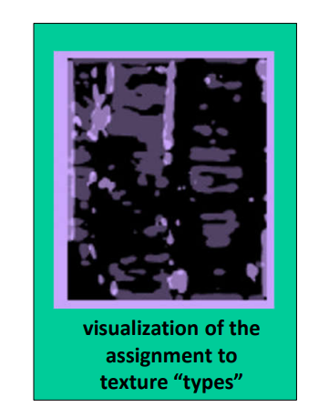
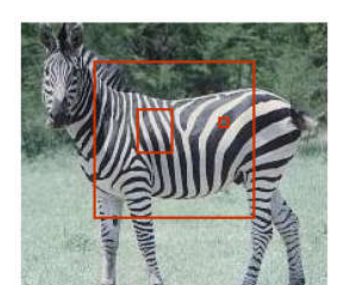
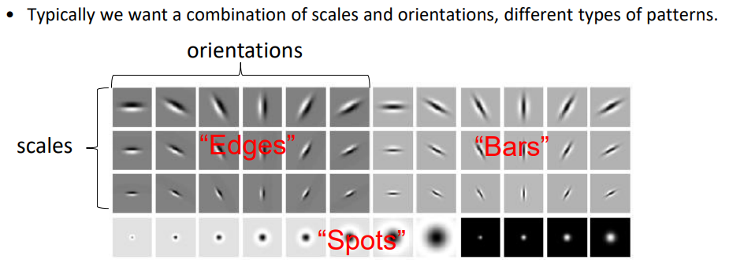

# 纹理

（Texture）

纹理一般有以下用处：

- 估计（Estimation）

	依据纹理计算表面方向和物体形状。

- 分割（Segmentation），分类（Classification）

	对纹理进行分析识别，表示，聚类。（纹理比对，是否一致）

- 合成（Synthesis）

	依据纹理生成纹理或图像。（生成相似纹理）

## 统计模式

认为纹理是有一些重复的模式构成的，一般对指定模式进行统计分析，例子：

可以看出最左图有三个基本的纹理（横条，纵条，草），分析知它们的区别可以体现在梯度上。

使用高斯偏导核得出梯度，划分小窗口，记录小窗口横纵方向的梯度强度统计信息，转换到二维空间，聚类：

转换到二维空间后，即可设定距离，依据距离比对小窗口内的纹理是否相似：

分类结果：

## 尺度影响

纹理容易受尺度的影响：

确定尺度（窗口大小）一般使用各尺度的窗口在物体上移动，选取统计信息变动最小的那个尺度对应的窗口大小。

后续若要识别该物体，则使用选定好的窗口大小。

## Filter Bank

可以同时使用多个滤波器，使用多种特征，多种尺度，构建多维空间中的特征向量：

- Edge

	边，上图中是不同尺度和方向的高斯偏导核。

- Bar

	条状。

- Spot

	点，斑点。