# 贝叶斯滤波器

（Beyes Filter，BF）

- 预测（信息）

	目标状态的**先验**。

- 观测（信息）

	有噪声，有偏差，目标状态的**似然**。

贝叶斯滤波器基于贝叶斯公式，用于估计目标状态，其思想是卡尔曼滤波、粒子滤波等算法的基础。

贝叶斯滤波的思想也可用于其它事物状态的预测，主要用在有不断新信息到来时不断更新现有预测（最初始的预测的依据是基本前提，客观环境等）。

- 预测

	通过之前的目标状态观测预测当前的目标状态。

- 更新

	通过当前的观测信息对预测进行更新（也叫修正），即实现当前目标状态的估计。

即通过目标的先验信息和似然信息得到目标的后验信息。

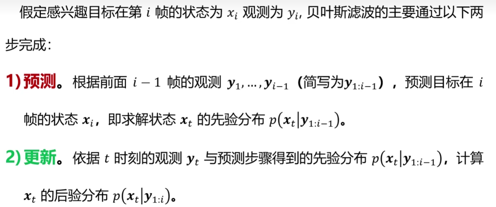

其中，$P(\boldsymbol y_{i:i-1})$ 表示 $\boldsymbol y_1 \dots \boldsymbol y_{i-1}$ 的联合概率，$\boldsymbol x, \boldsymbol y$ 都是**随机变量**，服从某种**分布**。

图像跟踪中的状态 $\boldsymbol x_i$ 就是坐标 $(x, y)^T$ 。

## 基本性质假设

- 齐次马尔科夫性假设（也即无后效性）

	假设目标任意时刻 $i$  的状态只依赖于前一时刻的状态，与其它时刻的状态与观测无关，也与时刻 $i$ 无关，即：

$$
p(\boldsymbol x_i | \boldsymbol x_{0:i-1}, \boldsymbol y_{1:i-1}) = p(\boldsymbol x_i | \boldsymbol x_{0:i-1})
$$

- 观测独立性假设

	假设任意时刻的观测只依赖于该时刻的目标状态，与其它观测和状态无关，即：

$$
p(\boldsymbol y_i | \boldsymbol x_{0:i}, \boldsymbol y_{1:i-1}) = p(\boldsymbol y_i | \boldsymbol x_{i})
$$

基本知识：

[可参考开头理论部分](https://www.cnblogs.com/ycwang16/p/5995702.html)

- 联合概率 $P(A,B)$ 也可写成 $P(AB)$ 。
- 条件联合概率 $P(A,B|C)$ 也可写成 $P(AB|C)$ ，$P(A|B,C)$ 也可写成 $P(A|BC)$ 等。
- 概率基本等式（**条件概率公式**），可作为推导基：

$$
P(AB) = P(A)P(B|A) = P(B)P(A|B)
$$

- 推导形式一（**贝叶斯公式**）：

$$
P(B|A) = \frac {P(B)P(A|B)} {P(A)}, \ P(A|B) = \frac {P(A)P(B|A)} {P(B)}
$$

- 推导形式二：

$$
P(B|A) = \frac {P(AB)} {P(A)}, \ P(A|B) = \frac {P(AB)} {P(B)}
$$

- 推导形式三：

$$
P(A) = \frac {P(AB)} {P(B|A)},\ P(B) = \frac {P(AB)} {P(A|B)}
$$

## 预测

即计算 $p(\boldsymbol x_i | \boldsymbol y_{1:i-1})$ ，有：
$$
\begin{align}
& p(\boldsymbol x_i | \boldsymbol y_{1:i-1}) \\
= & \int p(\boldsymbol x_i, \boldsymbol x_{i-1} | \boldsymbol y_{1:i-1}) {\rm d} \boldsymbol x_{i-1} \tag{1} \\
= & \int p(\boldsymbol x_i | \boldsymbol x_{i-1} ) p(\boldsymbol x_{i-1} | \boldsymbol y_{1:i-1} )  {\rm d} \boldsymbol x_{i-1} \tag{2}
\end{align}
$$
推导（1），考虑上一个状态 $\boldsymbol x_{i-1}$ ， 将全概率公式写为连续形式：
$$
\begin{align}
P(A) & = \sum\limits_i^n P(A,B_i) \\
& = \sum\limits_i^n P(A | B_i) P(B_i) \\
& = \int P(A|B) \rm d B
\end{align}
$$
其中，将 $B$ 全部情况加起来即对 $B$ 积分。

推导（2），由条件联合概率：
$$
P(A,B|C) = P(A|B,C)P(B|C)
$$
其中，对于 $P(\boldsymbol x_i | \boldsymbol x_{i-1}, \boldsymbol y_{1:i-1})$ ，可由齐次马尔科夫性化简。

得到（2）式后，若求时刻 $i$ 的 $\boldsymbol x_i$ ，只需求：

- **上一时刻**的目标状态的**后验概率** $p(\boldsymbol x_{i-1} | \boldsymbol y_{1:i-1} )$ ，
- 和一个 $\boldsymbol x_{i-1}$ 到 $\boldsymbol x_i$ 的**状态转移概率** $p(\boldsymbol x_i | \boldsymbol x_{i-1} )$ ，即从某一种随机变量状态转换到另一种随机变量状态的可能性。

从而可以进行递推。

## 更新

即计算 $p(\boldsymbol x_i | \boldsymbol y_{1:i})$ ，有：
$$
\begin{align}
& p(\boldsymbol x_i | \boldsymbol y_{1:i}) \\
= & \frac {p(\boldsymbol x_i, \boldsymbol y_i, \boldsymbol y_{1:i-1})} {p(y_{1:i})} \tag{1} \\
= & \frac {p(\boldsymbol y_i | \boldsymbol x_i) p(\boldsymbol x_i | \boldsymbol y_{1:i-1}) 
	p(\boldsymbol y_{1:i-1})} {p(\boldsymbol y_{1:i})} \tag{2} \\
= & \frac {p(\boldsymbol y_i | \boldsymbol x_i) p(\boldsymbol x_i | \boldsymbol y_{1:i-1})}
	{p(\boldsymbol y_i | \boldsymbol y_{1:i-1})} \tag{3} \\
= & \frac {p(\boldsymbol y_i | \boldsymbol x_i) p(\boldsymbol x_i | \boldsymbol y_{1:i-1})} 
	{\int p(\boldsymbol y_i | \boldsymbol x_i) p(\boldsymbol x_i | \boldsymbol y_{1:i-1}) {\rm d} \boldsymbol x_i} \tag{4}
\end{align}
$$

推导（1），由条件概率公式：
$$
\ P(A|B) = \frac {P(AB)} {P(B)}
$$
推导（2），由条件概率公式拆开分子的联合概率即可。

推导（3），与推导（1）的条件概率公式同理，有：
$$
{p(\boldsymbol y_i | \boldsymbol y_{1:i-1})} =
\frac {p(\boldsymbol y_{1:i})} {p(\boldsymbol y_{1:i-1})}
$$
推导（4），对分母添加 $\boldsymbol x_i$ （其会被积掉），与分子保持形式一致。

对于（4）：

- $p(\boldsymbol y_i | \boldsymbol x_i)$ 为 $\boldsymbol x_i$ 状态下观测为 $\boldsymbol y_i$ 的概率，即**观测概率**（某一状态（随机变量）下呈现某一观测（随机变量）的概率）。
- $p(\boldsymbol x_i | \boldsymbol y_{1:i-1})$ 为在之前的观测下，当前状态为 $\boldsymbol x_i$ 的概率，即上文中的**预测概率（**状态的预测，亦状态的先验）。
- 分母是所有概率的总和，更新结果只与（4）的分子有关。
- 分子为预测的当前状态下的观测概率，即后验概率，要找到**分子的极值**。
- 分子与后验概率成正比。

## 算法流程

通过前一次的状态计算结果（即前一次的后验），之前的观测，以及当前的观测，计算当前的状态：

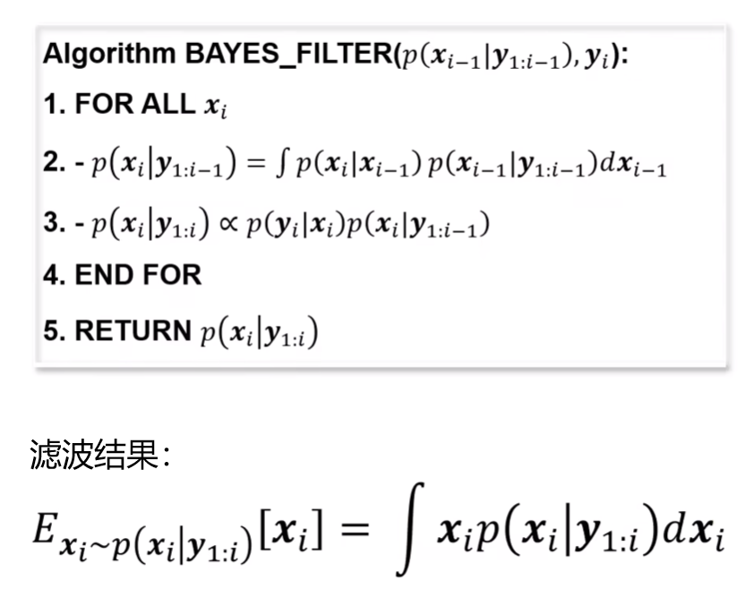

其中，$\propto$ 为正比符，表示成正比，$E_{x_i \sim p(x_i|y_{1:i})}$ 表示 $x_i$ 服从 $p(x_i|y_{1:i})$ 的分布下的期望（均值）。

- 第 2 步计算预测概率。
- 第 3 步通过预测概率和观测概率计算后验概率。
	
- 第 5 步返回后验概率。

对于滤波结果，有两种处理所有返回值的策略：

1. 取后验概率最大的 $\boldsymbol x_i$ 。
2. 取后验概率的均值，如上图所示。（不能做到（1）时使用）

## 动态模型

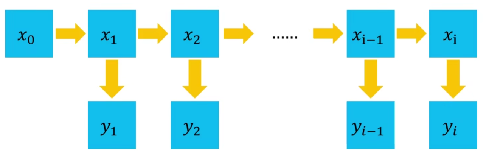

动态模型包括：

- 隐马尔科夫模型 —— 解码问题
- 线性高斯模型 —— 卡尔曼滤波问题
- 非线性高斯模型 —— 粒子滤波问题

在动态模型的基本框架中：
$$
\begin{cases}
\boldsymbol x_i = g(\boldsymbol x_{i-1}, \boldsymbol q_{i-1}) \\\\
\boldsymbol y_i = h(\boldsymbol x_i, \boldsymbol r_i)
\end{cases}
$$
其中，$\boldsymbol q_{i-1}$ 表示状态转移中的过程噪声，$\boldsymbol r_i$ 表示观测噪声，都服从高斯分布。

## 卡尔曼滤波器

（Kalman Filter，KF）

在 KF 中，状态转移概率和观测概率都具有线性关系：

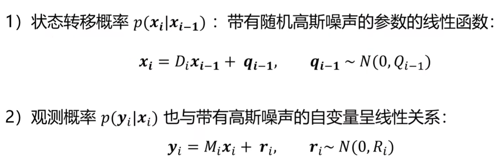

其中，$\boldsymbol D，\boldsymbol M$ 为表示移动的矩阵，$Q, R$ 是方差，在多维时是协方差矩阵。

显然，假设其噪声都是高斯分布，在线性关系移动下，状态转移概率和观测概率也应当服从高斯分布。

### 一维情况

即物体在一条线上运动时的情况。

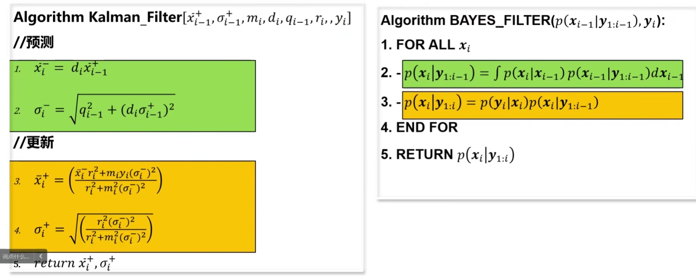

其中，加号表示修正后，减号表示未修正；$x$ 为分布的均值，$\sigma$  为方差，$m,d$ 表示移动（转移系数），$q,r$ 表示噪声，$y$ 表示观测。

先得到预测的均值和方差，然后更新得到修正后的均值和方差。

- 假设预测的方差 $\sigma^-_i = 0$ ，则 $\bar {x}^+_i = \bar {x}^-_i$ ，更新值就是预测值，即没有噪声。
- 假设观测的方差 $r_i = 0$ ，则 $\bar {x}^+_i = \frac {y_i} {m_i}$ ，更新值与预测值没有关系，更新值就是观测和移动有关。

### 多维情况

矩阵表达：

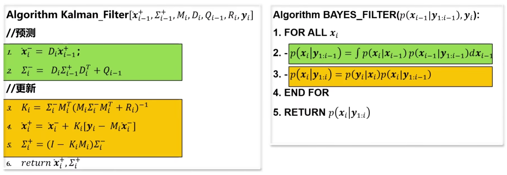

## 粒子滤波器

（Particle Filter，PF）

在粒子滤波器中，状态转移概率和观测概率为非线性关系。

在非线性下，状态转移概率和观测概率不再服从高斯分布，即 $p(\boldsymbol x_i | \boldsymbol y_{1:i-1}), p(\boldsymbol x_i | \boldsymbol y_{1:i})$ 分布未知，从而无法求后验概率 $p(\boldsymbol x_i | \boldsymbol y_{1:i})$ 最大化的分布参数。

直接使用后验数据的均值作为后验分布的期望，需要分布未知，需要使用采样方法估计期望。

### 蒙特卡洛采样

一般求随机变量 $x$ 的某个函数的期望使用以下公式：

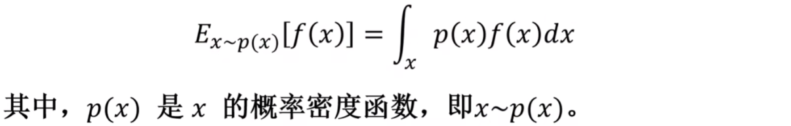

其通过积分求解分布的期望，当无法求解析解时，需要通过采样估计。

蒙特卡洛采样将大量样本的均值作为期望：

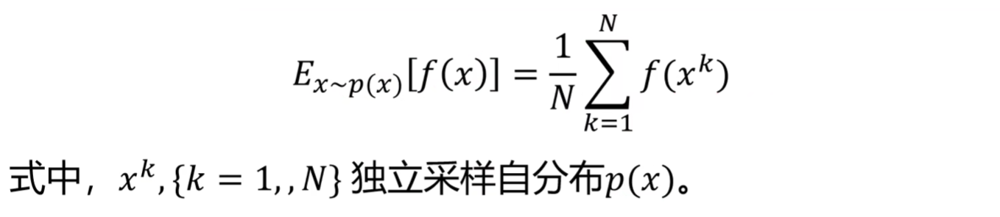

其中，$k$ 表示第 $k$ 个样本。

当从分布 $P(x)$ 中采样十分困难时，可以使用重要性采样。

### 重要性采样

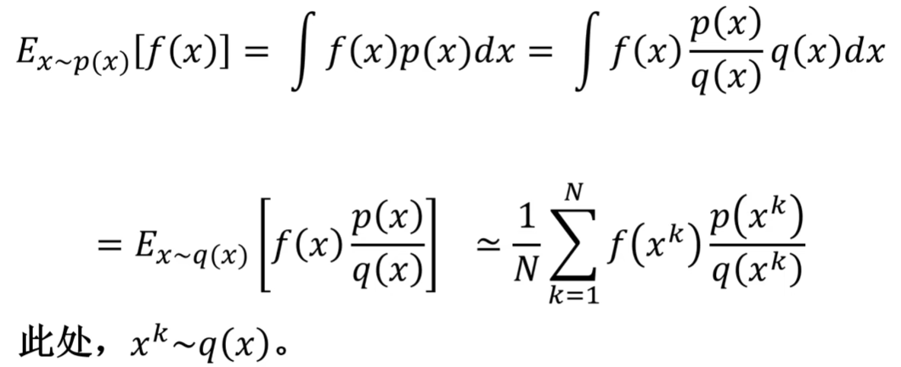

其中，$k$ 表示第 $k$ 个样本。

此时，可通过在 $q(x)$ 中采样，近似求取期望，应当尽量选取 $q(x)$ 与 $p(x)$ 接近的分布。

---

将重要性采样应用到粒子滤波：

其中，$W$ 用以作为替代的符号，$k$ 表示第 $k$ 个粒子。

推导后可将权重 $W$ 转为递推的形式：

转为递推形式后，可由上一步的权重分布推导下一步的权重分布，此时在初始给出一个初始权重分布就可以开始计算。

在不断的递推过程，权重分布会发生变化。

### 权重退化

权重分布在递推中不断变化（权重等于上一次权重乘以观测概率 $W_i^k = W^k_{i-1}p(y_i | x^k_i)$），不断的迭代乘法，容易出现权重退化的现象。即：权重的分布变得越来越集中，少部分粒子的权重变得越来越大，而其它粒子的权重越来越小，以至于其它粒子完全不起作用，然后仅剩的粒子也因为粒子数太少而无法继续准确描述分布，无法保证这少数粒子的估计能一直保持准确，即失去了相当的泛化性鲁棒性。

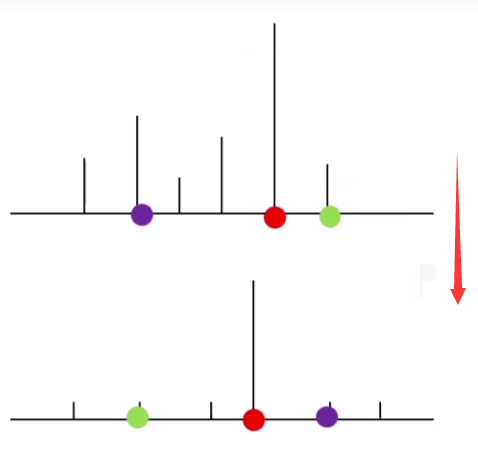

### 重采样

重采样技术用来解决权重退化。

- 使每个粒子代表一定的概率（比如 $1\%$），使用表示某一位置的粒子的数量代表某一位置的分布概率。（总权重为 $1$）
- 在每一次递推中，对分布中概率较高的位置采样出多个粒子，抛弃其它概率特别小的位置的粒子。

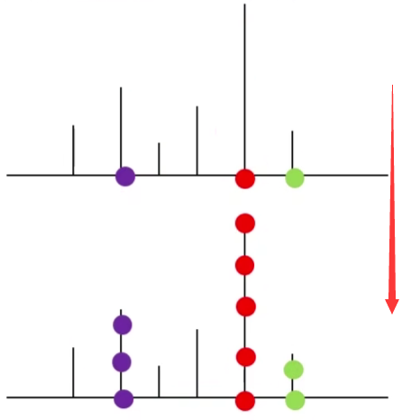

变化体现在公式上，就是不再需要描述每个粒子的权重（由 $\boldsymbol W$ 表示）（粒子权重都一样），只需要关注重采样和粒子表示的位置：

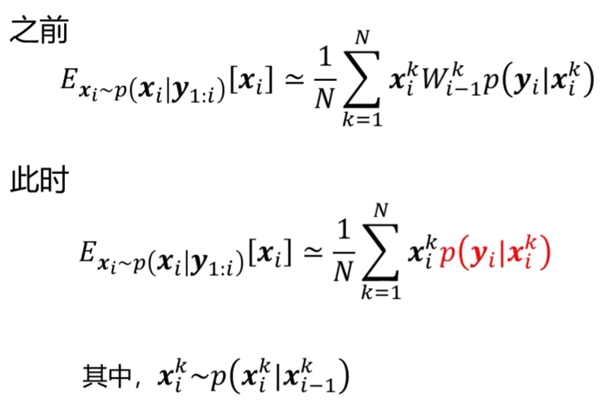

### 最终形式

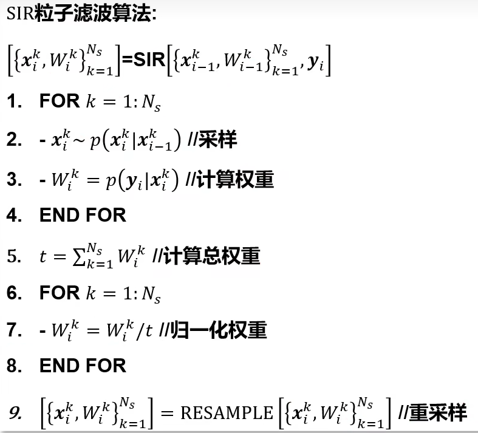

其中，归一化保持总权重为 $1$ 。
