# 边缘检测

- 边缘检测（Edge Detection）

## 边缘类型

- 物体边缘

	物体轮廓。

- 深度边缘

	深度的不连续。

- 颜色边缘

	颜色的不连续。

- 光照边缘

	光照的不连续。

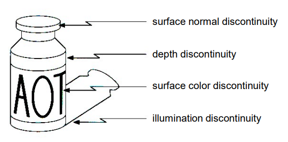

## 求导

### 基本定义

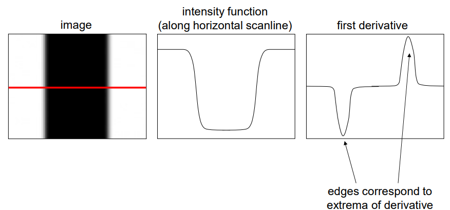

考察红线区域的像素值，如中间图，将其求导，极值点位置即边缘位置。

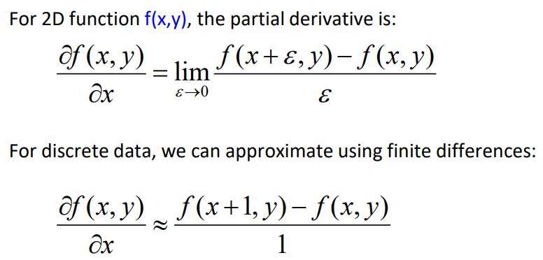

离散求导将 $\varepsilon$ 取 $1$ 近似。

从而求导可以用卷积表示（此为 x 轴方向，y 方向同理）：
$$
f(x+1, y) - f(x, y) = p_{x+1,y} - p_{x, y} = \
\begin{array}{|c|c|c|}
\hline
0 & 0 & 0\\
\hline
0 & -1 & 1\\
\hline
0 & 0 & 0\\
\hline
\end{array}
$$
对 $x$ 方向求导会使竖线边缘明显，对 $y$ 方向求导会使横线边缘明显（梯度方向通常和边垂直）：

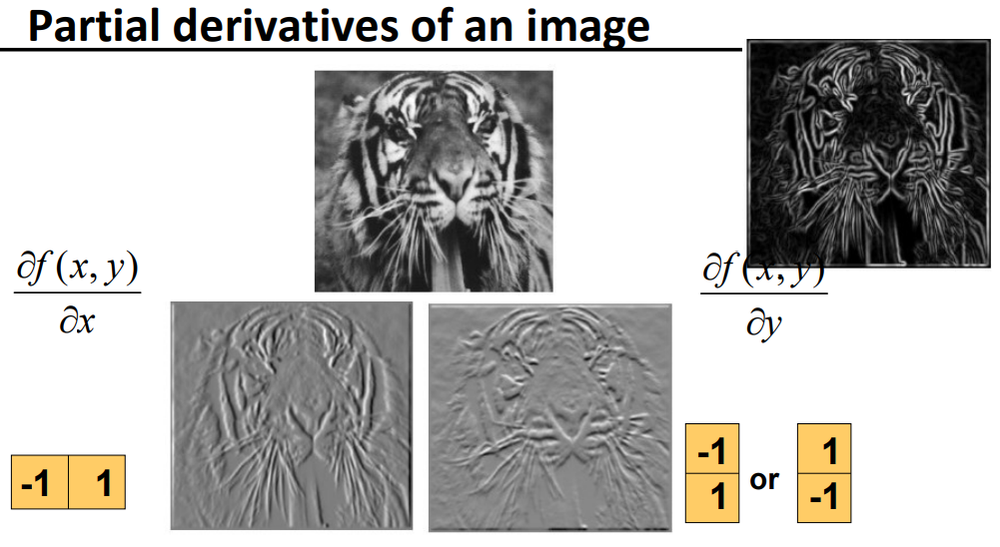

综合 x 方向导数和 y 方向导数即得梯度值（如上图右上方），即最终梯度大小，即**幅值（Magnitude）**：
$$
||\nabla|| = \sqrt{ ({\partial f \over \partial x})^2 + ({\partial f \over \partial y})^2 }
$$

### 其它定义

当两边差异都大时，中间是边缘：
$$
\begin{array}{|c|c|c|}
\hline
0 & 0 & 0\\
\hline
-1 & 0 & 1\\
\hline
0 & 0 & 0\\
\hline
\end{array}
$$

#### Prewitt 算子

扩展范围，应对单点噪声的能力更强。
$$
M_x = \ 
\begin{array}{|c|c|c|}
\hline
-1 & 0 & 1\\
\hline
-1 & 0 & 1\\
\hline
-1 & 0 & 1\\
\hline
\end{array}
\ 
M_y = \ 
\begin{array}{|c|c|c|}
\hline
1 & 1 & 1\\
\hline
0 & 0 & 0\\
\hline
-1 & -1 & -1\\
\hline
\end{array}
$$

#### Sobel 算子

$$
M_x = \ 
\begin{array}{|c|c|c|}
\hline
-1 & 0 & 1\\
\hline
2 & 0 & 2\\
\hline
-1 & 0 & 1\\
\hline
\end{array}
\ 
= \
\begin{bmatrix}
1 \\
2 \\
1
\end{bmatrix}
\begin{bmatrix}
-1 & 0 & 1
\end{bmatrix}
$$

上图，可对 Sobel 算子进行分解，相当于先进行高斯滤波（平滑）然后提取边缘，使得抗噪声更强。

#### Roberts 算子

检测斜向边缘。
$$
M_x = 
\begin{bmatrix}
0 & 1 \\
-1 & 0
\end{bmatrix}
\ 
M_y = 
\begin{bmatrix}
1 & 0 \\
0 & -1
\end{bmatrix}
$$

## 高斯导数核

（Gaussian Derivative Filter）

对于图像的一行或一列（卷积核也以一行或一列为例），当噪声较多时，直接求导的结果不好，不易确定边缘：

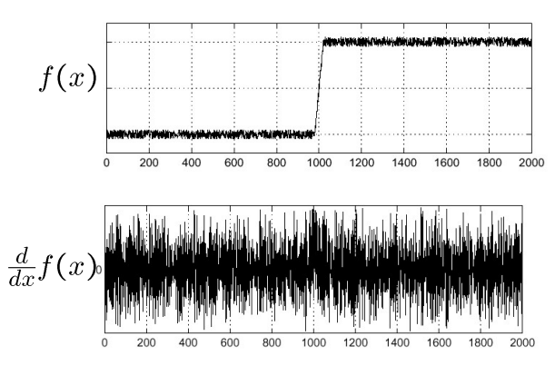

先进行高斯滤波（即 $g$），使得信号变得平滑，再求导，易于找到边缘：

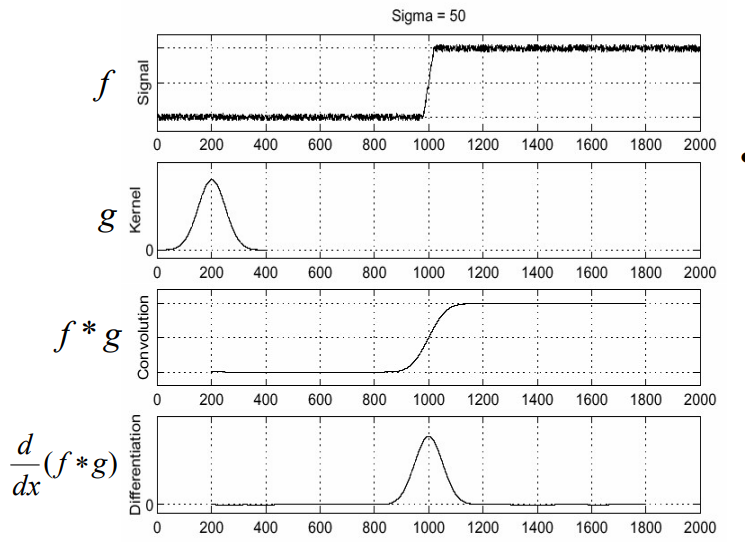

其中，$f\ast g$ 两端没有信号，是因为没有卷积时没有填充。

先卷积又求导，意味着又进行一次求导卷积，可以先对一个 kernel 做变换，只有一次耗时的卷积运算：

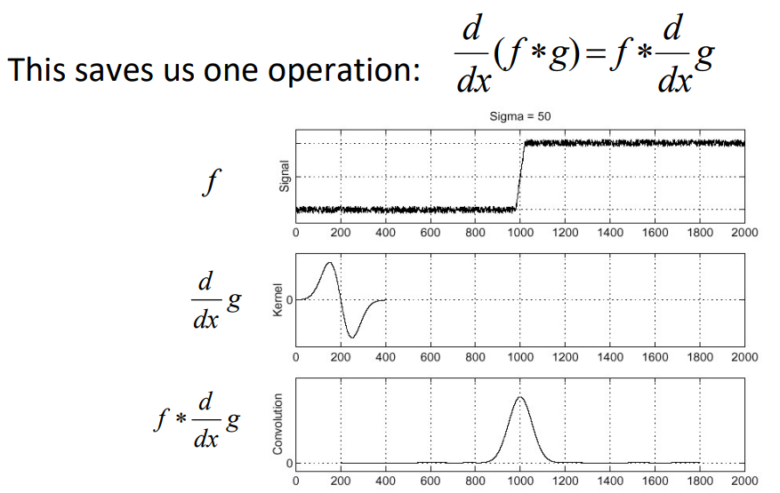

高斯核求导的三维可视化（纵坐标是值的大小）和二维可视化（颜色代表值大小）：

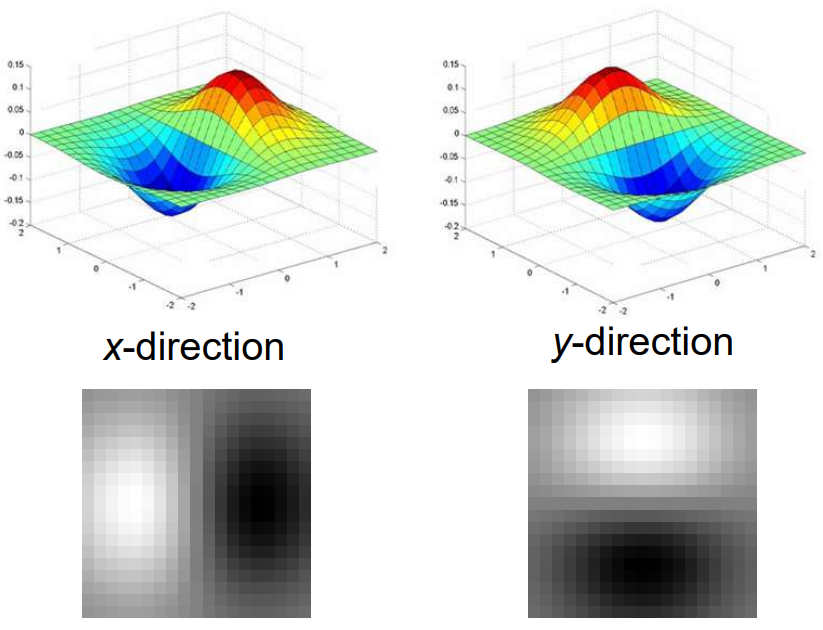

随着方差的增大（相应 kernel 的大小也增大），边缘的细节逐步丢失：

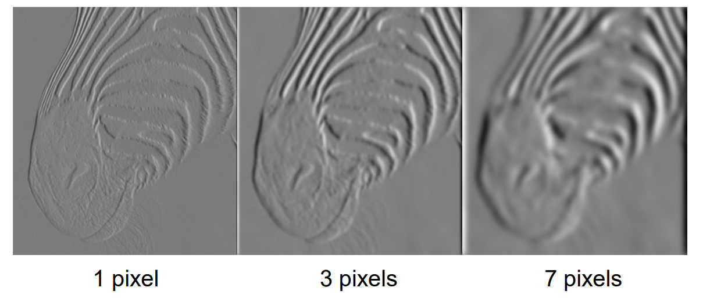

- 高斯导数核的求和结果为 $0$ 。
- 卷积结果绝对值越大说明边越明显。

## Canny 算子

### 门限

（thresholding）

边缘卷积后可以设定一个阈值，过滤梯度幅值较小的一些噪声。

但可能存在一些比较“粗”的边：

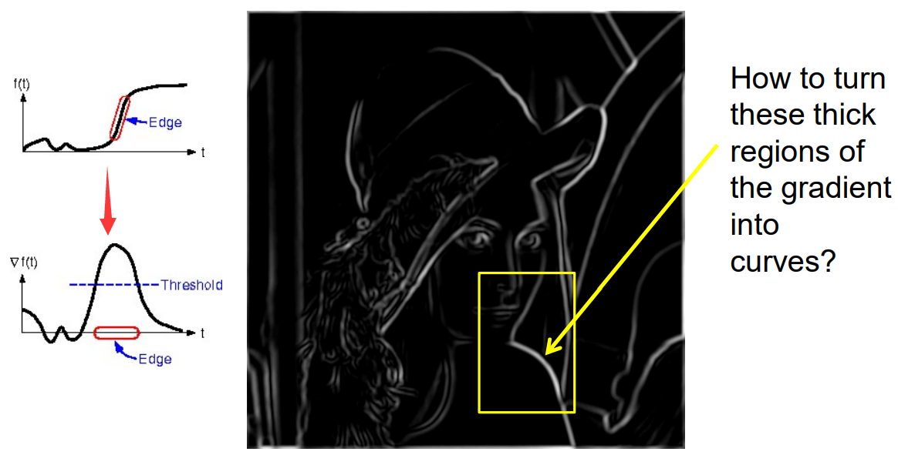

其中，虽然应用了 threshold ，但是边缘过渡可能不是突变，而是比较缓慢平滑，比较“宽”，这样的结果对于单独描述边的存在与否不够精细。

### 非极大值抑制

（Non-maximum suppression）

沿梯度方向找到跨越边的最大值。当梯度方向上的像素位置非整数时，可以用内插（一般用其附近四个点加权求和，即双线性插值）求得 $r,p$ 后再比较：

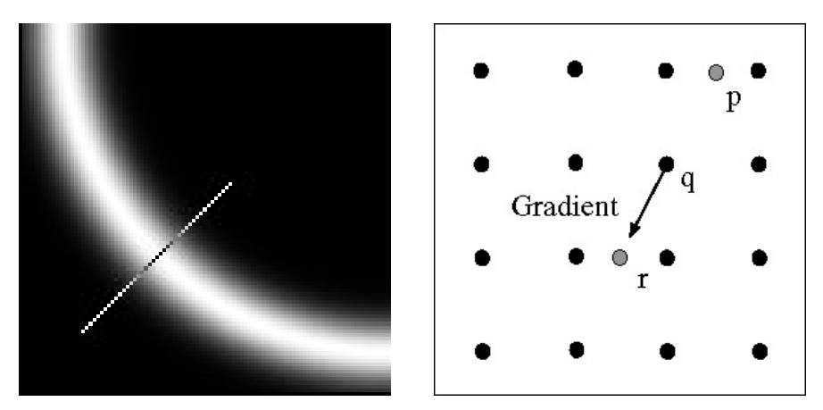

效果：

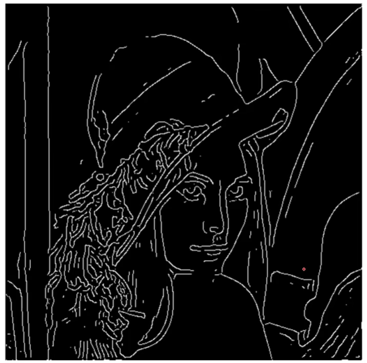

问题：当阈值设置过大，可能导致某些边被剔除（如图，下巴位置的边被截断），当太小，无法有效抑制噪声。

### 双门限

也叫滞后阈值（Hysteresis Thresholding）

- 先用高门限找出粗的边，即一定是边的部分。（强边缘）
- 然后用低门限值继续找出较精细的边。

假设噪声边不会与强边缘有连接关系：

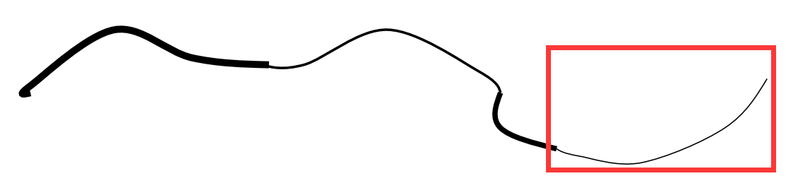

其中，最右边的细边被判断为噪声边丢弃。

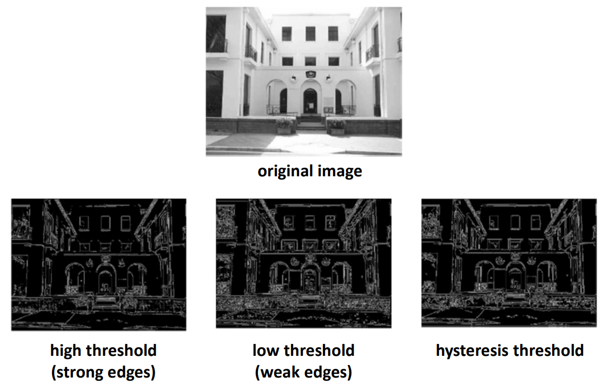
