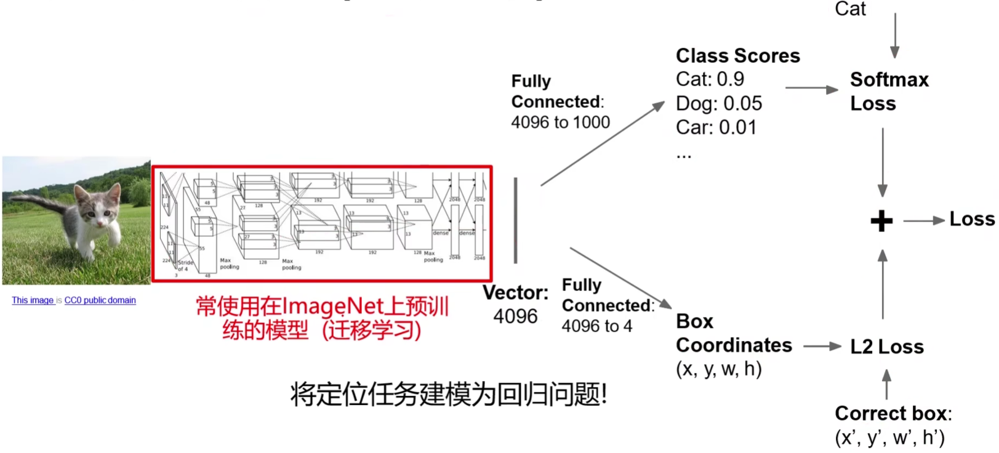

# 目标检测

（Object Detection）

## 总览

深度学习的目标检测算法主要分为：

- 两阶段（two stage）

	先生成候选区域，再分类。

	- R-CNN
	- Fast R-CNN
	- Faster R-CNN

- 一阶段（one stage）

	直接预测物体的类别和位置。

	- YOLO
	- SSD

## 单目标

（分类+定位）

使用卷积网络，在其 flatten 后的向量后，再加一层，输出：

- one-hot 向量，用以描述类别概率
- 描述 bounding box 左上角和右下角的点的坐标（4 维）。

使用两种损失相加（多任务损失）：

- 分类损失 softmax
- 定位损失 L2 loss

中间的卷积网络可使用预训练模型，只需训练 flatten 向量到输出结果权重即可（fine tuning）。

两个损失可同时训练，也可分开训练。

## 暴力多目标

滑动窗口，然后用分类器判断类别，或者不属于任何一种类别，计算量巨大。

## R-CNN

也叫 Slow R-CNN

[Rich feature hierarchies for accurate object detection and semantic segmentation 2013](https://arxiv.org/pdf/1311.2524.pdf)

使用选择性搜索算法（selective search）产生产生潜在的包含目标的区域（region proposal）。

也可叫潜在区域（Region of Interest，ROI）

1. 产生潜在区域。
2. 图片缩放，用以输入卷积网络。
3. 用卷积网络提取特征。
4. 使用 SVM 进行分类。
5. 使用 Bbox reg 回归进行潜在区域的修正，得到最终的 bounding box 。

问题：R-CNN 的计算效率仍然较低，一张图像有大约两千个 ROI 需要进行特征提取，重叠区域也反复计算。

### selective search

（选择性搜索，SS）

[Selective Search for Object Recognition 2012](http://www.huppelen.nl/publications/selectiveSearchDraft.pdf)

## Fast R-CNN

1. 直接对全图提取特征。
2. 对特征产生 ROI 。（特征区域对应在原图上的区域容易由卷积核的范围计算得出）
3. 缩放并裁剪特征。
4. 输入全连接网络。
5. 输出类别和边界偏差。

### ROI pooling

裁剪和缩放需要可导，才能让神经网络正常训练。

使用 ROI pooling 可以用池化的方式完成裁剪和缩放。

1. 将原图区域投影到特征图上，可能有非整数的区域边界，将其规整为整数。
2. 划分子区域，大小尽量相等即可。（一定是划分相同个数的子区域）
3. 对子区域进行 max pooling 。

处理后，所有特征区域产生的特性大小一致，但特征的区域会和原图的区域产生一定偏差。

## Faster R-CNN

[Faster R-CNN: Towards Real-Time Object Detection with Region Proposal Networks](https://proceedings.neurips.cc/paper/2015/file/14bfa6bb14875e45bba028a21ed38046-Paper.pdf)

- 在 Fast R-CNN 的特征层后加入区域建议网络（Region Proposal Network，RPN）产生候选区域，用以取代 selective search 。

#### RPN

对特征图的每个点进行分类，利用该点（anchor）及其周围 box 范围内的特征计算 anchor 处存在目标的分数：

同时返回一个边框的偏差量（相对于 ground truth），用以修正边框，使其更准确：

修正后的边框送入 ROI pooling 。

实际使用中，对于特征图的每个点位，通常采用 k 个不同尺寸和分辨率的锚点区域（anchor boxes）：

每个 anchor 在每种 box 都预测分数。对所有的 boxes 依据 object score 进行排序，选取前 300 个作为候选区域。

#### 四种损失

Faster R-CNN 使用四种 loss 联合训练：

- RPN 分类损失（目标或非目标的二分类）
- RPN 边界框坐标回归损失
- 候选区域分类损失
- 最终边界框坐标回归损失

回传梯度时， ROI pooling 直接将梯度回传到 feature map 部分，没有从 ROI pooling 到 RPN 的梯度。
