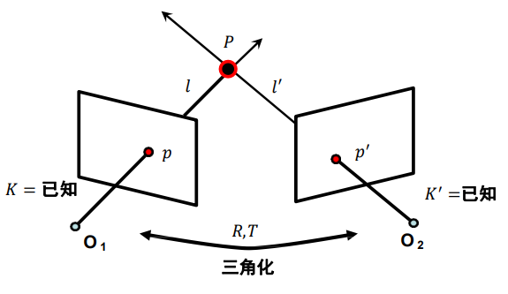
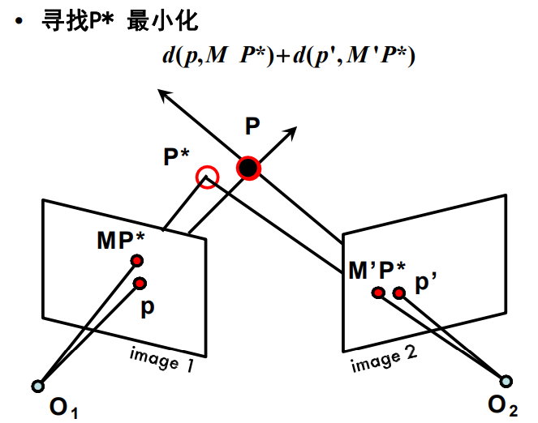
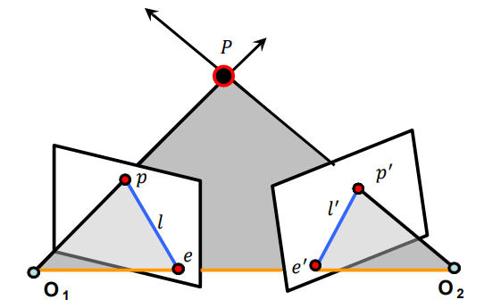
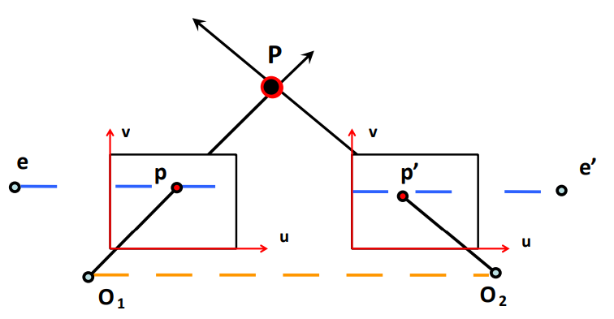
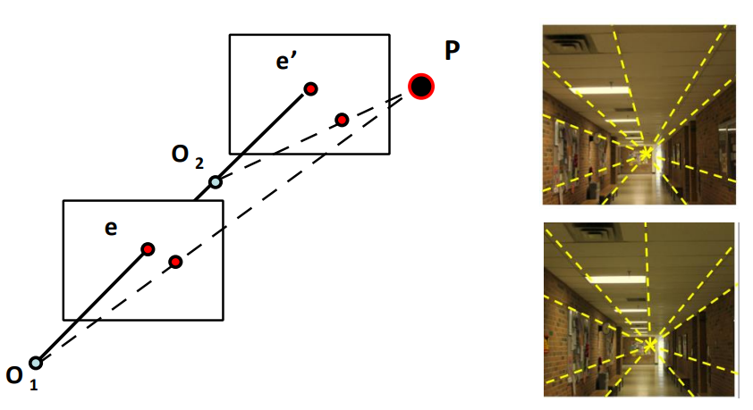
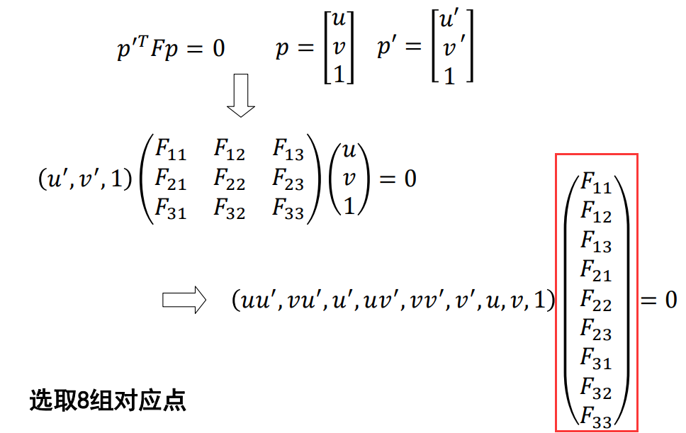
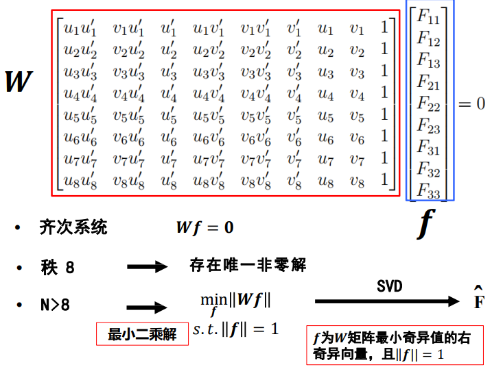
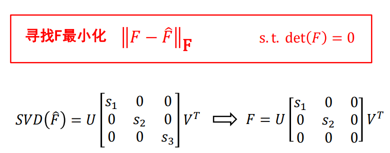
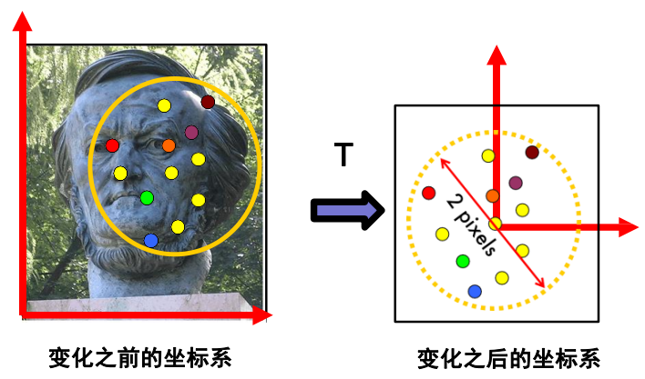

# 三维重建

关键问题：

- 摄像机几何

	从一张或多张图像中求解摄像机内外参数。

- 对应关系

	已知一张图片中的像素点，在另一个图像中找到对应点。

- 场景几何

	通过二至多幅图求解 3D 场景坐标。

## 三角化

单目恢复三维场景非常困难，考虑双目：

其中：已知像素点 $p,p^\prime$ ，内参数矩阵 $K,K^\prime$ ，两个镜头坐标系的旋转和平移变换矩阵 $R,T$ ，求 $P$ 的三维坐标。

可以使用线性方法列方程组，也可使用非线性的优化方法：

其中，$d()$ 为像素平面上 $MP^*$ 到 $P$ 或 $M'P^*$ 到 $P'$ 距离，$M = K[R,T]$ 为投影矩阵。

一般以 $O_1$ 作为世界坐标系。

## 极几何

极几何描述三维空间中一个点在两个不同视角下的两个视点的关系。

- 极平面

	过点 $P,O_1,O_2$ 的平面。

- 基线

	$O_1, O_2$ 的连线。

- 极线

	极平面与成像平面的交线，例如 $l,l'$ 。

- 极点

	基线与成像平面的交点，例如 $e,e'$ 。

性质：

- 所有极平面相交于极线。

- 所有极线相交于极点。

- **极几何约束**

	可将对应点的搜索范围缩小到对应极线上。

	- $p$ 的对应点一定在极线 $l'$ 上。
	- $p'$ 的对应点一定在极线 $l$ 上。

### 极几何特例

#### 平行视图

- 两个图像平面平行。
- 基线平行于图像平面，极点 $e,e'$ 位于无穷远。
- 极线平行于图像坐标系的 $u$ 轴。

利用平行视图可构建双目立体视觉系统。

#### 前向平移

在无旋转情况下，前后的成像平面：

两幅图上极点的位置相同，极点称作展开焦点（focus of expansion，FOE）。

### 极几何约束

#### 本质矩阵

对规范化摄像机拍摄的两个视点图像间的几何关系的代数描述。

- 规范化相机

	内参数矩阵为单位阵。

设空间点 $p$ 在 $O_1$ 坐标系下的非齐次坐标为 $(u,v,1)$ ，空间点 $p'$ 在 $O_2$ 坐标系下的非齐次坐标为 $(u',v',1)$ ，其满足约束：
$$
p'^T
\begin{bmatrix}
T \times R
\end{bmatrix}
p = 
p'^T \boldsymbol E p = 0
$$
其中，$\boldsymbol E$ 为本质矩阵，其等于 $T$ 与 $R$ 的叉乘（即外积），有 5 个自由度。

#### 基础矩阵

对一般摄像机拍摄的两个视点图像间的几何关系的代数描述。

基础矩阵可由规范化摄像机进行变换推导：
$$
p'^T \boldsymbol F p = 0 \ 
,\ \boldsymbol {F = (K'^{-1})^T
\begin{bmatrix}
T \times R
\end{bmatrix}
K^{-1}}
$$
其中，$\boldsymbol F$ 即为基础矩阵，秩为 $2$ ，有 7 个自由度。 

本质矩阵与基础矩阵的关系为：
$$
\boldsymbol {E = K'^T F K}
$$
本质矩阵只与内参数有关，基础矩阵同时与内参数和外参数有关。

## 八点算法

基于极几何约束，选取八对点估计基础矩阵。

虽然基础矩阵只有七个自由度，但（七对点）七个方程无法求解所有参数：

上图，可将矩阵方程展开为最后向量相乘的形式。一对点可有一个方程，因为最终等于 $0$ ，所以只需求解 $8$ 个参数即可自然得到 $F_{33}$ ，故需要 $8$ 对点。

一般会选取更多的点求解超定方程组的最小二乘解。

以上求出的 $\boldsymbol {\hat{F}}$ 一般秩为 $3$ ，不满足基础矩阵秩为 $2$ 的要求，其一般是一个满秩的能使 $p'^T \boldsymbol F p$ 接近于 $0$ 的矩阵。

进一步的，为求出符合要求的基础矩阵，可：

即再做一次 SVD ，对象是 $\boldsymbol {\hat{F}}$ ，然后直接将最小的特征值 $s_3$ 去掉，即得基础矩阵。

普通的八点算法在 SVD 时存在 $\boldsymbol W$ 的元素（像素坐标乘积）数值差异过大导致的数值计算问题，结果精度较低，可考虑**归一化八点法**：

依据图像上点的重心，将坐标系进行变换（平移和缩放），使得各个像点到原点（重心）的均方根距离小于 $\sqrt 2$ ，或均方距离小于 $2$ 。

