# 运动恢复结构

（Structure from Motion，SFM）

## SFM 问题

通过三维场景的多张图像构建三维点云，进而恢复出该场景的三维结构信息以及每张图片对应的摄像机参数及位姿。

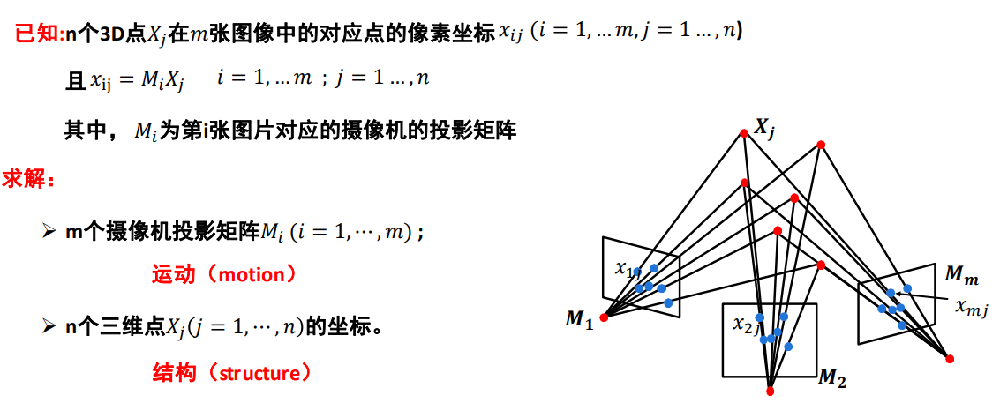

一般有三种情况：

- 欧式结构恢复（摄像机内参数已知，外参数未知）
- 仿射结构恢复（摄像机为仿射相机，内、外参数均未知）
- 透视结构恢复（摄像机为透视相机，内、外参数均未知）

每种情况可有多种方法，一般有三种方法：

- 代数方法（见欧氏结构恢复的代数推导）

	代数方法只能两个视图重建，多视图时反复进行二视图重建易积累误差。

- 因式分解方法（见仿射结构恢复的奇异值分解）

	因式分解法假定所有点都是可见的，必须保证所有用到的点都被所有相机看见。

- 捆绑调整（见透视结构恢复的非线性方法）

	最优化方法，常作为 SFM 的最后一步，由代数和分解方法提供优化方法的初始解。

	- 可同时处理大量视图，缺失数据影响小。
	- 参数量大，需要良好的初始化条件。

歧义：

- 欧式结构恢复

	相差一个相似变换（旋转，平移，缩放），可度量重构消除歧义。

- 仿射结构恢复

	保留平行关系，但夹角不一定保持（矩形到平行四边形）。

- 透视结构恢复

	平行线在无穷远相交（透视）。

## 欧氏结构恢复

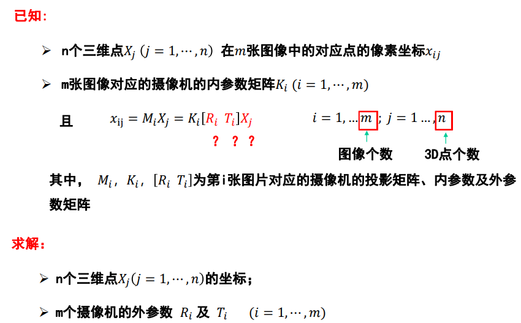

假设摄像机如下：

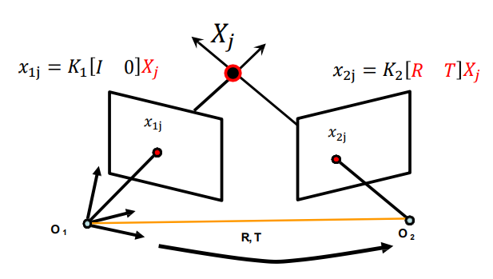

其中，以 $O_1$ 为世界坐标系原点，故 $O_1$ 的外参数矩阵中旋转为单位矩阵 $\boldsymbol I$ ，平移为 $0$ 。

### 代数方法

1. 求解基础矩阵 $\boldsymbol F$ 。
2. 利用 $\boldsymbol F$  和内参数求解本质矩阵 $\boldsymbol E$ 。
3. 分解本质矩阵，得到 $\boldsymbol {R, T}$ 。
4. 三角化求解三维点 $X_j$ 的坐标。

### 歧义

注意，求出的基础矩阵和本质矩阵与真实矩阵可能存在符号和尺度上的差异：

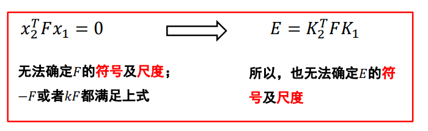

以上，欧氏结构恢复不能估计到场景的绝对尺度，其与真实场景相差一个相似变换（旋转，平移，缩放）。

相似变换的重构可使用**度量重构**。

## 仿射结构恢复

通过仿射变换进行三维空间坐标到二维像素坐标的转换：

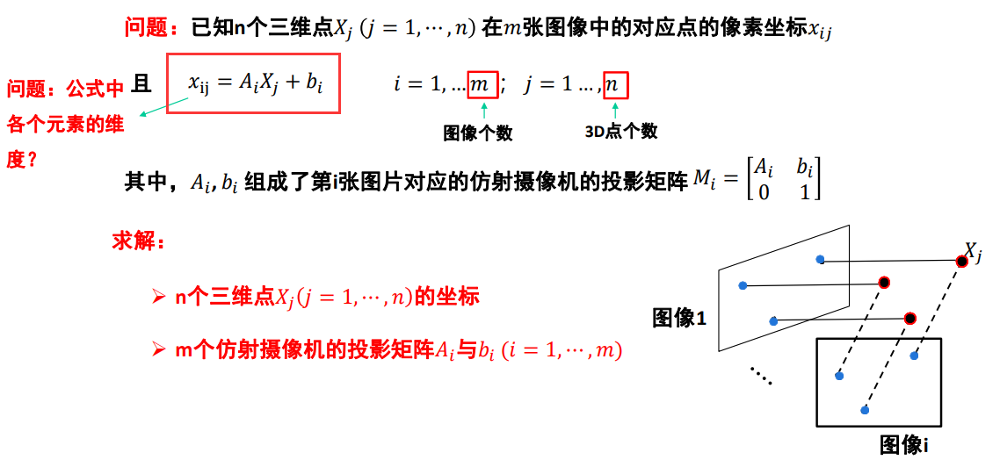

### 中心化

求每张图片的数据中心点（坐标均值），使每个点减去中心点，变为 $\hat x_{ij}$ ，这样就相当于将中心作为世界坐标系原点，如此可以消除掉 $b_i$ ，使得 $\hat x_{ij} = \boldsymbol {A_i X_j}$ 。

将中心化后的点写为测量值矩阵（也叫观测矩阵）：

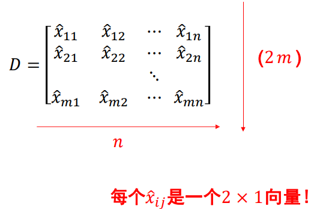

对其分解因式：

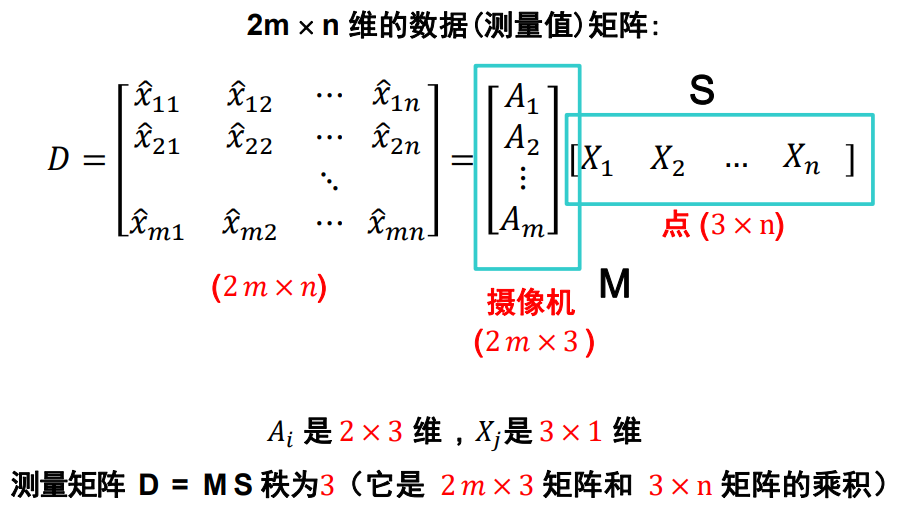

上图，分解 $\boldsymbol D$，求出 $\boldsymbol S$ 即可，具体方法可利用奇异值分解。

### 奇异值分解

计算 $\boldsymbol D$ 的奇异值分解：

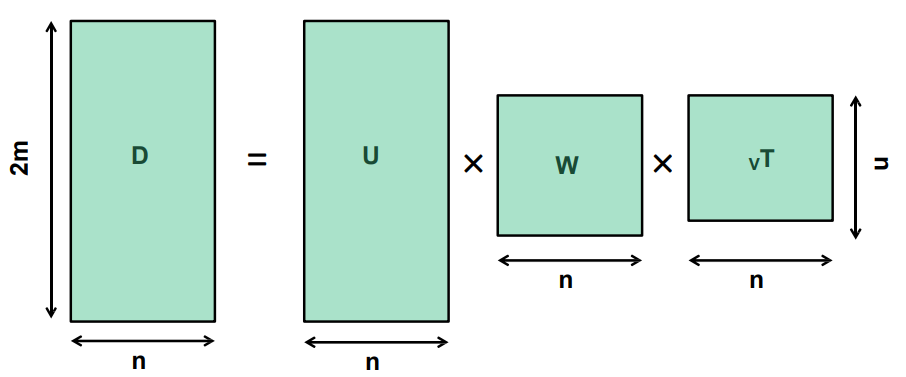

因为 $rank(\boldsymbol D) = 3$ ，理想情况下只有三个非零奇异值，代表 $\boldsymbol D$ 可由这三个奇异值相应的部分表示（黄色部分），真实情况取前三大的奇异值即可：

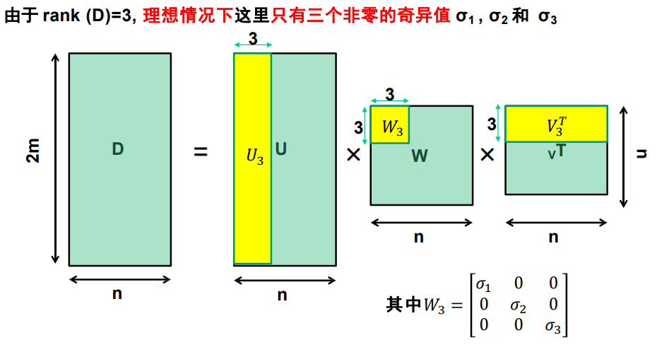

用奇异值分解表示 $\boldsymbol D$ ，即求得 $\boldsymbol S$ 部分： 

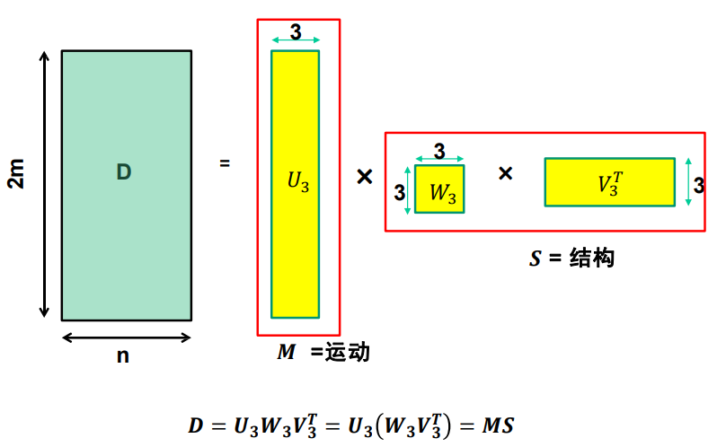

其中，下标 $3$ 表示三个奇异值相应的部分。

### 歧义

也可如下分解：

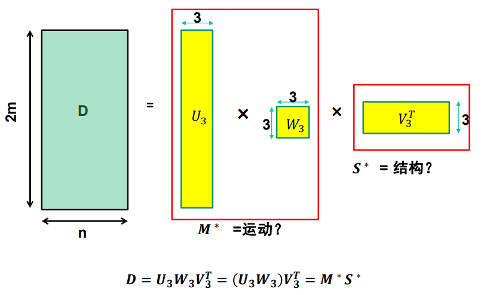

也可如下分解：

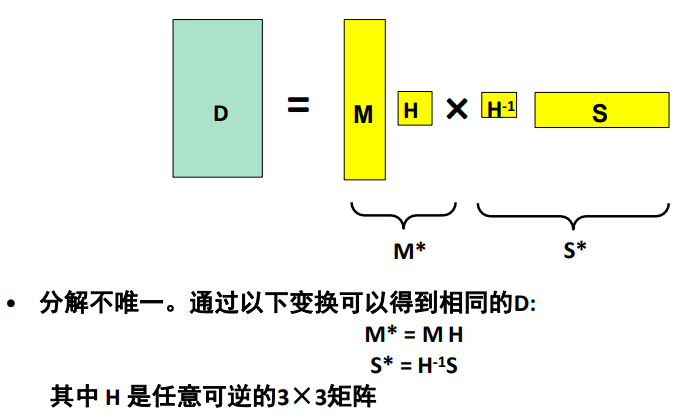

所以仿射结构恢复不唯一，存在歧义，保持平行关系，但夹角不一定保持：

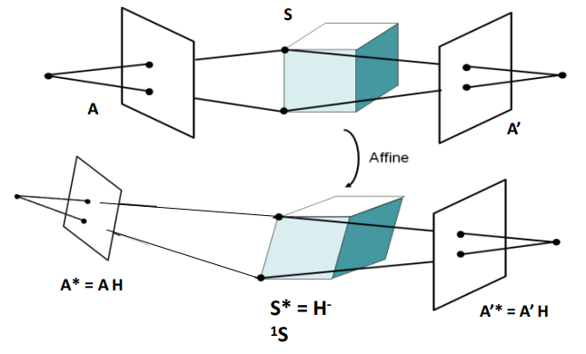

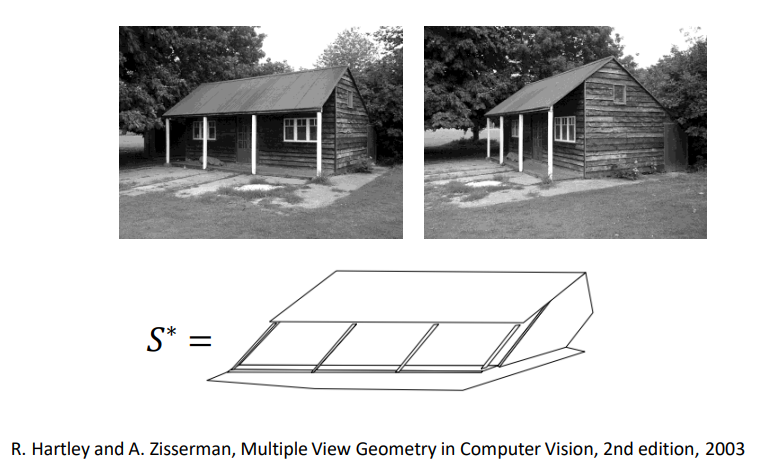

必须利用其它约束解决歧义。

## 透视结构恢复

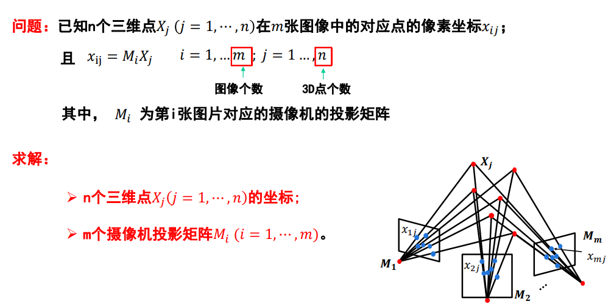

### 捆绑调整

一个非线性方法，最小化重投影误差：

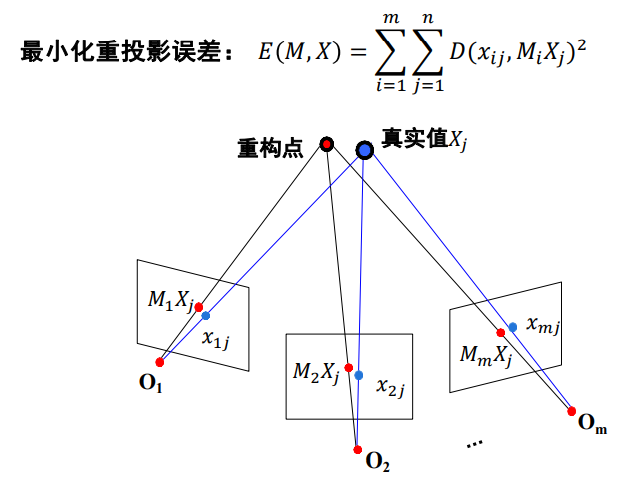

其中，$x_{ij}$ 为测量值，$\boldsymbol M_iX_j$ 为参数。

是一个非线性最小化问题，可使用牛顿法或列文伯格-马夸尔特法（L-M方法）。

### 歧义

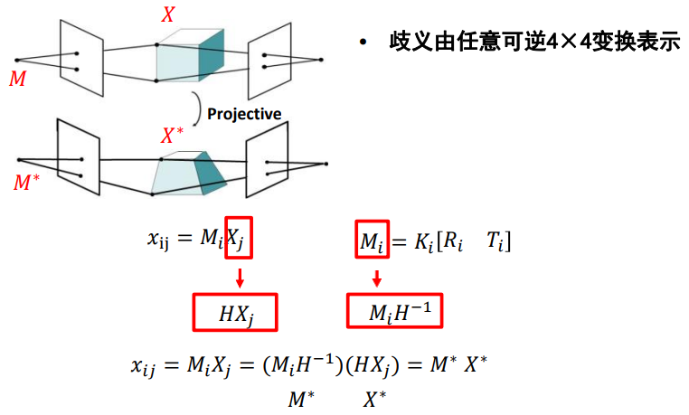

上图，$x_{ij} = \boldsymbol M_iX_j$ ，也可 $x_{ij} = \boldsymbol M^*X^*$ ，它们相差一个可逆的 $\boldsymbol H$ 。

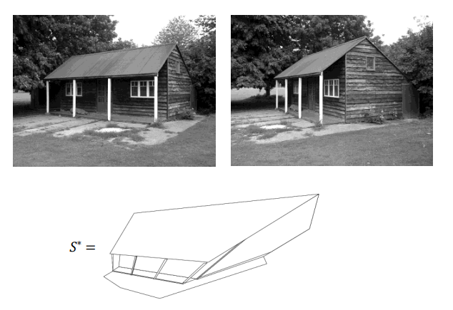

## 分层结构恢复

分阶段引入信息，逐步实现透视恢复，仿射恢复到欧氏恢复，再进行度量重构。
