# BEVFusion: A Simple and Robust LiDAR-Camera Fusion Framework

NeurIPS 2022

能够应对现实情况下的 LiDAR 和相机 malfunctions（故障）。

可直接应用到真实场景，无需后处理。

## Introduction

有些方法，先 LiDAR to world ，camera to world ，然后把 LiDAR 转换到 camera 坐标系下，将 LiDAR point 作为 query 去选择图片特征。

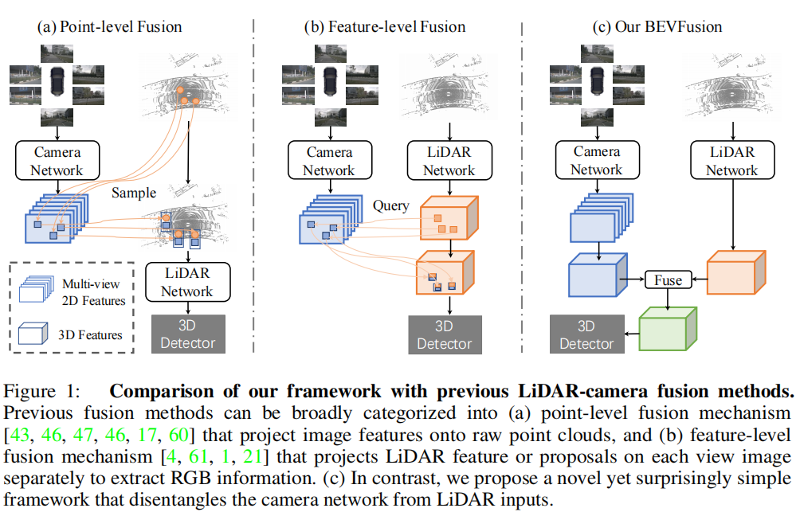

LiDAR points reflection rate is low due to object texture, a system glitch of internal data transfer, or even the field of view of the LiDAR sensor cannot reach 360 degrees due to hardware limitations.

- camera stream

	使用 Lift-Splat-Shoot（LSS） projects multi-view image features to the 3D ego-car coordinate features to generate the camera BEV feature 。

- LiDAR stream

	two voxel-based ones and a pillar-based one [59, 1, 20]  to encode the LiDAR feature into the BEV space.

提出一个新的 data augmentation 策略。

## A General Framework for LiDAR-Camera Fusion

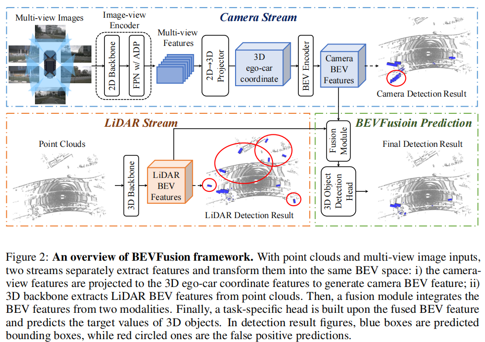

### Camera stream architecture: From multi-view images to BEV space

LSS 一开始用于 BEV semantic segmentation ，而非 3d detection ，直接使用效果不好，我们进行了调整。

将其分为三个部分：

- image view encoder

	encodes raw images into deep features（语义信息特征）

- view projector module

	transforms these features into 3D ego-car coordinate

- encoder

	finally encodes the features into the bird’s eye view (BEV) space

#### Image-view Encoder

其包含：

- a 2D backbone

	做基本特征提取。

	- LSS 原文使用 ResNet 。
	- 本文使用 Dual-Swin-Tiny 。

- a neck module

	for scale variate object representation 。

	- 使用 Feature Pyramid Network (FPN) 提取多尺度特征。
	- 对了更好地对齐特征，提出 Adaptive Module (ADP) 优化上采样的特征。
	- 使用 adaptive average pooling and a 1 *×* 1 convolution for each upsampled feature before concatenating.

#### View Projector Module

We apply 2D *→* 3D view projection proposed in [34] to construct the Camera BEV feature.

预测出 image depth ，再结合相机的参数，we can derive the image-view features to render in the predefined point cloud and obtain a pseudo voxel $V \in R^{X \times Y \times Z \times C}$ 。（将含有 depth 特征的图像特征融入点云中，得到 pseudo 体素表示）**？？？如何预测深度？？？**

#### BEV Encoder Module

为将 $V$ 进一步转换到 BEV space feature $F_{Camera} \in R^{X \times Y \times C_{camera}}$ ，采用 Spatial to Channel (S2C) operation [54] to transform $V$ from 4D tensor to 3D tensor $V \in R^{X \times Y \times (ZC)}$ ，然后使用 4 个 3x3 卷积层将其维度逐步降到 $C_{Camera}$ 。

LSS 基于下采样后得 low-resolution 特征，我们直接处理 full-resolution Camera BEV features to preserve the spatial information.

### LiDAR stream architecture: From point clouds to BEV space

输入 $F_{LiDAR} \in R^{X \times Y \times C_{LiDAR}}$ 。

采用一般方法，对比使用了三个模型做点云到 BEV space 的转化，PointPillars [20], CenterPoint [59] and TransFusion [1] 。

## Dynamic fusion module

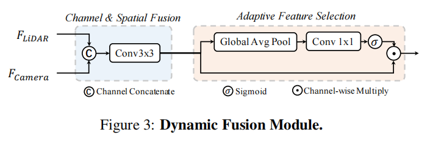

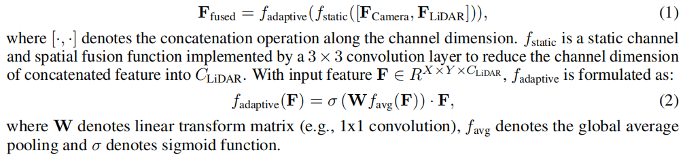

## Detection head

在三类流行的 detection head 上做了测试，anchor-based（PointPillars）[20], anchor-free-based（CenterPoint ）[59], and transform-based（TransFusion ）[1] 。

## Experiments

### Dataset

使用 nuScenes，指标为 nuScenes detection score (NDS) and mean average precision (mAP) 。

### Implementation details

训练包含两个阶段：

1. We first train the LiDAR stream and camera stream with multi-view image input and LiDAR point clouds input, respectively.

	两个 stream 都使用它们在 MMDetection3D 中的官方 setting 。

2. We then train BEVFusion for another 9 epochs that inherit weights from two trained streams 。

	这里使用 data augmentation 。

we additionally train the fusion phase with BEV-space data augmentation following [16, 27] when comparing with the state-of-the-art methods. 

In particular, we add the BEV-space augmentation implemented by [27]  for a better result.

### Generalization ability

在三种模型上应用 BEVFusion 框架的对比：

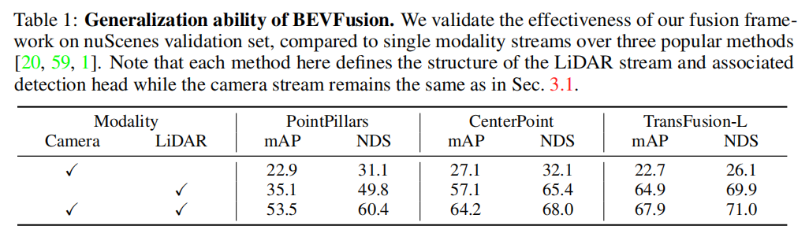

### Comparing with the state-of-the-art methods

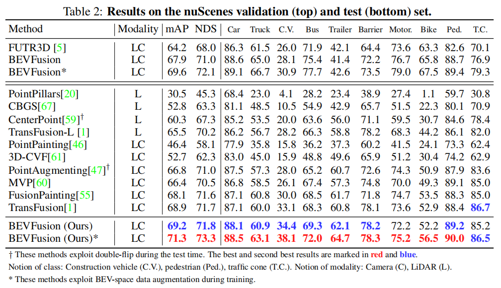

It is worth noticing that the original TransFusion[1] is a two-stage detector, whose model consists of two independent detection heads. By contrast, our BEVFusion with TransFusion-L as LiDAR backbone only contains one detection head, yet still outperforms the two-stage baseline by 0.3% mAP.

## Robustness experiments

semi-solid lidars 在：

- 雷达被一定程度损坏，即 scan range 减小的情况下。
- objects 没有反射雷达点。

### Data augmentation for robustness

- 减少 FOV（field of view）。
- 每个 object 内的点以 0.5 概率随机 drop 。

选择使用以上增强策略进行训练，然后 evaluate detectors on nuScenes validation set 。

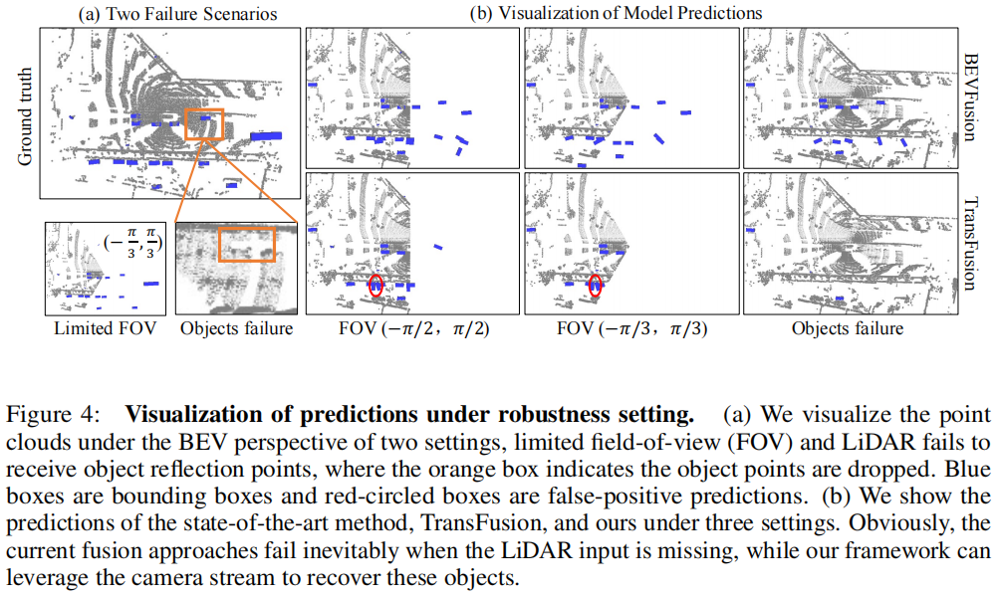

#### LiDAR sensor failure

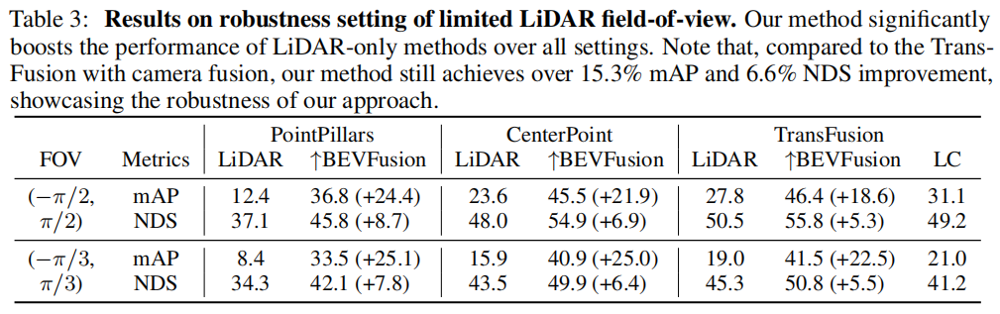

#### LiDAR fails to receive object reflection points

当反射率高于阈值时，一个点才能被判断为有效 object ，比如在雨天点的探测就受到影响。

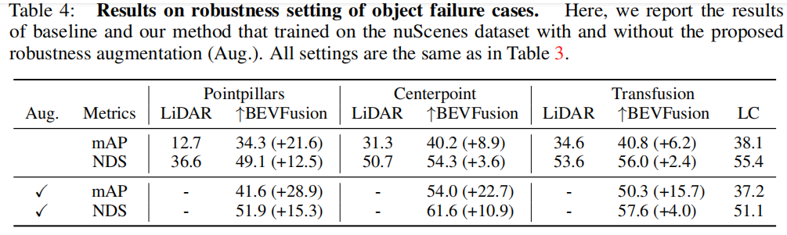

使用 Aug 训练后，BEVFusion 大幅提高了性能，而原始的 Transfusion 的 LC 之比 LiDAR 未 Aug 的 mAP 提高一点，比未增强的自己的 mAP 反而降低了。

objects 点的缺少可能导致错误的监督，模型需要能够应对这种情况。

### Robustness against camera malfunctions

三种情况下的相机故障场景：

- front camera is missing while others are preserved
- all cameras are missing except for the front camera
- 50% of the camera frames are stuck

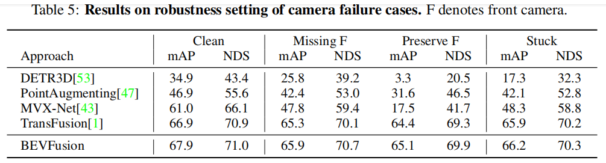

## Ablation

### Components for camera stream

The naive baseline with ResNet50 and feature pyramid network as multi-view image encoder，ResNet18 as BEV encoder following LSS [34], PointPillars [20] as detection head only obtains 13.9% mAP and 24.5% NDS.

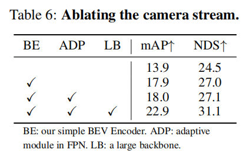

其中，打勾为替换该位置的模块。

### Dynamic fusion module

three different 3D detectors, PointPillars, CenterPoint, and TransFusion and the LiDAR stream as baseline 。

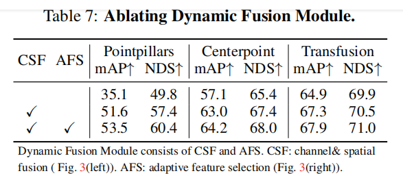

