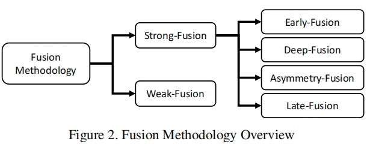
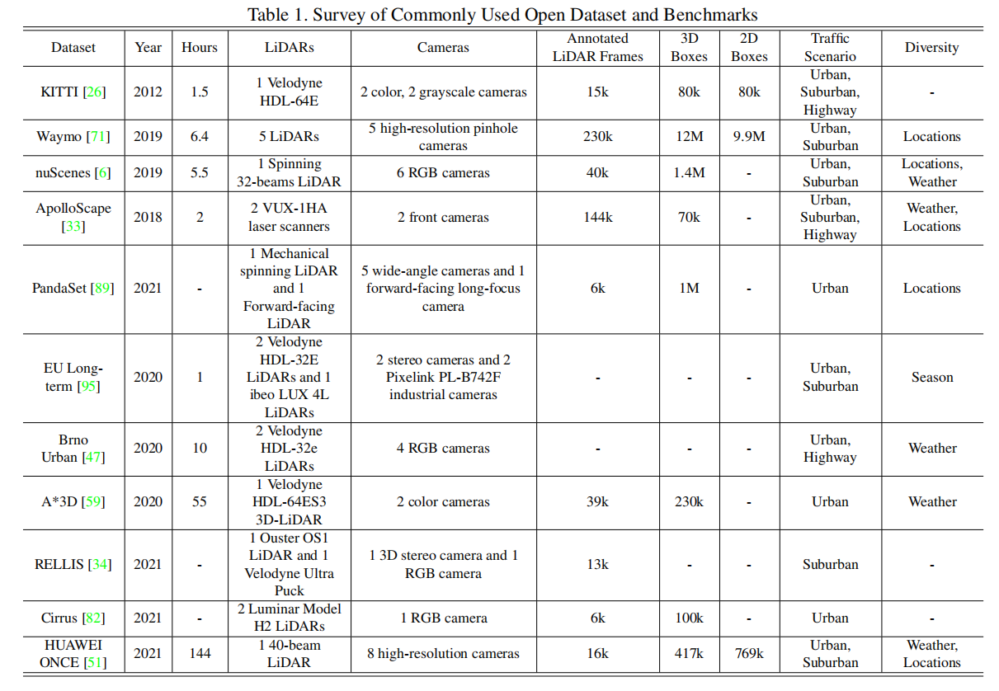
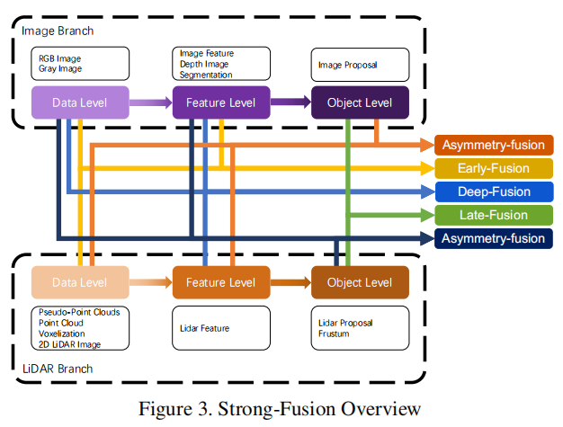
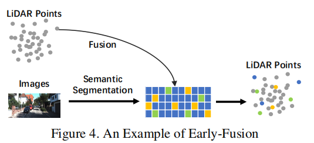
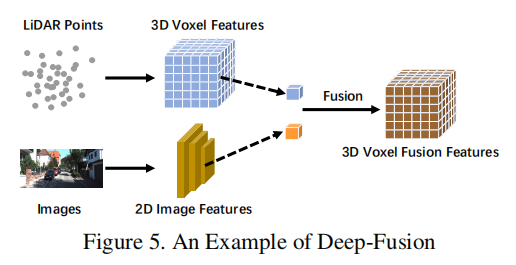
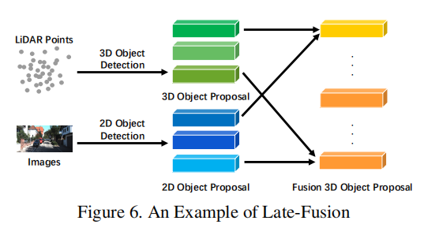
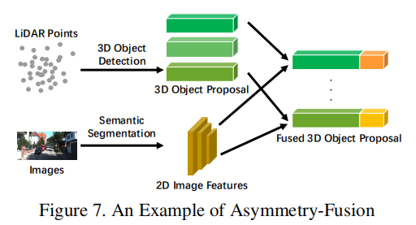
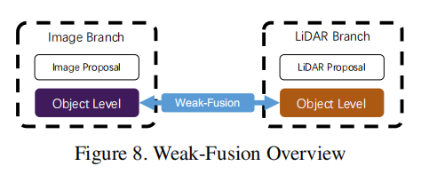

# Multi-modal Sensor Fusion for Auto Driving Perception: A Survey

2022，综述

LiDAR ：

- 不同距离下分辨率不同。
- 易受雾和大雨影响。

分类：

- strong-fusion

	- early-fusion（data-level-fusion）

		原始数据的空间对齐。

	- deep-fusion（feature-level-fusion）

		特征空间的混合。

	- late-fusion（object-level-fusion）

		预测结果的混合。

	- asymmetry-fusion

- weak-fusion

各分类下算法的性能比较。

## 常用数据集

## 数据表示

雷达的 raw data like (x, y, z, r), r 代表反射率（reflectance），不同纹理有不同反射率，这可能带来一些额外的信息。

LiDAR 视图：

- front-view

- range-view
- bird’s eye view

LiDAR 数据投影到图片：

- camera plane map (CPM)（直接到图片二维坐标系， front-view）
- bird’s eye view (BEV)（俯视图）‘

杂项：

pseudo-point clouds（伪点云）

pseudo images（伪图片）

## strong-fusion

### early-fusion

### deep-fusion

### late-fusion

### asymmetry-fusion

## weak-fusion

