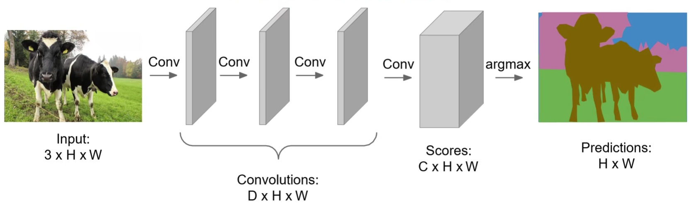
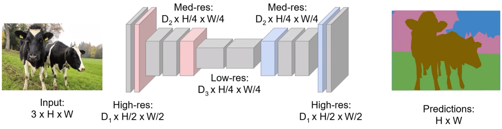
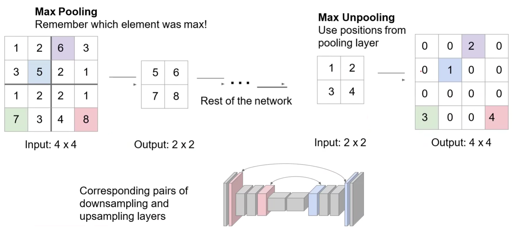
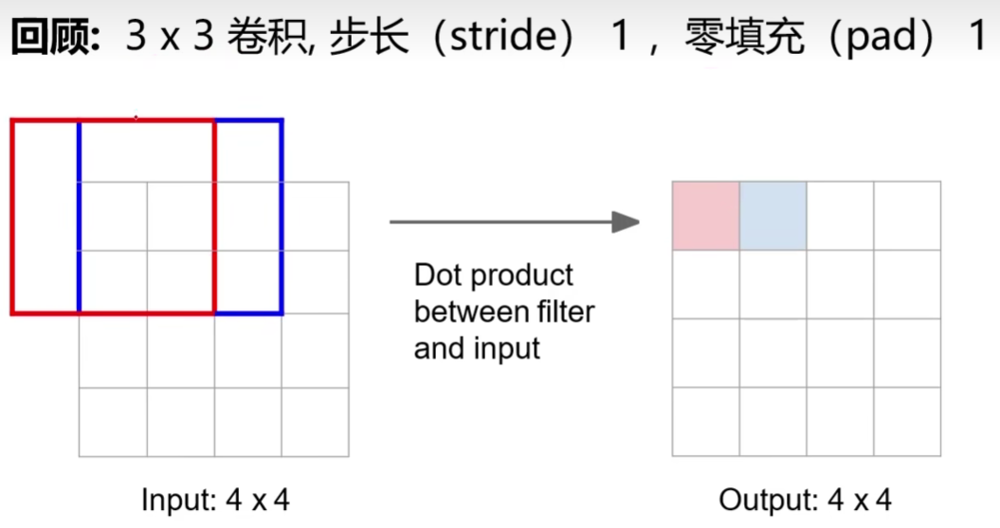
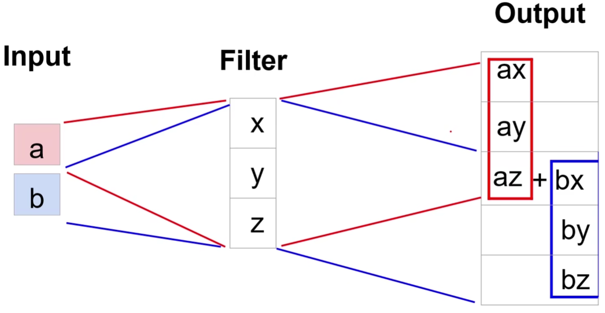
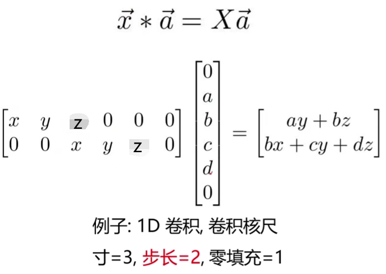
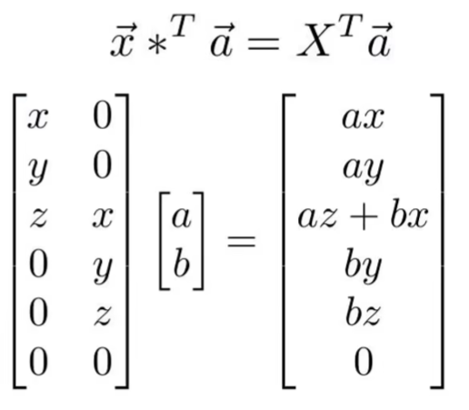

# 语义分割

（semantic segmentation）

## 暴力法

滑动窗口，设置某个大小的窗口在图像上滑动，用 CNN 对每个区域中心点像素进行图像分类。

效率太低，重叠区域被大量重复计算。

## FCN

（全卷积神经网络，Fully Convolutional Networks，FCN）

[Fully Convolutional Networks for Semantic Segmentation](https://openaccess.thecvf.com/content_cvpr_2015/papers/Long_Fully_Convolutional_Networks_2015_CVPR_paper.pdf)

让整个网络只包含卷积层，一次性输出所有像素的类别预测。

loss 函数为所有像素的 cross entropy 。

如果每一层的卷积移植保持原始分辨率，会占用相当高的显存占用。

可在网络中加入**下采样（池化，pooling）**和**上采样（反池化，unpooling）**的过程：

### 上采样

(upsampling)

#### 一般方法

- Nearest Neighbor

	复制里自己最近的像素值（即自己）。

- Bed of Nails

	周围直接填充 0 。

这两种方法基本不使用：

两者都可能添加噪声，同时对于 Bed of Nails ，某个像素（比如 1），在浅层的下采样时的位置对应关系可能和其在深层上采样时的位置对应关系不一致。

- index pooling

	对下采样和上采样时的对应关系进行了记忆。

#### 转置卷积

（Transpose Convolution）

在下采样时，移动的卷积核进行 max pooling ：

其中，红格在下采样时是红框位置的结果，蓝格在下采样时是蓝框位置的结果。

在上采样时进行转置卷积：

其中，转置卷积在上采样时将红格位置的元素填入红框内所有位置，将蓝格位置的元素填入蓝框内所有位置，重叠的部分按照权重相加。

转置卷积是可学习的上采样，重叠部分的权重作为神经网络需要学习的参数。

以一维计算为例：

其中，$x,y,z$ 就是要学习的参数。

将一维卷积写为矩阵形式：

其中，$\boldsymbol X$ 为卷积核矩阵，$\vec a$ 的两端的 $0$ 为填充，等号右侧为 1D 卷积的结果。

转置卷积的计算形式：

其中，只需将卷积核矩阵 $\boldsymbol X$ 进行转置再运算，即可达到恢复维度的效果。（所以叫转置卷积）

$\boldsymbol X$ 内非 $0$ 的部分为需要学习的权重。

## Unet

