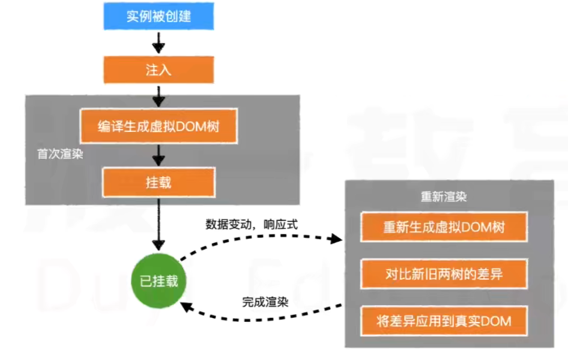
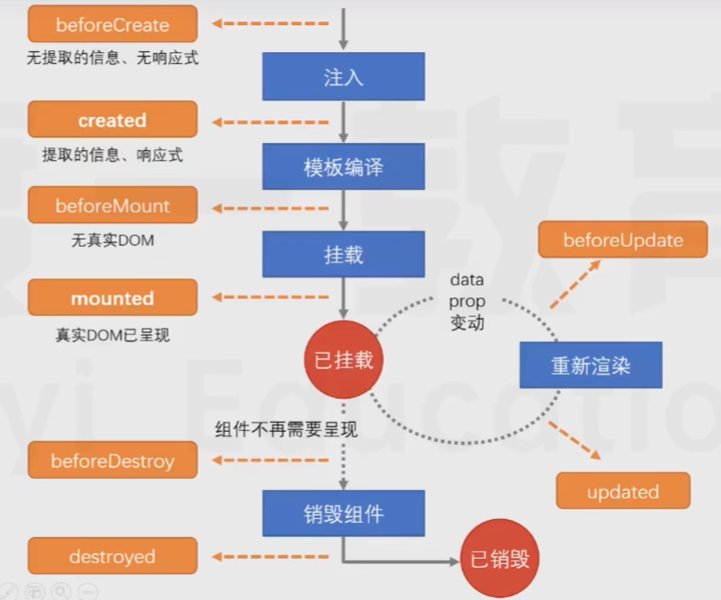

# Vue 基础

## 基本概念

Vue 是一个流行的前端框架，用于简化 JS 操作。

[Vue 官网](https://v3.cn.vuejs.org/)

主要特点：

- 渐进式

	可以在网页局部使用，可以逐步构造。

- 组件化

	局部开发再组合。

- （数据）响应式

	响应数据变动，自动渲染相关局部页面。（数据变，页面变）

应用场景：

- 前台部分页面（买家）
- 中后台全部页面（中台：买家；后台：管理员）

## 基本操作原理

- 传统 JS 需要：获取元素，处理数据，修改元素。
- Vue 需要：页面设置 Vue 模板，处理数据。（数据响应式地修改到 Vue 模板控制的局部页面表现）

## 核心原理

### 注入

Vue 对象中的部分内容会被提取到 Vue 实例中：

- `data`
- `methods`

该过程即为“注入”。

注入的目的为：

- 完成数据响应式
	- Vue2.0 通过 `Object.defineProperty` 方法完成数据响应式。
		- 修改数据的语句（比如 `Obj.data = 1;`）实际上调用了方法，该方法封装了响应式操作。
		- 缺陷：无法感知到新增和删除属性（类属性）等。
	- Vue3.0 通过 ES6 的代理（Proxy） 完成数据响应式。
- 绑定 `this`
	- 将 `methods` 中使用的 `this` 绑定到正确的对象（`vm` 实例）。

### 虚拟 DOM 树

为了提高渲染效率，Vue 会把模板编译为虚拟 DOM 树（由 JS 对象形成的树形结构），然后生成真实 DOM 。

直接改动真实 DOM 效率低，改动 JS 对象效率高。

只将（一堆操作的结果的）差异部分（使用 diff 算法比对操作前后的虚拟 DOM 树找到差异部分）更新到真实 DOM ，以提升页面效率。

Vue 提升效率在于：

- 减少虚拟 DOM 结点的产生。
- 只有必要的结点变化，以减少真实 DOM 的改动。

生成虚拟 DOM 树，可以：（以下三者在一个 Vue 对象中互斥有效，从上到下优先级递增）

- 在 HTML 中书写 Vue 模板，从而生成。
- 在 Vue 对象中配置 `template` 。
- 在 Vue 对象中的 `render()` 函数中直接创建虚拟 DOM 树结点。

虚拟结点树只能有一个根节点，从而一个 Vue 配置对象中的 `template` 只能有一个根元素。

### 挂载

将生成的真实 DOM 树放置到某个元素位置，即为挂载。

挂载方式：

- 通过 `el:"css 选择器"` 配置。
- 通过 `Vue实例.$mount("css 选择器")`配置。

### 完整流程

## 模板

Vue 使用 Mustache 模板引擎进行解析。

- 指令
- 特殊属性
- 计算属性

## 模块化

模块化可以解决全局变量污染，以一个 js 文件作为一个模块，隔离各文件的全局变量与全局函数，避免名称冲突。

在引用 JS 代码的 `script` 元素加上 `type="module"` 属性即可。

`export default` 可以将指定的内容导出，允许外部使用。

## 组件化

- 组件（Component）

对页面划分区域进行开发，每个区域成为一个组件，每个组件包含：

- 功能（JS 代码）
- 内容（模板代码）
- 样式（CSS 代码）

可以向组件传递数据，组件也可以抛出事件，传递数据。

组件内元素的大小使用相对大小，具体大小由外层组件控制。

组件名建议使用大驼峰命名法（开头大写，首字母大写）。

### 使用流程

- 创建组件

	写一个组件配置对象即可。

- 注册组件

	- 全局注册

		全局组件可以在整个应用的任何地方使用。

	- 局部注册

		局部组件只能在注册的地方使用。

- 应用组件

	- 在模板中按照 HTML 元素名的方式使用组件名，要注意组件的命名。
	- 也可使用插槽 `<slot name=""> </slot>`，通过 `name` 指定相应的组件挂载到插槽的位置。

### 组件树

Vue 实例内使用组件或组件内使用其它组件即形成组件树，其根结点为 Vue 实例。

组件间的数据应当只允许父到子等方向的单向流动（传递），即父组件传递过来的数据，子组件不应修改。

子组件不便控制的事件可以抛出给父组件控制。

### 组件生命周期

黄框内为一些异步函数，系统自动在对应生命时间调用，可以在组件中书写。一般用于控制数据交互时机。

## vue-cli

vue-cli 是一个脚手架工具，用于搭建工程环境，以及许多工具。

这些工具大都依赖：

- Node 环境
- npm 包管理器

（Node 和 npm 已集成，安装 Node 后就自动安装了 npm）

工程完成后，可以打包（使用命令）生成一个简易目录，内含处理后生成的页面代码，以供进一步使用。

`node_modules` 目录在开发后一般不上传，下载一个没有该目录的项目后，可以使用命令依据其配置文件还原。

## 开发杂项

开发组件时，`` ，加上 `scoped` 用以隔离选择器，最终会自动生成不重名的元素属性。

### 路由

路由即通过 URL 实现页面跳转与请求资源。

- 单页面路由
- 多页面路由

### 跨域

一个 URL 由：协议（protocol），域名（“主机“，host），端口（port）组成，当一个请求的 URL 的协议，域名，端口中任意一个与当前页面不同即为跨域。

为了安全性，浏览器采用同源策略（Same Orgin Policy），会阻止不同域的 JS 脚本的交互。

跨域限制：

- 无法读取非同源网页的 cookie、localstorage 等。
- 无法接触非同源网页的 DOM 和 js 对象。
- 无法向非同源地址发送 Ajax 请求。

解决方式一般有两种：

- 代理服务器

	服务器与当前页面同源，其不使用浏览器。（开发时可以用本机作为代理服务器）

- 添加响应头

	用以允许访问。
