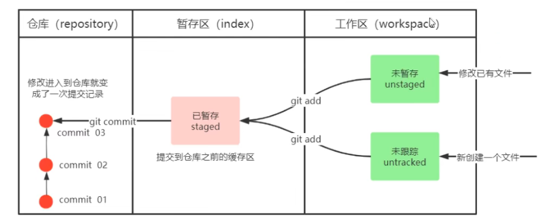

# Git

官方文档：[Git - Documentation](https://git-scm.com/doc)

## 基本概念

### 区域与状态

- 区域
	- 工作区
	- 暂存区（Index）（存放文件索引，称为暂存区）
	- 仓库
- 文件状态
	- 未跟踪
	- 未暂存
	- 已暂存
	- 已提交




## 工作流程图


## 本地仓库

### 常用指令

- `git init`
  在当前文件夹创建本地仓库。
- `git status`
  查看文件状态。（尚未提交的文件）
- `git add`
  - 后跟文件名：添加该文件到暂存区。
  - 后跟 `.`：添加当前目录所有文件到暂存区。（所有修改）
  - 暂存区的文件不属于任何一个分支。
- `git log`
  查看仓库日志。
  - `--all` 显示所有分支。
  - `--pretty=oneline` 将提交信息显示为一行。
  - `--abbrev-commit` 使输出的 commit 的 id 更简短。
  - `--graph` 以图的形式显示。
  - 建议设置别名同时使用上述所有参数 `git-log`。
- `git commit -m "注释内容"`
  提交到本地仓库。
  - **一次 commit （提交）产生一个版本。**
  - `-m` 表示在指令参数中指定注释，若不加，则会弹出 vim 编辑器以编辑注释。
  - `-a` 表示将已追踪文件添加到暂存区并提交。（注意，只要曾被添加或提交过都是已追踪文件，对于全新添加的文件必须先使用 `git add`）（不建议使用这个参数）
  - `git commit --amend` 可修改上一次 commit 的注释。

### 版本回退

HEAD 引用指向当前分支或某个版本。

- `git reset`
  回退到某一版本（由其哈希值或 HEAD 标识符的变体指定）。

  - 定义：过程相关文件

    当前索引（**暂存区**）中**文件**（已 `add` 但未 `commit` 文件）以及 HEAD 改变带来的**差异文件**
  
  - `--soft`
  
    将 HEAD 引用指向给定提交，过程相关文件变为已提交 `add` 状态（进入暂存区），工作目录的内容不变。
    不删除工作空间改动代码，撤销 commit，不撤销 `git add . ` 操作。
  
  - `--mixed`
  
    `git reset` 的默认参数。HEAD 引用指向给定提交，过程相关文件变为未提交 `add` 状态，进入工作目录。
    不删除工作空间改动代码，撤销 commit，并撤销 `git add .` 操作。
  
  - `--hard`
  
    HEAD 引用指向给定提交，索引（暂存区）内容和工作目录内容都会变为给定提交那时的状态。（过程相关文件丢失）
    删除工作空间改动代码，撤销 commit，撤销 `git add . ` 操作。
  
- `git reflog`
  查看已经删除的记录。

- `git reset --soft HEAD^`常用于撤销上一次错误的 commit 。

### 忽略列表

创建文件 `.gitignore`，指定不接受 Git 管理的文件名或通配符，其会在 `git add .` 时被忽略。

- 成功被忽略的文件或文件夹在 `git status` 时查看不到。

- 忽略规则

	```
	target   // 忽略 target 目录
	angular.json   // 忽略这个 angular.json 文件
	log/*   // 忽略 log 目录下的所有文件
	css/*.css   // 忽略css目录下的.css文件
	```

### 分支

- `git branch`

	查看本地分支。

- `git branch 分支名`

	创建分支。

- `git checkout 分支名`

  切换分支。若分支不存在，则创建并切换。

  - 建议切换分支前一定先提交分支。

- `git merge 分支名`

  将指定分支**合并到当前分支**。

  - 注意，合并后若有冲突，解决冲突后当前分支变化，指定分支仍不变。

- `git branch -d 分支名`

	删除分支。若是 `-D`，则强制删除。
	
- `git branch -m old_name new_name`

  修改分支名

### 解决冲突

- 修改产生冲突的文件，删除多余内容，留下想留下的内容即可。
- 远端分支也是分支，解决冲突方法一致。
- 若使用 push 失败，执行 pull 将再冲突解决掉后再 push。一般先 pull 查看是否有冲突，然后 push 。

### 常用规范

- 两个主要分支

  - master 主分支（github 现在默认为 `main`）

  - develop 开发分支

  	用于开发的分支，开发完成后要合并到 master 上。

- feature 分支

	添加功能。完成后合并到 develop 分支。

- hotfix 分支

	从 master 派生的分支，用于修复 bug。完成后合并到 master，develop，test 分支。

- test 分支

	用于测试代码。

## 远程仓库

- `git remote add <远程仓库简写> <URL>`

	**添加**远程仓库。github 远程仓库简写（远端名）默认为 `origin`，主分支默认为 `main` 。

- `git remote`

  **查看**远程仓库。

  - `-v` 显示所有远程仓库名与其 URL 。
  - `git remote show <远端名>` 显示详细信息。
  - `git remote rename <old_name> <new_name>` 更改远端名。
  - `git remote rm <远端名>` 删除远端。

- `git push [-f] [--set-upstream] [远端名 [本地分支名][:远端分支名]]`

	**提交**到远程仓库。

	- `-f` 强制推送，覆盖远端分支。
	- `--set-upstream` 推送并建立和远端分支的**关联**关系。
	- 若远程分支名与本地分支名相同，则可以只写本地分支。
	- 如果当前分支已经和远端分支**关联**（用 `--set-upstream` 建立），可以省略分支名和远端名：`git push` （将 master 分支推送到已关联的远端分支）。

- `git branch -v`

	查看分支，并显示与远端分支的关联关系。

- `git clone <仓库路径> [本地目录]`

	**克隆**仓库。若不指定本地目录，会自动设为克隆的仓库名。

- `git fetch [远端名] [分支名][:在本地重命名的分支名]`

  **抓取**远端分支到本地，不合并。

  - 若只指定远端名，则抓取该远端所有分支。
  - 若不指定远端名和分支名，则抓取关联远端的所有分支。
  - 若远端分支与本地分支重名，则抓取失败。

- `git pull [远端名] [分支名]`

	**拉取**远端分支到本地，并与当前本地分支和并。相当于 `fetch + merge` 。

	- 若不指定远端名和分支名，则拉取关联远端的所有分支。

## 底层原理

- Git 结构原理

  - [这才是真正的Git——Git内部原理揭秘！ | 机器之心](https://www.jiqizhixin.com/articles/2019-12-20)

  - [Git 原理解析 | 寒枫的博客](https://hanfeng.ink/post/git_core/)

- 文件比对原理

	Myers 算法，类似以行为单位的最长公共子序列 LCS 。

	- [类似git/linux的文件对比功能(diff)是怎么实现的? - 知乎](https://www.zhihu.com/question/24755861)
	- [Git 是怎样生成 diff 的：Myers 算法 - CJ Ting's Blog](https://cjting.me/2017/05/13/how-git-generate-diff/)

## 杂项

### 中文显示

中文路径文件名不能正确显示，而是显示为八进制的字符编码。

将 git 配置文件的 `core.quotepath` 项设置为 `false` 。quotepath 表示引用路径，加上 `--global` 表示全局配置。

1. git bash 终端输入命令：`git config --global core.quotepath false`
2. 若乱码，则继续在 git bash 界面中右击空白处，选择`选项->文本->本地Locale`，设置为`zh_CN`，旁边的字符集选框选设为`UTF-8`。
