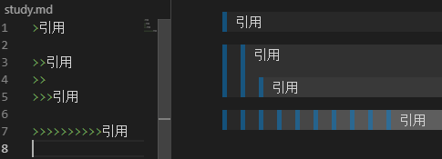

# Markdown

后缀名：  `.md`

推荐 typora 编辑器

以下以 VS code 使用为例，VS Code 内开启实时预览可点击右上角。

Markdown 原生不支持字体大小与颜色，但可以 HTML 标签形式改变颜色

## 标题

最多到 6 级


## 字体

加粗，斜体，斜体加粗，删除线

高亮：==   ==


## 引用

在引用的文字前加>即可。引用也可以嵌套，如加两个>>三个>>>

n 个...



注意上图中的空行对比

## 分割线

三个或者三个以上的  \* 都可以。


## 图片

! [图片alt](图片地址 ''图片title'') 图片alt就是显示在图片下面的文字，相当于对图片内容的解释。 图片title是图片的标题，当鼠标移到图片上时显示的内容。title可加可不加


## 超链接

[超链接名] (超链接地址 "超链接title") title 可加可不加


注：Markdown本身语法不支持链接在新页面中打开，貌似简书做了处理，是可以的。别的平台可能就不行了，如果想要在新页面中打开的话可以用 html 语言的 a 标签代替

## 列表

### 无序列表

用 - + * 任何一种都可以


### 有序列表

数字加点


注意空行

### 嵌套列表

上一级和下一级之间敲空格即可


注意三个符号间的差别，目录层级可以混用。

### 列表规范

Typora 的列表生成规范：

- 无解释内容不加空行。
- 有解释内容则加空行。

注意观察下图：


## 表格


## 代码

### 单行代码

代码之间分别用一个反引号包起来

### 代码块

代码之间分别用三个反引号包起来，且两边的反引号单独占一行


反单引号：`  Esc下方含 ~ 的按键

注意：反引号后加上语言的名字才有颜色渲染。

## 数学公式

参见公式指导手册：

https://www.zybuluo.com/codeep/note/163962#cmd-Markdown-%E5%85%AC%E5%BC%8F%E6%8C%87%E5%AF%BC%E6%89%8B%E5%86%8C

### 公式数组与表格

- 数组和表格均以 `\begin{array}` 开头，
- 列属性
	- 开头后定义列数及每一列的文本对齐属性，`c` `l` `r` 分别代表居中、左对齐及右对齐。
	- 若需要插入垂直分割线，在定义式相应位置插入 `|` ，
- 行属性
	- 插入水平分割线，在下一行输入前插入 `\hline` 。
	- 与矩阵相似，每行元素间均须要插入 `&` ，每行元素以 `\\` 结尾表示换行
- 最后以 `\end{array}` 结束数组。

示例：

```markdown
\begin{array}{c|lcr}
    n & \text{左对齐} & \text{居中对齐} & \text{右对齐} \\
    \hline
    1 & 0.24 & 1 & 125 \\
    2 & -1 & 189 & -8 \\
    3 & -20 & 2000 & 1+10i \\
\end{array}
```

$$
\begin{array}{c|lcr}
    n & \text{左对齐} & \text{居中对齐} & \text{右对齐} \\
    \hline
    1 & 0.24 & 1 & 125 \\
    2 & -1 & 189 & -8 \\
    3 & -20 & 2000 & 1+10i \\
\end{array}
$$

- 其中 `c|lcr` 表示在第一列和第二列间插入一条垂直分割线。
- 多个表格放一起（嵌套数组或表格）参见公式手册。