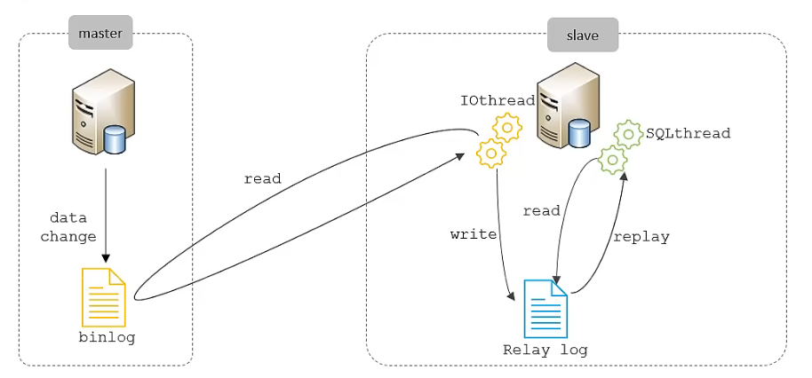
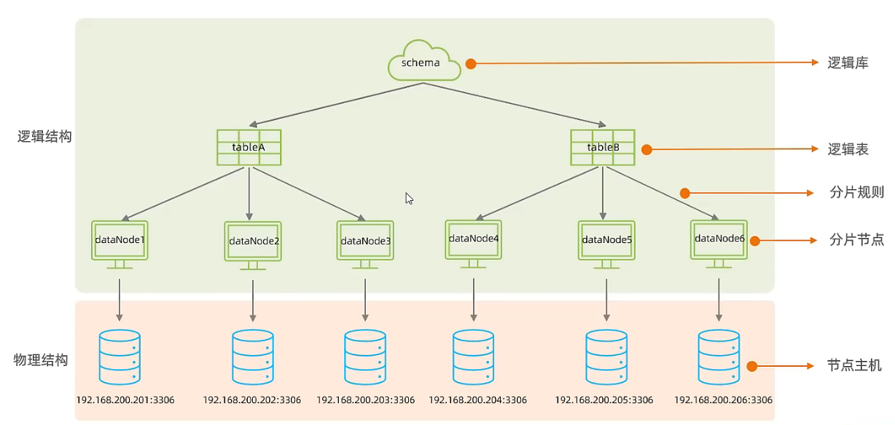
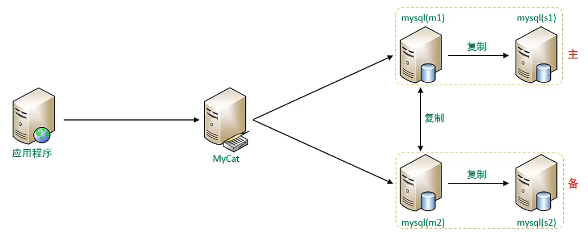

# 运维

## 日志

### 错误日志

记录系统出现错误的情况。

- 默认存放位置

	`/var/log/mysqld.log` 。

- 查看位置

	```sql
	show variables like '%log_error%';
	```

### 二进制日志

记录了所有 DDL 和 DML 语句，但不包括数据查询语句（select、show 等）。

- 作用

	- 灾难时的数据恢复
	- MySQL 的主从复制。

- 查看位置

	```sql
	show variables like '%log_bin%';
	```

- 日志格式

	```sql
	STATEMENT    基于 SQL 语句的日志记录，记录的是 SQL 语句，对数据进行修改的 SQL 都会记录在日志文件中。
	ROW          基于行的日志记录,记录的是每一行的数据变更。（默认)
	MIXED        混合了 STATEMENT 和 ROW 两种格式，默认采用 STATEMENT，在某些特殊情况下会自动切换为 ROW 进行记录。
	
	show variables like '%binlog_format%';   # 查看默认格式
	```

- 日志查看

	日志以二进程存储，不能直接读取，要通过查询程序查看。

	```sql
	mysqlbinlog [参数选项] <日志文件名>
	
	-d	指定数据库名称，只列出指定的数据库相关操作。
	-o	忽略掉日志中的前 n 行命令。
	-v	将行事件(数据变更)重构为 SQL 语句	
	-w	将行事件(数据变更)重构为 SQL 语句，并输出注释信息
	```

- 日志删除

	对于比较繁忙的业务系统，每天生成的 binlog 数据巨大，需要清理。

	```sql
	reset master;	删除全部 binlog 日志，删除之后，日志编号，将从 binlog.000001 重新开始
	purge master logs to 'binlog.******';	删除 ****** 编号之前的所有日志
	purge master logs before 'yyyy-mm-dd hh24:mi:ss';	删除日志为 "yyyy-mm-dd hh24:mi:ss" 之前产生的所有日志
	
	# 也可设置过期时间，过期自动删除
	show variables like '%binlog_expire_logs_seconds%';
	```

### 查询日志

查询日志记录客户端的所有操作语句，默认关闭。

- 查看查询日志状态，显示日志路径

	```sql
	show variables like '%general_log%';
	```

### 慢查询日志

慢查询日志记录了所有**执行时间超过指定参数**( long_query_time，单位:秒，默认10秒）的所有 SQL 语句的日志。
MySQL 的慢查询日志**默认关闭**，需要在 MySQL 的配置文件 (/etc/my.cnf）中配置如下信息：

```sql
# 开启 MySQL 慢日志查询开关
slow_query_log = 1

# 设置慢日志的时间为 2 秒，SQL 语句执行时间超过 2 秒，就会视为慢查询，记录慢查询日志
long_query_time = 2

# 设置完毕需重启
```

查看慢日志文件：`/var/lib/mysql/localhost-slow.log`

默认不会记录**管理语句**和**不使用索引的查询语句**，可以如下修改配置文件：

```sql
log_slow_admin_statements = 1   # 记录执行较慢的管理语句
log_queries_not_using_indexes = 1   # 记录执行较慢的未使用索引的语句
```

## 主从复制

### 概念

通过将存储**主数据库**（Master）的 DDL 和 DML 操作的**二进制日志**（binlog）传送到从数据库中，然后在**从数据库**（Slave）中执行（重做），从而使主从数据库数据保持同步。

- 逻辑结构
	- 一台主库可以同时向多台从库复制。
	- 从库也可以作为其它库的主库，实现链状复制。
- 作用
	- 主库出现问题，可以快速切换到从库提供服务。
	- 实现读写分离，降低主库的访问压力。
	- 可以在从库中执行备份，以避免备份期间影响主库服务。

### 原理

1. Master 主库在事务提交时，会把数据变更记录在二进制日志文件 Binlog 中。
2. 从库读取主库的二进制日志文件 Binlog，写入到从库的中继日志 Relay Log 。
3. Slave 重做中继日志中的事件，将改变反映到它自己的数据。



### 搭建

#### 主库配置

1. 修改配置文件 `/etc/my.cnf`

  ```sql
  # mysql 服务 ID，保证整个集群环境中唯一，取值范围: 1 ~ 2^32-1，默认为 1
  server-id = 1
  
  #是否只读, 1 代表只读, 0 代表读写
  read-only = 0
  
  # 指定不需要同步的数据库
  binlog-ignore-db = ...
  
  # 指定同步的数据库
  binlog-do-db = ...
  # 上两个选项都不设置，则同步所有数据库。
  ```

2. 重启 MySQL 服务。

3. 在主库上创建远程连接账号，并赋予主从复制权限。

	```sql
	# 创建 itcast 用户, 并设置密码，该用户可在任意主机连接该 MySQL 服务
	CREATE USER 'itcast'@'%'IDENTIFIED WITH mysql_native_password BY '密码';
	
	# 为'itcast'@'%'用户分配主从复制权限
	GRANT REPLICATION SLAVE ON *.*TO'itcast'@'%';
	```

4. 查看二进制日志坐标

	```sql
	show master status;
	
	字段含义说明:
	file   从哪个日志文件开始推送日志文件
	position  从哪个位置开始推送日志
	binlog_ignore_db   指定不需要同步的数据库
	```

#### 从库配置

1. 修改配置文件 `/etc/my.cnf`

	```sql
	# 要与主库不同
	server-id = 2
	
	# 是否只读, 1 代表只读, 0 代表读写
	read-only = 1
	```

2. 重启 MySQL 服务。

3. 登录从库，执行以下命令，以设置连接配置

	命令信息要使用在主库中注册好的账户。
	
	```sql
	CHANGE REPLICATION SOURCE TO SOURCE_HOST='xxx', SOURCE_USER='xxx', SOURCE_PASSWORD='xxx', SOURCE_LOG_FILE='xxx', SOURCE_LOG_POS='xxx';
	```

4. 开启同步操作

	```sql
	start replica;   # 8.0.22 之后
	start slave;   #  8.0.22 之前
   ```

5. 查看同步状态

	```sql
	start replica status\G;   # 8.0.22 之后    \G 用于转换数据的显示方式，使每个字段占一行。
	start slave status\G;   #  8.0.22 之前
   ```

## 分库分表

将数据分散到多台服务器存储，可由 Mycat 实现。

### 拆分策略

- 垂直拆分

	- 垂直分库

		以表为依据，不同的表分布到不同的数据库中。

	- 垂直分表

		以字段（列）为依据，将不同字段分布到不同表中。（一般各自通过主键或外键相关联）

- 水平拆分

	- 水平分库

		以记录（行）或字段值为依据，将不同位置的记录（行）分布到不同的数据库中。（水平分库就是水平分那个库的所有表）

	- 水平分表

		以记录（行）或字段值为依据，将不同位置的记录（行）分布到不同的数据库中。

## Mycat

由阿里巴巴发起，基于 Java 编写的 MySQL 开源中间件，可以像使用 MySQL 一样使用 Mycat 。

[Mycat 项目及配置入门](https://github.com/MyCATApache/Mycat-Server)

[Mycat 详细文档](https://github.com/MyCATApache/Mycat-doc)

- 支持 Windows 和 Linux
- 需要安装
	- 中间件服务器：Mycat
	- 分片服务器：MySQL

### 核心概念



- 分片节点也叫数据节点。
- Mycat 不存储实际的数据，实际的数据存储在 MySQL 中。

### 基本指令

```shell
mycat start
mycat stop
# 默认占用端口号 8066
```

连接 Mycat（像连接 MySQL 一样）：

```shell
mysql -h <IP address> -P 8066 -u <user name> -p <password>
```

### 基本配置

配置以下文件可实现分库分表和读写分离。

- 在`schema.xml` 文件中配置映射规则

	- 逻辑库（schema 标签）

	- 逻辑表（table 标签）

	- 数据节点（dataNode 标签）

	- 分片规则（rule 属性）（若表未被拆分，则 table 标签不添加 rule 属性，比如垂直分库时）

	- 节点主机（dataHost 标签）

- 在 `server.xml` 中配置用户及用户权限信息，需要配置用户访问逻辑库的权限。

- 在 `rule.xml` 配置分片规则。

配置好表后，要在 Mycat 中用 SQL 语句创建逻辑表，从而各数据库的物理表也会被映射从而创建。

### 注意

[可参考文档](https://www.cnblogs.com/joylee/p/7513038.html)

- Mycat 配合数据库本身的复制功能，可以解决读写分离的问题，但是针对分库分表的问题，不是完美的解决。或者说，至今为止，业界没有完美的解决方案。
	
	- 分库分表写入能完美解决
	
	- 不能完美解决主要是**联表查询的问题**
	
		Mycat 支持两个表联表的查询，**多余两个表的查询不支持**。 其实，很多数据库中间件关于分库分表后查询的问题，都是需要自己实现的，而且基本都不支持联表查询，Mycat 已经算做地非常先进了。分库分表之后联表查询问题，可以通过合理数据库设计来避免。
	
- 全局表
	
	- 对于数据字典表（经常要访问到的用于解释表项意义的表，数据量小且无变动），最好在每个数据库中都存放，在 Mycat 中设置为**全局表**（`type=global`），以利于业务操作。
	- 注意，多表联查时，Mycat 只能把 SQL 语句路由到某一个分片（库），而不能同时路由到多个分片，所以就只能使用那个分片中的表，若分片中不存在该表，则查询失败。

### 分片规则

- 范围

	某个范围的数据落入某一个分片中。

- 取余

	依取余结果落入某一个分片。

- 哈希

	字符串等不能计算的字段值，可以用计算哈希值，然后根据哈希值落入某一分片。

- 枚举

	按照某一字段的值落入某一分片。

- 应用指定

	按照某一字段的字符串子串（必须是数字）的表示落入某一个分片。（如 “01234123” 前两位为 ”01“，则落入 1 号分片）

- 固定分片哈希

	用位与运算取数字字段的二进制低位，然后按十进制解读为下标，依据一个数组（该数组内部为多个分片号，可重复）中的内容落入分片。（类似于依据解读出的下标大小范围分片）

- 字符串哈希解析

	截取指定字段的子字符串，进行 hash，从而得出分片。

- 按天分片（日期）

- 按自然月分片（日期）

### Mycat 管理

- Mycat 默认使用两个端口

	- 8066 数据访问端口，进行 DML 和 DDL 操作。

	- 9066 数据库管理端口，进行 Mycat 管理。

		```shell
		mysql -h <host> -P 9066 -u <user> -p <password>
		```

连接上 Mycat 9066 端口后，可使用 Mycat 管理命令：

| 命令 | 含义 |
| ---- | ---- |
| show @@help | 查看 Mycat 管理工具帮助文档 |
| show @@version | 查看 Mycat 的版本 |
| reload @@config | 重新加载 Mycat 的配置文件 |
| show @@datasource | 查看 Mycat 的数据源信息 |
| show @@datanode | 查看 MyCat 现有的分片节点信息 |
| show @@threadpool | 查看 Mycat 的线程池信息 |
| show @@sql | 查看执行的 SQL |
| show @@sql.sum | 查看执行的 SQL 统计 |

- Mycat-eye

	一款 Mycat 图形管理与监控工具，也可直接用于 MySQL 。

## 读写分离

在**主从复制**的基础上，将对数据库的读写操作分开，对**主数据库写**（insert、update、delete），对**从数据库读**（select）。

可使用 Mycat 实现。

### 一主一从

#### 原理


#### 配置

可使用 Mycat 实现（`schema.xml`文件）

- writeHost 标签（主）

- readHost 标签（从）
- dataHost 标签的 balance 属性

    | 参数值      | 含义                                                         |
    | ----------- | ------------------------------------------------------------ |
    | 0（默认值） | 不开启读写分离机制，所有读操作都发送到当前可用的 writeHost 上。（readHost 不生效） |
    | 1           | 全部的 readHost 与备用的 writeHost 都参与 select 语句的负载均衡（主要针对于双主双从模式，一主一从也可)。 |
    | 2           | 所有的读写操作都随机在 writeHost , readHost 上分发。（没有读写分离） |
    | 3           | 所有的读请求随机分发到 writeHost **对应的**（主对应从） readHost 上执行, writeHost 不负担读压力，只负担写。 |

### 测试技巧

如何确定数据来自主库还是从库？

主库的数据会复制到从库，而从库不会复制到从库，所以可以直接对从库的数据进行修改，再查询，即可区分数据来自主库还是从库。

#### 问题

主库结点（Master）宕机后，业务系统就只能读，而不能写了。

### 双主双从

#### 原理

- 四台数据库主机，一台 Mycat 主机。
- 两对主从复制 + 两个 Master **互相**主从复制。（互相以保证数据在四台数据库主机中的一致性）
- 一台主机 m1（或 m2） 处理所有写请求，另外三台负责所有读请求。
- 当一台 m 宕机后，另一台 m 负责写请求，另两台 s 负责读请求，m1 与 m2 互为备机。
- 注意，互相并不是同时的，**m1 与 m2 间同时只会生效一个主从复制关系**。
	- 当 m1 负责写时，m1 是主，m2 是从。
	- 当 m2 负责写时，m2 是主，m1 是从。




#### 主机配置

演示编号：m1 为 1，s1 为 2，m2 为 3，s2 为 4 。

演示功能分配：m1 写，其余读。

##### 主库配置

（两个主库都要配置，内容稍作修改即可）

1. 修改配置文件 `/etc/my.cnf`

```sql
  # MySQL 服务 ID，要保证在整个集群环境中唯一。
  serverid = 1   # 在 m2 中，= 3 即可
  
  # 在 m2 中，以下内容都一致
  
  # 指定同步的数据库
  binlog-do-db = dbA   # 指定数据库名
  binlog-do-db = dbB
  binlog-do-db = dbC
  
  # 在作为从数据库的时候，有写入操作也要更新二进制日志。
  log-slave-updates
  # 因为 binlog 默认只记录主数据库的写入操作，s1 要从 m1 复制数据，s2 要从 m2 复制数据，所以要设置该选项。
```

2. 重启 MySQL 服务。
2. 两台主库分别创建账户并赋予主从复制权限。

##### 从库配置

（两个从库都要配置，内容稍作修改即可）

1. 修改配置文件 `/etc/my.cnf`

	```sql
	server-id = 2   # 在 s2 中，= 4 即可
	```

2. 重启 MySQL 服务。

3. 登录从库，执行以下命令，设置连接

	命令信息要使用在主库中注册好的账户。

	```sql
	CHANGE MASTER TO MASTER_HOST='xxx', MASTER_USER='xxx', MASTER_PASSWORD='xxx', MASTER_LOG_FILE='xxx', MASTER_LOG_POS='xxx';
	```

4. 启动从库

	```sql
	start slave;
	
	show slave status\G;   # 查看状态
	```

##### 主库相互复制配置

分别在两个主库中执行以下命令：

```sql
CHANGE MASTER TO MASTER_HOST='xxx', MASTER_USER='xxx', MASTER_PASSWORD='xxx', MASTER_LOG_FILE='xxx', MASTER_LOG_POS='xxx';

start slave;

show slave status\G;   # 查看状态
```

#### Mycat 配置

（`schema.xml`文件）

- dataHost 标签

	- balance 属性

		完成读写分离和负载均衡。

	- writeType 属性，switchType 属性

		完成失败自动切换。

记得在 `server.xml` 给用户设置访问逻辑库的权限。


- 上图

	- `balance = "1"`

		代表全部 readHost 和 stand by writeHost 参与 select  语句的负载均衡，即正常情况下，一个主库负责写，其余三个主机负责读。

	- writeType

		- 若为 0，写操作都转发到第 1 台 writeHost，writeHost1 挂了，会切换到 writeHost2 上。
		- 若为 1，所有的写操作随机地发送到配置的 writeHost 上。（即两个主库都负责写）

	- switchType

		- 为 -1.不自动切换。
		- 为 1，自动切换。
