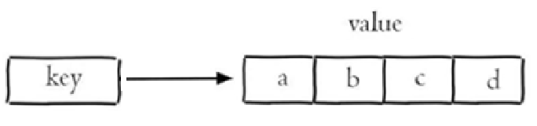

# Redis

## 基本概念

Redis 是一个基于**内存**的 key-value 结构数据库（C 语言开发）。

Redis 是互联网技术领域使用最为广泛的**存储中间件**。

key-value 结构存储：

 

特点：

- 基于内存存储，读写性能高  
- 适合存储热点数据（热点商品、资讯、新闻）
- 企业应用广泛

用途：

- 当数据只有一个字段或非常少的数据时，用一张表存储意义不大，可以考虑用 redis 存储。
- 高访问的微量数据。
- 存储某些全局变量。

### 对比

- 全局变量

	本地缓存，存储在内存或本地文件中。

	- 本地缓存依赖本地机器，当一个服务部署了多份，本地缓存就不太适用了。

	- 本地缓存比 redis 性能更好，实际开发中会两者结合使用。

- redis

	分布式缓存。

	- 提供持久化、发布、订阅、事务性操作等，在分布式场景下具有优异表现。
	- 可跨越不同进程、服务器和编程语言进行数据共享。
	- 需要网络通信和序列化、反序列化等额外开销。（缺点）

## 启动服务

- Redis 服务默认端口号为 **6379** 。
- **Ctrl + C** 可停止 Redis 服务。

```shell
# windows

# 启动 redis 服务
.\redis-server.exe redis.windows.conf

# 建立客户端，连接 redis 服务
.\redis-cli.exe
# 进一步可使用参数：
-h ip地址
-p 端口号
-a 密码（如果需要）
```

设置密码：

1. 修改配置文件，添加 `requirepass 123456` 。

2. 修改后服务端仍可无密码启动。

3. 客户端如果不带密码，仍然可以进入，但无法执行指令。

	可用指令 `keys *` 测试，会提示 `(error) NOAUTH Authentication required.` 。

## 数据类型

Redis 存储的 key-value 结构的数据。

其中：

- key 只能是字符串类型。
- value 有 5 种常用数据类型
	- value 在 redis 内部序列化后存储。
	- 在 redis 内部查询出的 value 是序列化后的结果。
	- 从 redis 取出 value 后，要进行反序列化（即类型转换）。

value 类型如下：

- 字符串 string

	普通字符串，Redis中最简单的数据类型。

- 哈希 hash

	也叫散列，一个哈希表，类似于 Java 的 HashMap 结构。

- 列表 list

	按照插入顺序排序，可以有重复元素，类似于 Java 的LinkedList 。

- 集合 set

	无序集合，没有重复元素，类似于 Java 的 HashSet 。

- 有序集合 sorted set / zset

	集合中每个元素关联一个分数(score)，根据分数升序排序，没有重复元素。

 

## 常用命令

### 字符串操作

Redis 中字符串类型常用命令：

- **SET** key value 			    设置指定key的值
- **GET** key                                        获取指定key的值
- **SETEX** key seconds value         设置指定key的值，并将 key 的过期时间设为 seconds 秒
- **SETNX** key value                        只有在 key    不存在时设置 key 的值

### 哈希操作

Redis hash 是一个string类型的 field 和 value 的映射表，hash特别适合用于存储对象，常用命令：

- **HSET** key field value             将哈希表 key 中的字段 field 的值设为 value
- **HGET** key field                       获取存储在哈希表中指定字段的值
- **HDEL** key field                       删除存储在哈希表中的指定字段
- **HKEYS** key                              获取哈希表中所有字段
- **HVALS** key                              获取哈希表中所有值

 

### 列表操作

Redis 列表是简单的字符串列表，按照插入顺序排序，常用命令：

- **LPUSH** key value1 [value2]         将一个或多个值插入到列表头部
- **LRANGE** key start stop                获取列表指定范围内的元素
- **RPOP** key                                       移除并获取列表最后一个元素
- **LLEN** key                                        获取列表长度
- **BRPOP** key1 [key2 ] timeout       移出并获取列表的最后一个元素， 如果列表没有元素会阻塞列表直到等待超    时或发现可弹出元素为止

 

### 集合操作

Redis set 是string类型的无序集合。集合成员是唯一的，这就意味着集合中不能出现重复的数据，常用命令：

- **SADD** key member1 [member2]            向集合添加一个或多个成员
- **SMEMBERS** key                                         返回集合中的所有成员
- **SCARD** key                                                  获取集合的成员数
- **SINTER** key1 [key2]                                   返回给定所有集合的交集
- **SUNION** key1 [key2]                                 返回所有给定集合的并集
- **SREM** key member1 [member2]            移除集合中一个或多个成员

 

### 有序集合操作

Redis有序集合是string类型元素的集合，且不允许有重复成员。每个元素都会关联一个double类型的分数。常用命令：

常用命令：

- **ZADD** key score1 member1 [score2 member2]     向有序集合添加一个或多个成员
- **ZRANGE** key start stop [WITHSCORES]                     通过索引区间返回有序集合中指定区间内的成员
- **ZINCRBY** key increment member                              有序集合中对指定成员的分数加上增量 increment
- **ZREM** key member [member ...]                                移除有序集合中的一个或多个成员

 

### 通用命令

Redis 的通用命令是不分数据类型的，都可以使用的命令：

- KEYS pattern 		查找所有符合给定模式( pattern)的 key 
- EXISTS key 		检查给定 key 是否存在
- TYPE key 		返回 key 所储存的值的类型
- DEL key 		该命令用于在 key 存在是删除 key

