# 单表查询

## select 语句

```
select [ all | distinct ] [ top n[ percent ] ] < 目标列表达式 > [ , ... n ]
[ into < 新表名 > ]
from < 表名 > | < 视图名 > [ , ... n ]
[ where < 条件表达式 > ]
[ group by < 列名 1 > [ having < 条件表达式 > ] ]
[ order by < 列名 2 > [ asc | desc ] ];


all 输出所有元组，包括重复的（默认为 all ）

distinct 输出无重复的结果（不相同的元组取某些列输出时可能变为相同）
目标列表达式：描述输出结果中的列，取列名等。还可以是数据或算术表达式

top 返回指定查询结果的前 n 行，包括 percent 则输出前 n% 行

into < 新表名 > 使用结果创建新表，创建时不会输出其数据

from 从表或视图中获取数据

where 筛选条件

group by 按列值分组，列值相等的元组为一个组，通常要在每组上取聚集函数

having 用来对 group by 子句的结果进行筛选

order by 指示按列值排序，升序 asc；降序 desc；默认为升序
```

## 简单查询

### 直接输出数据

若输出结果的列顺序与原表一致，则可用 * 号代替（只做标记，不是通配符）

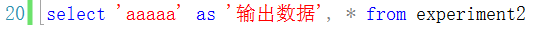


### 查询经过计算的值


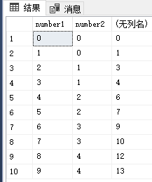

上图：直接使用列名进行计算将会对每一元组执行此重复操作。


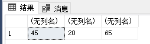

上图：使用聚集函数将会对整个列的数据进行操作，注意输出的行数。


上图：当各项的输出行数不一致时，将报错。聚集函数 sum 输出一行，而 number2 输出一列（很多行）。

（注意区分聚集函数（对列操作）和普通函数（对行操作）。

## 带有 where 子句的查询

### 比较大小

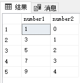

注意条件都要跟在列名后。

### 确定范围（也可使用比较大小的方式）

```
between ... and ... （属性值在某范围内）（左闭右闭区间）
not between ... and ... （属性值不在某范围内）
```

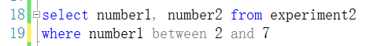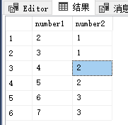

日期时间格式也可以用做范围比较。

### 确定集合

```
in （属性值属于指定集合的元组）（里面也可以放字符串）
not in （属性值不属于指定集合的元组）
```

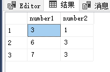

### 字符匹配

运算符 like 可进行字符串的匹配。一般格式如下：

```
[ not ] like ' <匹配串> ' [ escape ' <指定的转义字符> ' ]

匹配串是字符串，可以含有 SQL 中的通配符（只有这四个）：
%	（百分号）任意字符
_  	（下划线）单个字符
[ ]   指定范围内（例如 [a-f]）或集合（例如 [abcdef]）的任何单个字符。
[^]  不在指定范围内（例 [^a - f]）或集合（例 [^abcdef]）的任何单个字符。
（若匹配串不含通配符，则可用 = 等号取代 like，<>  不等号取代 not like）

escape（ 当匹配串中需要含有特殊字符时，可用 escape 指定转义字符 ）
```

### 空值查询

```
is null（为空值）
is not null（不为空值）
```


### 多重条件查询

可使用 and，or，括号，and 优先级高于 or 。

## 带有 order by 子句的查询

order by 按指定列值排序，升序 asc；降序 desc；默认为升序。

首先以指定的第一个列排序，若第一列相同，按指定的第二个列排序……可指定不同值。

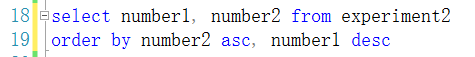

注意：此上下两条语句等价（注意差别）（因为默认 asc ）


## group by 分组查询

### 简单分组查询

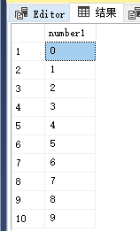

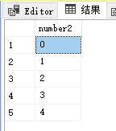

注意：

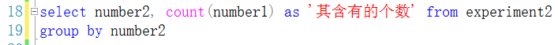

**此处的聚集函数只对该组内元组起作用**（在聚集函数遇到空值时，除 count 函数外，都跳过空值而只处理非空值）

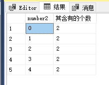

## 带 having 子句的分组查询

相当于定语从句。


对上表：


再使用 having 得 ：

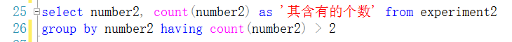


### 错误注意

1. 若以下使用：

	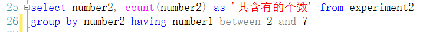

	则出错，

	

	原因是 number1 列并没有包含在 group by 子句的输出表中。

2. 若以下使用：

	

	此时 number1 的输出行数与 聚集函数的输出行数不一致，错误。

### 区分

- group by 是对表或视图分组后由 select 输出在一起。
- having 子句是对 group by 的结果表再进行选择。

top ：

into ：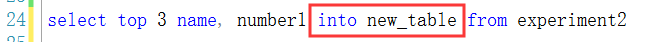

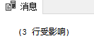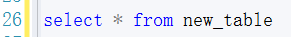

## 联合查询

**对几个输出结果集**进行集合运算后输出（不局限于单表，多表亦可）

集合运算符：
- union 并
- intserect 交
- except 差

对下表：


1. union 默认去除重复元组， union all 保留重复元组

	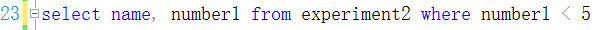

	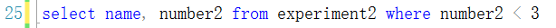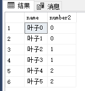

	并结果：

	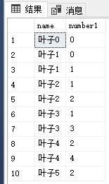
	
2. intserect 交（自动将重复元组去除）

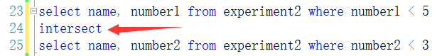

注：不支持 intserect all 。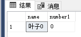

3. except 差（“上减下”）
	注：不支持 except all
	
	