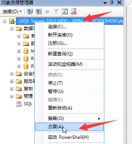
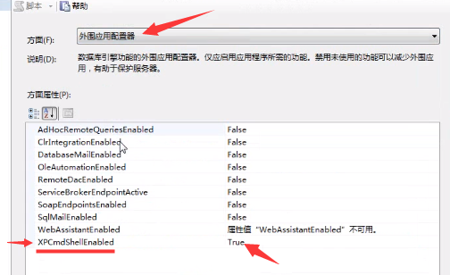
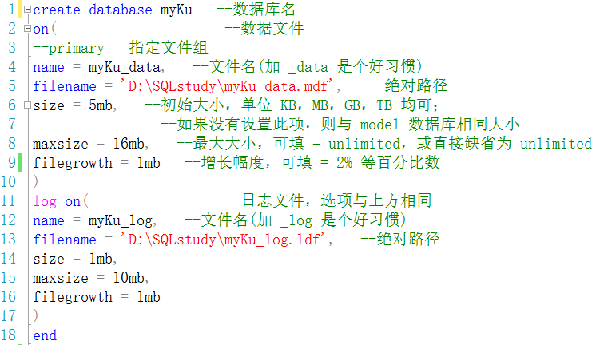
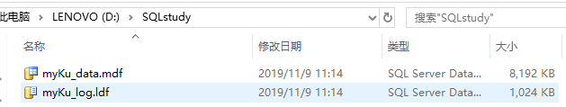

# 基本库管理

- 新建查询生成的文件扩展名为	 .sql
- 主数据文件扩展名为		 .mdf
- 辅助数据文件扩展名为		 .ndf
- 事务日志文件扩展名为		 .ldf

## 文件与文件组

主文件组，用户自定义文件组，默认文件组

- SQL Server 的数据存储在文件中，文件是实际存储数据的物理实体，文件组是逻辑对象，SQL Server 通过文件组来管理文件。

- 一个数据库有一个或多个文件组，主文件组（Primary File Group）是系统自动创建的，用户可以根据需要添加文件组。每一个文件组管理一个或多个文件，其中主文件组中包含主数据文件（master data file），扩展名是.mdf，这个文件是系统默认生成的，并且在数据库中是唯一的；

- 辅助文件的扩展名是.ndf，是用户根据需要添加的。

- 主文件组中也可以包含辅助文件，除了主文件组之外，其他文件组只能包含辅助文件。

- 每个数据库都有一个默认文件组。如果在创建数据库对象时没有指定文件组，则将默认文件组作为其文件组。如果没有指定默认文件组，则将主文件组作为默认文件组

## 创建文件夹

```
execute xp_cmdshell ' < 系统命令 > ' 

（ exec 是 execute 的简写 ）
```


若无法运行：



改为 true ,



也可用代码，用 sp_configure 存储过程改变选项，可根据错误提示编写多条语句。

## 创建数据库

一个 SQLserver 实例可以创建 32767 个数据库。

```
create database 语句
create database < 数据库名 >
on [ primary ] (
name = < 逻辑文件名 > 
filename = < 物理文件名 >
[ , size = < 初始大小 > ]
[ , maxsize = < 文件最大长度 | unlimited > ]
[ , filegrowth = < 文件增长幅度 > ] 
)
log on
[ primary ] (
name = < 逻辑文件名 > 
filename = < 物理文件名 >
[ , size = < 初始大小 > ]
[ , maxsize = < 文件最大长度 | unlimited > ]
[ , filegrowth = < 文件增长幅度 > ] 
)
```





### 创建前检查

创建数据库时必须保证数据库名称是系统中不存在的，如果存在，系统将会报错。一般在创建前先使用以下语句检查是否有该名称的数据库存在。


### 次数据文件（ .ndf ）

若要同时定义两个数据文件，在包含第一个定义的圆括号后加逗号，再用圆括号包含第二个定义即可；第二个文件作为次数据文件。

不同文件可放入不同文件组。

## use 语句

数据库切换。

```
use <数据库名>
```

默认情况下，用户连接的是 master 数据库。


上图左上角代表当前连接的数据库，数据库连接不对应时，可能对正确的语句提示无效对象，无效列等，
此时可更换连接的数据库，也可在无效对象前通过【 . 】点来准确指定，如：


改为：


## exec 语句

```
exec 参数1，参数2……      		（不带括号时）执行存储过程
exec( 存储 SQL 语句的字符串 )	（带括号时）执行 SQL 语句
```

存储过程：相当于命令脚本，函数。

## 查询数据库信息

1. 利用目录视图，如
	sys.databases  ——数据库基本信息
	sys.database_files  ——数据库文件信息
	sys.filegroups  ——数据库文件组信息
	sys.master_files  ——数据库文件的基本信息和状态信息
	
	
	
2. 利用函数，如

```
databasepropertyex（< 数据库名 >,< 选项 >）
查看指定数据库名的指定选项属性
```


```
db_id (< 数据库名 >)
返回指定数据库的 id

db_name (< id 号 >)
返回指定 id 号的数据库名
```

3. 利用存储过程，如
	sp_tables   ——返回在当前数据库环境中查询的对象列表
	sp_help   ——返回当前数据库对象的信息
	sp_helpdb  [< 数据库名 >]  ——显示给定数据库或所有数据库的参数信息
	sp_spaceused   ——查看当前数据库空间信息
	
	
	
## alter database 语句

修改数据库。

```
增加文件大小： modify file
增加文件： add file | add log file
删除文件：remove file 子句
```

以下只需指定逻辑文件名或绝对文件名其中之一，有些选项缺省则文件对应的属性不变。

1. 增加数据库文件的大小（只能增加，不能减少）

```
alter database < 数据库名 >
modify file (
name = < 逻辑文件名 >，
filename = < 绝对路径 >，
size = < 文件大小 >，
maxsize = < 最大大小 >，
filegrowth =  <增长幅度>
)
```


2. 增加数据文件或日志文件

```
alter database < 数据库名 >
add file | add log file (
name = < 逻辑文件名 >,
filename = < 绝对路径 >,
size = < 初始大小 >,
maxsize = < 最大大小 >,
filegrowth = < 增长幅度 >
)
```

3. 删除数据库的文件

```
remove file 子句
alter database < 数据库名 >
remove file < 逻辑文件名 >
```

## 数据库的更名，删除

- 在更名或删除前应确保没有用户正在使用数据库 。
- 注意：更名只是更改逻辑名称，实际物理文件名未改变。

执行系统存储过程 sp_renamedb 。

```
sp_renamedb < 旧数据库名 > ,< 新数据库名 >
```


## drop database 语句

删除数据库。

```
drop database < 数据库名 >
```


