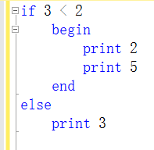
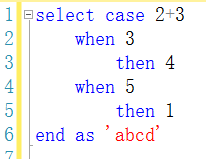
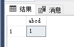
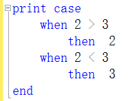
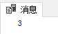
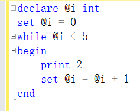
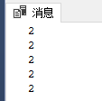
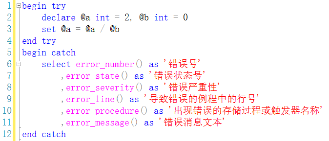

# 流程控制与时间及异常处理


## begin ... end 语句

将多条语句组合为一个语句块，要么都执行，要么都不执行。
可嵌套。

```
begin
< 语句 > [ , 其它语句 ]
[ < begin ... end > [ , 其它块 ] ]
end
```


## if ... else 语句

```
if < 条件表达式 >
<命令行或语句块>
[ else [ 条件表达式 ] 
<命令行或语句块> ]
```



## case 语句

注意：case 语句必须要与其它命令搭配，如 select，print 等。
返回表达式必须返回一个值，当中不能有操纵语句

### 匹配 case 语句

```
case < 输入条件表达式 >
when < 条件表达式求值 1 > then < 返回表达式 1 >
when < 条件表达式求值 2 > then < 返回表达式 2 >
...
[ else < 返回表达式 n > ]
end
```



### 条件 case 语句

没有了开头的输入条件表达式，将依次求取表达式的值，返回第一个为真的表达式对应的返回表达式；若都不为真，则返回 else 中的返回表达式

```
case 
when < 条件表达式求值 1 > then < 返回表达式 1 >
when < 条件表达式求值 2 > then < 返回表达式 2 >
...
[ else < 返回表达式 n > ]
end
```



## while 循环语句

```
while < 条件表达式 >
begin
< 命令行或语句块 >
[ break ]
[ continue ]
< 命令行或语句块 >
end
```



注意：SQL 没有 for 循环。

## return 语句

无条件退出，可附带整型返回值.

```
return [ < 整型表达式 > ]
```

如果不提供返回值，系统会根据执行结果返回一个内定值（都为负值）。


## waitfor 语句

可以定义一个延迟时间间隔或等待到的时间点，当超过间隔或达到时间点时，执行其后的语句。

```
waitfor delay <时间间隔> 
或
waitfor time <等待时间点>
```

注意：延迟的时间间隔必须小于 24 小时；时间用 time 数据格式，用单引号括起。

 左图：3 秒后输出 5

## try ... catch 语句

错误处理（异常处理）
注意：要与 begin ... end 搭配使用

```
begin try
< 语句 > | < 语句块 >
end try
begin catch
< 语句 > | < 语句块 >
end catch
```

用于捕获错误的函数：

| **error_number()**    | **返回错误号**                         |
| --------------------- | -------------------------------------- |
| **error_state()**     | **返回错误状态号**                     |
| **error_severity()**  | **返回错误严重性**                     |
| **error_line()**      | **返回导致错误的例程中的行号**         |
| **error_procedure()** | **返回出现错误的存储过程或触发器名称** |
| **error_message()**   | **返回错误消息的完整文本**             |




- 严重性为 10 或更低的错误被视为警告或信息性消息，try ... catch 块不处理此类错误。

- 严重性高于 10 但不关闭数据库连接的所有执行错误可构造 try ... catch 块对其缓存。