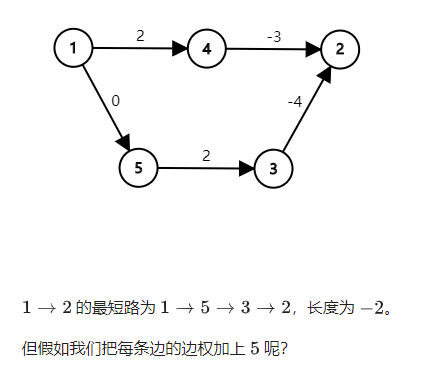
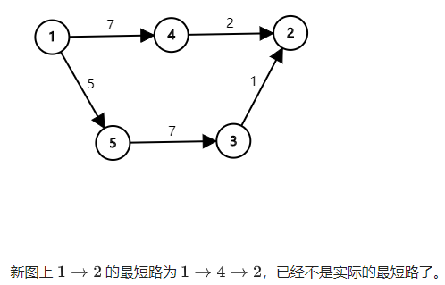

# 最短路

## 总览

| 算法 | 作用 | 适用图 | 补充 | 复杂度 |
|-|-|-|-|-|
| Floyd | 全源最短路 | 非负环图 | 支持负权 | $O(N^3)$ |
| Bellman-Ford，SPFA | 单源最短路 | 任意图 | 可判负环存在性 | $O(NM)$ |
| Dijkstra | 单源最短路 | 非负权图 | 无负权显然无负环 | $O(M\log M)$ |
| Johnson | 全源最短路 | 非负环图 | 支持负权 | $O(NM\log M)$ |
| DAG single source | 单源最短路 | DAG | 支持负权，显然无环 | $O(N+M)$ |
| DAG all source | 全源最短路 | DAG | 支持负权，显然无环 | $O(N(N+M))$ |

上表中 $N$ 为顶点数，$M$ 为边数，Dijkstra 使用优先队列实现。

注意负权与负环的关系，有负权不一定有负环，若存在负环，则不存在最短路。

Bellman-Ford 适用于可以方便地遍历所有边的数据结构，SPFA 适用于方便遍历某个顶点所有出边的数据结构。

判可达负环优先用 SPFA，判全局负环优先对不同连通域用多次 SPFA。

Dijkstra 算法的基本操作“拓展”是在深度上寻路，而 Bellman-Ford 算法的“松弛”操作则是在广度上寻路，这就确定了 Bellman-Ford 算法可以对负边进行操作而不会影响结果。

若没有负权边，最好选择 Dijkstra 算法，若有，最好选 SPFA 算法。

对于稀疏图（点较少的图）的全源最短路，$n$ 次优先队列优化的 dijkstra 算法为 $O(nm\log m)$，这比 Floyd 算法更优，若有负权就用 Johnson 算法。

DAG 具有无环的特殊性质，所以不需要再使用 Bellman-Ford 或者 SPFA 这样较慢的算法了。

## 最短路性质

对于边权为正的图，任意两个结点之间的最短路:

- 不会经过重复的结点。
- 不会经过重复的边。
- 任意一条的结点数不会超过 $n$ ，边数不会超过 $n-1$。

对于能够与负环连通的源点与终点，它们之间不存在最短路。

## Floyd 算法

可求前 $k$ 个节点中的全源最短路（任意两点间的最短路）。

适用于任何图，不管有向无向，边权正负，但是最短路必须存在。（不能有负环）

复杂度比较高，但是常数小，容易实现。

### 原理

`f[k][x][y]` 表示只允许经过节点 $1$ 到 $k$，节点 $x$ 到节点 $y$ 的最短路长度。即是在子图 $V' = 1, 2, \ldots, k$ 中的路径，注意：$x$ 和 $y$ 不一定在这个子图中。

有状态转移方程：`f[k][x][y] = min(f[k-1][x][y], f[k-1][x][k]+f[k-1][k][y])`

其中 `f[k-1][x][y]`，为不经过 $k$ 点的最短路长度，而 `f[k-1][x][k]+f[k-1][k][y]`，为经过了 $k$ 点的最短路长度。

### 实现

初始化时`f[0][x][y]` 的取值有：

- $x$ 到 $y$ 的边权（当 $x$ 与 $y$ 间存在直接相连的边时）
- $0$（当 $x = y$ 时，到自身的距离为 $0$）
- $+\infty$（当 $x$ 与 $y$ 间没有直接相连的边时）

可以看出，`f`数组的第一维是可以省略的，逐步增大 $k$ 的规模，于是有：

```c++
for (k = 1; k <= n; k++) {
	for (i = 1; i <= n; i++) {
		for (j = 1; j <= n; j++) {
      		f[i][j] = min(f[i][j], f[i][k] + f[k][j]);   //状态转移方程
    	}
  	}
}
```

时间 $O(n^3)$ ，空间 $O(n^2)$。

在 Floyd 算法枚举 $k$ 的时候，已经得到了前 $k-1$ 个点的最短路径，这 $k-1$ 个点不包括点 $k$，并且他们的最短路径中也不包括 $k$ 点。

### 应用

#### 最小权值环

一个正权无向图，找一个最小权值的环。

在一个环上，对于其编号最大的节点 $u$，有 $1$ 到 $u-1$ 号节点中 $x$ 到 $y$ 的最短路径与边 $(u, x)、(u, y)$ 构成了一个最小环。即 `f[u-1][x][y]` 和 $(u,x), (u,y)$ 共同构成了环。

在 Floyd 的过程中枚举 $u$，计算这个和的最小值即可。$O(n^3)$

```c++
min = __INT_MAX__;
for (k = 1; k <= n; k++) {
	for (i = 1; i <= n; i++) {
		for (j = 1; j <= n; j++) {
	        // （一）：
            min = std::min(min, f[i][j] != __INT_MAX__ ? f[i][j] + weight[k][i] + weight[k][j] : __INT_MAX__);
            // min = std::min(min, f[k-1][i][j] + weight[k][i] + weight[k][j]);
            // （二）：
            f[i][j] = std::min(f[i][j], f[i][k] + f[k][j]);   // 状态转移方程
        }
  	}
}
// 注：
// 防止 f 中的无穷大溢出，要增加判断，也可初始化为极大值。
// 在压维时，（一）式要放在（二）式前面，因为（一）需要的是 f[k-1][i][j]，而（二）执行后，f[k-1][i][j] 被更新为 f[k][i][j]。
```

#### 全源连通性

已知一个有向图中任意两点之间是否有连边，要求判断任意两点是否连通（存在某种关系）。

此时的边的边权变为 $0/1$，而 $min$ 变成了 或 运算。$O(n^3)$

```c++
bool f[][];
for (k = 1; k <= n; k++) {
	for (i = 1; i <= n; i++) {
		for (j = 1; j <= n; j++) {
			f[i][j] = f[i][j] | (f[i][k] & f[k][j]);
    	}
  	}
}
// 前 k 个点中，若当前的 f[i][j] 连通，则其之前 k-1 个点中 i，j 不经过 k 而连通 （即 f[i][j] 连通），或者 i，j 经过 k 而连通。
```

注意：这个两点间的联通关系，可以进行泛化。**P2419 [USACO08JAN]Cow Contest S**

## Bellman-Ford 算法

P3385 【模板】负环 https://www.luogu.com.cn/problem/P3385

一种基于==松弛（relax）==操作的最短路算法。支持负权。

- 能找到某个结点出发到所有结点的最短路，或者报告某些最短路不存在。（单源最短路）
- 可用来判定是否存在负环。

SPFA 算法是 Bellman-Ford 算法的一种优化。

补充概念

- 对边松弛：$relax(u, v)$
- 对点松弛：对 $u$ 的所有出边松弛，即 $relax(u,for\ each\ v_i)$

### 原理

假设起点（即源点）为 $S$，定义 $dist(u)$ 为 $S$ 到 $u$（当前）的最短路径长度。

$relax(u, v)$ 为：$dist(v) = min(dist(v), dist(u) + len(u, v))$

松弛操作由三角形不等式而来：$dist(v) \le dist(u) + len(u, v)$

不断松弛的过程，即是估计的最短路径值渐渐地被更加准确的值替代，直至得到最优解的过程。

### 实现

初始化：

- $len$ 为边的权值，该边不存在则为 $+\infty$，$u = v$ 则为 $0$。
- $dist$ 中，源点设为 $0$ ，
	- 起点可直接到达的点设为其边权，其余都是 $+\infty$。
	- 也可直接将源点以外的点都设为 $+\infty$，松弛操作会对其进行更新。

```c++
for (int i = 1; i <= n; ++i) {
    dist[i] = len(S, i);
}
// 亦可
dist[S] = 0;
dis[not S] = __INT_MAX__;
```

不断循环，在每一次循环内又对每一条边执行松弛（定义为 $allEdgesRelax$）操作，直到某一次循环内没有一次松弛成功（即更新 $dis(v)$ ）则结束循环，算法结束。

每次 $allEdgesRelax$ 复杂度为 $O(m)$， $m$ 为边的数量。

由于每次 $allEdgesRelax$ 会使最短路的边数至少 $+1$，而最短路的边数最多为 $n-1$，所以 $allEdgesRelax$ 最多执行 $n-1$ 次，总复杂度为 $O(nm)$。

==当到某些节点的最短路不存在时（如果 S 存在一个能走到的负环），==可能会 $allEdgesRelax$ 无限次（与 $S$ 的最短路不存在的点的某些边会被 $relax$ 成功无数次）。

注意：每次循环都会遍历完所有的边。

#### 写法一

直接循环 $n-1$ 次。

```c++
for (int i = 1; i < n; ++i) {   // 每条边最多松弛 n-1 次。
    for each edge relax(u, v) {   // 每一条边
        dist[v] = min(dist[v], dist[u] + len(u, v));   // relax
    } 
}
bool flag = false;   // 是否存在负环
for each edge relax(u, v) {   // 再对所有边松弛一次
    dist[v] = min(dist[v], dist[u] + len(u, v));   // relax
    int t = dist[u] + len(u, v);
    if (dist[v] > t) {
        dist[v] = t;
        flag = true;   // 第 n 次遍历边时，一但松弛成功即存在负环
        break;
    }
} 
if (flag) {
	puts("存在负环");
}
```

#### 写法二

逐步循环，直到完成。

```c++
// 清晰版
bool allEdgesRelax() {   // 对所有边执行一次松弛，返回是否存在一次松弛成功
    bool flag = false;   // 是否松弛成功
    for each edge relax(u, v) {   // 每一条边
        if (dist[v] > dist[u] + len(u, v)) {
            dist[v] = dist[u] + len(u, v);
            flag = true;   // 一但有一个点的距离被更新即松弛成功
        }
    }
    return flag;
}

bool flag = false;   // 是否存在负环
int count = 0;   // 松弛成功的次数
while (allEdgesRelax()) {   // 每条边最多松弛 n-1 次
	if (++count > n - 1) {
        flag = true;   // 存在负环
        break;
    }
    continue;
}

// 紧凑版
int count = 0;   // 松弛成功的次数
bool flag = true;   // 是否松弛成功
while (flag) {
    flag = false;
    for each edge relax(u, v) {
        if (dist[v] > dist[u] + len(u, v)) {
            dist[v] = dist[u] + len(u, v);
            flag = true;   // 一但有一个点的距离被更新即松弛成功
        }  
    }
    if (flag && ++count > n - 1) {   // 短路原则
        break;
    }
}
if (count > n - 1) {
	puts("存在负环");
}
```
### 判负环

如果 Bellman-Ford 算法在 $n-1$ 次 $allEdgesRelax$ 内结束了，那么一定没有负环。如果某条边被成功松弛了 $n$ 次（意味着 $allEdgesRelax$  成功执行了 $n$ 次），那么一定有负环。

### 判可达负环

根据遍历所有边的次数只能判断**整张图**是否存在负环，对于某个点 $x_0$ 能到达的路径上是否有负环需要其它方法。

主要有三种方法

1. 先找出所有 $x_0$ 可达域上的边，然后对其跑 Bellman-Ford，从而判断是否存在负环。
2. 在运行 Bellman-Ford 的过程中，直接跳过 $x_0$ 不可达的点。如何跳过？可知 $x_0$ 不可达的点 $x_i$ 一定有 $d[x_i] = + \infty$，故在每次松弛前，若 $d[x_i] = + \infty$，不松弛即可。
3. 增加数组，记录 $x_0$ 到每个点的最短路经过的边数，一但某个点经过了大于 $n-1$ 条边，则 $x_0$ 可达域存在负环。

第二种方法最简易且不使用额外数组，关键部分代码如下：

```c++
// 在遍历边的过程中，松弛之前
for each edge relax(u, v) {
    if (d[u] != inf) {   // 可达才执行松弛，以 u 为判断基准
        if (dist[v] > dist[u] + len(u, v)) {
        	dist[v] = dist[u] + len(u, v);
        	flag = true;   // 一但有一个点的距离被更新即松弛成功
    	}  
    }
}
```

## SPFA 算法

即（Shortest Path Faster Algorithm），是 Bellman-Ford 算法 的队列优化版本。

### 原理

Bellman-Ford 算法有许多无用的松弛操作。

松弛的“传递性”：==显然，只有上一次被松弛成功的边指向的点，才有可能引起下一次的（对其出边的）松弛操作。==

用队列维护“哪些点可能会继续引起松弛操作”，就能只访问必要的边（其出边）了。（不断对点松弛）

### 实现

```c++
init(dist[])   // dist[] 初始化 
queue<int> que;
que.push(S);
inQue[S] = true;   // 在队列中。防止反复入队执行过多无用的松弛操作。
while (!que.empty()) {
	u = que.front(); que.pop();
    inQue[u] = false;
    for each edge(u, v) {
		if (dist[v] > dist[u] + len(u, v)) {   // 松弛（relax）
            dist[v] = dist[u] + len(u, v);   // 松弛成功
            if (!inQue[v]) {   // 在松弛成功的基础上，若未在队列中，则入队。
                que.push(v);   // 将松弛成功的边指向的点入队，以便执行后续松弛操作。
                inQue[v] = true;
            }
        }
    }
}
// dist 数组即是源点到各点的距离
```

SPFA 在最坏情况下时间复杂度仍高达 $O(NM)$，若没有负权边，最好选择 Dijkstra 算法。

Bellman-Ford 算法还有一些其它的优化，可见网络资料。

### 判可达负环

 SPFA 使用队列，无法直接得知进行到第几次循环，所以无法通过循环次数判断负环。

注意：

SPFA 原理中，松弛是从源点不断扩散，因此天然是判**可达负环**，这与 Bellman-Ford 天然判**负环**不同。

#### 判断入队次数

当某个点 $u$ 的入队次数  $cnt[u] \ge n$，则存在可达负环。

关键代码：

```c++
cnt[];   // 某个点的入队次数
flag = false;   // 是否存在负环
...
while (!que.empty()) {
    ...
   for each edge(u, v) {
       if (relax(u, v)) {   // 若松弛成功
           ...
           
           if (!inQue[v]) {   // 入队
               que.push(v);
           	   ++cnt[v];   // 增加次数
               if (cnt[v] >= n) {   // 存在可达负环
                   flag = true;
               }
           }    
           ...
       }
   }     
}
```

#### 判断边数

Bellman-Ford 算法在第 $i$ 轮，是在计算包含 $i$ 条边的最短路，可以记录到达每个节点的**最短路经过的边数**，一但到某个点 $u$ 的边数 $cnt[u] \ge n$，则至少有一个点被重复经过，即一定存在可达负环。

判边数的效率会比判入队次数高，因为其收敛更快。

关键代码：

```c++
cnt[];   // 到某个点的最短路经过的边数
flag = false;   // 是否存在负环
...
while (!que.empty()) {
    ...
   for each edge(u, v) {
       if (relax(u, v)) {   // 若松弛成功
           ...
           cnt[v] = cnt[u] + 1; 
           if (cnt[v] >= n) {   // 存在可达负环
               flag = true;
           }
           ...
       }
   }     
}
```

### 判负环

对每个连通域判一次可达负环即可。

未被判断的连通域的 `dist[]`数组的值会是无穷大。

## Dijkstra 算法

Dijkstra 是个人名（荷兰姓氏）

可求单源最短路，只适用于非负权图，但是效率很高。

### 原理

将顶点分为两个集合

- $A$ ：已确定最短路长度（即 $dist[\ ]$ 的值）的。
- $B$ ：未确定最短路长度的。

重复以下操作

1. 对新加入 $A$ 的点松弛，并将松弛成功的边指向的点移入 $B$ 中（即“==扩展==”）。
2. 将 $B$ 中最短路长度最小的点加入 $A$ 。

$B$ 为空时，算法结束。

### 实现

####  暴力

$O(n^2 + m) = O(n^2)$

依次找到每个点到其余点的最短距离，然后不断更新距离数组。

```c++
dist[1] = 0;   // 以 1 为源点
dist[not 1] = inf;
visited[1] = true;
visited[not 1] = false;

void dijkstra() {
    for (int i = 1; i < n; i++) {
        int x = 0;
        for (int j = 1; j <= n; j++) {   // 找到未标记的节点中 dist 最小的节点对其它节点进行更新
            if (!visited[j] && dist[j] < dist[x]) {
                x = j;
            }
        }
        visited[x] = true;
        for (int j = 1; j <= n; j++) {   // 更新其它节点的最短路
            dist[j] = min(dist[j], dist[x] + len(x, j));
        }
    }
}
```

#### 优化

- 用堆（heap​） ：$O(m\log n)$ 其中， $n$ 为点数，$m$ 为边数。

	使用 heap 可以删除一个旧的结点，从而可以找到某个节点的最小权值后再加入堆中。

- 用 priority_queue ： $O(m\log m)$。

	因为使用 priority_queue 无法删除某一个旧的结点，只能插入一个权值更小的编号相同的结点，这样操作导致堆中元素是 $O(m)$ 的，故 priority_queue 中一次操作是 $O(\log m)$。

优化可以使用的数据结构还有许多，根据使用数据结构的不同，其实现的 dijkstra 算法的时间复杂度也不同，但都在 $O(\log)$ 量级，以下为优先队列实现：

```c++
dist[S] = 0;   // 距离数组初始化
dist[not S] = __INT_MAX__;

struct V {
    int u, dist;   // 顶点，当前源点到顶点的距离
};

bool operator < (const V & a, const V & b) {   // 重载运算符，用于优先队列
    return a.dist < b.dist;
}

priority_queue<V> pQue;   // 小根堆
pQue.push({S, 0});   // 优先队列初始化

while (!pQue.empty()) {
    int u = pQue.top().u; pQue.pop();
    for each edge(u, v) {   // 对点松弛即是 扩展
        if (dist[v] > dist[u] + len(u, v)) {   // 松弛
            dist[v] = dist[u] + len(u, v);
            pQue.push({v, dist[v]});   // 将更新距离的顶点入队，用于后续扩展。
        }
    }
}
```

==事实上，堆优化 Dijkstra 就是优先队列 BFS。==

可以由权值相等时的 BFS 理解权值不等时的优先队列 BFS，进而理解 Dijkstra。

## Johnson 算法

全源最短路算法，不支持负环。

### 引例

求全源最短路有以下方法：

- Floyd 算法，$O(n^3)$
- $n$ 次 Bellman-Ford 算法，$O(n^2m)$
- $n$ 次优先队列优化的 dijkstra 算法，$O(nm\log m)$，在稀疏图上，这比 Floyd 算法更优。

但 Dijkstra 算法不能正确求解带负权边的最短路，因此需要对原图上的边进行预处理，确保所有边的边权均非负。

如果给所有边的边权同时加上一个正数 $x$，从而让所有边的边权均非负。如果新图上起点到终点的最短路经过了 $k$ 条边，则将最短路减去 $kx$ 即可得到实际最短路。

但这样的方法是错误的。考虑下图：





Johnson 算法则通过另外一种方法来给每条边重新标注边权。

### 流程

1. 新建一个虚拟节点（设其编号为 $0$ ）。从这个点向其它所有点连一条边权为 $0$ 的边。
2. 接下来用 Bellman-Ford 算法（因为 Bellman-Ford 算法支持负权边）求出从 $0$ 号点到其他所有点的最短路，记为 $h_i$ 。
3. 对每条从 $u$ 点到 $v$ 点，边权为 $w$ 的边，将该边的边权重新设置为 $w+h_u-h_v$。
4. 以每个点为起点，跑 $n$ 轮 Dijkstra 算法（此时边权都非负）即可求出任意两点间的最短路。
5. 将最短路的值对应为原图的最短路的值，$dist(s,t) = Johnson(s,t)-h_s+h_t$。

### 复杂度

Bellman-Ford 算法 $O(nm)$，也可用 SPFA 算法，但此时这一次的使用对总体时间复杂度的影响很小，所以建议使用 Bellman-Ford 算法并以最简易的方式实现。

使用优先队列实现的 dijkstra 算法，$O(m\log m)$

总复杂度为 $O(nm\log m)$

### 正确性证明

为什么这样重新标注边权的方式是正确的呢？

在讨论这个问题之前，我们先讨论一个物理概念——势能。

诸如重力势能，电势能这样的势能都有一个特点，势能的变化量只和起点和终点的相对位置有关，而与起点到终点所走的路径无关。

势能还有一个特点，势能的绝对值往往取决于设置的零势能点，但无论将零势能点设置在哪里，两点间势能的差值是一定的。

接下来回到正题。

==在重新标记后的图上==，考虑从 $s$ 点到 $t$ 点的一条路径 $s\to p_1\to p_2 \to\cdots\to p_k\to t$ 的长度表达式如下：

$(w(s,p_1)+h_s-h_{p_1})+(w(p_1,p_2)+h_{p_1}-h_{p_2})+\cdots+(w(p_k,t)+h_{p_k}-h_t))$

化简后为：

$w(s,p_1)+w(p_1,p_2)+\cdots+w(p_k,t)+h_{s}-h_t$

==此处可知：Johnson 算法求出最短路长度后，原图的最短路长度 $dist(s,t) = Johnson(s,t)-h_s+h_t$==

无论从 $s$ 到 $t$ 的是哪一条路径，$h_s-h_t$ 的值是不变的，这正与势能的性质相吻合。

为了方便，下面我们就把 $h_i$ 称为 $i$ 点的势能。

上面的新图中 $s\to t$ 的最短路的长度表达式由两部分组成，前面的边权和为原图中 $s\to t$ 的最短路，后面则是两点间的势能差。==因为两点间势能的差为定值，因此原图上 $s\to t$ 的最短路与新图上 $s\to t$ 的最短路相对应。==

到这里我们的正确性证明已经解决了一半——我们证明了重新标注边权后图上的最短路径仍然是原来的最短路径。接下来我们需要证明新图中所有边的边权非负，因为在非负权图上，Dijkstra 算法能够保证得出正确的结果。

根据三角形不等式，图上任意一边 $(u,v)$ 上两点满足：$h_v\le h_u+w(u,v)$。这条边重新标记后的边权 $w'(u,v)=w(u,v)+h_u-h_v\ge0$ 。这样即证明了新图上的边权均非负。

至此，Johnson 算法的正确性得证。

### 实现

```c++
// 新建节点
add 0 point;

// Bellman-Ford
h[0] = 0;
h[not 0] = inf;
for (int i = 0; i < n; ++i) {   // 把新建节点算上
   for each edge(u, v) {
       h[v] = min(h[v], h[u] + len(u, v));
   } 
}

// 重新赋边权
for each edge(u, v) {
    len(u, v) += h[u] - h[v];
}

// n 次 dijkstra
struct V {
    int u, dist;
};

priority_queue<V> que;

for (int i = 1; i <= n; ++i) {   // 不算新建节点
	que.push({i, 0});
    // auto & distN = dist[i] 可用引用化简
    while (!que.empty()) {
        int u = que.top().u; que.pop();
        for each edge(u, v) {
            if (dist[i][v] > dist[i][u] + len(u, v)) {   // 新的边权
            	dist[i][v] = dist[i][u] + len(u, v);
                que.push({v, dist[i][v]});
            }
        }
    }
}

// 原图最短路的值
for (int i = 1; i <= n; ++i) {
    for (int j = 1; j <= n; ++j) {
        dist[i][j] -= h[i] - h[j];
    }
}
```


## DAG 单源最短路

因为是 Bellman-Ford 算法的原理，只是更改了松弛顺序，所以支持负权边。

### 原理

对于 DAG 的单源最短路，对 $dist[\ ]$ 进行相应初始化后，可以直接按拓扑排序的顺序对顶点进行松弛。


上图是以只存在一个入度为 $0$ 的点的拓扑排序示意图，可以清晰得观察到其“无后效性”。即使是有多个入度为 $0$ 的点，其“无后效性”仍然存在，其对松弛（relax）操作的效率存在巨大影响。

### 实现

拓扑排序 $O(N + M)$，松弛只需 $O(M)$

总复杂度 $O(N+M)$

```c++
queue<int> que;
// vector<int> topo;   存放拓扑序列

void DAGMinDist() {
    // 初始化
	dist[S] = 0;   // 将源点 S 到 S 的距离设置为 0
	dist[not S] = __INT__MAX__;   // 到其余点设置为正无穷
    for (int i = 1; i <= n; ++i) {   // 将入度为 0 的点入队。
        if (!inDegree[i]) {
            que.push(i);
        }
    }
    while (!que.empty()) {
        int u = que.front(); que.pop();
        // topo.push_back(u);
        for each edge(u, v) {
            dist[v] = min(dist[v], dist[u] + len(u, v));   // 松弛（relax）
            if (--inDegree[v] == 0) {
                que.push(v);
            }
        }
    }
}
```

## DAG 全源最短路

跑 $n$ 次 DAG 单源最短路即可。

## 具体路径

开一个 `pre` 数组，在更新距离的时候记录下来后面的点是如何转移过去的，算法结束时再递归地输出路径。

- Floyd 记录 `pre[i][j] = k;`
- Bellman-Ford、SPFA 和 Dijkstra、Johnson 和 DAG 一般记录 `pre[v] = u`。6