# 模式匹配

亦称串匹配。

## 基本概念

- 串（string）
	由字符以某种顺序组成的线性结构。
	- 有 $n+1$ 个字符的串，即长度为 $n$ 的串（'\0' 不计入长度），其下标范围为 $[ 0, n-1 ]$ 即 $[ 0, n )$
- 空串
	长度为 0 的串。
	- 空串是任何一个串（包括自己）的前缀、后缀以及子串。
- 前缀（prefix）
	可包含末尾字符，可为空。
- 后缀（suffix）
	可包含开头字符，可为空。
- 真前缀
	不包含最后一个字符，可为空。
- 真后缀
	不包含最前一个字符，可为空。
- 子序列
	按在原串中的顺序，任意选取字符构成的序列。（不必连续）
- 子串（substr）
	串的某一部分，连续的子序列。
- 相等
	长度相等，按顺序每个字符也相同。
- 字典序
	从第一个字符开始比较，不比较长度。

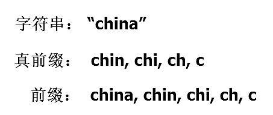

- 文本串（text）或 主串， $T$，长度为 $n$ 。
- 模式串（grep），$P$，长度为 $m$ 。
- grep 也意为正则表达式 。
- pattern ：模式 。

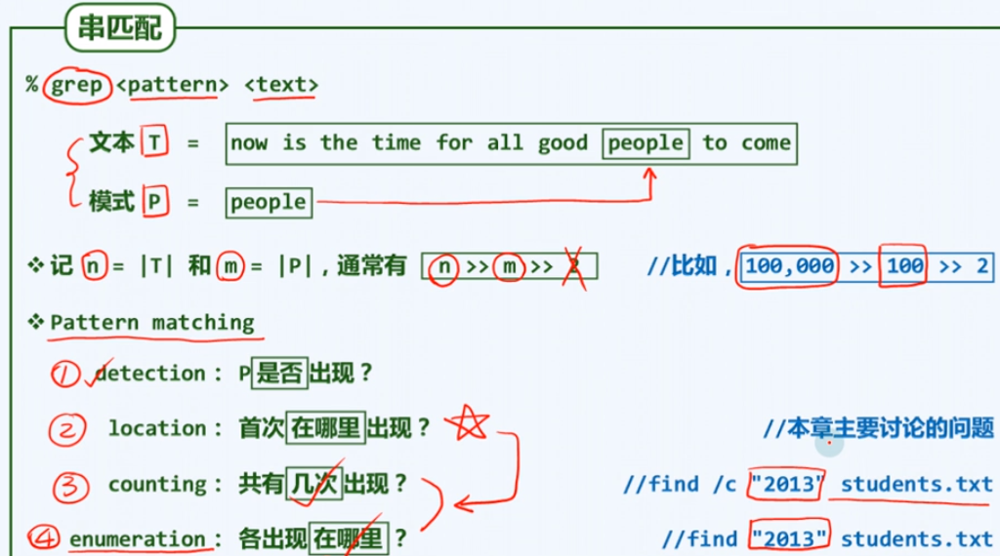

## 总览

### 性能对比

| 算法 | 策略 | 最好 | 最坏 |
| - | -  | -  | - |
| 朴素 | 暴力 | $O( nm )$ | $O( nm )$ |
| KMP | NEXT（经验） | $O( n+m )$ | $O( n+m )$ |
| BM | BC（教训） | $O( {n \over m} )$ | $O( nm )$|
| | GS（经验） | $O( n+m )$ | $O( n+m )$|
| | BC + GS | $O( {n \over m} )$ | $O( n+m )$ |

- KMP 适用于字符集较小的情况。
- BM 适用于字符集较大的情况。
- BC 中的哈希原理运用方式会对 BM 的性能（时间与空间均可能）产生较大影响。（要考虑字符集大小）
- 单独采用 GS 策略时与 KMP 效果是一样的。？？？？？？？
- GS 与 NEXT 互为变体。
- 当模式串是非周期性的，KMP 最坏为 $O( 2n+m )$，BC+GS 最坏为 $O( 3n+m )$ 。

### 图形对比

- 纵轴表示时间，由下到上分别为：$n \over m$, $n+m$, $nm$
- 横轴表示概率，即单次比对成功的概率，这取决于字符集的大小 。

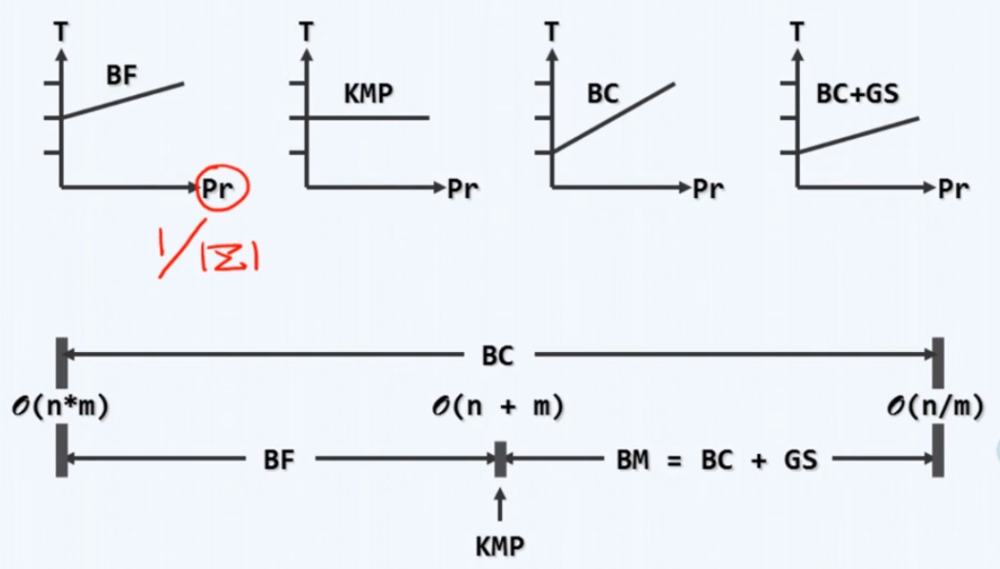

上图：BF 代表暴力法。

## 暴力法

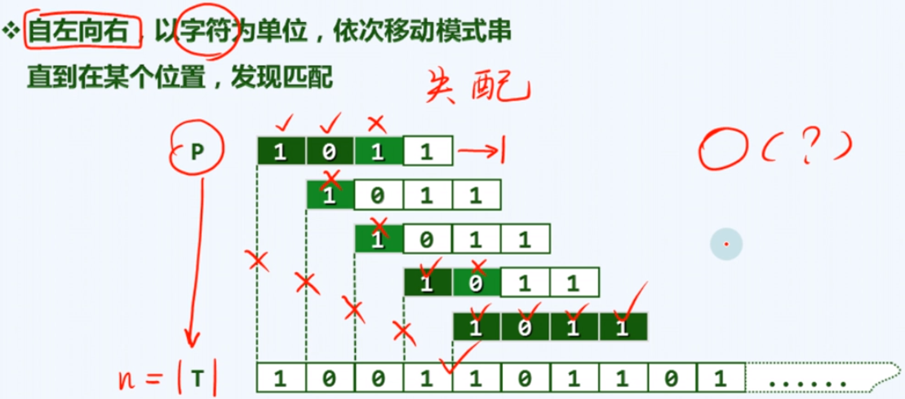

重复匹配的蛮力：文本的每个字符可能要重复匹配多次，大量时间消耗于模式串前缀的匹配中。

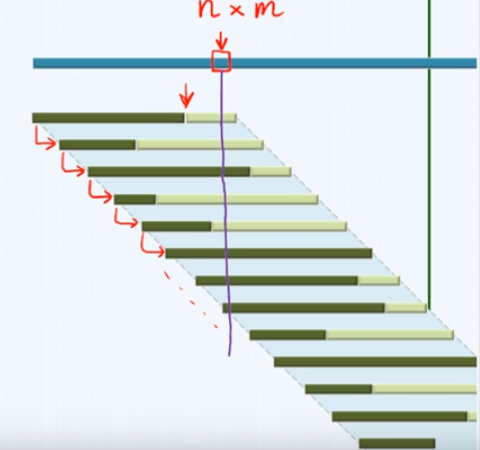

## KMP 算法

更简化的 KMP 流程以及手算方法见考研笔记。

$n$ 为主串长度，$m$ 为模式串长度。

### 经验

优化蛮力。

1. （滑动后）避免前缀重复匹配
	比较到某两个字符时，模式串已经有一部分前缀被匹配，以此为信息，若能够使用这些信息，进而跳过已这些匹配部分，使得其不再匹配，则能避免大量的重复匹配。
	（即下图中的 $R$；$R$ 在 $E$ 和 $O$ 前已经被匹配过，因此滑动后不再匹配）
2. （滑动时）跳过必定失配部分
	向后滑动时，跳过必定失配的部分，使得向后滑动的距离尽量大，而不是一个一个地滑动，如此也能避免大量重复匹配。
	（即下图模式串 $R$ 到 新的 $R$ 位置的移动）

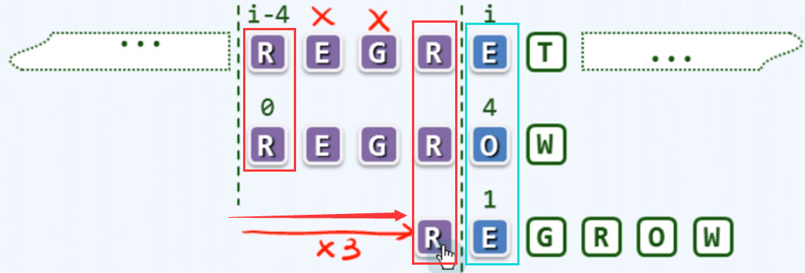

上图：$E$ 和 $O$ 失配（即比较失败）后，模式串直接向后滑动，使得下一次匹配从 蓝框文本串的 $E$ 和 匹配串的新 $E$ 开始。（而不是从模式串开头的 $R$ 开始）

如何确定新的 $E$ 的位置呢？

### 引入查询表 （next 表）

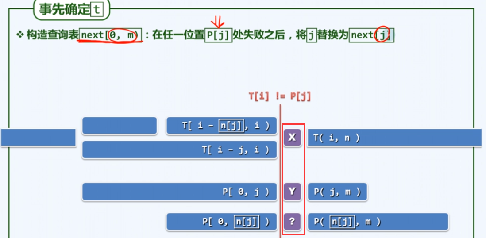

上图：红框即为 $j$ 的位置，$next[j]$ 即是在 $j$ 上的 X 字符和 Y 字符失配后，新的 $j$ 的位置。$j$ 是模式串的下标。

### KMP 主算法实现

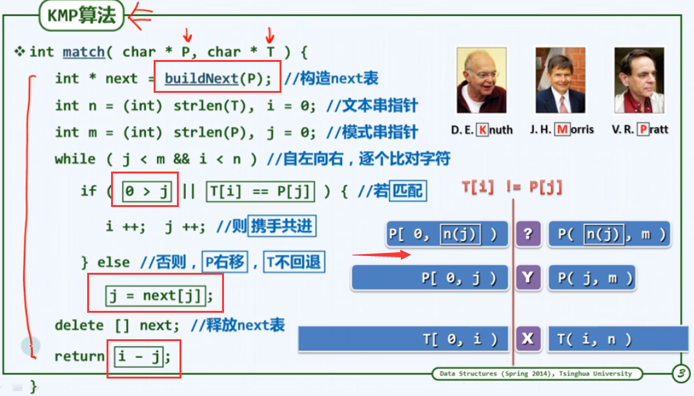

上图：红箭头代表模式串的滑动。$0 > j$ 的判断条件将在后续解释，匹配失败返回 $-1$。

### 主算法实例

暂时直接给出 next 表：

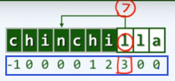

上图：

- 红圈中的 l 字符，下标为 $7$，其对应的 next 表中的元素为 $3$
- 蓝框为 next 表，next 表中的值为模式串移动后的第一个比对位置

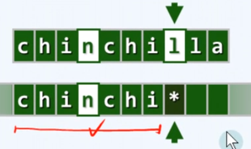

上图：上方为匹配串，下方为文本串，此时其前 $7$ 个字符已经被匹配。由于“l” 字符与 “*” 字符发生失配，模式串要滑动，即 $j$ 要执行 $j = next[j]$，即 $j$ 被赋值为 $3$

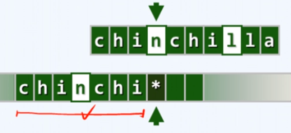

上图：滑动后的情况，下标为 $3$ 的 “n” 字符成为了下一个参与匹配的字符。

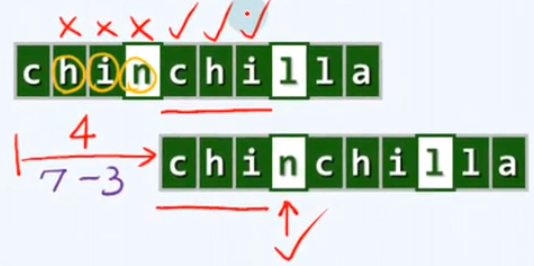

上图：

上方为模式串滑动前，下方为模式串滑动后，比较位置。（滑动了 $4$ 个字符 $= 7 - 3$）

$j = next[j]$ 后，新的匹配从 n 开始的效果：

- 打叉的字符为不匹配的直接跳过的字符。
- 打勾的字符为不必再次从头开始匹配的前缀。
- 画横线部分即是当前失配位置对应的模式串的（最长）真前缀与真后缀。

### 解释查询表 

对“经验”的运用。

#### 自匹配原理

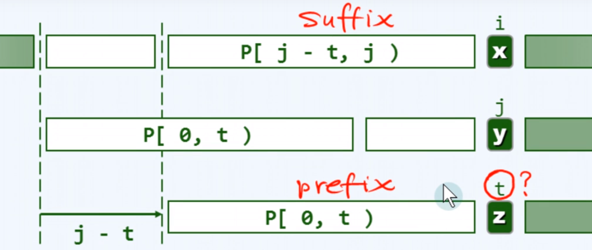


上图：

最上方的串是主串（$T$），中间的是模式串（$P$），最下方的是模式串失配后移动 $j - t$ 的结果。
$T$ 与 $P$ 在 $i$（即 x） 和 $j$（即 y） 处失配，$P$ 于是移动 $j - t$ 的距离，使得 $P[t]$（即 z）参与到下一次与 $T[i]$（即 x）的比对中。

观察可以发现：

- 因为是在 $i$ 和 $j$ 处才发生失配，所以 $i$ 之前的主串和 $j$ 之前的模式串必定是匹配的。
- 因为滑动后是从 $t$ 开始新的比对，所以 $t$ 之前的模式串（即 $P[ 0, t )$ ）和主串中 x 前的 $P[ j - t, j )$ 也必定是匹配的。

由此：

- $t$ 之前的模式串 $P[ 0, t ) $
	- 是 $j$ 之前的模式串的 **真前缀**（proper prefix），
	- 也是 $i$ 之前的主串的 **真后缀**（proper suffix），
- 同时，$i$ 之前的主串与 $j$ 之前的模式串又是匹配的，
	- 故 $P[ 0, t )$ 也是 $j$ 之前的模式串的真后缀。

也就是说，在 $j$ 之前的这个**局部模式串中（每个 $j$ 前对应一个局部模式串，不包含 $j$）**，其首部和尾部具有某种相似性（这个相似性就是**自匹配性质**），而 next 正是借助这种相似性进而计算得出。

也正是如此，KMP 得以借助 next 表实现：

1. （滑动后）避免前缀重复匹配（图中 $P[ 0, t )$ 部分）
2. （滑动时）跳过必定失配部分（图中 $j - t$ 部分）

#### PM 值

即是**最大相匹配**的真前缀与真后缀的长度。（Partial Matched）

考虑下图：

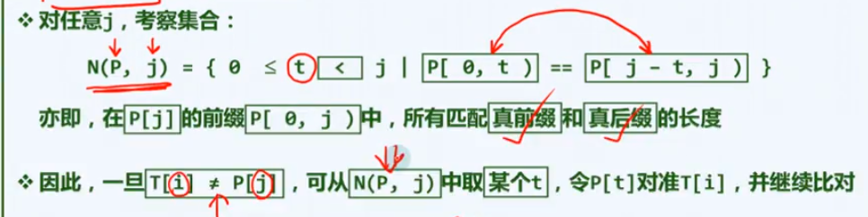

在模式串 $P$ 的 $j$ 之前的局部模式串中，对于 $t$ 和 $j$，若存在 $0$ 到 $t$ 的字符匹配 $j - t$ 到 $j$ 的字符，则这个 $t$ 就是满足自匹配性质的下标，也就是在 $j$ 位置发生失配后，其的后继者的下标（ $t$ 即是 $next[ j ]$ ），这个 $t$ 的值也是在 $j$ 之前的局部模式串中**相匹配**的真前缀和真后缀的长度。

考虑滑动的距离 $j - t$ ：

- 对每一个 $j$，可能存在多个相应的 $t$，选择其中**最大的**那个 $t$。（即 PM 值）

对某一个 $j$，$t$ 越大，滑动距离越小；$t$ 越小，滑动距离越大，这种情况下，滑动距离小，能保证正确性。
$t$ 越大也代表相匹配的真前缀和真后缀的长度最大。

若 $t$ 太小，则可能使得滑动距离太大，以至于错过一个可以完全匹配的串。

示例：

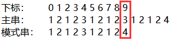

上图：在模式串下标 $9$ （即 $j$） 处，主串中字符 3 与 模式串中字符 4 失配，此时 $j$ 对应的 $t$ 应有两个取值：$2$ 和 $4$，若选小的 $t$，滑动距离为：$7$ （$9 - 4 = 7$）

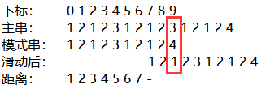

上图：可见其导致本轮匹配失败，错过了匹配的串。若选最大的 $t$，滑动距离为：$5$ （$9 - 4 = 5$）

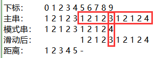

上图：滑动后，没有错过，匹配成功。

### 构造 next 表

（详见考研笔记）

#### 明确意义

$next[ j ]$ 是在 $P[ 0, j )$ 中，在 $j$ 位置失配后，模式串的后续比对字符下标，也是 $j$ 对应的局部模式串中最大相匹配的真前缀与真后缀的长度。

#### 初始化特殊值

$t$ 也是真前缀与真后缀的长度，故：$0 \le t \lt j$（$t$ 和 $j$ 都是模式串 $P$ 的下标）

- 若 $j > 0$：$t$ 必定存在，至少为 $0$
- 若 $j = 0$：$t$ 不存在，因为不存在自匹配的真前缀和真后缀
- $j$ 是下标，不会小于 $0$

**因此统一将 next 表的第 $0$ 项初始化为 $-1$（$next[0] = -1$）（本笔记模式串下标从 $0$ 开始，若从 $1$ 开始，则应为 $next[1] = 0$）**

对于上方 `0 > j` 的判断条件：

失配后，因为 $t$ 不存在，$j$ 被赋值为 $-1$，所以后续比对位置就是主串的下一个字符和模式串的第一个字符。（模式串开头滑动到当前失配位置的后一个位置）必须有该条件，上方 KMP 图示代码才可以正确运行。

#### 暴力法实现 next 表

原理：依次对每个 $j$，找出 PM 值，填表即可。

流程：

- 对长度较小的部分，直接找 PM 值确定 next。

- **长度从大到小**，**从第一个相同的元素开始**比较，

	因为匹配的真前缀和真后缀的第一个元素必定相同

	- 如果没有比较到末尾，则换下一个元素找 PM

#### 递推法原理

- 依据 $next[ j+1 ] <= next[ j ] + 1$
	- 因为整个局部模式串增加一个单位长度，故真后缀最多增加一个单位长度，进而自匹配的真前缀也最多增加一个单位长度。
	- 特别的，当且仅当 $P[ j ] == P[ next[ j ] ]$ 时取等号
- 取等号时即可由 $next[ 0, j ]$ 推出 $next[ j+1 ]$

#### 与自匹配的联系

自匹配即用自己匹配自己，主串和模式串都使用自己，当满足**上文**自匹配原理时，既有：

- 如果等号满足，即后继位置的字符等于当前位置字符，即有**相匹配的真前缀与真后缀长度增加了一个单位**。（即求得新的 PM 值）
- 如果等号不满足，即后继位置的字符不等于当前位置字符，则选取下一个后继字符（也就是 next 嵌套）再来比对。

#### 自匹配实现方式

- 当 $P[ j ] == P[ next[ j ] ]$ 时，$next[ j+1 ] = next[ j ] + 1$
- 当 $P[ j ] != P[ next[ j ] ]$ 时，
	- 如果 $P[ j ] == P[ next[ next[ j ] ] ]$，则 $next[ j+1 ] = next[ next[ j ] ] + 1$，以此类推……
	- 必收敛于 $next[ 0 ]$ 的位置，得到 $next[ 0 ] + 1（next[ 0 ] = -1）$，即 $0$

next 的不断嵌套，即是模式串不断自匹配的过程。

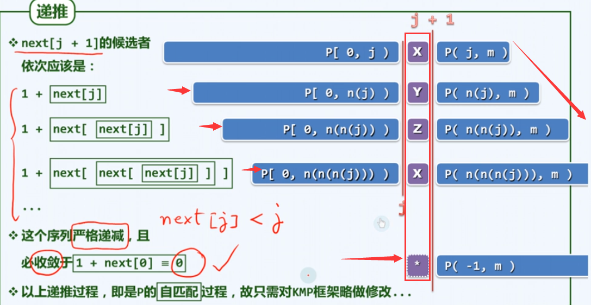

上图：

- Y 与 X 失配，滑动。
- Z 与 X 失配，滑动。
- X 与 新 X 相匹配，新 X 的前部分应与旧 X 前部分的一个真后缀相等。

#### 递推法实现 next 表

自己匹配自己，于是可以采用匹配算法的框架（KMP）。

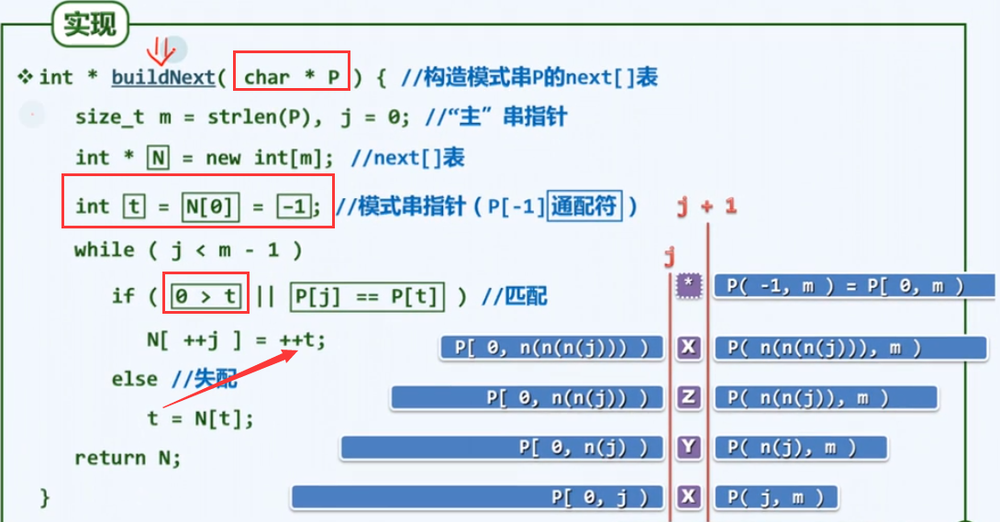

**next （下一个元素）可进一步优化为 nextval 表（下一个值）。**

### KMP 复杂度

构造 $k = 2*i - j$，考虑 KMP 主算法，观察 $k$ 的值：

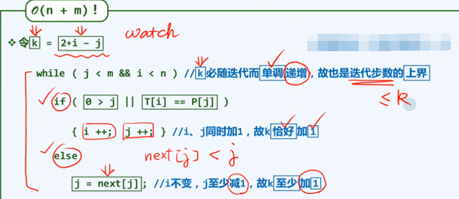

$k$ 反映了不同情况下，KMP 算法中 $i$ 与 $j$ 的变化，亦迭代步数的上界。

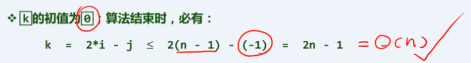

上图：

- 因为 $i，j$ 初值为 $0$，故 $k$ 的初值也为 $0$。
- 在 KMP 算法结束时，$i$ 最大为 $n-1$， $j$ 最少为 $-1$，故 $k$ 最大为 $2*n - 1$，如此，迭代步数即 $O( 2n - 1 )$，即 $O( n )$
- 同理，构造 next 表的自匹配过程与 KMP 的原理相同，故为 $O( m )$
- 综合后，KMP 的复杂度即为 $O( n + m )$

### KMP 优化

示例：

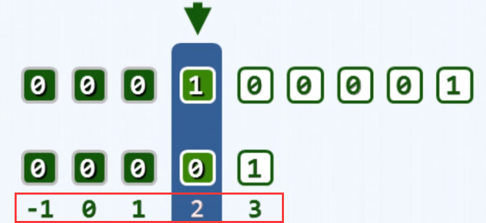

上图：红框为 next 表项，蓝色区域是失配位置。

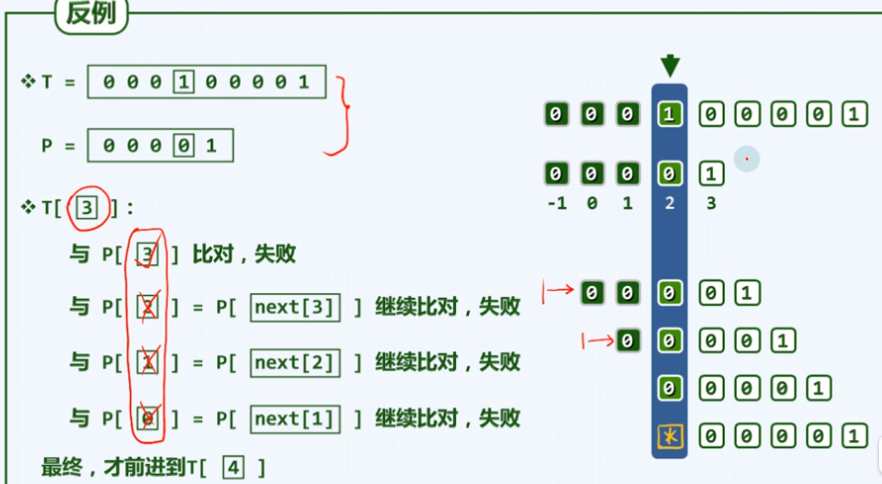

上图：蓝色区域与 $1$ 比较的第一次失配是有意义的，然而滑动后，新的比较字符仍然是 $0$，不断地是 $0$，不断失配，又不断滑动，又不断是 $0$，这浪费了许多时间。

#### nextval 表

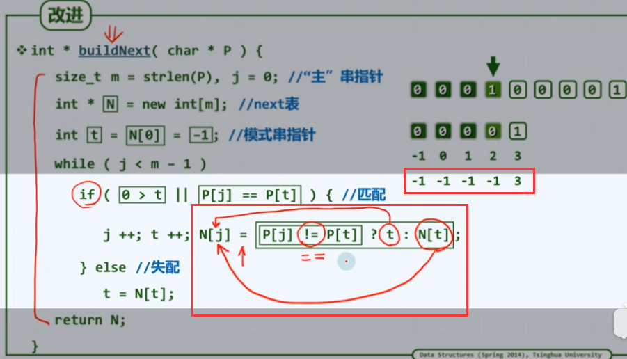

上图：

- 若后继字符与原来的失配字符相同，则其必定再次失配，继续取其后继。
- 因为是从前往后迭代，所以当前位置与后继相同后只再取一次后继即可。
- 再取的后继肯定是已经得出的值。

### 完整代码

```c++
#include<cstdio>
#include<iostream>
#include<cstring>

const int N = 25;
int next[N];

void buildNext(char * P, int lenP) {
    int j = 0, t = -1;   // j 相当于“主串”指针，t 为模式串指针，此时的 t 就相当于 KMP 中的 j
    next[0] = -1;
    while (j < lenP - 1) {   // 因为下方 ++j
        if (t < 0 || P[j] == P[t]) {   // 注意 j == 0 时的判断情况
            ++j, ++t;   // 注意这里，考虑初始情况的处理
            next[j] = t;   // 取其后继
        } else {
            t = next[t];
        }
    }
    return;
}

void buildNextval(char * P, int lenP) {   // 最优版
    int j = 0, t = -1;   // j 相当于“主串”指针，t 为模式串指针，此时的 t 就相当于 KMP 中的 j
    next[0] = -1;
    while (j < lenP - 1) {
        if (t < 0 || P[j] == P[t]) {   // 注意 j == 0 时的判断情况
            ++j, ++t;   // 考虑初始情况
            next[j] = (P[j] != P[t] ? t : next[t]);   // 若后继 P[t] 与当前已失配的 P[j] 相同，则取后继 next[t]
        } else {
            t = next[t];
        }
    }
    return;
}

int KMP(char * T, char * P) {
    int lenT = (int)strlen(T);
    int lenP = (int)strlen(P);
    // buildNext(P, lenP);
    buildNextval(P, lenP);
    int i = 0, j = 0;
    while (i < lenT && j < lenP) {
        if (j < 0 || T[i] == P[j]) {
            ++i; ++j;
        } else {
            j = next[j];   // j < 0 时，j 被赋值 -1，从而执行 ++i,++j 开始新的匹配。
        }
    }
    return i - j <= lenT - lenP ? i - j : -1;   // 匹配失败返回 -1
}

int main(void) {
    char T[] = "121231212312124";
    char P[] = "1212312124";
    std::cout<< KMP(T, P) <<std::endl;

    return 0;
}
```

### 性能可视对比

在最坏情况下：（右边的是局部放大图）

暴力：

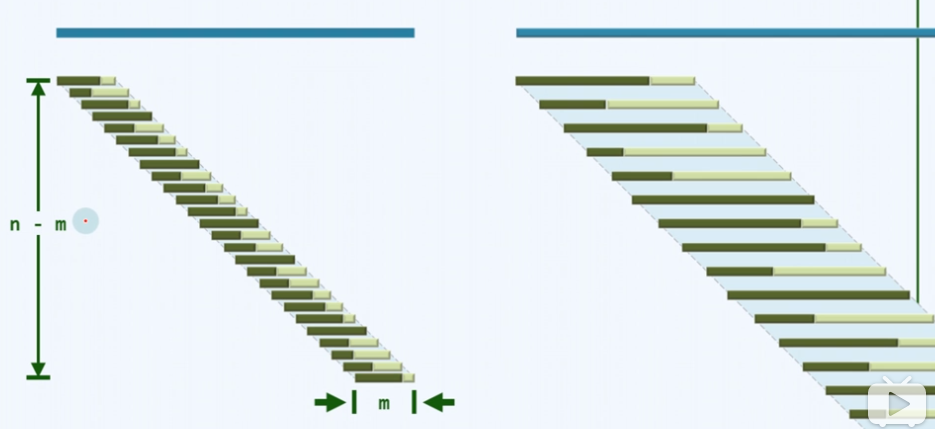

KMP:

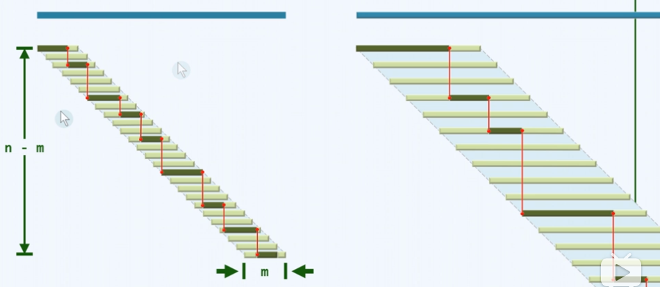

KMP 匹配过程中，除了端点外，没有任何重叠，故最坏情况 $O(2n)$（即每一步匹配都是端点，每一步都重叠）。

### 适用场合

- 在最好情况下，暴力法可能在每一个比对位置都只有常数，甚至一次比对，就可排除掉一个对齐位置。这种最好情况发生的概率随着字符集规模（所含字符种类）的增大，这个概率也会快速提高。
- **换言之，字符集规模越大，KMP 的优势也就越不明显。**
- **字符集越小，KMP 越能体现出优势，如二进制串。**

## Karp-Rabin 算法

（了解思想即可，实际应用效率不高，代码是容易实现的）

### 化串为数

将每个串看成某进制的数，通过进制转换可以在 $O(1)$ 内得到下一个对齐位置的串指纹（fingerprint）

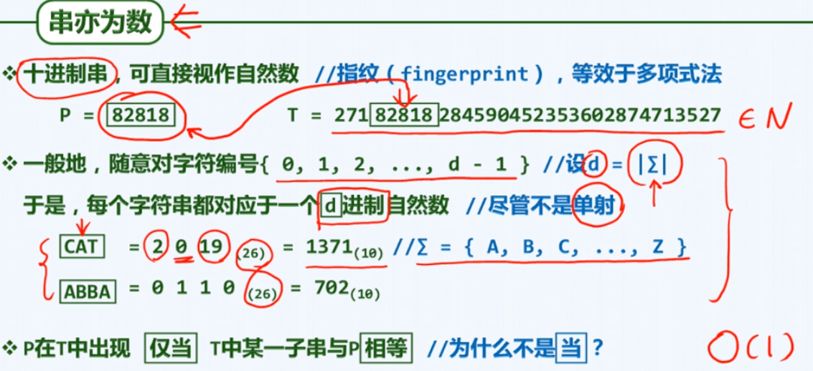

### 数位溢出

如此，对于较长的串，可能出现指纹过大导致速度降低情况。

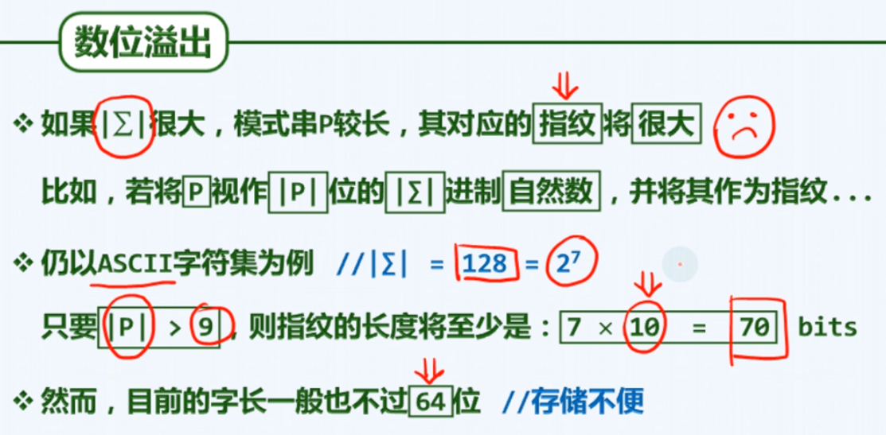

### 散列压缩

- 通过一个哈希函数（一般可用取余素数的方式），对指纹做进一步处理。
- 通过对比压缩后的指纹，确定匹配位置。

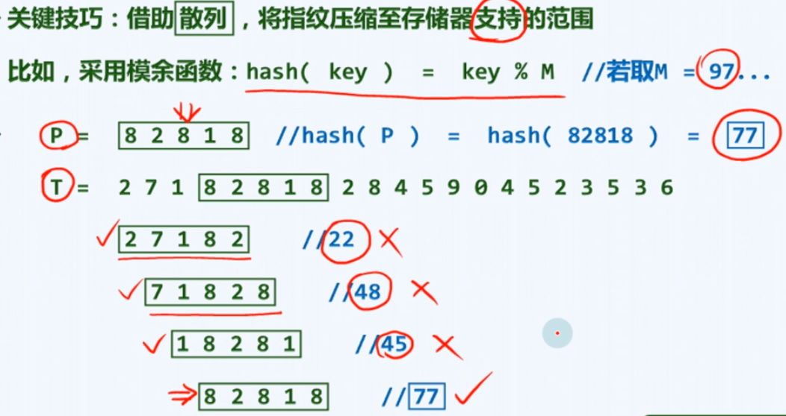

### 散列冲突

**对于指纹相等的对齐位置**，在其对齐位置做仔细的逐字符比较，以判断其是正确匹配还是发生了散列冲突。

- 冲突则继续匹配即可。

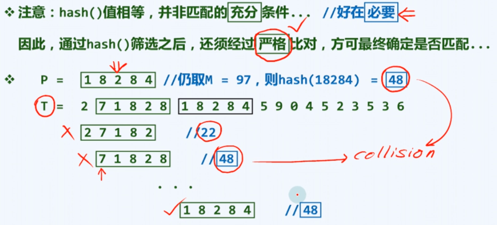

### 代码略

## BM 算法

（boyer moore 算法）

**两个并行算法（策略）：**

- BC 坏字符策略（Bad-Character shift）（“教训”）
- GS 好后缀策略（Good-Suffix shift）（“经验”）

### BC 策略

（Bad-Character shift，坏字符策略）

“教训”。

#### BC 原理

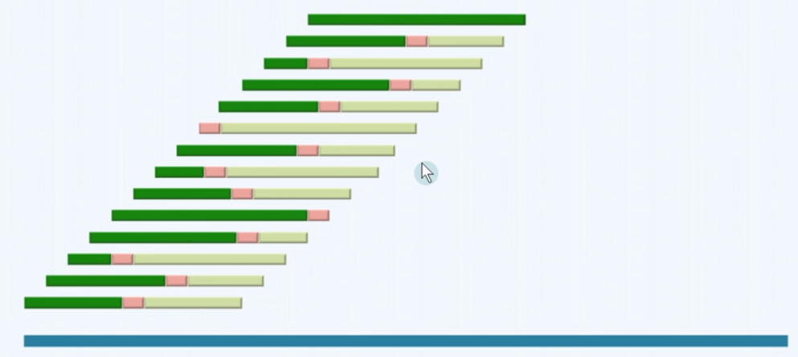

上图：

图示为暴力法匹配过程，粉色部分为失配位置。

- 对每一个对齐位置，观察，
	- 局部上，多次成功，一次失败
	- 整体上，“一"次成功，多次失败

为此，**与其说要加速成功匹配，不如说要加速失败，进而尽可能快地排除掉失配位置。**

KMP 即是如此，其会排除掉大量的对齐位置，但只做一次**失配位置**的比对，就足以排除掉一个**对齐位置**（失配位置前方的所有成功位置。）

在**每一个对齐位置从后往前比对**：更多地关注教训，使之更早出现，使教训更大者更早出现。

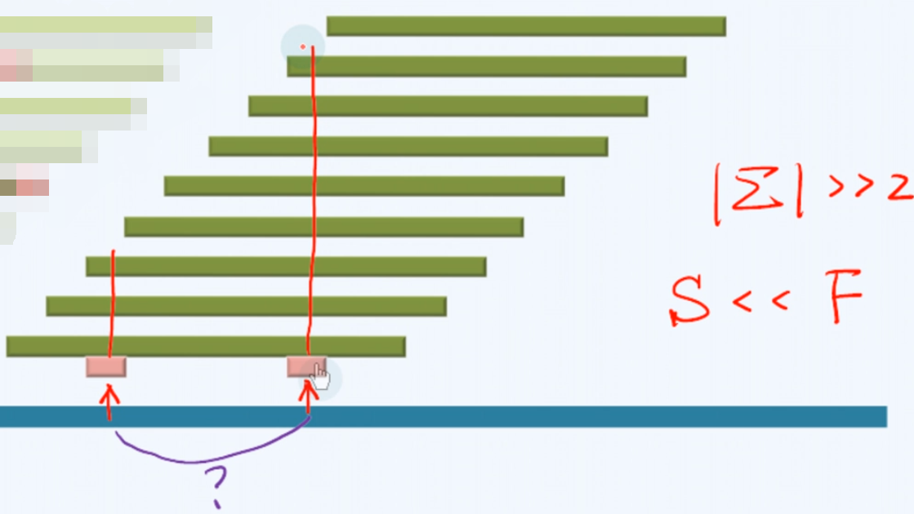

上图：累加和代表字符集的规模，S 代表成功的概率，F 代表失败的概率。

**字符集的规模越大，则一个字符在某一个位置比对失败的概率就越大。**

两个粉色位置分别代表在某一个对齐位置中，靠前的位置和靠后的位置。靠后的位置能够排除掉更多的对齐位置（红线所经过），故在某一个对齐位置中，优先比对靠后的字符。

#### BC 实例

- 在某一个对齐位置中，优先比对靠后的字符。
- 元素为汉字，其字符集较大。

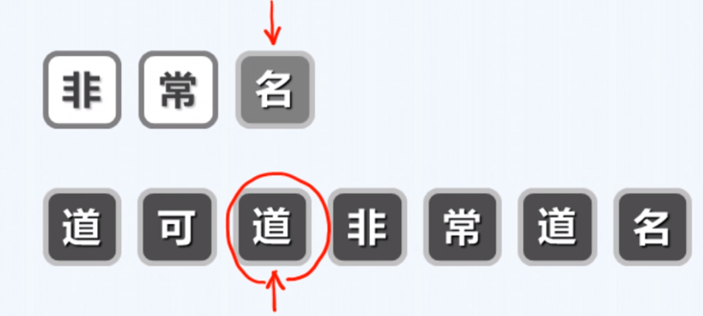

上图：对于“名”和“道”，若要成功匹配，则与“道”对应的字符应该也是“道”，但“道”根本没有出现在模式串中，故可直接整体后移。

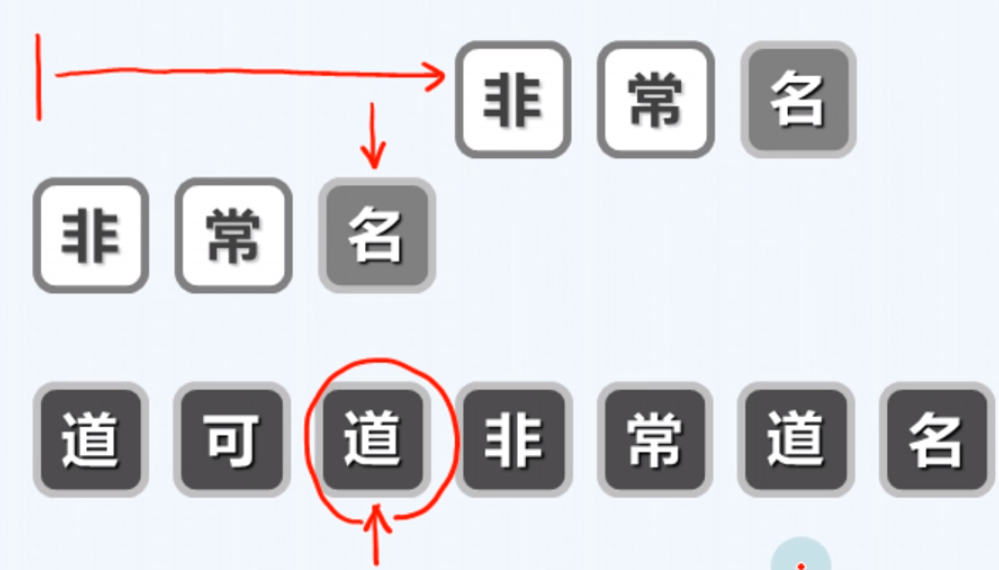

上图：移动后的结果，继续移动。

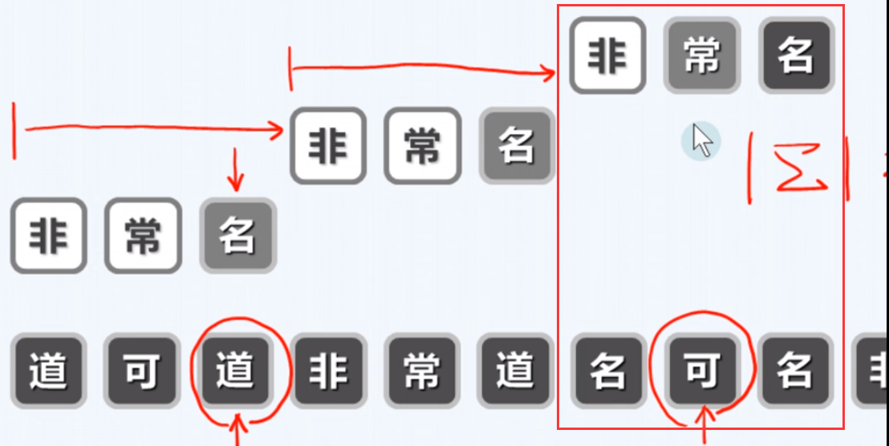

上图：继续移动后的结果。“名”与“名”匹配，继续往前比对“常”与“可”，再次滑动。

- 总结：**对于某个失配位置，若其失配，则后继字符至少应当是能够匹配的字符，其余字符可排除。**

效率：

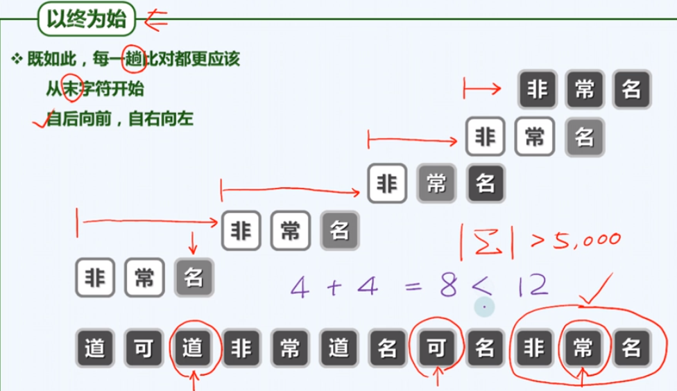

上图：黑色方块为成功比对，灰色方块为失败比对，白色方块为未比对。

- 累计比较不过 8 次，比主串 12 个字符还要小。
- 平均在每个字符上的比对，不足一次。
- 滑动后仍然从模式串最靠右的字符开始比对。

#### 引入 bc 表

记录模式串中每一个失配位置的后继字符对应的秩（即下标）。


注意上图中 X，Y 的位置及意义。

- 这个失配的字符 ‘Y’，即所谓坏字符。
- 失配位置的后继字符至少应当是可成功匹配的。
- 滑动的距离为 `j - bc['X']` 。
- **滑动后仍然从模式串最靠右的字符开始比对。**

#### 三个特殊情况

1. 模式串中有多个后继 X：
	- 指定前提：失配位置 X，Y 的模式串左侧存在后继 X，右侧不存在 X（‘X’ free）
	- 选择其中使模式串滑动位移量最小的后继 X（即最靠右的，注意此时右侧 'X' free），其在模式串中的秩应尽可能大。
	
2. 模式串中没有后继 X：
	- 直接整体滑过即可。
	- 在模式串开头增设哨兵（令 `bc[0] = -1`）：以通配符作为哨兵，其可作为后继字符（其能够成功匹配），使意义保持一致。
	
		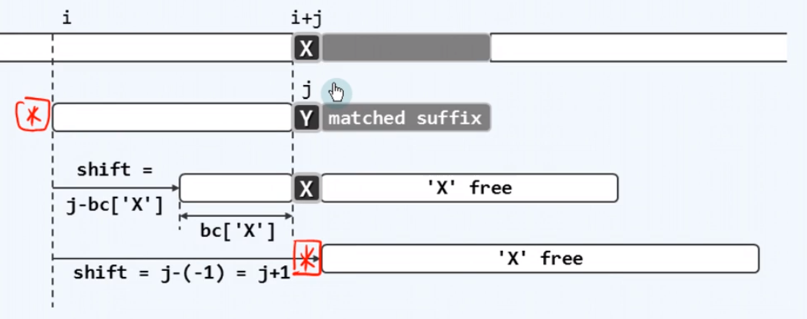

3. 模式串中的后继 X 过于靠后：（这个情况可以被 GS 优化掉）
	- 这种情况是由 bc 表的构造过程导致的（画家算法）。
	- 此时的后继 X 存在于已匹配后缀中。
	- 位移量最小的那个后继 X 过于靠右，使得失配 Y 的下标 $j$ 减去 `bc['X']` 为负，即滑动距离为负，这是不必要的。
	- **若不使用 GS，则此时模式串整体移动一个字符即可。**
	
	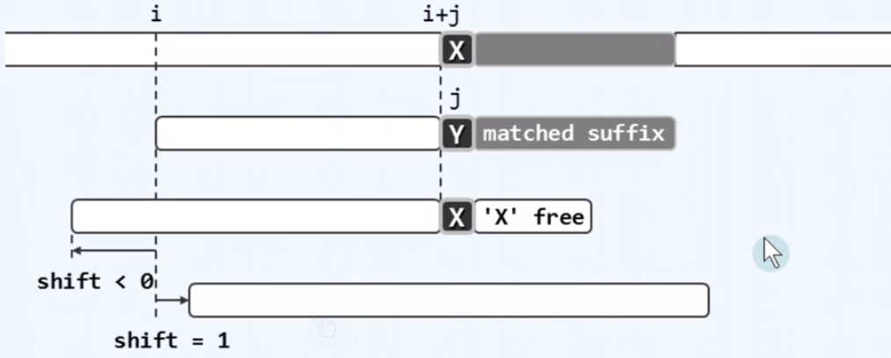

#### 构造 bc 表

明确意义：

- bc 表记录模式串中每一个失配位置的后继字符对应的秩（即下标）
- 后继字符位置中选取其秩最大的（最靠后的）那一个。
- 失配位置的后继字符至少应当是可成功匹配的。
- 这个后继字符的秩是根据**哈希原理**得到的。
- 根据**字符集**构造 bc 表。

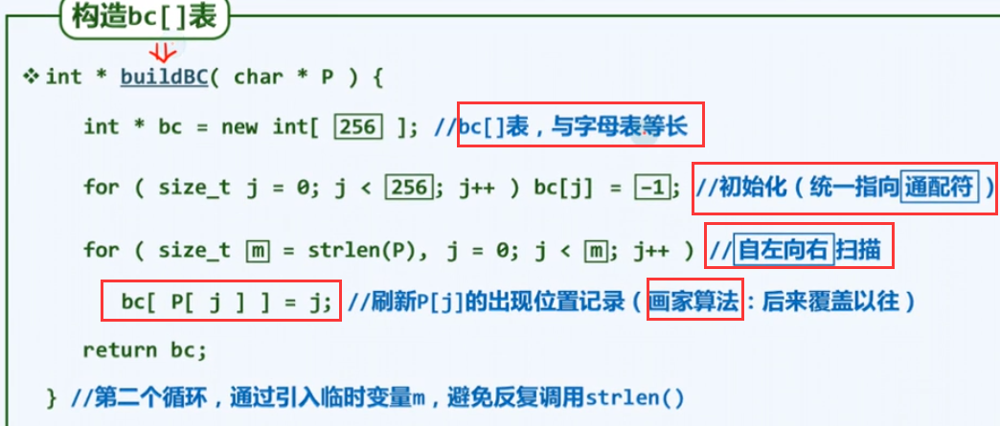

注意图中的**画家算法**策略：

从左往右扫描，对于两个相同字符，其 bc 表中记录的项是这两个字符中秩最大的那个，即最靠右的那个。（**这是为特殊情况 1 服务，但也导致了特殊情况 3** ）

实现哈希的方法要随字符集的规模而灵活选用。大概有哪些？？？？？？

#### BC 效率分析

##### 构造 bc 表的效率

设 $s$ 为字符集字符个数，$m$ 为模式串字符个数。

时间：

- bc 表初始化为 $-1$，$O(m)$
- 画家算法，设 则 $O(s)$

总时间：$O( s + m  )$

空间：字符集大小的表，则 $O( s )$。

BC 中的哈希原理运用方式会对 BM 的性能（时间与空间均可能）产生较大影响。（要考虑字符集大小）

- bc 表的初始化优化：（有 GS 时才行）
	bc 表不必都初始化为 $-1$，更准确地说，是全部初始化为 $0$ 即可，这样 bc 表初始化的时间就可以省略，则 $O( m )$。因为与 GS 策略的共同运用会把特殊情况 3 优化掉。

若 $s$ 与 $m$ 较小，则可忽略。

##### BM_BC 最好情况

$O( {n \over m} )$，其中 $n$ 是主串字符个数，$m$ 是模式串字符个数。

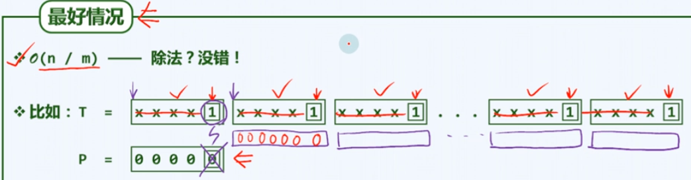

字符集越大，性能优势越明显。特别适合大字母表：ASCII + Unicode 。

##### BM_BC 最坏情况

$O( nm )$，缺乏“经验”。

只采用 BC 策略时，最坏情况将退化为暴力法的复杂度。（从右到左比对，每个失配位置都在模式串左端）

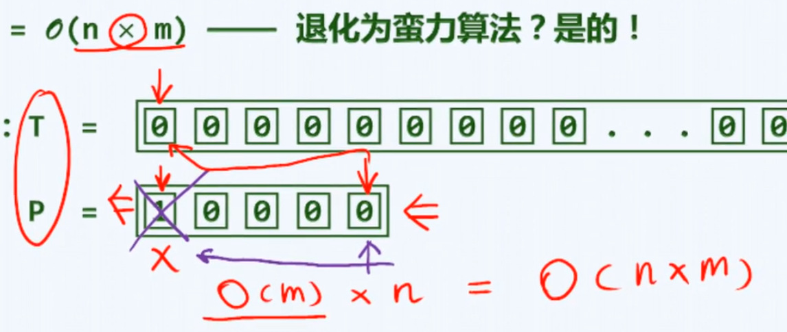

### GS 策略

（good-suffix shift，好后缀策略）

“经验”。

#### BC 不足

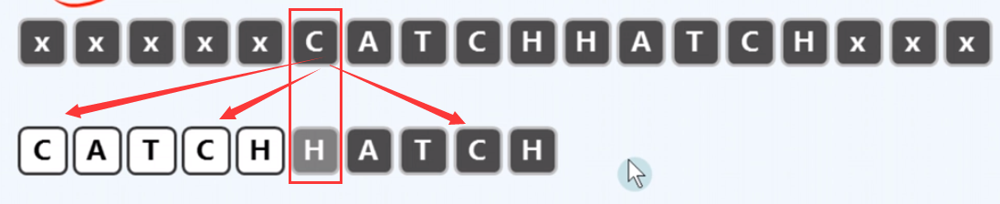

上图：此时， C 与 H 失配，BC 策略将选择模式串中最靠右的 C 作为后继字符，但其太过靠右，故 BC 策略以滑动一个单位代替。


上图：滑动后，模式串从最右侧开始匹配，在 H 与 C 处失配，BC 策略将选择最靠右的 H 作为后继字符，但其太过靠右，故只滑动一个单位。

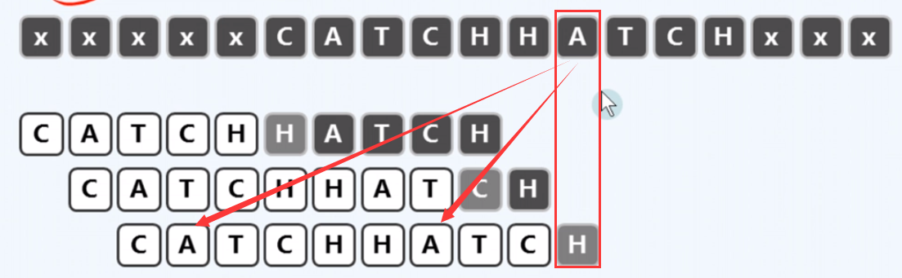

上图：滑动后，模式串从最右侧开始匹配，在 A 与 H 处失配，BC 策略将选择最靠右的 A 作为后继字符，此时滑动三个单位。

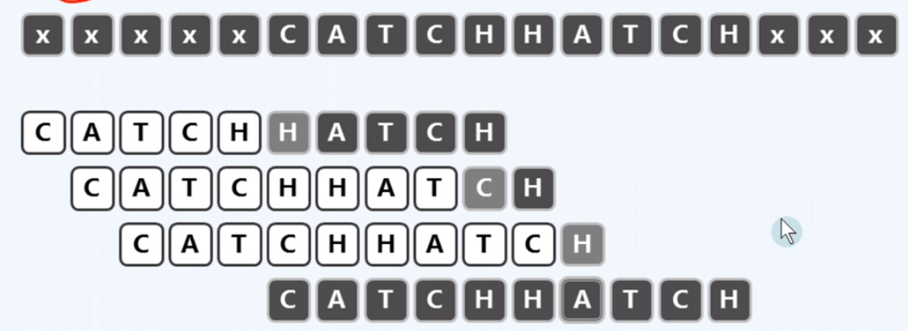

上图：滑动后，模式串从最右侧开始匹配，至此，全部匹配。

观察：对于第一个失配位置 C 与 H，虽然失配，但 H 右侧存在已经匹配成功的后缀（此即**好后缀**），**利用好后缀，可以优化掉只滑动一个单位的对齐位置，进而提高效率。**

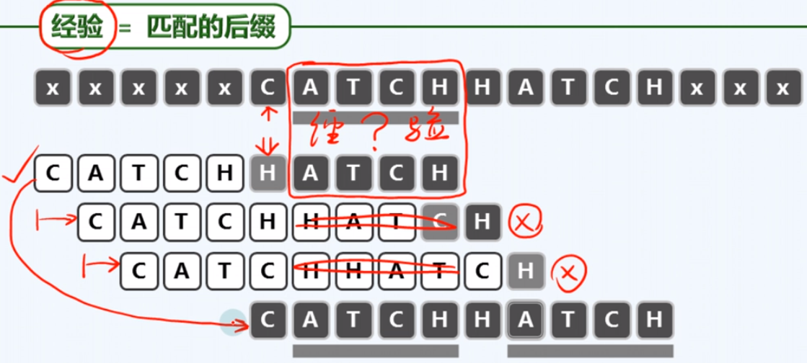

#### GS 原理

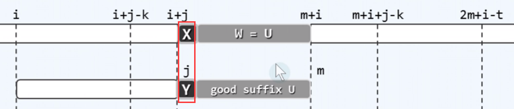

上图：

1. 在任意一个时刻，若某个对齐位置的扫描失配于 X，Y 位置，则其失配前扫描过的位置一定是匹配的，即好后缀。

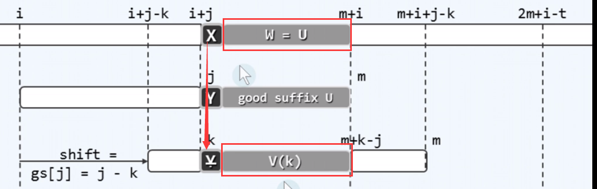

上图：

2. 若通过滑动，重新在某个位置对齐，应当使滑动前文本串中匹配“好后缀”的部分，能够继续得以匹配 $V(k)$。
3. 既然滑动前失配于 Y，故滑动后其后继的字符应当不再是 Y。（相当于 KMP 中 next 表的优化，即 nextval 表）
4. 若在模式串中足以与滑动前文本串中的部分继续匹配的子串有多个，选择自匹配最长者，即使得位移量小的那个，即最靠右者。

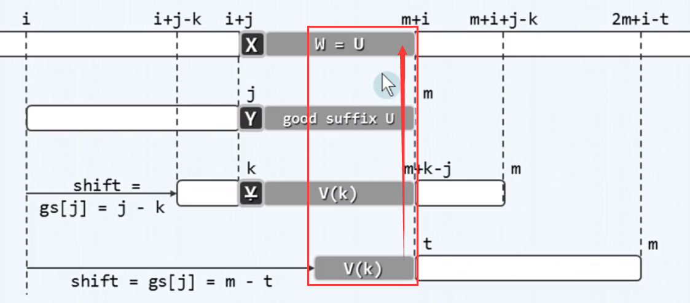

上图：

5. 在模式串中，若不存在任何足以与滑动前文本串部分继续匹配的子串，这意味着此后的对齐位置，至少应当越过当前失配位置。
6. 为保证不遗漏掉有价值的对齐位置，要尽可能从模式串中找到某个 前缀，使得其能够与刚才匹配部分的相应后缀继续匹配。

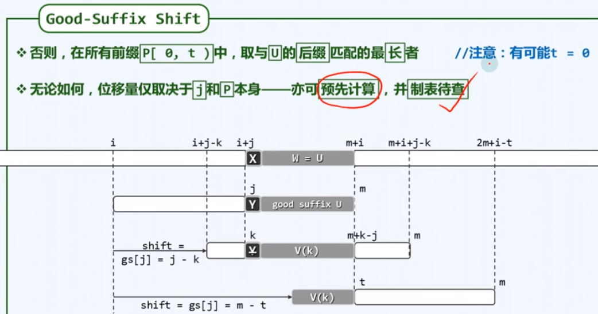

以上，滑动位移量只取决于模式串，而与文本串无关，故可制表待查。

#### gs 表实例

- gs 表项的值是指该字符失配时，模式串移动的距离。
- gs 表类似于 KMP 的 next 表，但其自匹配的两个子串的相对位置与 KMP 不同。

先直接给出 gs 表：

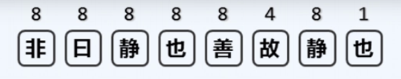

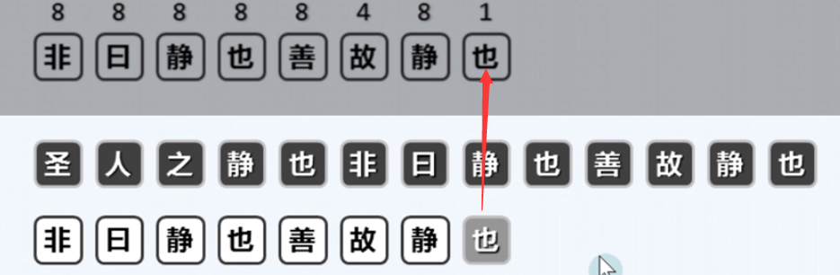

上图：“也”失配，查找 gs 表，滑动 $1$ 个字符。

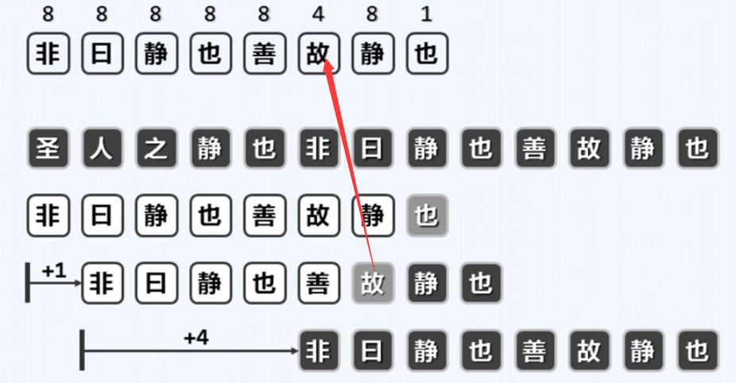

上图：“故”失配，查找 gs 表，滑动 $4$ 个字符。

#### MS 子串

- $MS[j]$
	$P[0, j]$ 的所有后缀中，与 $P$ 的某一后缀匹配的最长者。
	- 亦终止于 $j$，且与全串的后缀能够最长匹配的子串，有可能为空。
	- 注意，$MS[j]$ 是指 $j$ 对应的子串，而不是一个数值。
	- 注意是 $0$ 到 $j$，不是 $j$ 到末尾。

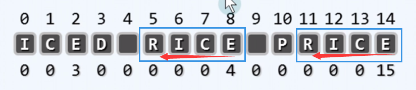

上图：$P[8]$（字符 E）所对应的 MS 子串为自 $8$ 开始，从右向左四个字符组成，即 RICE（注意其与全串的一个后缀相匹配）

（若在 $P[10]$ 失配，则其后继位置为 $P[4]$）

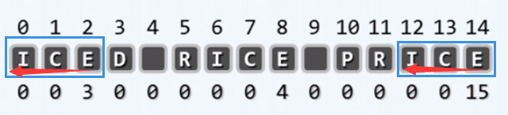

上图：$MS[2]$，即从 $P[2]$（E）开始的从右向左的与全串后缀最长匹配的那个子串。

（若在 $P[11]$ 失配，则其后继位置为 $P[-1]$）
（若在 $P[6]$ 失配，则其后继位置为 $P[-1]$）
（若在 $P[5]$ 失配，则其后继位置为 $P[-1]$）

#### ss 值

- $ss[j]$
	即为 $MS[j]$ 的长度（类比于 KMP 的 PM 值）

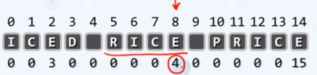

上图：$P[8]$ 即字符 E，其所对应的 ss 表项即为 $4$ 。

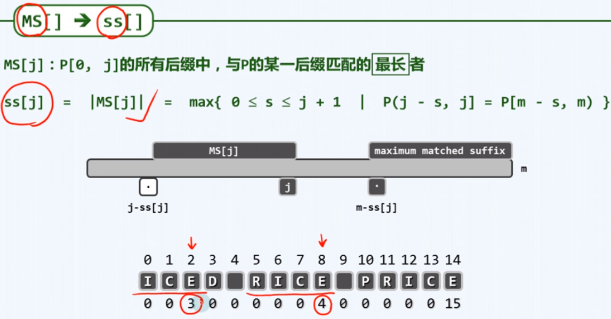

ss 表已经包含了 gs 表的所有信息，可通过其快速构造 gs 表。

#### 构造 ss 表

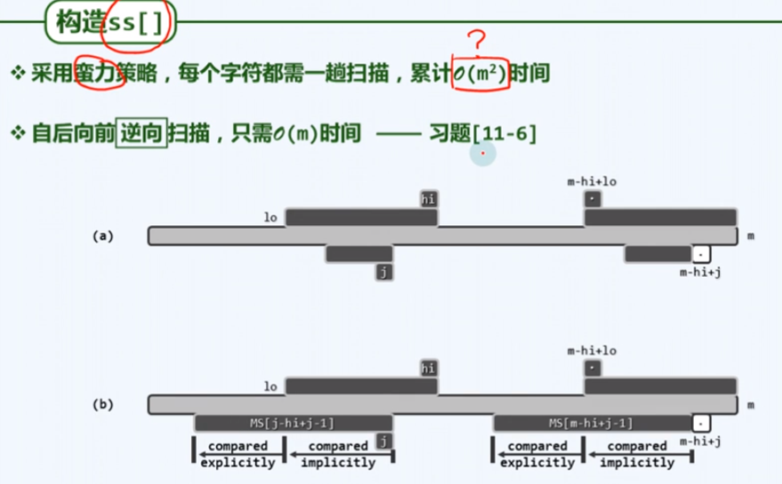

1. 线性法类比 next 表的构造过程，略。？？？？？？
2. 暴力构造：从右往左两重循环即可（类比构造 next 表的暴力法，将其反向）。详见下方代码。

#### 推出 gs 表

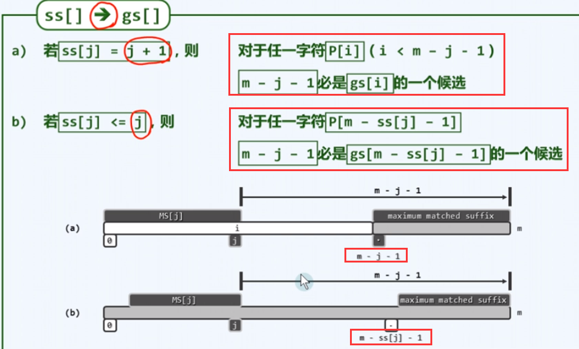

1. $ss[j] = j + 1$（最大情况）（图 a）
	对于位置 $j$，其 MS 子串的长度最大只能为 $j + 1$，若在 $m - j - 2$ 处失配，模式串应移动 $m - j - 1$ 的距离。
2. $ss[j] <= j$ （一般情况）（图 b）
	对于位置 $j$，当自匹配的子串长度小于 $j$，若在 $m - ss[j] - 1$ 处失配，模式串也应移动 $m - j - 1$ 的距离。

以上都是在失配后将 $MS[j]$ 移动到可以替换最长已匹配后缀（maximum matched suffix）的位置。详见下方代码。

#### GS 效率分析

类似与 KMP，模式串不会回退，最好最坏均为 $O(n+m)$ 。

### 策略并行（BC + GS）

并行两个策略时，分别得到策略对应的位移量，哪个策略的位移量大就执行哪个策略，这也是 bc 表可以优化为全部初始化为 $0$ 的原因。

### 完整代码

```c++
#include<cstdio>
#include<iostream>
#include<cstring>
#include<algorithm>

const int N = 25;
int bc[256];
int gs[N];
int ss[N];

void buildbc(char * P, int lenP) {
    for (int i = 0; i < 256; ++i) {   // 与 GC 并行时，本循环可删去
        bc[i] = -1;   // 构造结束后，P 中没有的字符对应的 bc 表值即是 -1
    }
    for (int j = 0; j < lenP; ++j) {
        bc[ (int)P[j] ] = j;   // 此处 bc 以 P 为下标，实际要选择使用哈希算法
    }
    return;
}

int BM_BC(char * T, char * P) {
    int lenT = (int)strlen(T);
    int lenP = (int)strlen(P);
    buildBc(P, lenP);
    int i = lenP-1, j = lenP-1;   // 从右边开始比较
    while (i < lenT && j > 0) {
        if (T[i] == P[j]) {   // 匹配则往左继续
            --i; --j;
        } else {
            i += lenP - 1 - bc[ (int)T[j] ];   // 将主串的 i 移到比对的末尾。此处 bc 以 T 为下标
            j = lenP-1;   // 返回模式串末尾
        }
    }
    return i <= lenT - lenP ? i : -1;   // 匹配失败返回 -1
}

void buildss(char * P, int lenP) {   // 暴力法
    ss[lenP-1] = lenP;   // 末尾初值
    for (int i = lenP - 2; i >= 0; --i) {   // 末尾位置开始
        int count = 0;
        for (int j = i, k = lenP-1; j >= 0; --j, --k) {   // 往左比较
            if (P[j] == P[k]) {
                ++count;
            } else {
                break;
            }
        }
        ss[i] = count;
    }
    return;
}

void buildgs(char * P, int lenP) {
    buildss(P, lenP);
    for (int i = 0; i < lenP; ++i) {   // 初始化，与 BC 并行时可删去。
        gs[i] = 1;
    }
    for (int i = 0, j = lenP-1; j > 0; --j) {
        if (ss[i] == i + 1) {
            while (i < lenP - j - 1) {
                gs[i++] = lenP - j - 1;
            }
        }
    }
    for (int i = 0; i < lenP - 1; ++i) {
        gs[lenP - ss[i] - 1] = lenP - i - 1;
    }
    return;
}

int BM_GS(char * T, char * P) {
    int lenT = (int)strlen(T);
    int lenP = (int)strlen(P);
    buildgs(P, lenP);
    int i = lenP-1, j = lenP-1;   // 从右边开始比较
    while (i < lenT && j > 0) {
        if (T[i] == P[j]) {   // 匹配则往左继续
            --i; --j;
        } else {
            i += gs[j];   // 移动的距离
            j = lenP-1;   // 返回模式串末尾
        }
    }
    return i <= lenT - lenP ? i : -1;   // 匹配失败返回 -1
}

int BM_BC_GS(char * T, char * P) {
    int lenT = (int)strlen(T);
    int lenP = (int)strlen(P);
    buildbc(P, lenP);
    buildgs(P, lenP);
    int i = lenP-1, j = lenP-1;   // 从右边开始比较
    while (i < lenT && j > 0) {
        if (T[i] == P[j]) {   // 匹配则往左继续
            --i; --j;
        } else {
            i += std::max(lenP - 1 - bc[ (int)T[j] ], gs[j]);   // 移动的距离
            j = lenP-1;   // 返回模式串末尾
        }
    }
    return i <= lenT - lenP ? i : -1;   // 匹配失败返回 -1
} 

int main() {
    char T[] = "121231212312124";
    char P[] = "1212312124";
    //std::cout<< BM_BC(T, P) <<std::endl;
    //std::cout<< BM_GS(T, P) <<std::endl;
    std::cout<< BM_BC_GS(T, P) <<std::endl;

    //build ss 测试：
    //char P[] = "ICED RICE PRICE";
    //char P[] = "abcdefcd";   // 非曰静也善故静也
    //buildss(P, strlen(P));

    return 0;
}
```

### BM 算法性能（BC + GS）

- 附加空间
	$| bc[ ] | + | gs[ ] | = O( s + m )$
- 时间
	- 预处理：$O( s + m )$
	- 查找：最好 $O( n / m)$，最差 $O( n + m )$