# 红黑树

（Red-Black Tree，RBT），别名：对称二叉 B 树，平衡二叉 B 树。

一种 BST，一种特化的 BBST，在进行插入和删除操作时通过特定操作保持树的相对平衡，从而获得较高的查找性能。

红黑树虽然复杂，但其最坏情况时间效率高，在实践中也是高效的： 可以在 O(log n) 时间内做查找，插入和删除，n 为树中元素的数目。

- 近似 BBST
	红黑树是一种平衡二叉查找树的变体，它的左右子树高差有可能大于 1，所以红黑树不是严格意义上的平衡二叉树（BBST）
	- 但对之进行平衡的代价较低
	- 其平均统计性能要强于作为 BBST 的 AVL 。
- 相对平衡的相对平衡
	BBST 不是严格平衡，是相对平衡，而 RBT 比 BBST 更相对平衡。
	- 因为舍弃了一部分平衡性，所以 RBT 具有了更好的性质）
	- RBT 的相对平衡性仍然具有很好的应用价值

与（2, 4）树（4 阶 B 树）可以相互转化。

## 总览

### 插入

#### 定义

- x 为插入节点，p 为 x 的父亲，g 为 p 的父亲（亦 x 的祖父）
- u 为 p 的兄弟（即 x 的叔父 uncle ）

#### 注意点

- 插入节点默认染红，再作修复。
- 插入节点为根节点则要将其染黑。
- 发生双红缺陷时，g 必定存在。
- u 为空时亦有效。

#### 双红缺陷（RR）

x、p 都为红。

- 分类
	- RR-1 ：u 为黑（为空时为外部节点，亦是黑，有效）
	- RR-2 ：u 为红
- 修复
	- RR-1: 统一重构并染色
	- RR-2：统一染色并向上

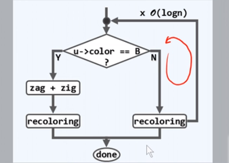

### 删除

#### 定义

- x 是被删除的节点，r 是其后继节点（不一定是中序，注意 BST 删除函数的语义）。
- p 为 x 的父亲，s (sibling) 为删除 x 前 x 的兄弟，为删除 x 后 r 的兄弟（即 p 的另一个孩子）

#### 注意点

- 注意 x 和 r 不可能都为红，因为 r 是 x 的右孩子。
- x 与 r 具有特殊关系，这是由 BST 的删除算法（removeAt）决定的。
- 后继 r 非空时 s 必有两个非空的孩子。

#### 一红一黑（RB）

x、r 一红一黑 。

- 修复
	- 单点染黑

（流程图略）

#### 双黑缺陷（BB）

x、r 均为黑。

- 分类
	- BB-1：s 为黑，且至少有一个红孩子 t
	- BB-2-R：s 为黑，且两个孩子都为黑，p 为红
	- BB-2-B：s 为黑，且两个孩子都为黑，p 为黑
	- BB-3：s 为红（代表着其孩子均为黑）
- 修复
	- BB-1：统一重构并染色
	- BB-2-R：交换颜色
	- BB-2-B：单点染红并向上递归双黑缺陷
	- BB-3：旋转并染色转化为 BB-1 或 BB-2-R

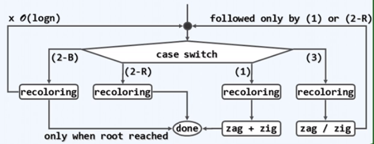

### 复杂度对比

- 时间复杂度
	- 查找，插入，删除均为 $O(\log n)$ 。

- 结构变化量
  - 插入均为 $O(1)$ 。
  - RBT 删除为 $O(1)$，AVL 删除为 $O(\log n)$ 。

如果只有查找操作，那么 AVL 的性能优于 RBT，因为 AVL 具有更强的平衡性。

## 结构变化量

- 持久性结构（一致性结构）（Persistent structure）
	- 即支持对历史版本访问的结构。
	- 搜索，插入，删除，需要指定版本号参数

### 暴力实现

$h$ 为版本总数，单次操作 $O(\log h + \log n)$，累计 $O(h + n)$ 时间 / 空间 。

- 单次操作的时间可接受，但空间消耗太大
- 多次操作下，创建副本也会消耗大量的时间

可否将空间复杂度控制在 $O(n + h \log n )$ 内？

### 大量共享，少量更新

每个版本新增空间复杂度仅为 $O(\log n)$ 。

红线指向共享量，蓝线指向更新量。

这种结构超出了这门课的要求，可见邓俊辉老师另一门课程：《计算几何》。

能否进一步提高，比如总体 $O( n+ h)$、单版本 $O(1)$？

### 控制变化量

如果能够将相邻版本间的空间变化控制在 $O(1)$（即在每次操作后只旋转常数次），则可以使空间复杂由 $O(n + h \log n)$ 变为 $O(n+h)$ 。

**红黑树是任何一次动态操作引发的结构变化量都控制在常数 $O(1)$ 内的一种 BBST 。**

## 基本概念

### 四条定义

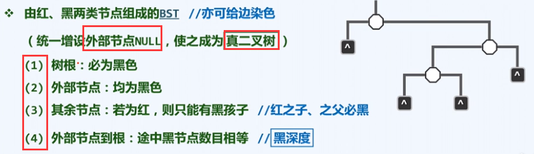

1. **只要红黑树非空，那么根节点必为黑**
2. **外部节点都为黑色**
	- 外部节点是不存在的空节点
	- 上顶和下底均为黑
3. **红节点只能有黑孩子**
	对红节点的约束
	- 意味着红节点的父节点和子节点都是黑色的，红节点被黑节点包围
	- 控制结构，对应 B 树的结构
	- 保证提升时，红节点只提升一层，即限定 B 树超级节点的结构
4. **外部节点到根结点所经过的黑节点数目相等**
	对黑节点的约束
	- 某个节点的高度是其到达外部节点所经过的黑节点数目
	- 起始外部节点自身的黑色不算在路径上
	- 这个数目也叫黑深度或黑高度，**根节点的黑高度为 $0$**
	- 控制深度，平衡性
	- 黑深度和黑高度其实就是对应 B 树的深度和高度

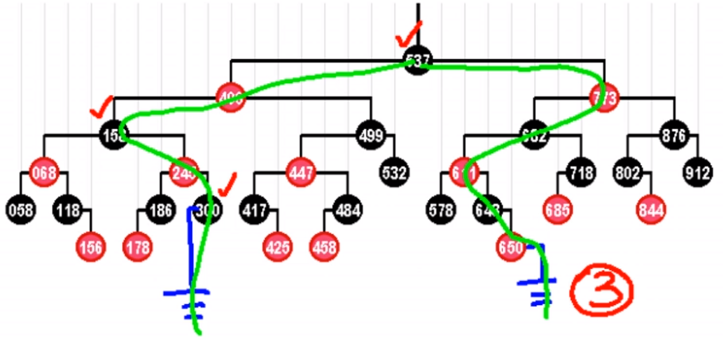

### 颜色内涵

红黑树的颜色约束了其的某种空间结构（以二叉树的结构模拟了 4 阶 B 树），使得其在由插入和删除导致失衡后，任何一次动态操作引发的结构变化量都能控制在常数 $O(1)$ 内。

### 提升变换

（lifting）

一种等价的拓扑变换，将每个红节点提升至与其父节点平齐（不会出现两个红色节点紧邻的情况）。

提升后：

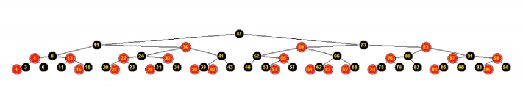

对于一棵红黑树：

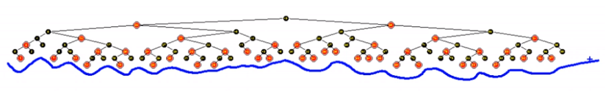

其底部节点高低不齐，但提升之后：

底部节点变得高度一致，因为此时是一颗 B 树（2,4）树。

- B 树的叶子节点高度一致
- 红黑树的叶子节点高度是浮动的

### 结点对应

（2, 4）树 == 红黑树（相互对应）

- 四类超级结点
	- 黑黑
	- 黑红
	- 红黑
	- 红红

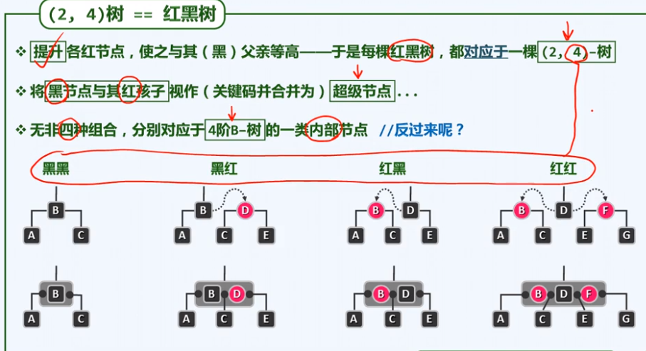

### 调整修复

- 理解红黑树要时刻心里有点 B 树。（思考其对应关系）
- **提升后观察 B 树，修复 B 树结构后再修复超级结点的颜色，然后“逆提升”观察红黑树，即得红黑树的修复方式。**
- RBT 以“宽松的”四条定义被破坏替代“严格的”平衡被破坏，以此获得了更优的平均性能。

## 红黑树类

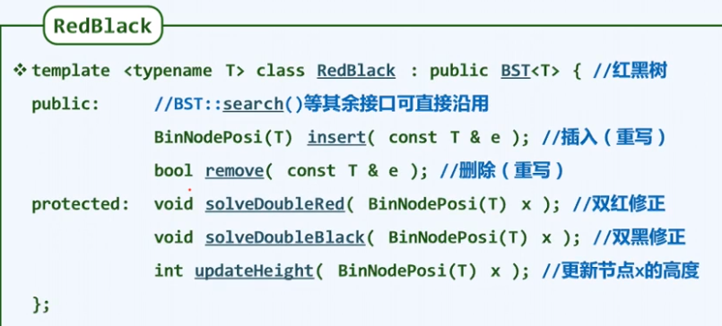

上图中指的是更新节点黑高度。

高度更新函数：

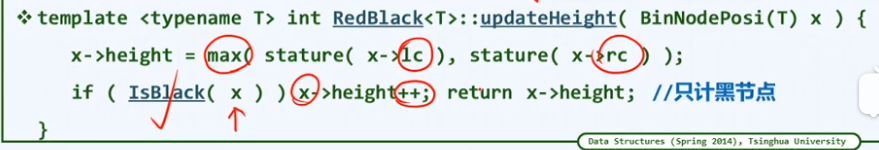

上图：当前节点为黑时，它的高度才需要增加一个单位。

---

本例假设红黑树不含相同节点

## 查找

由于每一颗红黑树都是一颗二叉排序树（BST），因此，在对红黑树进行查找时，可以采用运用于普通 BST 上的查找算法，在查找过程中不需要颜色信息。

## 插入

### 算法

- 新插入节点默认染红，后做修复。
- 初始化黑高度为 $-1$，因为新插入的节点必定在末端（参考根结点的黑高度）

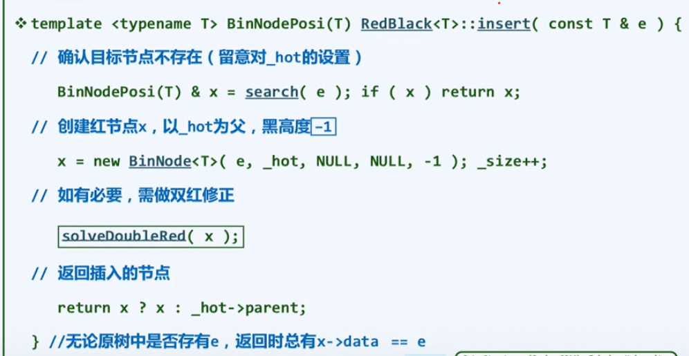

先按 BST 的常规插入算法插入，新插入节点 x 的位置必为末端位置。

- 设 x 的父节点 p 存在，否则 x 为根。直接将 x 染红，如果它是根，解决缺陷时再染成黑色即可 。

- 检查定义
	- 1、2 定义满足
	- 3 定义不一定满足
		如上图，不确定颜色的节点由白色表示，节点 p 如果原来是黑的，则此时 3 定义满足，否则不满足。
	- 4 定义因为其余路段上的黑节点都不变，所以满足

### 双红缺陷（RR）

如果 p 原来是红的，则造成双红缺陷（此时 x，p 均为红），即下图：

- 所有指向黑色或不定色的边，都用实线表示
- 所有指向红色的边，都用虚线表示，在 提升变换 之后，所有虚边都将变为水平方向

因为 g 是 红节点 p 的父亲，所以 g 肯定是黑色的（发生双红缺陷的此时，p 不可能是根结点，g 必定存在）。

x 的叔父 u (uncle)（即 p 的兄弟） 的颜色不定，所以根据 u 的颜色分情况处理。

### RR 修复

#### RR-1

u 为黑，亦 u 为空的情况。

局部子树有四种情况，这里只考虑其中 zig（a）和 zagzig（b）的情况，另两种分别与之对称。

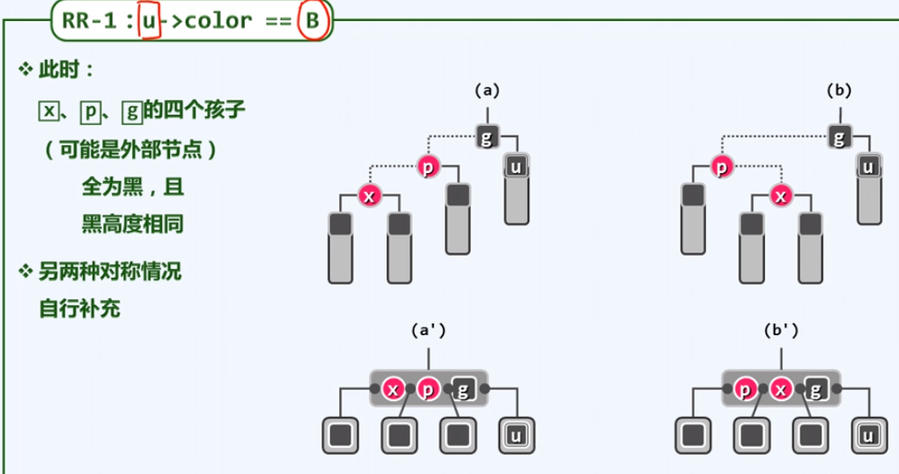

- 对 B 树

	不需进行 B 树的结构变换，只需交换 p、g 或 x、g 的颜色即可。

- 对红黑树

	该操作对应到红黑树上就是局部子树重构，并染色（红黑树发生了结构变换，但不过 $O(1)$ ）。

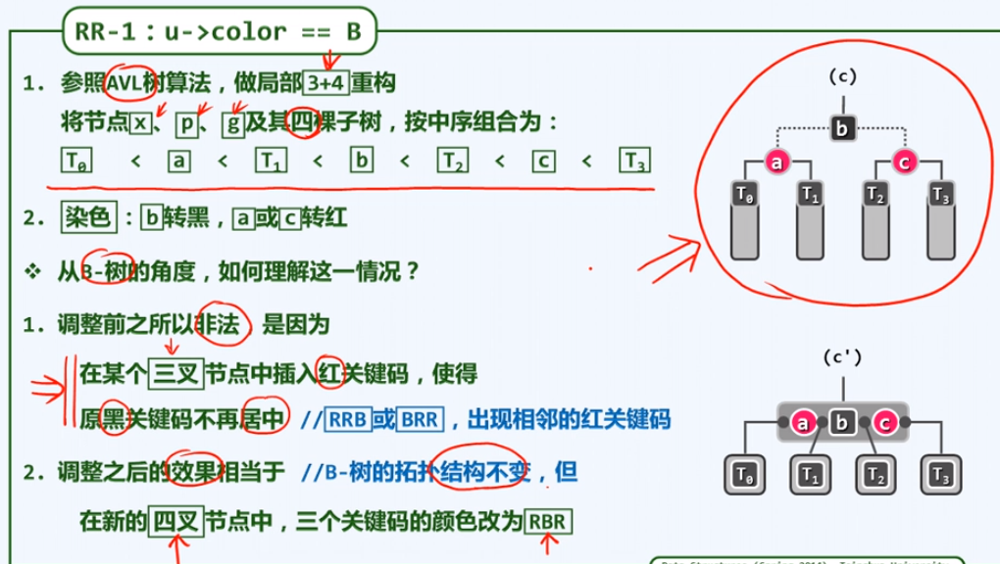

#### RR-2

u 为红。

局部子树有四种情况，这里只考虑其中 zig（a）和 zagzig（b）的情况，另两种分别与之对称

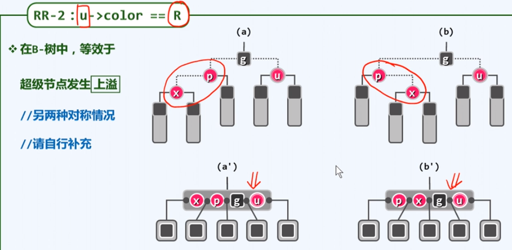

提升后可以看到，不符合 4 阶 B 树形式，即产生了上溢。

- 对 B 树
	- 要对 B 树进行结构变换（分裂），提升 g 并染红，将 p，u 染黑。 
	- g 上升后其两旁有未知颜色的节点（白色问号节点，其中必定有一个黑色），相当于对其插入了 g，可能再次导致双红缺陷，不断修正即可。
	- 结构变换可能达到 $O( \log n )$
- 对红黑树
	- 该操作对应到红黑树上没有结构变换，只有染色操作。
	- p、u 染黑，g 染红
	- 即使 g 上升后再发生双红缺陷，也最多再有一次结构变换（RR-1），或再有 $\log n$ 次染色操作（RR-2）。
	- 结构变换仍为 $O(1)$

#### 总结

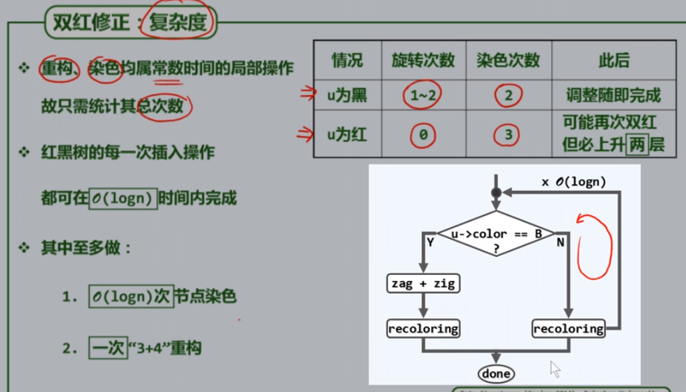

上图中：染色次数一栏取决于有多少个节点需要重染色。

由流程图可以看到：染色操作可能执行 $\log n$ 次，但只要有一次结构操作（即重构，即图中的 zag+zig），修复则立即终止。

即：$O ( \log n )$ 次染色，$O (1)$ 重构。

## 删除

### 算法

按照 BST 的删除接口删除（搜索到的）节点。

- BST 删除函数的语义
	- 若待删除的 x 至少有一个空孩子，则删除
	- 若 x 两个孩子都不为空，则与其中序后继交换，x 变为左孩子为空的节点，再删除

因此即将删除的 x 的位置，其至少有一个孩子为空。

根据 BST 删除函数语义，删除 x 后，将由其后继 r （不一定是中序后继）接替其位置，（r 可能是个空（外部）节点），另一孩子记作 w（w 必是一个黑的空（外部）节点）（这里的 w 与下文的 s 不同）。

- 检查定义
	- 1、2 定义满足（若被删除的 x 为根仍然满足）
	- 3、4 定义不一定满足

### 红黑缺陷（RB）

一红一黑缺陷。

x、r 一红一黑 。

- 若待删除节点 x 和替代者 r 为一红一黑（如上图（a）（b）所示）
	- （a）r 接替 x 的位置，r 的左右子树的黑高度在 r 为黑时才能不受影响。
	- （b）r 接替 x 的位置，r 的左右子树的黑高度减少。

### RB 修复

单点染黑

- 对 B 树
	删除 x 不会导致 下溢，只需要重染色即可保持超级结点结构。
- 对红黑树
	将 r 染为黑色即可，r 为空也可行（空为黑色）。r 染为黑色，p 的子树的黑深度与原来相等。

### 双黑缺陷（BB）

x、r 均为黑。（x 和 r 不可能都为红，因为 r 是 x 的右孩子）

此时删除 x，相当于 B 树中的下溢，s (sibling) 为新树中 r 的兄弟（即 p 的另一个孩子）（“新树"即已删除 x 的树）

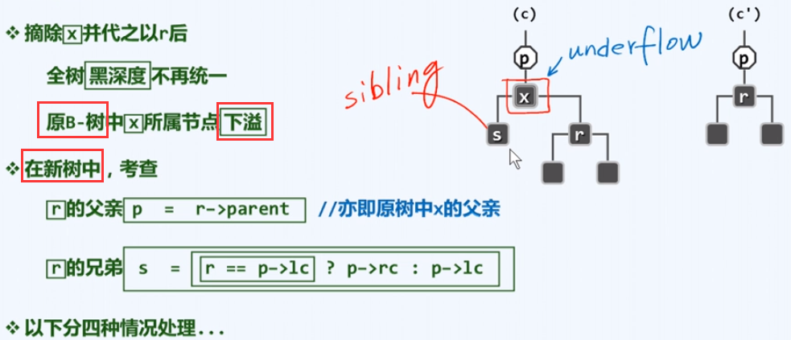

上图有错误，s 应为删除 x 后的新树的 r 的兄弟，是原树（亦旧树）中 p 的一个孩子，而不是原树中 x 的孩子。而且原树中 x 应至多有一个非空孩子。

**B 树的叶子节点的高度必定相等，又 4 阶 B 树的分支结点至少有两个孩子，从而有：后继 r 非空时 s 必有两个非空的孩子。**

### BB 修复

#### BB-1

s 为黑，且至少有一个红孩子 t 。

局部子树有四种，其余情况分别与下图的（a）对称或相似。

图示中的空白节点为颜色不定的节点，问号结点为状态不定结点。

删除 x 产生了下溢。

- 对 B 树
	- 进行旋转操作，令 p 取代 x 的位置，s 取代 p 的位置。
	- 此时原含 s 的超级节点因为有 t 的存在，在 s 离开后不会产生下溢。
	- 在原含有 p 的超级节点，p 离开后又补上了一个重染色成 p 颜色的 s 与原来的状态保持一致，故不会在原含有 p 的超级节点造成任何缺陷。
	- 结构变换 O(1)
- 对红黑树
	- 删除 x 后，对 t、s、p 局部子树进行重构并重染色
	- 新的局部子树的根继承原 p 的颜色（下图为 s 替代了 p 的位置，但还有一些对称或相似情况）
	- 结构变换 O(1)

#### BB-2-R

s 为黑，且两个孩子都为黑，p 为红。（2 后的 R 是指 p 为红的子情况）

局部子树有两种情况，另一种与下图（a）对称

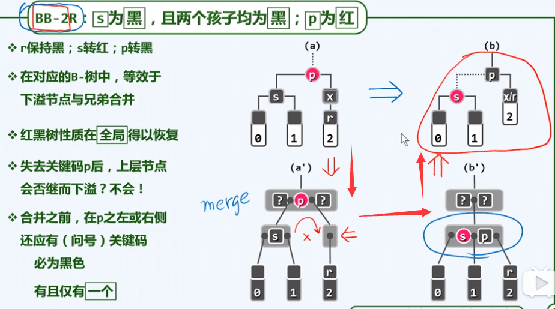

删除 x 产生了下溢。

- 对 B 树
	- 此时原含 s 的超级节点没有 t 的存在，在 s 离开后会产生下溢，故不能旋转。
	- 执行合并操作，将 p 下拉，合并 s 与 p
	- 此时，因为 p 是红色的（在红黑树中必有一个黑父亲），故原含有 p 的超级节点中，除 p 外，在 p 的左侧或右侧一定有且仅有一个关键码，并且为黑色。故 p 离开后，原含有 p 的超级节点不会发生下溢。
	- 结构变换 O(1)
- 对红黑树
	- 只需重染色即可，s 染红，p 染黑（交换颜色）
	- 结构变换 O(1)（只有删除 x 产生了结构变化）

#### BB-2-B

s 为黑，且两个孩子都为黑，p 为黑。（2 后的 B 是指 p 为黑的子情况）

局部子树有两种情况，另一种与下图示（a）对称

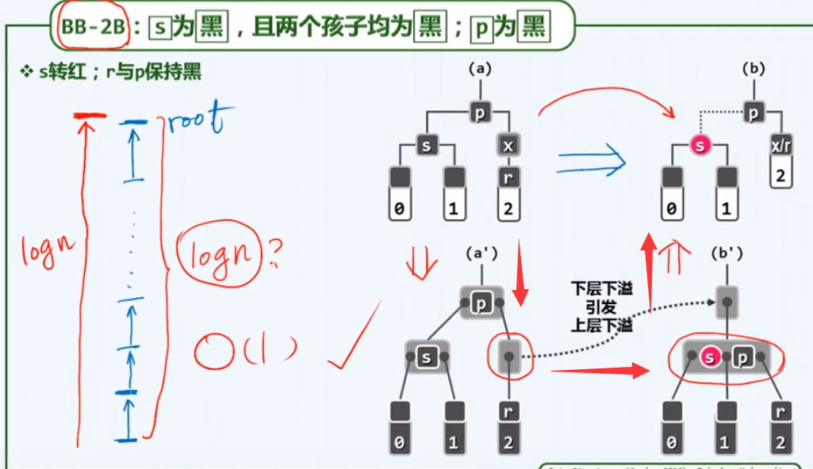

删除 x 产生了下溢。

- 对 B 树
	- 含有 s 的超级节点只有一个关键码，若旋转，则该节点会接着下溢。故此时对局部子树执行合并操作。
	- 合并 s 与 被删除 x 留下的空节点，同时下拉 p，组成新的超级节点（s、p），将 s 染红。
	- p 为黑色，其孩子也是黑色，故下拉前 p 只可能是单独作为一个超级节点，下拉后含有 p 的超级节点发生了下溢，但其下溢会向上传导，结构变化最多不过 O(logn) 次。
- 对红黑树
	- 将 s 染红即可，即在 s 与 p 间增加一条可提升的虚边。原 x 的位置由 r 接替。
	- 黑 x 被删除，r 的黑深度减少，将 s 染红，从而减少 p 的另一子树的黑深度。但只将 s 染红只能保证 p 的两个子树的黑深度相等，还要向上继续处理，以修复 p 子树以外的子树的黑深度，使它们的黑深度保持一致。
	- p 的子树的黑深度减少，相当于原来的 p 位置像 x 一样被删除了，故会向上传导，引发新的双黑缺陷，s 染色后的 p 成了新的 “x” 的 r。
	- 染色可能 O(logn) 但只要一次结构变换就修复完毕。
	- 结构变换 O(1)（只有删除 x 产生了结构变化）

#### BB-3

s 为红（代表着其孩子父亲均为黑）。

可转化为其它情况。

局部子树有两种情况，另一种与下图示（a）对称

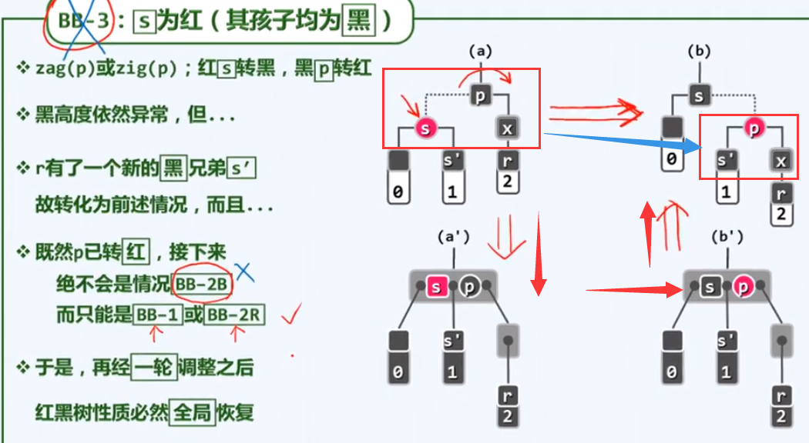

删除 x 会产生下溢。

- 对 B 树
	- 此时交换 s 与 p 的颜色，使其转化为另一种下溢情况（BB-1 或 BB-2-R）。
	- 无结构变换。
- 对红黑树
	- 对 s 和 p 进行 zig 或 zag 的旋转，再交换 s 和 p 的颜色。
	- 此时结构变换为 O(1) 。
	- 同时 p 的局部子树也转化为 BB-1 或 BB-2-R（图中红框所示）（绝不可能是 BB-2-B，因为 p 已经转为了红色）。
	- 由 BB-1 和 BB-2-R 可知，再经过 O(1) 的结构变换，即修复完成。
	- 总结构变换为 O(1)

**类似于此前 s 的孩子的原理，s' 必有两个非空的孩子。**

### 特殊点

由于 removeAt 函数在待删除节点两个孩子都为空时，只将其直接删除，后继以空代替（而不是返回中序后继），虽然 AVL 及 Splay 内能够将其重平衡，但在红黑树中，这会引发错误，故在红黑树中，我们在**待删除节点后继为空或其为叶节点**时要特殊处理。

若该点也不是根节点，则将其的数据与父节点数据交换，然后删除其父节点。（removeAt 可以正确处理待删除节点为根节点的情况）

### 总结

- 对于（2-B）分支
	最多进行 $O(\log n)$ 次的重染色就会结束。
- 对于（1）分支
	染色并 zag+zig（重构）。
- 对（3）分支
	一次 zig 或 zag（单旋） 后，转化为 （2-R）或（1）随即终止。

即：$O ( \log n )$ 次染色，$O (1)$ 重构。