# 自平衡二叉搜索树

（AVL Tree）

AVL 是最早被发明的 BBST 。

## 总览

- AVL
	- 插入 $O(\log n)$
		- 搜索 $O(\log n)$
		- 旋转
			- 单旋 $O(1)$
			- 双旋 $O(1)$
	- 删除 $O(\log n)$
	  - 搜索 $O(\log n)$
	  - 旋转
	  	- 单旋 $O(\log n)$
	  	- 双旋 $O(\log n)$

## 平衡因子

- 结点的平衡因子即该结点左右子树的高度差（左子树高度 减 右子树高度）。
- 若 BST 的每个结点的平衡因子的绝对值都不大于 $1$ ，则其是一棵 AVL 。
- 根据高度定义，叶子结点的高度为 $0$，空结点的高度为 $-1$ 。


一棵 AVL 树的高度在渐进意义下不会超过 $O(\log n) $ 。

通过平衡因子控制 BST，使其转化为 AVL 。

## 平衡条件

理想平衡、平衡因子、AVL 平衡条件 。


上方图示宏定义参数 $x$ 为结点，我在代码中是采用指针。

## AVL 模板类

只需重写 BST 的插入与删除接口。


## 失衡与重平衡

### 插入


- 插入 M，导致了其祖先 K，N，R，G 的失衡。
- 但对于不是它祖先的结点而言，绝不会因它失衡，因为其高度不变。

### 删除

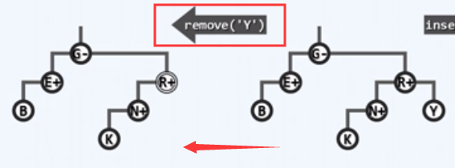

- 删除 Y，导致其父结点 R 失衡（删除后的瞬间，至多只有一个祖先失衡）。
- 但将其父结点重平衡后，有可能不断重复地导致它的祖先结点失衡，于是需要不断重平衡失衡的结点，直到完全平衡。

### 指定符号

- v（ vertex ）: 当前结点
- p（ parent ）: 父亲
- g（ grandparent）: 祖父
- Ti （ $i = 0,1,2,3$ ）：各子树

注意：初始状态必须为平衡状态。

### 最小不平衡子树

即以插入或删除结点的祖先中离插入或删除结点位置最近的失衡结点为根的子树，以下称为局部子树。

- 局部子树必须是祖孙三代的形式（重平衡后变为两代），其余形式对重平衡无用
- 局部子树的初始态为平衡态，一次只能插入或删除一个结点，所以一次只能导致高度差出现 1 的变化
- 每一次旋转最多能改变 1 的高度
- 结点的两棵子树的高度差超过 1 即是失衡（以下图示注意三条黑线）
- 对于一个局部子树，其失衡后，通过旋转将其中序序列的中间结点（p或v）提升到局部子树的最高位即可消除失衡。（即是将高的子树提升，矮的子树放下，以此消除超额的高度差）
- 局部子树根结点的**深度**应保持不变。
- **中序序列**顺序保持不变，即只发生祖孙三代的高度变化（注意四棵子树顺序不变）
- 一旦有失衡的祖先，那个祖先必定有一个孙子，该孙子是其兄弟间高度最高的那个（失衡时祖父不可能为空，**失衡时必存在祖孙三代的形式，即必存在最小不平衡子树**）

---

**以下只演示主要情况，对称情况类似。**

## 插入

### 单旋

祖孙三代处于一条直线上。


上图：

- 对于一棵平衡树，插入一个结点（箭头所指用虚线连接，代表只插入其中之一的位置），导致 g 失衡，（注意：g 是所有因此而失衡的祖先中，最深的那个）。
- g 经单旋调整后高度可复原，子树高度也就复原，从而更高祖先也复原，即平衡，全树平衡。

#### zag


上图：引入临时引用。

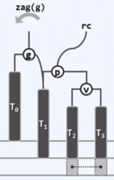

上图：使 p 的左子树 T1 成为 g 的右子树。

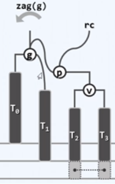

上图：令 g 成为 p 的左孩子。


上图：将局部子树的根由 g 替换为 p；zag 完成；

整理后如下：

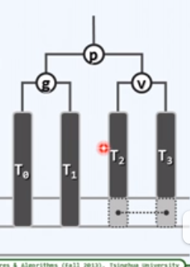

#### 前后对比


- 红线为局部子树的根结点高度线，将其整理持平后，观察下方三条黑线即可确定高度。
- 对中间的黑线，可以看出旋转后局部子树的高度与插入前一致，故更高祖先都将平衡。

### 双旋

祖孙三代为“之”字形。


注意：对于这种情况，g 仍然是所有因此而失衡的祖先中，最深的那个。

#### zig

对 p 进行 zig 旋转。


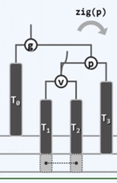


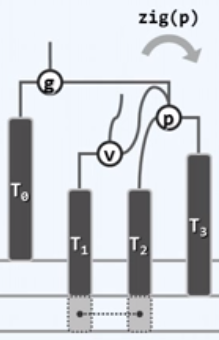

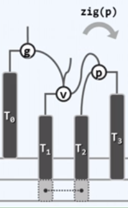

上图：至此，zig 旋转完成。

#### zag

再对于 g 进行 zag 旋转。


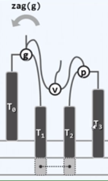

上图：这次 zag 旋转完成。

整理后如下：

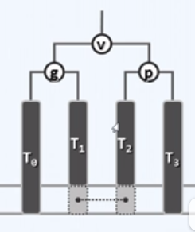

#### 前后对比

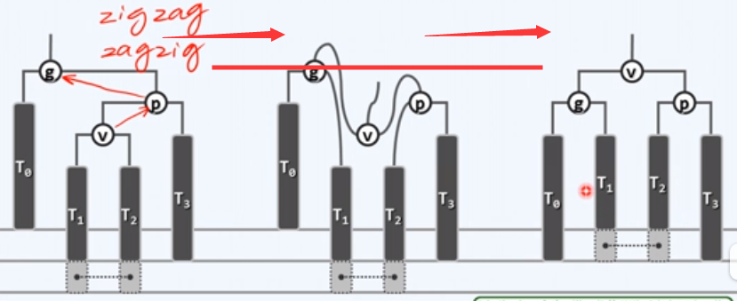

失衡的祖先也必复衡。

### 实现

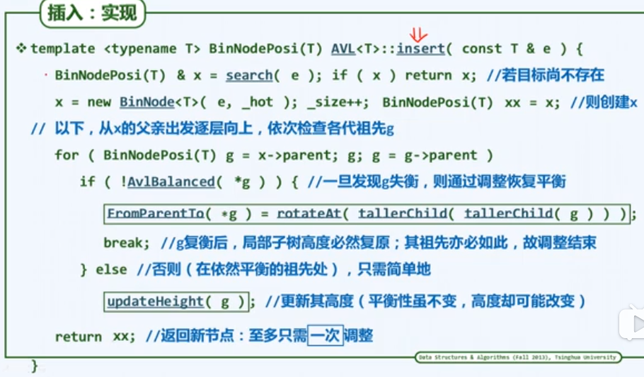

`FromparentTo()`：没有这个函数，此处只是为了说明参数语义。
`updateHeight()` 是 `BinTree<T>` 中只单独更新一个结点高度的函数。

- 注意：
	- `tallerChild()` ：其高度更高的那个孩子。
	- `rotateAt()`： 参数是传入第一个失衡结点的孙子，导致失衡的结点是该孙子的后代或其本身。

- 特殊情况

	- 从空树开始
		1. 插入第一个结点，不可能失衡；
		2. 插入第二个结点，不可能失衡；
		3. 插入第三个结点，可能失衡，但现在可以直接得到其失衡结点的正确孙子。

	- 一旦有失衡的祖先，那个祖先必定有一个孙子，该孙子是其兄弟间高度最高的那个。
	- 可使用一个变量记录失衡结点的孙子，优化掉 `tallerChild()` 的嵌套使用。

## 删除

### 单旋

祖孙三代处于一条直线上。


上图：

- 红框为删除的那个结点
- T0 与 T1 下方的结点最多只可能同时存在一个
- T2 下方的虚线结点有可能存在，有可能不存在，
- 同时只会失衡一个结点，首个可能就是 x 的父亲 _hot（x为删除的那个结点，其是上图 T3 下的一个结点）

围绕 g 做旋转 zig（g），结果如下：


上图：

- 若 T2 下方的虚线结点存在，则局部子树的高度与原来一致，此时所有祖先也都平衡。
- 若不存在，局部子树对应的祖先高度可能缩短一个单位，从而失衡向上传导。
- 失衡传播现象
	一次旋转后高度未必复原，更高祖先仍可能失衡，可能需要 log( n ) 次旋转才能使整棵树完全复衡，即每一层都进行一次旋转。

### 双旋

祖孙三代为“之”字形。

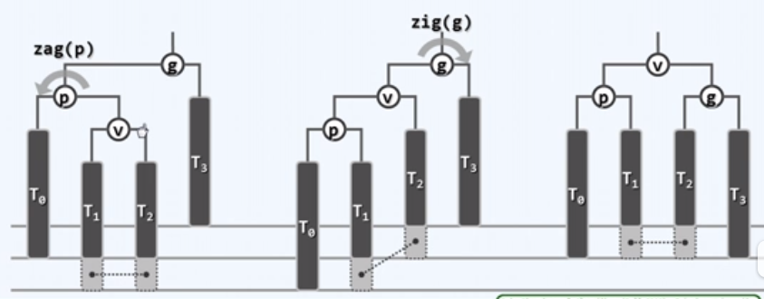

### 实现


- 删除与插入不同，可能删除结点的父亲就是首个失衡结点，而我们需要传入局部子树的孙子，所以必须调用 tallerChild( ) 函数。

## 3 + 4 重构

### 原理

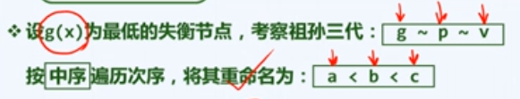


对于局部子树，三个结点，四个子树（故叫做 3+4 重构）必然能够构成以下的 中序遍历 形式：

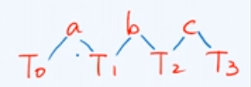

注意：上图的线只表示顺序，不表示树枝.

所以我们可以直接拼接成局部子树的最终结果：

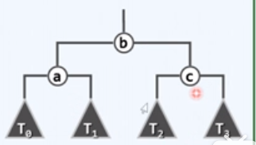

无论需要如何旋转，最终结果都为这个形式，我们只需要判断其属于那种情况（即重命名然后传参）。

- 旋转
	- 因为无论局部子树原结构如何，调整后其中序遍历顺序依然不变，所以四棵子树的顺序也不会变。
	- 可以先判断其属于哪种结构，然后得出其中序遍历顺序，形参按此顺序填入即可；直接重构。
	- 失衡时祖父不可能为空

### 实现

传入的参数按局部子树的原结构顺序传入即可。

返回值为新的局部子树的根结点。


前两个更新高度的操作只是更新了一个结点的高度，最后再将 a 和 c 连接到 b 上，此时更新高度就不会重复扫描祖先。

## 统一旋转

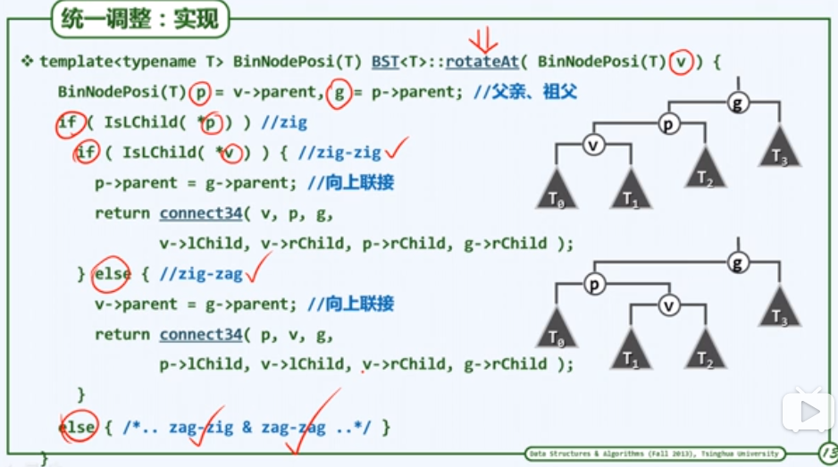

上图中的注释有错误，以下方笔记中的四种情况为准。（zig-zig 应为 zig；zig-zag 应为 zag-zig）。

`rotateAt` 函数放在了 BST 中。

- 参数
	- rotateAt 函数参数是传入第一个失衡结点到引发失衡结点的路径上的孙子。
	- 也可传入最小不平衡子树的根结点，将旋转函数稍作修改即可。（失衡时祖父不可能为空）
- 返回值
	返回值为新的局部子树的根结点 。
- 上图的向上连接操作有缺陷
	- 要把局部子树根结点是其父亲的左孩子还是右孩子弄清楚，并连接上。
	- 还要在祖父是根结点时，更新 `BinTree<T>` 中的 `_root`（储存根结点的变量）（应将其操作新建一个函数，详见代码，`up_link`）

### 四种情况

注意相对位置，高度，中序序列。

1、zag 。2、zig。

```
g     对称      g
  p	         p
    v     v
```

3、zag - zig 。4、zig - zag 。

``` 
     g  对称  g
p                  p
   v            v
```

不会有以下两种情况的局部子树。

```
    g    对称    g
p      v      v     p
```

以下两种情况就是 3、4、由中序序列可知，下图画错了。	

```
    g     对称    g
p                    p
       v       v
```

## 效率

- 搜索算法时间复杂度为：$O( \log n ) $
- 插入和删除算法在渐进意义上时间复杂度都为:   $O( log n )$


- 删除算法平均每 $5$ 次操作会旋转 $1$ 次
- 插入后，最多只需 $O( 1 )$ 次旋转
- 删除后，最多要 $O( \log n )$ 次旋转