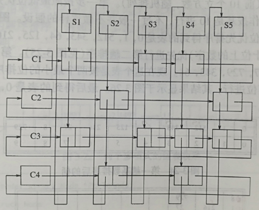
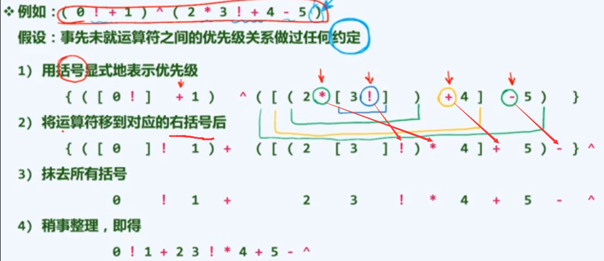
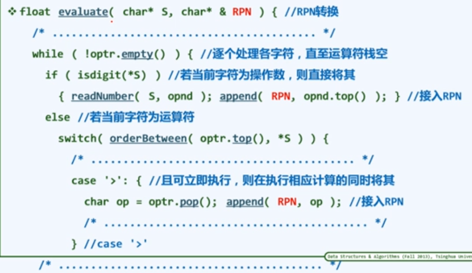

# 表 栈 队列

## 表

### 链表

#### 结构

- 头结点，首结点，末结点，尾结点

头结点和尾结点的存在是为了方便对链表进行操作。

- 注意区分画简图时的前驱与后继。

#### 初始化

建立头尾节点并相连。

### 循环链表

构建时最好也加上类似于头尾结点的辅助结点。

一般用静态链表实现。

### 静态链表

用数组实现的链表叫静态链表（数组表示法）。

需要存储当前**元素**以继其后继的**下标**。

### 自适应链表

- 局部性（locality）
	刚被访问过的数据，极有可能很快地再次被访问；下一个要访问的节点，极有可能在刚被访问的节点附近。
	

可以在每次搜索后，都将被搜索到的节点移至链表开头，以构造一段高概率搜索区域，从而提高查找效率。

### 多重表

通过多个链表及添加的表头模拟二维数组。

适用于数据成二维数组模式但所用空间少的情况。

### 栈

（Stack）

先进后出，后进先出。

#### 结构

- 一个始终指向栈底的指针 base
- 一个指向栈顶“超顶”值的指针 top

#### 链式栈

最好用单链表，以表的前端为栈顶（即头结点的下一个结点）。

#### 共享栈

以一个数组作为存储空间实现两个栈。

一个栈的栈底在数组的开头，另一个栈的栈底在数组的末尾。

中间有两个浮动的栈顶，每个栈元素较少时，另一个栈可以占有更多的空间。

#### 中缀表达式

- 两个栈
	- 字符栈
	- 数字栈
- 计算流程
	- 从左向右扫描
	- 数字直接进栈
	- **栈顶运算符优先级高或相等，则计算栈顶运算符。**
	- 符号不断进栈，直到当前扫描的符号的优先级低于栈顶符号优先级，则计算，并出栈，结果入数字栈。
	- 计算后，**继续比较当前扫描的符号与新的栈顶的符号的优先级**，直到停止计算，当前符号入栈，继续扫描。
	- 注意点
		- 括号优先级最低
		- 字符串首尾添加标记，优先级最低
		- 若有表达式  $2\times 32 + 5$ 则有读取到字符 $3$ 后有紧接着读到字符 $2$ 时，要将 $3$ 出栈并乘以 $10$ 再加上 $2$ 再入栈

#### 后缀表达式（RPN，逆波兰表达式）

上图：上方为中缀表达式，下方为对应的逆波兰表达式。

##### 计算方法

- 一个栈，数字入栈，一遇到符号就弹出计算，结果再入栈。
- 数字的顺序不会改变
- 括号被全部消除

计算逆波兰表达式（后缀表达式）时，完全不必考虑符号的优先级顺序，这是一个显著的优点。

##### 中缀转 RPN

- 手工转换

  - 显式添加括号，表示所有的计算次序
  - 将运算符移到对应的右括号后（移到左括号前则是转换为前缀表达式）
  - 去掉所有括号即可

- 转换算法

  - 两个栈，因为计算中缀表达式需要两个栈。

  	因为数字可以直接加入 RPN，因此实际只需一个运算符栈。

  - 计算中缀表达式的过程中，逐步构建 RPN。

  - 扫描到数字则数字加入 RPN

  - 扫描到运算符，当栈顶运算符可立即执行时，将运算符加入 RPN

## 队列

（queue）

先进先出

### 循环队列

- 需要有头尾指针。
- 可以用数组实现，实际用链表更好，下标要用循环控制式控制。

### 双端队列

（deque）

两方可同时进队出队。

### 优先队列

（priority queue）

使用堆实现，详见《堆》

- 为什么使用堆，而不使用平衡树？
	若使用 BBST 则会在 search 和 remove 接口上产生浪费，过犹不及。
	- 优先队列只对优先级最高的元素查找和删除，BBST 对其过于强大。
	- 优先队列只需要维护元素间的偏序关系，而 BBST 维护的是全序关系。