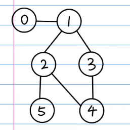
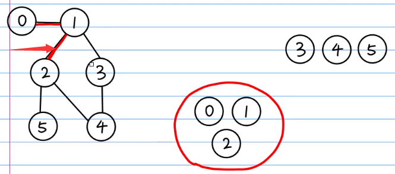
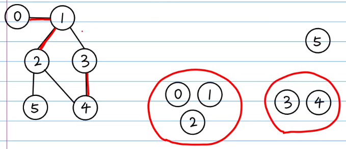
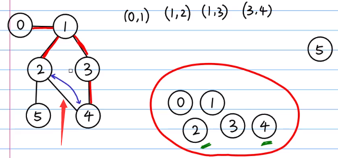
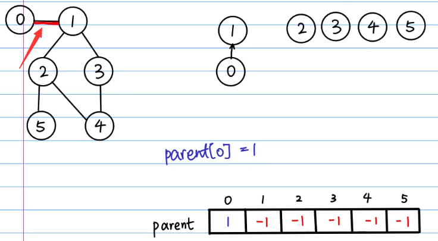
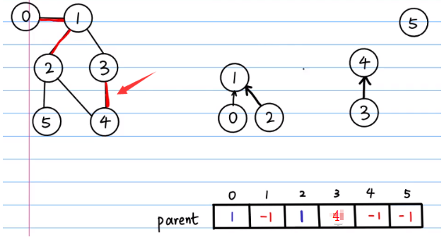
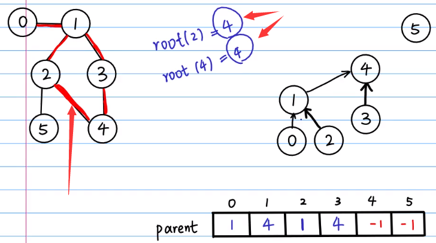

# 并查集

（Disjoint Set，Union-find，Disjoint Set Union，DSU 算法）

- 一种用来处理不相交集合的树形数据结构。
- 能快速判断集合间是否具备相交关系。

@正月点灯笼

## 原理

以检测一个图里面是不是包含有环为例。



上图：对于一个图，判断它是否有环。


上图：随意找一条未被选过的边，将其连接的两个点放入一个集合中。



上图：再随意找一条未被选过的边，其连接 1 和 2，因为 1 已经放入了一个集合，所以把 2 放入与 1 相同的集合里。



上图：再随意找一条未被选过的边，其连接 3 和 4，把 3 和 4 放入一个集合中。


上图：再随意找一条未被选过的边，其连接 1 和 3，1 和 3 分别在两个集合中，将其合并为一个集合。



上图：再随意找一条未被选过的边，其连接 2 和 4，2 和 4 在同一个集合中，代表其存在环。

### 总结

随意选择一条未被选过的边，其连接的两个点只要同时已经在一个集合中，那么说明存在环。（都不在集合中则放入集合）

## 算法

- 使用双亲表示法表示的树实现。
- 以根结点标志不同的集合。
- 一个 parent 数组，```parent[ i ]``` 表示 $i$ 号结点的父亲。


上图：初始化。（该初始化方式非最优，以下方代码为准）



上图：任意选一条边，其连接的两个点中随意选一个作为父结点，图中选择的是 1，并修改数组。


上图：选一条边，1 已在树中，2 应与 1 在同一个集合中，面临两种情况：

- 1 作为父结点
- 2 作为父结点

合并的树应以高度值大的树的根结点作为父结点，即以 1 为父结点（使树的高度尽量低）。



上图：3 和 4 应单独构成一个集合，即单独的一棵树。


上图：选择了连接 1 和 3 的边，分属两个集合，即分属两颗树，被连接，合并两颗树。（根结点相连）



上图：2 和 4 的根都是 4，说明它们已经属于一个集合，说明存在环。


- 找到根结点，判断是否相同，不同则合并，相同则存在环。

## 路径压缩

合并时直接选择一个结点作为父结点可能导致树退化成一条长链，这样再查找父结点时复杂度就会大幅提升。

路径压缩有多种方式，以下列出两种：

1. 查找根的过程中，将当前结点的祖父改为其父亲，这样每查询一次，路径就会被不断压缩。
	（每次查询只向上扫描一次，但压缩度低，每次只压缩 $1 \over 2$ 的路径）
2. 查找到根后，将其路径上所有结点的父亲都设为根。
	（递归或迭代，迭代更好）
	（每次查询要向上扫描两次，但压缩度高）

## 代码

以上方示范中的图为例，求是否有环存在。（实现方式与上方原理示范有不同）

- 每个结点初始化父结点为自己。
- 查找根进行路径压缩，最坏一次查找 $O(n)$，最优一次 $O(1)$ 。
- 合并时任意选择一个点作为父亲即可（ $O(1)$ ）。

注意：自环也是环。

```c++
#include<cstdio>

const int N = 6;   // 边数
const int M = 6;   // 点数
int edges[N][2] = {{0, 1}, {1, 2}, {1, 3}, {2, 5}, {2, 4}, {3, 4}};
int parent[M];
bool flag;

int find(int x) {
    int res = x, t;
    while (x != parent[x]) {   // 查找根
        x = parent[x];
    }
    while (res != parent[res]) {   // 路径压缩
        t = parent[res];
        parent[res] = x;   // 赋为根
        res = parent[t];
    }
    return x;
}

bool join(int x, int y) {
    x = find(x);
    y = find(y);
    if (x == y) {
        return true;
    } else {
        parent[x] = parent[y];   // 无其它要求随意选其中一个即可，若根相等，不影响正确性
    }   // 也可写为 parent[x] = y;
    return;
}

int main() {
    for (int i = 0; i < M; ++i) {   //初始化
        parent[i] = i;
    }
    for (int i = 0; i < N; ++i) {   //遍历边
        if (join(edges[i][0], edges[i][1])) {
	        printf("There are cycles!\n");
    	} else {
        	printf("There are no cycles!\n");
    	}
    }
    return 0;
}
```

扩展：如果不是求是否有环，而是其它要求，可以建立额外数组，存储高度等信息。

## 模板题

P1551 亲戚 https://www.luogu.com.cn/problem/P1551

### 代码

```c++
const int MAXN = 5005;
int n, m, p;
int parent[MAXN];
bool result[MAXN];

int find(int x) {
	int res = x, t;
	while (x != parent[x]) {
		x = parent[x];
	}
	while (res != parent[res]) {
		t = parent[res];
		parent[res] = x;
		res = parent[res];
	}
	return x;
}

inline void join(int x, int y) {
	x = find(x);
	y = find(y);
	parent[x] = parent[y];
} 

inline bool check(int x, int y) {
	x = find(x);
	y = find(y);
	return x == y;
}

int main(void) {
	scanf("%d %d %d", &n, &m, &p);
	std::iota(parent+1, parent+n+1, 1);
	int a, b;
	for (int i = 1; i <= m; ++i) {
		scanf("%d %d", &a, &b);
		join(a, b);
	}
	for (int i = 1; i <= p; ++i) {
		scanf("%d %d", &a, &b);
		result[i] = check(a, b);
	}
	for (int i = 1; i <= p; ++i) {
		printf("%s\n", result[i] ? "Yes" : "No");
	}
	return 0;
}
```

## 集合类

添加另一种类型的集合，本题是添加其**反集**。

P1892 [BOI2003]团伙 https://www.luogu.com.cn/problem/P1892

本题关键是：

-  “敌人的敌人就是朋友” 相当于如果一个人有两个或更多敌人，这些敌人就应该被合并。
- enemy 数组就是记录了每个人的第一个敌人，再遇到敌人时就把这两个敌人合并。

### 代码

```c++
const int MAXN = 1005;
const int MAXM = 5005;
char opt;
int p, q, n, m;
int parent[MAXN], enemy[MAXN];

int find(int x) {
	int res = x, t;
	while (x != parent[x]) {
		x = parent[x];
	}
	while (res != parent[res]) {
		t = parent[res];
		parent[res] = x;
		res = parent[t];
	}
	return x;
}

void join(int x, int y) {
	x = find(x);
	y = find(y);
	parent[x] = y;
	return;
}

int main(void) {
	scanf("%d %d", &n, &m);
	std::iota(parent, parent+n+1, 0);   // enemy 不能这样初始化，因为自己和自己是朋友不是敌人。
	for (int i = 1; i <= m; ++i) {
		// scanf("%*c%c %d %d", &opt, &p, &q);
		std::cin>> opt >> p >> q;
		if (opt == 'F') {
			join(p, q);
		} else {
			if (enemy[p] != 0) {
				join(enemy[p], q);
			} else {
				enemy[p] = q;   // 记录敌人的集合（记录反集）
			}
			if (enemy[q] != 0) {
				join(enemy[q], p);
			} else {
				enemy[q] = p;
			}
		}
	}
	int ans = 0;
	for (int i = 1; i <= n; ++i) {
		if (find(i) == i) {
			++ans;
		}
	}
	printf("%d\n", ans);
	return 0;
}
```

