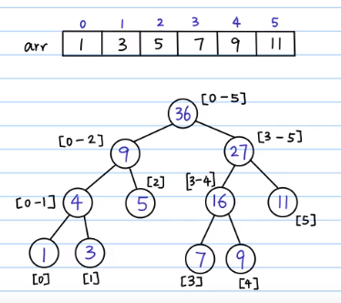
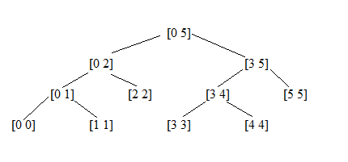

# 线段树

（Segment Tree）

一种堆式存储的二叉搜索树。

统一以下标 $1$ 开始，$0$ 做哨兵，尾部多余的做填充结点。

递归和非递归代码所建的树不一样，填充结点的分布也不同，要注意。

- 线段树（递归版）

	一般的线段树。

- ZKW 线段树（迭代版）

	ZKW 线段树在常数和空间上更具优势，也更易实现，但适用场景没有一般线段树多。

本笔记以 RMQ 问题，即区间和为例。（注意，RMQ 问题的最优解是 ST 表）

## 总览

### 功能

具有区间属性的大量操作。

- 单点查询（zkw 可直接通过计算下标直接得到结果）
- 单点更新（zkw 可直接通过计算下标更新叶结点，但也要更新祖先）
- 区间查询
- 区间更新（必须使用标记，否则速度会退化）

- 区分
	- 递归查询时要下推标记。
	- 非递归查询时要上推标记。(zkw)

### 效率

- 设原始数据个数为 $N$ 。
- 默认有标记。

| 分类       | 单点查询    | 单点更新    | 区间查询    | 区间更新    | 空间    |
| ---------- | ----------- | ----------- | ----------- | ----------- | ------- |
| 线段树     | $O(\log n)$ | $O(\log n)$ | $O(\log n)$ | $O(\log n)$ | $O(4N)$ |
| ZKW 线段树 | $O(1)$      | $O(\log n)$ | $O(\log n)$ | $O(\log n)$ | $O(2N)$ |

### 空间问题

@正月点灯笼

#### 一般线段树（递归）

其是递归建树，要开 $4N$ 的空间。

假设我们有数组 $[1, 3, 5, 7, 9, 11]$，这种方法会生成如下的树：



这棵树与完全二叉树较为相似（但不是完全二叉树，$5$ 的下方无结点），除了最后一层之外其他层都是满的。由于树的最底层并不保证从左到右依次填充，用数组存储的时候需要对如例子中值为 $5$ 的结点留出左右子树的位置，从而保证值为 $16$ 的结点仍然可以通过 $2i,2i +1$ 的下标跳动方式访问到左右子树。故我们至少要将数组开到最底层“填充至完全二叉树“的长度，而通常提到的 $4N$ 是表示满二叉树的数组，即为值为 $11$ 的结点也留出了左右子树的空位。

#### zkw 线段树（迭代）

同样对于数组 $1, 3, 5, 7, 9, 11$，若使用计算的起始位置方法会生成如下的树：

```c++
         36
       /    \
      32      4
    /   \    / \
   12    20  1  3
  / \   /  \
 5   7  9  11
```


这种方法将原数组填充至树数组的后缀部分，改变了叶子结点从左到右的顺序，但填充成了完全二叉树。从而只要开 $2N$ 的数组就可以了。（但需要头尾留下哨兵空间）


## 线段树（递归版）

### 示意图

对于原数据区间下标 $a,b$，线段树中的每一个非叶子结点 $[a,b]$，它的左儿子表示的区间为 $[a,\lfloor {a+b \over 2} \rfloor]$，右儿子表示的区间为 $[\lfloor {a+b \over 2} \rfloor + 1,b]$ 。因此线段树是平衡二叉树，叶子结点数目为 $N$，即整个原数据的长度。



叶子结点存储原始数据区间，其上的祖先存储所表示范围的某种区间属性。

### 原理

- 初始化

	递归，划分区间建树。

- 单点查询

	可由区间查询实现。

- 单点更新

	可由区间更新实现。

- 区间查询

	不断向下，区间分割，取表示各区间的结点的信息。（下推标记）

- 区间更新

	不断向下，区间分割，将改动作用于表示各区间的结点。

详见代码。

没有添加标记的线段树，在区间更新时要更新每个叶子结点，复杂度过高。

### 懒标记

（Lazy 标记，Cover 标记，延迟标记）

**lazy 标记用于解决区间更新的复杂度问题，以此为代价，查询也要考虑标记。**

- 当更新区间时，不更新实际数据，只将其变化通过 lazy 记录下来。
- 等到下次要查询的时候，再查看标记并更新标记。
- 使用 lazy 标记时对单点更新也要使用 lazy 标记。
- 注意填充结点也有 lazy 结点。

### 下推标记
（pushDown）

**查询时**从上往下不断下推标记，使标记最终作用于待查找的点和区间。

```c++
void pushDown( int p ) {
    if ( lazy[p] != 0 ) {   // 如果当前被标记过
        lazy[p<<1] += lazy[p];   // 改变左孩子标记
        lazy[p<<1|1] += lazy[p];   // 改变右孩子标记
        lazy[p] = 0;   // 标记复位
    }
    return ;
}
```

**要注意综合标记作用的结点个数。**

### 代码

递归所建的树所有操作均要递归，因为其准确下标不好直接计算。（注意区间比较与变动）

```c++
#include<cstdio>
#include<iostream>

// 以下区间均指左闭右闭区间，区间都是指原始数据上的区间

const int N = 10;
int data[N+5];   // 1 开始
int tree[4*N+5];
int lazy[4*N+5];

// 建树
void build( int p, int l, int r ) {   // p 为子树根结点， l 为左区间端点， r 为右区间端点
    if ( l == r ) {   // 左右区间端点相等时代表已经到了叶子结点
        tree[p] = data[l];   // 依次将原始数据赋给叶子结点, 注意两个下标
        return;
    }
    int mid = ( l + r ) >> 1;
    build( p<<1, l, mid );   // 往左子树
    build( p<<1|1, mid+1, r );   // 往右子树，注意 mid+1
    tree[p] = tree[p<<1] + tree[p<<1|1];   // 父结点的值等于两孩子的和
}

// 下推标记
void pushDown( int p ) {
    if ( lazy[p] != 0 ) {   // 如果当前被标记过
        lazy[p<<1] += lazy[p];   // 改变左孩子标记，注意不要漏了原标记
        lazy[p<<1|1] += lazy[p];   // 改变右孩子标记
        lazy[p] = 0;   // 标记复位
    }
    return ;
}

// 单点更新：
// 使用 lazy 标记时对单点更新也要使用 lazy 标记，可以利用区间更新来进行单点更新。
// 以下是没有 lazy 标记时的情形
void update( int p, int l, int r, int x, int num ) {   // x 为目标位置， num 为更新的数据。
    if ( l == r ) {   // 到达叶子结点，更新数据
        tree[p] = num;   // 可写为：tree[p] += num （num 正为增加，负为减少）等用作其它用途。
        return;
    }
    int mid = ( l + r ) >> 1;
    if ( x <= mid ) {   // 注意等号
        update( p<<1, l, mid, x, num );   // 往左子树
    } else {
        update( p<<1|1, mid+1, r, x, num );   // 往右子树，注意 mid+1
    }
    tree[p] = tree[p<<1] + tree[p<<1|1];   // 更新祖先信息
    /*   如果 num 是加减的数，可以写成这样
        tree[p] += num;
    */
}

// 区间查询。单点查询时将 l 与 r 指定相等即可。
int find( int p, int l, int r, int x, int y ) {   // 找到存储 [x,y] 区间的信息的结点，l r 是正在搜索的区间
    if ( x <= l && r <= y ) {   // 如果 [l,r] 区间(即正在搜索的范围)包含要寻找的存储一部分信息的根结点，返回子树根结点的 sum 值
        return tree[p] + lazy[p]*(r-l+1);   // 考虑标记，要综合标记作用的结点个数。
    }
    pushDown( p );   // 下推标记
    int mid = ( l + r ) >> 1;   // 下方都与 mid 比较。    缩小搜索范围。
    if ( y <= mid ) {   // 说明区间在左子树
        return find( p<<1, l, mid, x, y );
    } else if ( x > mid ) {   // 说明区间在右子树
        return find( p<<1|1, mid+1, r, x, y );   // 注意 mid 加一
    } else {   // [x,y] 横跨 mid，分两段继续寻找。 此处必然是横跨，不可能是在一个子树中，因为其已经被计算过返回了值
                // 此时要将 x，y 进行改变
        return find( p<<1, l, mid, x, mid ) + find( p<<1|1, mid+1, r, mid+1, y );   // 注意 x, y 参数的变换
    }
}

// 区间更新。  代码直接对区间查询做小部分修改即可
void updateXY( int p, int l, int r, int x, int y, int add ) {   // 此处以对区间每个数都加 add 为例
    if ( x <= l && r <= y ) {
        lazy[p] += add;   // 对 lazy 数组进行操作
        return ;
    }
    int mid = ( l + r ) >> 1;
    if ( y <= mid ) {
        updateXY( p<<1, l, mid, x, y, add );
    } else if ( x > mid ) {
        updateXY( p<<1|1, mid+1, r, x, y, add );
    } else {
        updateXY( p<<1, l, mid, x, mid, add );
        updateXY( p<<1|1, mid+1, r, mid+1, y, add );
    }
    return ;
}

int main( void ) {
    for ( int i = 0; i < N; ++i ) {   // 构造原始数据
        data[i] = i;
    }
    build( 1, 1, N );
    std::cout<< find( 1, 1, N, 3, 5 ) <<std::endl;
    updateXY( 1, 1, N, 3, 5, 2 );
    updateXY( 1, 1, N, 4, 6, 1 );
    std::cout<< find( 1, 1, N, 3, 5 ) <<std::endl;

    return 0;
}
```


## ZKW 线段树

作者是清华大学的张昆玮，可参见 [PPT讲稿《统计的力量-线段树》](https://wenku.baidu.com/view/f27db60ee87101f69e319544.html)，命名为 zkw 线段树。

### 原理

- 初始化

	将原始数据依次放在叶子结点位置，然后倒序初始化各分支结点。

- 单点查询

	直接计算叶子结点的下标。

- 单点更新

	直接计算叶子结点的下标，更新。（上推标记）

- 区间查询

	不断向上取表示各区间的结点的信息。（上推标记）

- 区间更新

	不断向上将改动作用于表示各区间的结点。

详见代码。

### 叶子起始位置

zkw 必定是一颗完全二叉树。

#### 逻辑结构

起始位置映射到逻辑结构时，不一定都在最底层第一个，如下图，$1$ 就不是最底层第一个结点对于数组 $[1, 3, 5, 7, 9, 11]$。非递归方法会生成如下的树：

```
         36
       /    \
      32      4
    /   \    / \
   12    20  1  3
  / \   /  \
 5   7  9  11
```

#### 计算方法

若原始数组有 $N$ 个数据，且树数组从下标 $1$ 开始，则树数组的末尾元素下标就是 $2N - 1$，叶子应有 $N$ 个，从而叶子起始下标为：$N$（如上图所示，使原始数据第一个元素（上图中的 1）可以不位于最底层，当要非递归区间查询时仍要开 4 倍空间。）

- 若一颗完全二叉树有 $N$ 个结点，且下标从 $1$ 开始，则第一个叶子结点的下标为 $\lfloor {N \over 2} \rfloor$ 。

### 区间查询


$3$ 到 $11$ 是要查询的区间，从其区间两端外的第一个结点出发，不断向上（蓝色圈）。

- 如果左边的蓝色是左孩子，则其右边的兄弟（红色圈）包含一部分要查询的区间属性。
- 如果右边的蓝色是右孩子，则其左边的兄弟包含一部分要查询的区间属性。
- 直到左右蓝色相撞或都到达根结点 $1$，先到 $1$ 的会再到 $0$，但 $0$ 位置不会引起变化，停止追溯。（若带标记，相撞仍需向上追溯直到根结点，以更新标记）
- 技巧
	- 左右兄弟之间下标转换直接加 1 减 1 即可。
	- 判断是否为左右孩子可根据下标奇偶，下标 $1$ 开始，偶数为左孩子，奇数为右孩子。

左右蓝色所在的层，最多相差一层，此时仍可正常运作，如下图查询 叶子 $1$ 到 叶子 $7$ 之间时：

```
         36
       /    \
      32      4
    /   \    / \
   12    20  1  3
  / \   /  \
 5   7  9  11
```

待标记的区间查询和修改要注意标记意义，注意是否需要乘以**作用叶子个数**。

### 上推标记

（pushUp）

- **查询时**，将当前结点祖先路径上所有有效的标记综合在一起，并返回综合值（因为上方标记与下方标记覆盖且共同作用）
- 发现一个标记就要上推一次，因为对于某个位置，各层标记的效果可以叠加。

```c++
// 返回该结点祖先路径上所有有效 lazy 的综合 
int pushUp( int p ) {   // 一但发现一个有效标记，立刻向上继续查找标记，并综合到一起
    int ans = 0;
    for ( int i = p; i >= 1; i >>= 1 ) {
        if ( lazy[i] != 0 ) {
            ans += lazy[i];
        }
    }
    return ans;
}
```

### 简易写法

- 一种查询终止条件的简易写法 `i ^ j ^ 1`，运用**异或**，$i,  j$ 分别是左右蓝色下标，`i ^ j ^ 1` 则代表：
	- $i,j$ 都到达根结点（$1$ 就是根结点下标）时
	- 即将相撞时（即将要 $i == j$ 时，也即父亲相同时）
- 满足以上两种时会退出循环（即向上的过程）

带标记的区间查询代码：

```c++
// 有标记的区间查询
int findLazy( int x, int y) {
    int sum = 0;
    int count = 1;   // 该位置代表了多少个叶子的属性
    for ( int i = N+x-2, j = N+y; i^j^1; i >>= 1, j >>= 1, count <<= 1 ) {
        // printf("i = %d, j = %d, i^j = %d, i^j^1 = %d\n", i, j, i^j, i^j^1);   // 帮助理解 i^j^1 的语句
        if ( !(i&1) ) {   // 左右不必都一直追溯到根结点，相撞就退出了
            sum += tree[i+1] + pushUp(i+1) * count;
        }
        if ( j&1 ) {
            sum += tree[j-1] + pushUp(j-1) * count;
        }
    }
    return sum;
}
```

### 代码

```c++
#include<cstdio>
#include<iostream>

const int N = 10;   // 原数组所含元素个数
int data[N+5];
int tree[2*N+5];
int lazy[2*N+5];

void build( void ) {
    for ( int i = 0; i < N; ++i ) {   // 初始化叶结点
        tree[N+i] = data[i+1];   // 下标从 1 开始
    }
    for ( int i = N-1; i >= 1; --i ) {   // 初始化上层结点。 注意 N-1。 一定要倒序，这样写起来比较简洁又高效
        tree[i] = tree[i<<1] + tree[i<<1|1];
    }
    return ;
}

// 无标记的单点更新，x 为原始数组中的目标位置，num 更新的数据
void update( int x, int num ) {
    data[x] = num;
    tree[N+x-1] = num;   // 直接修改
    for ( int i = (N+x-1)>>1; i >= 1; i >>= 1 ) {   // 从其父亲开始不断更新祖先
        tree[i] = tree[i<<1] + tree[i<<1|1];   // 为避免判断其为左孩子还是右孩子，故从父亲计算两个孩子
    }
    /*   若 num 是加减的数，更新可写成下面这样。也可求出增加的数额后采用以下方法。
        for ( int i = N+x; i >= 1; i >>= 1 ) {   // 直接从当前结点往祖先更新
            tree[i] += num;
        }
    */
   return ;
}

// 单点查询较简单，直接计算下标即可，略

// 无标记的区间查询
int find( int x, int y ) {   // x，y 为待查找的区间
    int ans = 0;
    // 以下的位运算仅在树从下标 1 开始时有效，从 0 开始要做更改。
    // i，j 分别为所查询区间两端外的第一个结点。如果没有标记则到两者父亲相同时循环终止，如果有标记，需要一直追溯的根结点不断更新标记
    int i = N+x-2, j = N+y;   // 端点外，分别 -1，+1
    for ( ; i^j^1; i >>= 1, j >>= 1 ) {
        if ( !(i&1) ) {
            ans += tree[i+1];   // 添加右孩子代表的属性    // 以结点意义不同要作变化
        }
        if ( j&1 ) {
            ans += tree[j-1];   // 添加左孩子代表的属性
        }
    }
    return ans;
}

// 返回该结点祖先路径上所有有效 lazy 的综合 
int pushUp( int p ) {   // 一但发现一个有效标记，立刻向上继续查找标记，并综合到一起
    int ans = 0;
    for ( int i = p; i >= 1; i >>= 1 ) {
        if ( lazy[i] != 0 ) {
            ans += lazy[i];
        }
    }
    return ans;
}

// 有标记的区间查询
int findLazy( int x, int y) {
    int sum = 0;
    int count = 1;   // 该位置代表了多少个叶子的属性
    for ( int i = N+x-2, j = N+y; i^j^1; i >>= 1, j >>= 1, count <<= 1 ) {
        // printf("i = %d, j = %d, i^j = %d, i^j^1 = %d\n", i, j, i^j, i^j^1);   // 帮助理解 i^j^1 的语句
        if ( !(i&1) ) {   // 左右不必都一直追溯到根结点，相撞就退出了
            sum += tree[i+1] + pushUp(i+1) * count;
        }
        if ( j&1 ) {
            sum += tree[j-1] + pushUp(j-1) * count;
        }
    }
    return sum;
}

// 有标记的区间更新，与有标记的区间查询相似
void updateXY( int x, int y, int add ) {   // 以区间都增加或减少一个数为例
    for ( int i = N+x-2, j = N+y; i^j^1; i >>= 1, j >>= 1 ) {
        if ( !(i&1) ) {
            lazy[i+1] += add;
        }
        if ( j&1 ) {
            lazy[j-1] += add;
        }
    }
}

int main( void ) {
    for ( int i = 1; i <= N; ++i ) {   // 原数组
        data[i] = i;
    }   
    build();
    for ( int i = 1; i <= 2*N+1; ++i ) {
        std::cout<< tree[i] <<" ";
    }
    std::cout<<"\n"<< findLazy( 1, 3 ) <<std::endl;
    std::cout<< findLazy( 1, 7 ) <<std::endl;   // 相差一层情况的测试
    std::cout<< findLazy( 4, 5 ) <<std::endl;   // 提早相撞情况的测试
    updateXY(1, 3, 2);
    std::cout<< findLazy( 1, 3 ) <<std::endl;   // 注意这种查询区间两段不在同一层上的情况，仍然可行
    updateXY(1, 3, 1);
    std::cout<< findLazy( 1, 3 ) <<std::endl;

    updateXY(1, 1, 1);   // 区间更新用作单点更新测试
    std::cout<< findLazy( 1, 1 ) <<std::endl;   // 区间查询用作单点查询测试

    return 0;
}
```

