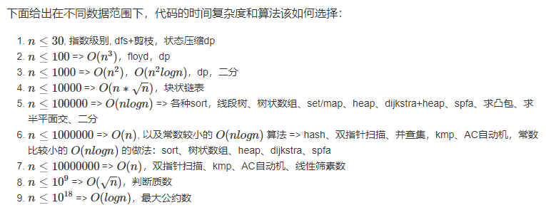
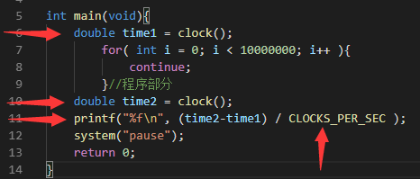
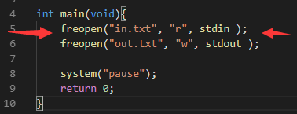
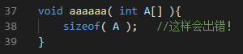
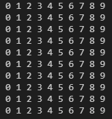
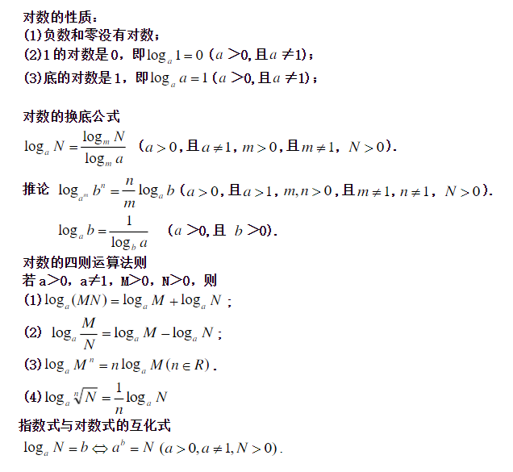

# 算法技巧及注意事项

## 常见缩写术语

- 通过（ accepted， AC ）
- 答案错（ Wrong Answer，WA ）
- 编译错（Compile Error，CE）
- 运行错（ Runtime Error，RE ）
- 输出格式错（ Presentation Error，PE ）
- 超时（ Time Limit Exceeded，TLE ）
- 超内存（Memory Limit Exceed，MLE）

## 一些思想

（以下不计严格的全局顺序，但具有局部顺序）

- 穷举
枚举所有情况，枚举部分情况，按一定规则枚举情况。

- 权重
依据权重迭代简化算法

- 切割
将内在逻辑较复杂的形状切割为内在逻辑较简单的形状：如一维数组，矩形，三角形等。
例如将矩阵切割为一行一行的一维数组而解决问题。

- 二分
在一段范围内有多种可能性，并能够确定二分后的方向（往哪个区间深入），考虑二分试验其可能性、（在一百两百内，顺序查找是优于二分查找的）

- 分治
将大问题划分为若干小问题，然后合并得到最终解。
（要特别注意局部最优解的合并不是全局最优解的情况）
（切割偏图形，分治更宽泛）

- 打表
  1、程序内打表，如果打表复杂度大则不可用。
  2、外部打表，然后将答案复制到源代码中，注意要用逗号分隔，方便直接赋值。（记得开氧气）
  3、对于一些需要重复计算等的关系，可以打表先存储好
  4、对于一些规律不好表达的操作可以直接用数字矩阵代替
  5、打表不一定要将答案全部打出，也可只打出部分答案，但要使其余答案可根据其快速推出。

- 公式
公式推导化简，简化运算，使用转换为对数运算等手段防止溢出等。

- 数论
数学方法变换问题，从而化简、预处理或直接求值。

- 博弈
博弈论，对抗式的最优解。

- 反序
将正序难解的问题，逆序求解，可运用栈。
反序不只是顺序的反转，也可以是关系（映射）的反转。

- 迭代
迭代比较宽泛，大致是递归的逆形式，用循环实现的都能叫迭代。

- 递归、回溯
从性质相似的大规模问题逐步到小规模问题，伴有回溯。

- 搜索
以各种顺序搜索状态树（解答树），状态图。

- 剪枝
想办法减少搜索的状态数。
有时虽然贪心（或其它思路）是错的，但却可以为我们快速求出一个较优解，从而用于剪枝。

- 记忆化
对重叠子问题进行记忆化。
剪枝与记忆化是搜索算法强有力的武器。

- 离散化
对于连续量，找出其“最小”尺度，依据其中点等特征点进行操作。
（注意可以有多个不同的“最小”尺度）
可对大范围数据的“下标”去重，并赋予新的下标。

- 贪心
由小而大，逐步扩大局部最优解规模。
只适用于局部最优解合并后是全局最优解的问题。
当局部最优解（即较优解）有用处时，也可利用。

- 递推
从性质相似的小规模问题逐步到大规模问题。不存储状态，无最优子结构。

- 动规
状态递增，具有最优子结构，转态转移较为灵活。
要注意递推与动规的区别。

- 图论
架构状态关系图（网），以图论角度思考问题，动规的超集。

- 映射
建立哈希关系、映射关系。可用于去重，枚举等。
常见方式为：排列康托展开，状态压缩，键值映射，集合去重。

- 固定（基准点）
对于有规律的需要不断移动的图形，可考虑以其一点作为基准点，再给出其它数据，即确定一个图形。

- 分解固定
将一个难以求解的两端不固定的问题  转化为两个容易求解的一端固定的问题。
当然也可以对多端问题进行固定操作。
（基准点不会增加问题数，分解固定会增加问题数，但问题体量会变小）

- 抽样规律
对于肯定有规律的题，先暴力求出少部分解，然后找规律。

- 重构
将复杂过程构成的问题完全拆解，寻找快捷的组合方法。
尽管重构后可能有一部分速度损失，但是降低了思维难度，提高了代码的可复用性。
就像可以靠一次次旋转复原魔方，但也可以靠拆解后组装复原魔方。

- 换位
对于复杂过程，如果变动身份不影响状态或结果，那么考虑交换身份或其它变动。

- 降维（升维）
将低维解决问题的方案进行组合，穷举等解决高维问题。
也可以说是把低维方法升维，但要注意，可以是在非整数的维度间转换。

- 拟合
极其难以确定数据大致范围时，对原数据进行变换，按浮动，试错（是否变好，是否变差）等方式看能否导出一定的范围。

- 特性数据问题的优化存在性
一个算法若能解决一个数据具有特殊性的问题，且其对于数据无特殊性时也适用，说明可能存在解决这个问题的更高效率的数据结构或算法。
比如左式堆的合并操作。

- 意义扭转
  在能明确所有自变量与因变量的范围时，可考虑扭转意义，分析优化。
  例：f(x, y) == z 可扭转为 f(x, z) == y 或 f(y, z) == x 等
  常用于动态规划。

- 重复元

  对于重复过程，即对重复元进行重复的过程，可能得出结果只需开始与结束重复元，可能一定个数的重复元会使得状态复位，如此，依据重复元执行的性质解决问题，可模拟小部分结果，观察规律。

## 算法分析

O （大写 O 欧（英文字母））：最坏情况
Θ （大写 Theta 西塔）：平均情况
Ω （大写 Omega 欧米伽）：最好情况

- 常数
	常数无法确定，我们只能比较其的相对大小关系。
	
- 倍数
常数虽无法确定，但我们可以给出一个大概的倍数，用其更准确地描述时间复杂度及代码与原始数据的相关性。

- 常见错误点
数字溢出，下标越界，时间超时，空间爆炸。

### 时间复杂度分析

一般时间限制 1 秒

#### 状态量分析

1 秒内计算小状态数一般在 1 到 10 亿左右，即 $10^7$、$10^8$  量级。
（尽量不要达到 10 亿，即 10^9。状态越大越要尽量降低状态数 ）

2^5 = 32
2^6 = 64
2^7 = 128
2^8 = 256
2^9 = 512
（估计值比实际值大，保证不会超时）
2^10 = 1024（约 1050，1.05 x 10^3）
2^20 = 1048576（约 105 万，1.05 x 10^6）
2^30 = 1073741824（约 11 亿，1.1 x 10^9）
2^40 = 1099511627776（约 1.1 万亿， 1.1 x 10^12 ）
2^50 = 1125899906842624（约 1200 万亿，1.2 x 10^15）

规律：
三次方的增加是因为 2^10 = 1024 接近 1000
科学计数底数近似值：起始近似 1
科学计数指数近似值：
10 次方 -> 3 x 1 = 3。20 次方 -> 3 x 2 = 6。30 次方 ->  3 x 3 = 9。

#### 递归时间复杂度函数的分析（一般用状态数考虑即可）

主定理：
一般求状态数就可以解决递归的效率问题，但如果要求较精确的时间复杂度表达式，就需要用主定理。
状态数是一个数，而时间复杂度是一个函数。
（主定理不是很重要，内容请使用搜索引擎）

#### 状态量分析的补充

光看状态量是不够的，还要看状态的“大小”，才能准确估计时间。

但出题人在出题时会根据解法的状态量来调整数据，此时并未参考状态大小，所以我们在估算时也可以适当忽略状态大小。

### 空间复杂度分析

（b(bit)，B(byte)，K(KB)，M，G，T，P）

（估计值比实际值小，保证不会爆空间）
一个 int 4 字节，1 M 有 262144 个 int（约 250000 个，即 二十五万 个）
（即 1 M 有约 一百万 字节）
10 M 约 $2.5\times 10^6$ 个 int，即 250 万个
100 M 约 $2.5\times 10^7$ 个 int，即 2500 万个

一百万个 int 需要 4 M
一千万 个 int 需要约 40 M
一亿 个 int 需要约 400 M

递归与栈空间（一般不必精确考虑爆栈）：
栈存储参数以及局部变量，空间一般 1 ~ 8 M

### 数据类型范围

#### 常用类型


简略：
（估计值比实际值小，保证不会溢出）
int --> 正负 21 亿。
(unsigned int 0 到 42 亿)
long long --> 2^63 = 922 3372 0368 5477 5808 
--> 正负 922 万万亿（正负 9.22 x 10^18）

重要估算技巧：可根据位宽推范围（2^10 约等于 10^3）

$32$ 位（$4$ 字节）有符号 int 最多能存储 $12!$。

$64$ 位（$8$ 字节）有符号 long long 最多能存储 $19!$


#### C++ 大整数类型

支持正负 1.7 x 10^38 的范围。

可一定程度上作为高精度的替代。
64 位以下的评测机可能无法识别。
有些时候可能不允许使用。

```c++
__int128_t  ：128 位 int, 注意：正负 1.7 x 10^38
__uint128_t ：无符号 128 位 int,
（有些时候写作 __int128，依具体环境而定）
```

该类型与 int 使用方法类似，但无法直接使用 printf 和 cout 等系统函数输入输出，需要手写。


注：上图中，直接赋值超过范围的字面量会出错。红框正好 38 个数。

实际上，对于 int128 的输出输出，如果输入或最终结果在 long long 内：

- 可以用 long long 输入，然后赋值给 int128。
- 可以将 int128 赋值给 long long，然后输出。

## 数据范围反推算法

@闫学灿



（上图只是部分算法，用于举例）

根据数据范围，很多时候都可选取“接近但不超过”的复杂度的算法。

推导出最高允许的复杂度后，必定存在小于等于该复杂度的算法，避免把一个简单问题想得太难。

## C++ 读入输出优化

```c++
std::ios_base::sync_with_stdio(false);
std::cin.tie(NULL);
std::cout.tie(NULL);
```

## 编译优化选项

### O1

在不影响编译速度的前提下，尽量采用一些优化算法降低代码大小和可执行代码的运行速度

### O2（氧气）

该优化选项会牺牲部分编译速度，除了执行-O1所执行的所有优化之外，还会采用几乎所有的目标配置支持的优化算法，用以提高目标代码的运行速度。

### O3（臭氧）

该选项除了执行-O2所有的优化选项之外，一般都是采取很多向量化算法，提高代码的并行执行程度，利用现代CPU中的流水线，Cache 等。

### 说明

上诉编译优化选项只占一部分，但是较常用。
在不开启优化时，代码的编译以利于调试为目的，开启后，以优化为目的。
（默认是 O0，即一般编译）
STL 等容器提供了大量抽象接口，在不开启 O2 优化的情况下，几乎全部都是函数调用，开启后，由于内联函数会被内联等各种措施，抽象降低，速度提升。
在大量利用 STL 的程序中开启优化，对一般程序可能会有负优化。
一般开 O2 优化，当程序中有大量最值比较等可并行的操作时，开 O3 优化。

若比赛无特殊要求，一般不开优化。

==对于填空题，请一定把 O2 优化打开。==

### 开启优化的预编译指令

```c++
程序开头键入：
#pragma GCC optimize(1)
或
#pragma GCC optimize(2)
或
#pragma GCC optimize(3)

也可对编译器输入编译命令：-O1  -O2  -O3
```

## 常用标识符

| 标识符 | 意义 |
|-|-|
| MAXN, MAXM | 最大N，最大M |
| max, min | 最大值，最小值 |
| Case, T | 样例数 |
| i, j, k, l, m, n, ii, jj, kk | 循环变量 |
| L, R | 左闭右闭区间 |
| lo, hi | 左闭右开区间（右为超尾值） |
| ch | 一个字符 |
| t，temp | 临时变量 |
| res | 存储变量（reserve） |
| ans | 结果（answer） |
| dp, f | 动规数组 |
| bag | 背包数组 |
| check | 检查函数 |
| V, E | 顶点，边 |
| Node | 结点 |
| u, v | 边的起点与终点 |
| s, t | 图的源点与终点 |
| x | 某个元素 |
| p | 一个指针（pointer） |
| rank | 秩（代表某种具有顺序的规则） |
| pos | 某个位置（position） |
| exist | 存在 |
| save，memory | 保存，记忆 |
| deep | 深度 |
| count, cnt | 计数 |
| arr, nums | 数组，数字数组 |
| arrA, arrB$\ldots$ | 数组 A，数组 B（注意泛化） |
| sta, que, deq, pQue, se, ma | 栈，队列，双端队列，优先队列，集合，关联集合（map） |
| tree，heap，graph | 树，堆，关系图 |
| map，metrix | 地图，矩阵 |
| hash | 哈希函数，哈希映射 |
| inf | 无穷 |
| w(weight) | 权值 |
| v(value)，cost | 价值，花费 |

## 重要事项

### 常用基本头文件

```c++
<iostream>
<cstdio>
<algorithm>
<cmath>
<cstring>
<cctype>
```

### 程序时间计算

头文件：<ctime>
函数：clock ( )
常量：CLOCKS_PER_SEC（即 1000） （除以其将结果转化为以秒为单位）



这个时间是本地机时间，可在比对算法时使用。

### 重定向式文件输入输出

在 main 函数开头添加：
头文件：```<cstdio>```
函数：freopen ( )



所有输入输出函数都将变为使用文件
（使用后无法恢复重定向，只有重新重定向到命令行）
不过要注意比赛是否禁止使用重定向方式访问文件

### 数组初始化，数组批量值移动

头文件：```<cstring>```
函数：memset ( ),   memcpy ( )


memset 对 bool 类型可用:


memset 对 char 可赋一字节内的任何值
注意：
1、memset 函数按 字节 对内存块进行初始化，所以尽量不要用它将 int 数组初始化为 0 和 -1 (int：11111111 11111111 11111111 11111111) 之外的其他值
2、memset 函数对整型二维数组也有效，memcpy 函数只对一维数组使用
3、注意：为保证不出错，以上函数只对整型数组使用。
4、注意：以下传入的形参会出错



重要补充（最好只用 0 和 -1）：

如果是 int 数组：
int 类型范围：-2147483648～2147483647
127：（极大值）
全部初始化为int的较大值，即 2139062143 ( int 最大值为 2147483647 )；
128：（极小值）
全部初始化为一个很小的数，比int最小值略大，为 -2139062144。
如果是 double 数组：
double 类似范围为：-1.7e+308～1.7e+308
127：全部初始化为一个很大的数 1.38e+306；
0：全部初始化为 0；
128：全部初始化为一个很小的数 -2.93e+306。

### 二维数组的坐标


红色箭头指向横坐标 X 增大的方向（装数组的数组）
绿色箭头指向纵坐标 Y 增大的方向（装元素的数组）



概念上可以按一般坐标系处理。

### 对数运算

有时候，可以将用科学记数法表示的数直接转化为字符串，以避免溢出。
```<cmath>``` 数学函数库中： log() 以 e 为底，log10() 以10 为底
可以将导致溢出的相关过程做 log 处理，以避免溢出。



### STL 中的一些注意点

当数组空间不确定时，使用 STL。

快速排序（quick_sort）适用于数据较随机的场合；（不稳定）
归并排序（stable_sort）适用于数据较多部分有序的场合。（稳定）

二路归并函数： merge()

二分查找函数：
前提：数组单调不降，否则出错。（默认 < 运算符）
upper_bound()
返回第一个**大于**被查找数的那个数的地址。
可与数组首地址相减得到下标，也可直接指针。
lower_bound()
返回第一个**大于等于**被查找数的地址。
可与数组首地址相减得到下标，也可直接指针。

得到一个指向数组元素的指针后，要得出它的下标，应该与整体数组（数组名）作差，而不是与部分数组段的开头作差。

自写的二分查找函数注意参考二分查找笔记。

建议：
左闭右开区间，使用 lo 和 hi 作为标识符
左闭右闭区间，使用 L 和 R 作为标识符

nth_element() 算法，属于 algorithm 库。
nth_element(lo, nth, hi)
其中 nth 是分割点，使用该函数后，序列中 nth 前的元素都小于它，nth 后的元素都大于它（可自定义比较器作为第四个参数）
也就是说，使用该函数后，nth 的位置上的数，是其完全排序后应当存在于那个位置的数。
常可用于求第 k 小的数：nth_element(arr, arr+k, arr+n);
求第 k 大的数只需换位 n-k 即可：nth_element(arr, arr+n-k, arr+n);

### 溢出边界控制

乘积为例：

```c++
if (res <= MAX / number) {   //满足条件时说明 res * number 不会溢出
    res *= number
}
```

### 整数平方根精度问题

对于 `double sqrt(double x)`，double 的整数部分完全能容纳下 32 位的 int，因此一个 int 类型的 $n$，若 $\sqrt n$ 为整数，则对 $n$ 开平方根不会产生精度问题。

对于 long long，可以使用 `long double sqrtl(long double)`（C++ 11），也不会产生上述精度问题。

对于不确定场合，可以使用以下两种方法：

```c++
for (int i = 1; i * i <= n; ++i)   // A 版本，i * i 容易导致溢出
    
for (int i = 1; i <= n / i; ++i)   // B 版本，效率稍有不足
```

对于 $\sqrt n$ 为小数时，一般使用 $\sqrt n + 1$ 即可。

### 整数趋近

$\frac a b$ 上取整可写为：$\frac {a+b-1} b$ （天然下取整）。

例：

有 $\frac {n(n+1)} 2$ 个数分层分布如下：

```c++
1
1 2
1 2 3
1 2 3 4
...
1 2 3 4 ... n
```

问第 $x$ 个数在第几层？

可以使用二分，以下演示推公式：

有 $\frac {y(y+1)} 2 = x$，即 $y^2 + y - 2x = 0$，设定 $x,y$ 都为正整数，用求根公式解这个二次方程，有 $y = \frac {\sqrt {1 + 8x} - 1} 2$。

$y$ 的所有过程使用浮点数运算，此时 $\lfloor y \rfloor$ 即是 $x$ 所在层的上一层，$\lceil y \rceil$ 即是 $x$ 所在层的下一层。

考虑的 $8x$ 若容易溢出，则可进一步化简：$y = \frac {\sqrt {1 + 8x} - 1} 2 = \sqrt {\frac 1 4+2x} - \frac 1 2$。

#### 整数趋近的误差问题

使用上述公式下取整求上一层时，当 $x$ 恰好能进行整数运算时，无法得到正确的下或上取整结果。

此时得到的 $y$ 刚好是 $x$ 所在的层数，而不是上一层。

#### 解决办法

将得出的结果 $y$，进行反向验算即可。即判断是否有：$\frac {y\times(y+1)} 2 = x$，如果有，则特判正确即可。

#### 测试程序

```c++
#define ll long long

int main() {
    ll rank = 1;
    for (ll i = 1; i <= 10000; ++i) {   // 1000 层
        for (ll j = 1; j <= i; ++j, ++rank) {
            ll pos = (ll)(sqrt(0.25 + 2 * rank) - 0.5);
            // if (i - 1 != pos) {
            //     printf("Error: rank = %lld i = %lld pos = %lld\n", rank, i, pos);
            // }

            // if (i - 1 == pos || pos * (pos + 1) = 2 * rank) {   // 正确判断
            //     puts("Correct!");
            // }
            if (i - 1 != pos && pos * (pos + 1) != 2 * rank) {
                printf("Error: rank = %lld i = %lld pos = %lld\n", rank, i, pos);
            }
            if (rank > 100) {   // 前 100 个
                goto mark;
            }
        }
    }
    mark:
    puts("Correct!");
    return 0;
}
```

==一般不要用整数趋近，容易因考虑不全面或浮点数的精度误差导致错误，此时应该用对于整数准确性高的二分，查找判断层数。==

## 重要杂项

精确到个位的四舍五入：( int )( x + 0.5 ) 注意结果为整型

遇到浮点数要注意 EPS 的使用。

每行末尾以回车符结束，包括最后一行。一般行首不应有空格，注意判断行尾是否可以有多余空格，末尾是否可以有多余空格。另外，输出的每个数或字符串应该以单个空格隔开。

读取时注意一些字符的干扰，比如 e，可能会被当作科学计数法的标记而导致读入的数据错误

需要输入空格时使用 fgets 函数；（ fgets 会添加末尾空字符，在个数限制内，还会读入换行符，要注意换行符的处理）
其参数 n ，代表所有字符包括空字符一共 n 个

需要输入空格和特殊字符时，可以考虑使用 getchar 函数，特别是大量数据时，getchar() 的效率较高。

注意短路规则，C 与 C++ 都是如此

涉及 long long 的输入输出一般用 C++ 输出语句，
因为其输出控制符可能容易搞错（有时候是 %lld,  有时候 %64d）。
以下代码可以避开对 long long 输入控制符的选择：
scanf("%d", &n2 ); 
long long n = n2;
（但注意 n2 不能超过 int ）

scanf 返回成功输入的变量个数，无法再读入时，返回 0

计算完一组数据后，注意重置变量，以便下一组数据求解。

高精度中精确到小数点后 n 位时：
对小数点后第 n+1 位四舍五入，然后还要对前面所有位考虑满十进位

比较大的数组尽量声明在 main 函数外，否则可能无法运行（函数内的变量开辟在栈中，函数外的变量开辟在堆中，这样可以防止爆栈）

memcmp() 比较两个缓冲区


---

先检查是否越界，再取出值。

sscanf( ) 函数：从字符串输入 <cstdio>
sprintf( ) 函数：输出到字符串 <cstdio>
（可以声明一个缓冲字符数组 buf ）
strchr( ) 函数：在字符串中查找一个字符 <cstring>
strstr( ) 函数：在字符串中查找一个字符串 <cstring>
strlen( ) 函数：返回所含字符个数 <cstring>（不包空字符）
（strlen 返回的数字即是空字符的下标）

不要弄错 strlen 和 sizeof，对字符串操作时，sizeof 给出整体空间大小；stelen 给出字符串长度（亦从 0 开始时的末尾空字符的下标）

对于一次要给出多个重复过程答案的，可以考虑先在整个范围打表（答案表）

字典序不必比较长度，一趟扫描即可。

使用 str[ i ] != '\0' 并不能比 i < strlen( str ) 节约一次扫描的时间，使用系统函数是第一选择。

求时间日期等的差值，直接按进制数处理（各位乘以权值）并相减即可。

若要输出前导 $0$ 可：`printf("%03d", a);   // 宽度为 3，自动补前导 0` 。

保证结果不溢出的同时，要保证计算的中间结果不溢出。

常常可以化简公式来使操作简便。

对于一些多条命令输入，可构建命令结构体。

读入输出大量数据时，考虑快读快写。

求无限循环小数时，用除法竖式，当相同的余数再次出现时，说明小数开始循环。

goto 不能跨函数使用。

增加虚结点的同时，也增加了虚边。
