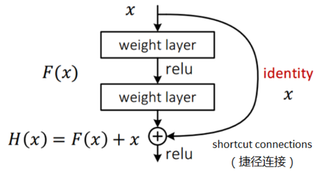

# ResNet

残差网络（Residual Network，ResNet）也叫深度残差网络（Deep Residual Network，DRN）

## 残差

- 误差（Error）

	观察值与真实值的差。（测量值与真实值间存在测量误差）

- 残差（Residual）

	预测值与真实值的差。

假设想要找一个 $x$ ，使得 $f(x) = b$ ，给定一个 $x$  的估计值 $x_0$ ，残差就是 $b-f(x_0)$ ，误差就是 $x - x_0$ 。

## 梯度退化

也叫梯度消失，即当神经网络的深度不断增大，训练（优化）越来越难，梯度逐渐衰减，从而准确度不增反降的现象。

## 恒等映射

对一个网络增加**恒等映射（Identity Mapping）**层（输入等于输出的层），模型效果不变。

只要能保持原网络效果，那么将恒等映射换为全连接层，则模型不会变坏；如果更换的层学习到一些知识，则模型会变好。

## 残差块

残差块一般由两层或三层（可以是全连接层，也可以是卷积层）组成，输入为 $x$ ，两层全连接层的输出为 $F(x)$ ，最终的残差块输出为 $H(x)$ （省略了 bias）：

本来的期望输出为 $F(x)$ ，添加恒等连接后的期望输出为 $H(x)$ ，原来的 $F(x) = H(x) - x$  即为残差。

恒等连接抑制了梯度退化，使得网络的可训练性增强。

## 模型集成

残差网络可以由模型集成来理解，在一个模型的基础上，综合其它模型的结果不会使得最终结果变得更坏。

