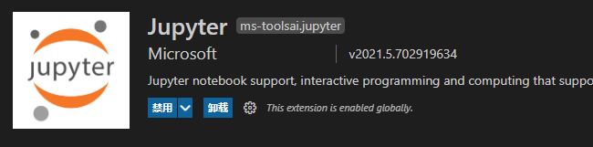
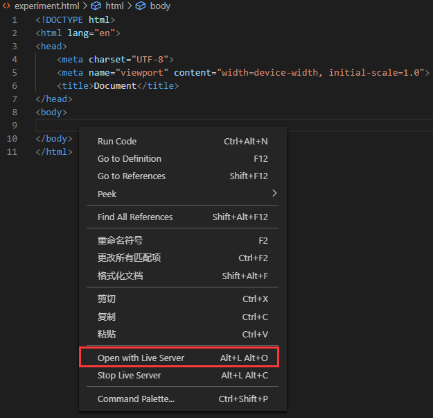
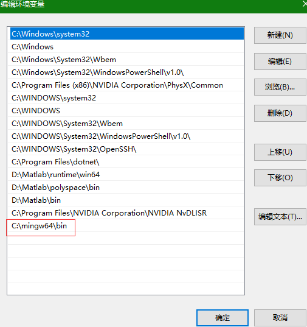
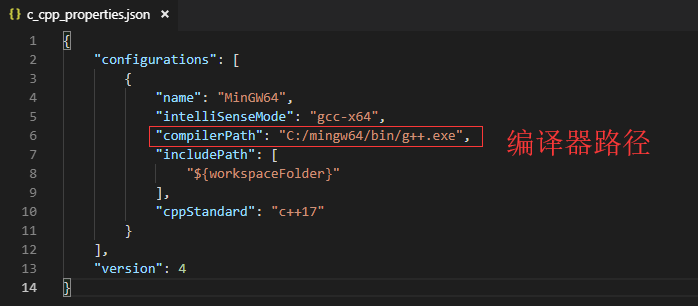
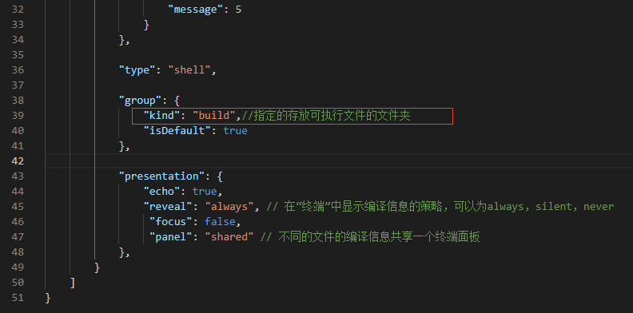

# VS Code

## 常用功能

### 打开命令面板

Ctrl + Shift + P

可输入信息搜索。

### 预览编辑器

在只能同时打开一个选项卡（编辑器时）：

此时单击打开的是预览编辑器，双击打开的才是正式编辑器，正式编辑器才能多开。

若要取消这个，去掉下图设置选项中的勾：


### 三键快捷键


形如以上的快捷键，意思是：

先按住 Ctrl+K，松开后再按 W

### 实时说明（建议）

Ctrl + Space ：主动触发建议

Ctrl + Shift + Space ：主动触发参数提示

在参数提示中，会显示函数重载版本及函数完整信息。


上图：出现红框内容时，可以按 Alt + 上下键 翻页

若 IDE 的代码提升不正常，则很有可能是当前函数体或内部语法没有写正确，

也有可能是需要重新启动 IDE……

### 函数注释

函数的注释说明应该写在函数声明处，这样就可以实时显示。

### 查看函数

- 查看函数定义
	- Ctrl + 左键单击
	- 光标定位到函数，按F12
- 返回跳转前的位置
	- Ctrl + Shift + 8
	- Alt + 左箭头
- 撤销返回跳转
  - Alt + 右箭头


### 终端控制


上图：即 esc 下方那个按键

常配合：`Ctrl + 1 or 2 or 3...` **聚焦**到第 `n` 个编辑器。


上两图，要先关闭数字小键盘输入才行。

## 常用插件

### 各种语言

#### C++


#### Python

Anaconda 插件已经下架，但其只是扩展包，仍可使用 Python 扩展，解释器路径选择 Conda 路径中的 Python 解释器即可。




Ctrl + Shift + P 打开命令面板，搜索即可使用 jupyter。（Python 扩展中本就包含了 Jupyter 扩展）

打开命令面板使用 `Pyhton: select interpreter` 即可切换 Conda 环境。

### 实用工具


### 前端插件

#### 自动刷新


修改代码保存后，可自动刷新浏览器显示页面。

打开文件时：



### 远程连接 Linux

Remote Development（用里面的 **Remote SSH**）


配置好后可以使用 VS Code 代码提示等功能，但编译要用命令行。

- 配置时遇到的一些问题
	- 密钥最好在 Git Bash 里用命令生成，有时用 cmd 不行，原因未知。
	- 权限问题，`.ssh/` 权限为 700，`authorized_keys` 权限为 600 。

### 数据库

SQLTools


- 可能遇到的问题
	- MySQL 8.0 改变了密码加密方式：更换协议，改变端口。（具体参见文档） 
	- 不支持 NaN：指定相关项的确切值。

## C++ 配置环境

新建文件夹

**要求路径全英文**

文件目录下会有 .code 文件夹，这是VScode设置的文件夹，如果没有就自己建，

**.code文件夹包含最重要的三个文件如下：**


如果没有，自己建，内部可以配置各种编译选项

**可能需要下载相应语言编译器**

建议把编译器文件夹放在C盘根目录下

**下载编译器后设置系统环境变量（步骤如下）：**

控制面板->系统（或电脑属性）->高级系统设置


环境变量


在系统变量 Path 中新建


新建编译器 `C:\mingw64\bin` 路径即可



**三个文件内容及意义如下：**



该文件不能添加注释，但可以修改参数

```json
{
    "configurations": [
        {
            "name": "MinGW64",
            "intelliSenseMode": "gcc-x64",
            "compilerPath": "C:/mingw64/bin/g++.exe",
            "includePath": [
                "${workspaceFolder}"
            ],
            "cppStandard": "c++17"
        }
    ],
    "version": 4
}
```

**编译器路径不正确，会导致找不到头文件等错误**


调试器路径注意不要错误

```json
{
    "version": "0.2.0",
    "configurations": [
        {
            "name": "C++ Launch (GDB)",                 // 配置名称，将会在启动配置的下拉菜单中显示
            "type": "cppdbg",                           // 配置类型，这里只能为cppdbg
            "request": "launch",                        // 请求配置类型，可以为launch（启动）或attach（附加）
            "targetArchitecture": "x64",                // 生成目标架构，一般为x86或x64
            "program": "${fileDirname}/build/${fileBasenameNoExtension}.exe", // 将要进行调试的程序的路径
            "args": [],                                 // 程序调试时传递给程序的命令行参数，一般设为空即可
            "stopAtEntry": false,                       // 设为true时程序将暂停在程序入口处，一般设置为false
            "cwd": "${workspaceRoot}",                  // 调试程序时的工作目录，一般为${workspaceRoot}
            "externalConsole": false,                    // 调试时是否显示控制台窗口，一般设置为true显示控制台
            "internalConsoleOptions": "neverOpen",      // 如果不设为neverOpen，调试时会跳到“调试控制台”选项卡",
            "MIMode": "gdb",                            // 指定连接的调试器
            "miDebuggerPath": "C:/mingw64/bin/gdb.exe", // 调试器路径
            "setupCommands": [
                {
                    "description": "Enable pretty-printing for GDB",
                    "text": "-enable-pretty-printing",
                    "ignoreFailures": false
                }
            ],
            "preLaunchTask": "Compile" 
        }
    ]
}
```




``` json
{
    "version": "2.0.0",
    "tasks": [
        {
            "label": "Compile",
            "command": "g++",
            "args": [
                "${file}",   // 指定编译源代码文件
                "-o",
                "${fileDirname}/build/${fileBasenameNoExtension}.exe", // 指定输出文件名，不加该参数则默认输出a.exe
                "-O0",      // 优化级别
                "-ggdb3",   // 生成和调试有关的信息
                "-Wall",    // 开启额外警告
                "-static-libgcc",   // 静态链接
                "-std=c++17",       // 使用c++17标准
                "-finput-charset=UTF-8",    //输入编译器文本编码 默认为UTF-8
                "-fexec-charset=GB18030",   //输出exe文件的编码
                "-D _USE_MATH_DEFINES"
            ],

            "problemMatcher": {
                "owner": "cpp",
                "fileLocation": [
                    "absolute",
                ],
                "pattern": {
                    "regexp": "^(.*):(\\d+):(\\d+):\\s+(warning|error):\\s+(.*)$",
                    "file": 1,
                    "line": 2,
                    "column": 3,
                    "severity": 4,
                    "message": 5
                }
            },

            "type": "shell",
            
            "group": {
                "kind": "build",//指定的存放可执行文件的文件夹
                "isDefault": true
            },

            "presentation": {
                "echo": true,
                "reveal": "always", // 在“终端”中显示编译信息的策略，可以为always，silent，never
                 "focus": false,
                 "panel": "shared" // 不同的文件的编译信息共享一个终端面板
            },
        }
    ]
}
```

**新建一个build文件夹（可在上述文件中指定），用于存放可执行文件**

**要运行代码，必须要配置插件，并且新建文件要注意后缀名**