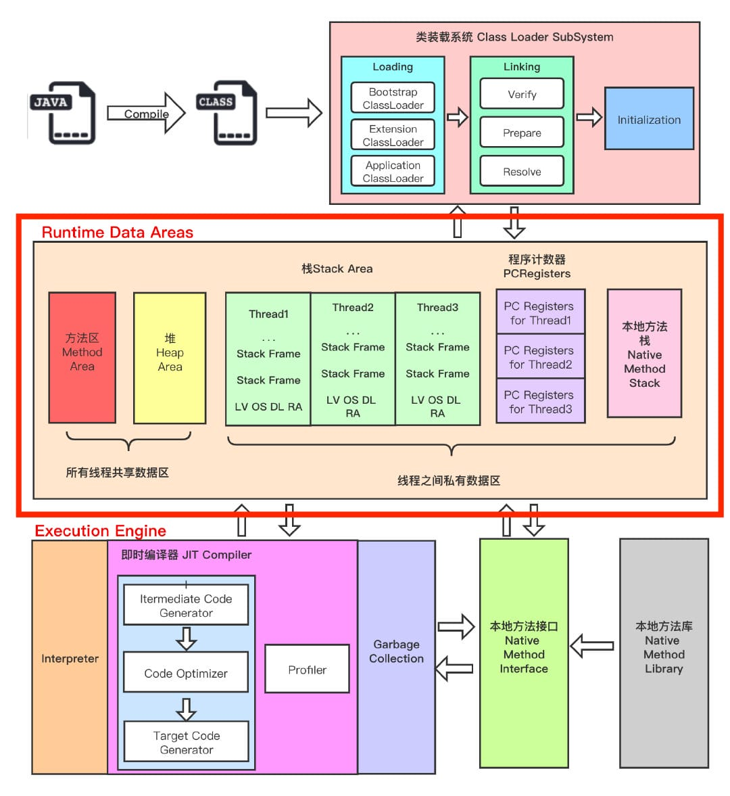
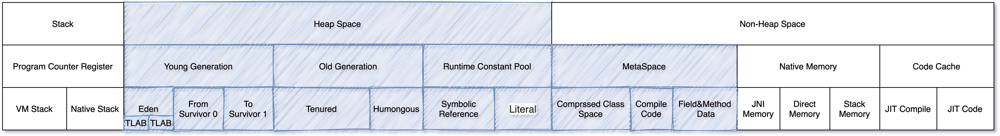
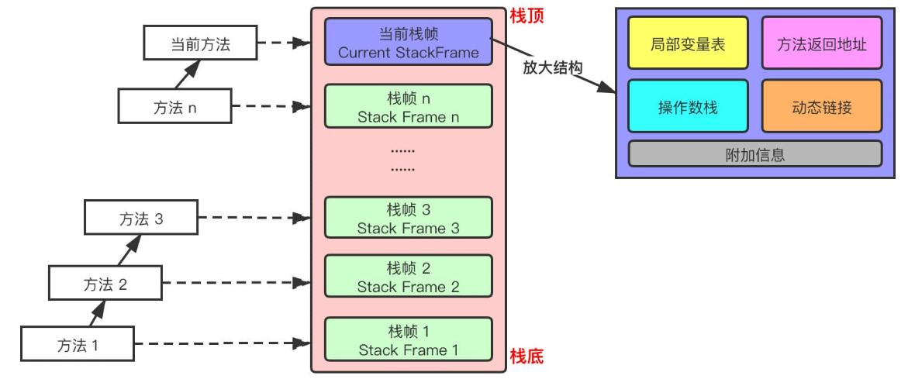
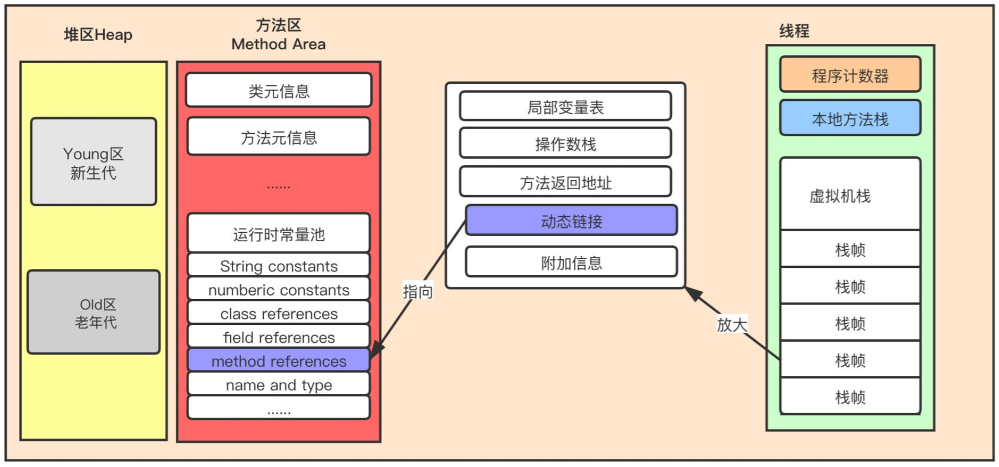
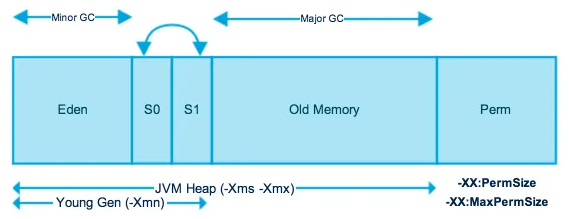
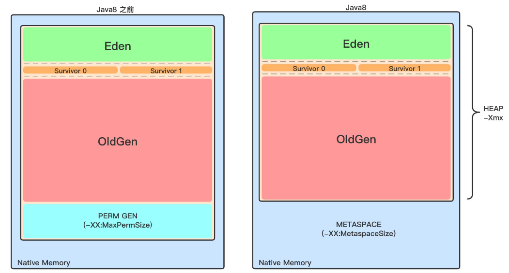

# JVM 内存结构

JVM 内存布局规定了 Java 在运行过程中内存申请、分配、管理的策略，保证了 JVM 的高效稳定运行。

不同的 JVM 对于内存的划分方式和管理机制存在着部分差异。

主要结构：

- class 文件
- 类装载系统（Class Loader SubSystem）
- 运行时数据区（Runtime Data Areas）
- 执行引擎（Execution Engine）

**下面这个图很重要：**



其中：

- 线程私有（线程开始则创建，线程结束则销毁，线程级生命周期）

	程序计数器、虚拟机栈、本地方法区

- 线程共享（JVM 启动则创建，JVM 退出则销毁，JVM 级生命周期）

	堆、方法区, 堆外内存（Java7的永久代或JDK8的元空间、代码缓存）



## 程序计数器

程序计数寄存器（Program Counter Register），并非是物理寄存器，叫程序计数器（或PC计数器或指令计数器）会更加贴切，JVM 中 PC 寄存器是对物理 PC 寄存器的抽象模拟。

程序计数器是一块较小的内存空间，可以看作是当前线程所执行的字节码的**行号指示器**，用来存储指向将要执行的下一条指令的地址，由执行引擎读取下一条指令。

CPU 会不停作线程切换，需要为每个线程都分配一个 PC 寄存器（线程私有），保证线程独立计算，不互相影响。

任何时间一个线程都只有一个方法在执行，也就是所谓的当前方法。如果当前线程正在执行的是 Java 方法，程序计数器记录的是 JVM 字节码指令地址，如果是执行 native 方法，则是未指定值（undefined）。

## 虚拟机栈

每个线程在创建的时候都会创建一个 Java 虚拟机栈（Java Virtual Machine Stacks），其内部每个栈帧（Stack Frame）对应一次 Java 方法调用。

- 方法执行开始则入栈（进栈/压栈），方法执行结束则出栈。
- 栈不存在垃圾回收问题。

栈空间异常：

- 采用固定大小的虚拟机栈时，如果线程请求分配的栈容量超过 Java 虚拟机栈允许的最大容量，Java 虚拟机将会抛出一个 **StackOverflowError** 异常。
- 采用动态扩展的虚拟机栈时，如果在尝试扩展的时候无法申请到足够的内存，或者在创建新的线程时没有足够的内存去创建对应的虚拟机栈，那 Java 虚拟机将会抛出一个 **OutOfMemoryError **异常。

可以通过参数`-Xss`来设置线程的最大栈空间，栈的大小直接决定了函数调用的最大可达深度。

### 栈帧

（Stack Frame）

栈帧是栈的存储单位。

- 在一条活动线程中，一个时间点上，只会有一个活动的栈帧。即只有当前正在执行的方法的栈帧（**栈顶栈帧**）是有效的，这个栈帧被称为**当前栈帧**（Current Frame），与当前栈帧对应的方法就是**当前方法**（Current Method），定义这个方法的类就是**当前类**（Current Class）
- 执行引擎运行的所有字节码指令只针对当前栈帧进行操作。
- 如果在该方法中调用了其他方法，对应的新的栈帧会被创建出来，放在栈的顶端，称为新的当前栈帧。
- Java 方法有两种返回函数的方式，一种是正常的函数返回，使用 return 指令，另一种是抛出异常，不管用哪种方式，都会导致栈帧被弹出。

每个栈帧中存储着：

- 局部变量表（Local Variables）

- 操作数栈（Operand Stack）(或称为表达式栈)

- 动态链接（Dynamic Linking）

	指向运行时常量池的方法引用。

- 方法返回地址（Return Address）

	方法正常退出或异常退出的地址。

- 一些附加信息。



#### 局部变量表

存储方法参数和局部变量，包括以下类型：

- 基本数据类型
- 对象引用类型
- returnAddress 类型（指向了一条字节码指令的地址，已被异常表取代）

局部变量表是建立在线程的栈上，是线程的私有数据，因此不存在数据安全问题。

局部变量表所需要的容量大小是编译期确定下来的。

局部变量表中的变量只在当前方法调用中有效。

##### 槽 slot

局部变量表最基本的存储单元是 Slot（变量槽）。

在局部变量表中：

- 32 位以内的类型占用一个 Slot

	包括 int 和 returnAddress 类型，其它更小的类型如 byte、short、char、boolean 在存储前被转换为 int 。

- 64 位的类型占用两个连续的 Slot

	包括 long 和 double 。

JVM 会为局部变量表中的每一个 Slot 都分配一个访问索引，索引值的范围从 0 开始到局部变量表最大的 Slot 数量。

一个实例方法被调用时，它的方法参数和内部的变量会被按照顺序被复制到局部变量表上的 slot 中（对于实例的方法，第一个参数是隐藏参数 this）。

占两个 slot 的变量只能被前一个 slot 的索引访问。

栈帧中的局部变量表中的槽位是可以重用的，如果一个局部变量过了其作用域，那么在其作用域之后申明的新的局部变量就很有可能会复用过期局部变量的槽位，从而达到节省资源的目的。

局部变量表中的变量是重要的垃圾回收根节点，只要被局部变量表中直接或间接引用的对象都不会被回收。

#### 操作数栈

每个独立的栈帧中除了包含局部变量表之外，还有一个操作数栈，也称为表达式栈（Expression Stack）。

操作数栈**，**主要用于保存计算过程的中间结果，同时作为计算过程中变量临时的存储空间。

栈中的任何一个元素都可以是任意的 Java 数据类型：

- 32bit 的类型占用一个栈单位深度
- 64bit 的类型占用两个栈单位深度

如果被调用的方法带有返回值的话，其返回值将会被压入当前栈帧的操作数栈中，并更新 PC 寄存器中下一条需要执行的字节码指令。

##### 栈顶缓存

（Top-of-stack-Cashing）

物理寄存器的读写速度比内存更快，而 JVM 的栈是在内存中的，在执行当前方法时，需要频繁读写栈顶元素，也就需要频繁读写内存。

HotSpot JVM 设计者们提出了栈顶缓存技术，将栈顶元素全部缓存在物理 CPU 的寄存器中，以此降低对内存的读/写次数，提升执行引擎的执行效率。

#### 动态链接

每一个栈帧内部都包含一个指向运行时常量池中该栈帧所属方法的引用，用于支持当前方法的代码进行动态链接(Dynamic Linking)。

在 Java 源文件被编译到字节码文件中时，所有的变量和方法引用都作为符号引用（Symbolic Reference）保存在 Class 文件的常量池中，描述一个方法调用了另外的方法时，就是通过常量池中指向方法的符号引用来表示的，**动态链接的作用就是为了将这些符号引用转换为调用方法的直接引用**。



##### JVM 是如何执行方法调用的

方法调用不同于方法执行，方法调用阶段的唯一任务就是确定被调用方法的版本（即调用哪一个方法），而方法执行还涉及方法内部的具体运行过程。

Class 文件的编译过程中不包括传统编译器中的链接步骤，一切方法调用在 Class文件里面存储的都是**符号引用**，而不是方法在实际运行时内存布局中的入口地址（**直接引用**）。也就是需要在类加载阶段，甚至到运行期才能确定目标方法的直接引用。（多态的实现）

在 JVM 中，将符号引用转换为调用方法的直接引用与方法的绑定机制有关：

- 静态链接（需要早期绑定）

	当一个字节码文件被装载进 JVM 内部时，如果被调用的**目标方法在编译期可知**，且运行期保持不变时。这种情况下将调用方法的符号引用转换为直接引用的过程称之为静态链接。

- 动态链接（需要晚期绑定）

	如果被调用的方法在编译期无法被确定下来，也就是说，只能在程序运行期将调用方法的符号引用转换为直接引用，由于这种引用转换过程具备动态性，因此也就被称之为动态链接。

绑定机制为：早期绑定和晚期绑定。**绑定是一个字段、方法或者类在符号引用被替换为直接引用的过程，这仅仅发生一次**。

- 早期绑定（Early Binding）

	**早期绑定就是指被调用的目标方法如果在编译期可知，且运行期保持不变时**，即可将这个方法与所属的类型进行绑定，这样一来，由于明确了被调用的目标方法究竟是哪一个，因此也就可以使用静态链接的方式将符号引用转换为直接引用。

- 晚期绑定（Late Binding）

	如果被调用的方法在编译器无法被确定下来，只能够在程序运行期根据实际的类型绑定相关的方法，这种绑定方式就被称为晚期绑定。

##### 虚方法和非虚方法

- 如果方法在编译期就确定了具体的调用版本，这个版本在运行时是不可变的。这样的方法称为非虚方法，比如静态方法、私有方法、final 方法、实例构造器、父类方法都是非虚方法
- 其他方法称为虚方法

##### 虚方法表

在面向对象编程中，会频繁的使用到动态分派，如果每次动态分派都要重新在类的方法元数据中搜索合适的目标有可能会影响到执行效率。为了提高性能，JVM 在类的方法区建立一个虚方法表（virtual method table），使用索引表来代替查找。非虚方法不会出现在表中。

每个类中都有一个虚方法表，表中存放着各个方法的实际入口。

虚方法表会在类加载的连接阶段被创建并开始初始化，类的变量初始值准备完成之后，JVM 会把该类的虚方法表也初始化完毕。

#### 方法返回地址

（return address）

用来存放调用该方法时 PC 寄存器的值。

一个方法的结束有两种情况：

- 方法正常退出时，调用者的 PC 计数器的值作为返回地址，即调用该方法的指令的下一条指令的地址。（正常完成出口）
- 通过异常退出时，返回地址通过异常表确定，栈帧中一般不会保存这部分信息。（异常完成出口）
	- 方法执行过程中抛出的异常存储在一个异常处理表中（每个方法都有一个异常处理表）。
	- 如果方法执行时发生了异常，且这个异常没有在方法内被处理，也就是只要在本方法的异常表中没有搜索到匹配的异常处理器，就会导致方法退出。

正常完成出口和异常完成出口的区别在于：通过异常完成出口退出的不会给他的上层调用者产生任何的返回值。

#### 附加信息

栈帧中还允许携带与 Java 虚拟机实现相关的一些附加信息。例如，对程序调试提供支持的信息，但这些信息取决于具体的虚拟机实现。

## 本地方法栈

（Native Method Stack）

### 本地方法接口

本地方法（Native Method）

一个 Native Method 就是一个 Java 调用非 Java 代码的接口。

Java 使用本地方法（Native Methods）主要有以下几个原因：

- 访问底层系统资源

	有些操作需要访问操作系统的底层资源，例如硬件设备、操作系统特性、文件系统等。Java 的标准库无法直接提供对这些底层资源的访问，而本地方法可以通过 C、C++ 等语言直接调用系统 API，实现对这些资源的访问。

- 性能优化

	某些计算密集型或性能关键的任务，使用 Java 实现可能不够高效。通过使用本地方法，开发者可以利用 C、C++ 等语言的性能优势，对关键部分进行优化，从而提升程序整体性能。

- 重用现有代码

	在开发过程中，可能需要使用已经用其他语言编写的代码库或函数。为了避免重复造轮子，Java 可以通过本地方法调用这些已有的库，以便与现有的系统或库进行集成。

- 与外部系统的集成

	有时候 Java 应用需要与一些外部系统（如特定的硬件设备、第三方库、遗留系统等）进行交互。这些外部系统可能只提供了 C、C++ 接口，通过本地方法可以使 Java 与这些系统进行无缝集成。

- 处理 Java 无法完成的任务

	有些任务是 Java 无法直接完成的，例如操作内存管理、线程调度等底层操作。通过使用本地方法，可以实现 Java 自身无法完成的功能。

本地方法一般使用 `JNI`（Java Native Interface）来实现，这是一套允许 Java 代码与其他语言（如 C/C++）进行交互的接口。

### 本地方法栈

Java 虚拟机栈用于管理 Java 方法的调用，而本地方法栈用于管理本地方法的调用。

本地方法栈也是线程私有的。

本地方法是使用 C 语言实现的。

本地方法栈的具体做法是在 `Native Method Stack` 中登记 native 方法，在 `Execution Engine` 执行时加载本地方法库，当某个线程调用一个本地方法时，它就进入了一个全新的并且不再受虚拟机限制的世界，它和虚拟机拥有同样的权限。

本地方法可以通过本地方法接口来访问虚拟机内部的运行时数据区，它甚至可以直接使用本地处理器中的寄存器，直接从本地内存的堆中分配任意数量的内存。

并不是所有 JVM 都支持本地方法。因为 Java 虚拟机规范并没有明确要求本地方法栈的使用语言、具体实现方式、数据结构等。如果 JVM 产品不打算支持 native 方法，也可以无需实现本地方法栈。

在 Hotspot JVM 中，直接将本地方法栈和虚拟机栈合二为一。

## 堆内存

**栈是运行时的单位，而堆是存储的单位**，栈解决程序的运行问题，即程序如何执行，或者说如何处理数据。堆解决的是数据存储的问题，即数据怎么放、放在哪。

Java 堆用于存储 Java 对象实例。

### 内存划分

Java 堆被所有线程共享。

为了进行高效的垃圾回收，虚拟机把堆内存**逻辑上**划分成三块区域（分代的唯一理由就是优化 GC 性能）：

- 新生代（年轻代）

	新对象和没达到一定年龄的对象都在新生代。

- 老年代（养老区）

	被长时间使用的对象，老年代的内存空间应该要比年轻代更大。

- 元空间（JDK1.8 之前叫永久代）

	像一些方法中的操作临时对象等，JDK1.8 之前占用 JVM 内存，JDK1.8 之后直接使用物理内存。



Java 堆可以处于物理上不连续的内存空间中，只要逻辑上是连续的即可，像磁盘空间一样。实现时，既可以是固定大小，也可以是可扩展的，主流虚拟机都是可扩展的（通过 `-Xmx` 和 `-Xms` 控制），如果堆中没有完成实例分配，并且堆无法再扩展时，就会抛出 `OutOfMemoryError` 异常。

#### 年轻代 (Young Generation)

年轻代是所有新对象创建的地方。

对年轻代执行的垃圾收集称为 Minor GC 。

年轻代分为三个部分：（默认比例是`8:1:1`）

- 伊甸园（Eden Memory）

- 幸存区 1（Survivor Memory）

	称为 from 或 s0 。

- 幸存区 2（Survivor Memory）

	称为 to 或 s1 。

对象年龄：

1. 大多数新创建的对象都位于 Eden 内存空间中
2. 当 Eden 空间被对象填满时，执行 Minor GC，并将所有幸存者对象移动到一个幸存者空间中
3. 每次 Minor GC 时检查幸存者对象，并将它们移动到另一个幸存者空间。（所以每次，一个幸存者空间总是空的）
4. 经过多次 GC 循环后存活下来的对象被移动到老年代。通常，这是通过设置年轻代对象的年龄阈值来实现的。
	- 大对象直接进入老年代（大对象是指需要大量连续内存空间的对象），目的是避免在 Eden 区和两个Survivor 区之间发生大量的内存拷贝。

#### 老年代（Old Generation）

老年代包含经过许多轮 minor GC 后仍然存活的对象。

通常，垃圾收集是在老年代内存满时执行。

老年代垃圾收集称为 主 GC（Major GC），通常需要更长的时间。

#### 元空间（Metaspace）

元空间是 Java 虚拟机规范中方法区这个概念的实现：

- 在 JDK8 之前称为永久代（Permanet Generation，PermGen）

- 在 JDK8 及之后移除了永久代，替换为元空间（Metaspace）

	详见《方法区》部分笔记。



### 堆内存设置

#### 堆大小

堆的大小在 JVM 启动的时候就确定了，可以通过 JVM 参数设置：

- `-Xms` 用来表示堆的起始内存，等价于 `-XX:InitialHeapSize`
- `-Xmx` 用来表示堆的最大内存，等价于 `-XX:MaxHeapSize`

如果堆的内存大小超过 `-Xmx` 设定的最大内存， 就会抛出 `OutOfMemoryError` 异常。

通常会将 `-Xmx` 和 `-Xms` 两个参数配置为相同的值，使得垃圾回收机制清理完堆区后不再需要重新计算堆的所需大小，从而提高性能。

- 默认情况下，初始堆内存大小为：电脑内存大小/64
- 默认情况下，最大堆内存大小为：电脑内存大小/4

#### 分区大小

默认情况下新生代和老年代的比例是 1:2，可以通过 `–XX:NewRatio` 配置。

新生代中的 **Eden**:**From Survivor**:**To Survivor** 的比例是 **8:1:1**，可以通过 `-XX:SurvivorRatio` 来配置。

动态调整：

若在 JDK 7 中开启了 `-XX:+UseAdaptiveSizePolicy`，JVM 会动态调整 JVM 堆中各个区域的大小以及进入老年代的年龄，此时 `–XX:NewRatio` 和 `-XX:SurvivorRatio` 将会失效。

JDK 8 默认开启`-XX:+UseAdaptiveSizePolicy`，不要随意关闭`-XX:+UseAdaptiveSizePolicy`，除非对堆内存的划分有明确的规划。

每次 GC 后都会重新计算 Eden、From Survivor、To Survivor 的大小，计算依据是**GC过程**中统计的**GC时间**、**吞吐量**、**内存占用量**。

### 对象在堆中的生命周期

1. 创建对象时，先分配到新生代的 Eden 区。
	- 每个对象将被 JVM 分配一个**对象年轻计数器**（`-XX:MaxTenuringThreshold`），默认值为 15 。
	- 如果分配的对象大小超过了`-XX:PetenureSizeThreshold`，对象会**直接被分配到老年代**。
2. 当 Eden 空间不足时，JVM 将执行新生代的垃圾回收（Minor GC） 
	- JVM 会把存活的对象转移到 Survivor 中，并且对象年龄 +1 。
	- 对象在 Survivor 中同样也会经历 Minor GC，每经历一次 Minor GC，对象年龄都会 +1 。
	- Minor GC 时，Eden 和 Survivor 区域，即整个年轻代区域都会进行垃圾回收。
3. 对象年龄超过阈值将进入老年代。
4. 老年代空间不足时，将执行 Major GC 清理老年代空间。
	- 老年代执行 Major GC 后仍然空间不足，则抛出 OOM（OutOfMemoryError）异常。

### TLAB

JVM 为每个线程分配了一个私有缓存区域，称为 TLAB（Thread Local Allocation Buffer），它包含在 Eden 空间内。

堆区是线程共享的，任何线程都可以访问到堆区中的共享数据，由于对象实例的创建在 JVM 中非常频繁，因此在并发环境下避免多个线程操作同一地址，需要使用加锁等机制，进而影响分配速度。

优先分配到 TLAB 可以避免一系列的线程安全问题，同时还能提升内存分配的吞吐量，这种内存分配方式称为**快速分配策略**。

默认情况下，TLAB 空间的内存非常小，仅占有整个 Eden 空间的 1%  。

一旦对象在 TLAB 空间分配内存失败时，JVM 就会尝试使用加锁机制确保数据操作的原子性，从而直接在 Eden 空间中分配内存。

### 对象内存分配优化策略

#### 逃逸分析

逃逸分析（Escape Analysis）**是一种可以有效减少 Java 程序中同步负载和内存堆分配压力的跨函数全局数据流分析算法**。

在 JDK 6u23 版本之后，HotSpot 中默认就已经开启了逃逸分析。

通过逃逸分析，Java Hotspot 编译器能够分析出一个新的对象的引用的使用范围从而决定是否要将这个对象分配到堆上。

逃逸分析的基本行为就是分析对象动态作用域：

- 当一个对象在方法中被定义后，对象只在方法内部使用，则认为没有发生逃逸。
- 当一个对象在方法中被定义后，它被外部方法所引用，则认为发生逃逸。例如作为调用参数传递到其他地方中，称为方法逃逸。

例如：

```java
public static StringBuffer craeteStringBuffer(String s1, String s2) {
   StringBuffer sb = new StringBuffer();
   sb.append(s1);
   sb.append(s2);
   return sb;
}
```

`StringBuffer sb`是一个方法内部变量，上述代码中直接将sb返回，这样这个 StringBuffer 有可能被其他方法所改变，这样它的作用域就不只是在方法内部，虽然它是一个局部变量，但是其逃逸到了方法外部。甚至还有可能被外部线程访问到，譬如赋值给类变量或可以在其他线程中访问的实例变量，称为线程逃逸。

上述代码如果想要 `StringBuffer sb`不逃出方法，可以这样写：

```java
public static String createStringBuffer(String s1, String s2) {
   StringBuffer sb = new StringBuffer();
   sb.append(s1);
   sb.append(s2);
   return sb.toString();
}
```

不直接返回 StringBuffer，那么 StringBuffer 将不会逃逸出方法。

使用逃逸分析，编译器可以对代码做优化：

- 栈上分配

	如果一个对象的指针永远不会逃逸，把它分配到栈上（栈分配）可能比堆分配更优。（对该对象访问更快且无需垃圾回收）

	- 常见于方法中的局部变量、临时变量、字符串等。

- 同步省略（锁消除）

	如果一个对象被发现只会被一个线程访问到，那么对于这个对象的操作可以不考虑同步。

- 分离对象或标量替换

	有的对象可能不需要作为一个连续的内存结构存在也可以被访问到，那么对象的部分（或全部）可以不存储在内存，而存储在 CPU 寄存器。（对该对象访问更快且无需垃圾回收）

	- 标量（Scalar）指一个无法再分解成更小的数据的数据。Java 中的原始数据类型就是标量。
	- 相对的，还可以分解的数据叫做聚合量（Aggregate），Java 中的对象就是聚合量，因为其还可以分解成其他聚合量和标量。

## 方法区

方法区（Method Area）与 Java 堆一样，是所有线程共享的内存区域。

方法区只是 JVM 规范中定义的一个概念，用于存储类信息、常量池、静态变量、JIT编译后的代码等数据，并没有规定如何去实现它，不同的厂商有不同的实现。

- 永久代和元空间都是方法区的一种实现

	永久代（PermGen）是 Hotspot  虚拟机特有的概念， Java8 的时候被元空间取代。

- 对于物理内存空间

	- 永久代

		物理上是堆的一部分，和新生代，老年代地址是连续的（受垃圾回收器管理）。

	- 元空间

		存在于本地内存（也称为堆外内存，不受垃圾回收器管理），这样就不受 JVM 限制了，也比较难发生 OOM（但会有溢出异常）。

- 对于存储内容

	- 永久代

		存储类信息、常量池、静态变量、JIT编译后的代码等数据。

	- 元空间

		存储类的元信息。静态变量和常量池等并入堆中。相当于永久代的数据被分到了堆和元空间中。

Java 虚拟机规范把方法区描述为堆的一个逻辑部分，但目前它有一个别名叫 Non-Heap（非堆），实际上是与 Java 堆分开的（对外内存）。

Java 8 开始的变化：

- 移除了永久代（PermGen），替换为元空间（Metaspace）；

- 永久代中的 class metadata 转移到了 native memory（本地内存，而不是虚拟机）；

- 永久代中的 interned Strings 和 class static variables 转移到了 Java heap；

- 永久代参数 （PermSize MaxPermSize） -> 元空间参数（MetaspaceSize MaxMetaspaceSize）

将永久代替换为元空间的原因：

- 为永久代设置空间大小是很难确定的。

	在某些场景下，如果动态加载类过多，容易产生 Perm 区的 OOM。如果某个实际 Web 工程中，如果功能点比较多，那么在运行过程中，要不断动态加载很多类，经常出现 OOM，而元空间的大小仅受本地内存限制，空间更大。

- 对永久代进行调优较困难。

### 设置方法区内存大小

JDK8 及以后：

- 元数据区大小可以使用参数 `-XX:MetaspaceSize` 和 `-XX:MaxMetaspaceSize` 指定，替代原有的两个参数。

- 默认值依赖于平台。

	Windows 下，`-XX:MetaspaceSize` 初始大小是 21M，`-XX:MaxMetaspacaSize` 上限大小的值是 -1，即没有限制。

- 对于一个 64 位的服务器端 JVM 来说，其默认的 `-XX:MetaspaceSize` 的值为 20.75MB，这就是当前大小。

	- 一旦触及当前大小，Full GC 将会被触发并卸载没用的类（即这些类对应的类加载器不再存活），并重置当前大小。
	- 新的当前大小取决于 GC 后释放了多少元空间
		- 如果释放的空间不足，那么在不超过 `MaxMetaspaceSize`时，适当提高该值。
		- 如果释放空间过多，则适当降低该值。

- 如果当前大小设置过低，上述初始大小调整情况会发生很多次，通过垃圾回收的日志可观察到 Full GC 多次调用。

	- 为了避免频繁 Full GC，建议将 `-XX:MetaspaceSize` 设置为一个相对较高的值。

### 方法区存储内容

方法区用于存储已被虚拟机加载的类型信息、常量、静态变量、即时编译器编译后的代码缓存等数据。

#### 类型信息

对每个加载的类型（类 class、接口 interface、枚举 enum、注解 annotation），JVM 必须在方法区中存储以下类型信息

- 这个类型的完整有效名称（全名=包名.类名）
- 这个类型的直接父类的完整有效名（对于 interface或是 java.lang.Object，都没有父类）
- 这个类型的修饰符（public，abstract，final 的某个子集）
- 这个类型的直接接口的一个有序列表

#### 域（Field）信息

- JVM 必须在方法区中保存类型的所有域的相关信息以及域的声明顺序
- 域的相关信息包括：域名称、域类型、域修饰符（public、private、protected、static、final、volatile、transient 的某个子集）

#### 方法（Method）信息

JVM 必须保存所有方法的

- 方法名称
- 方法的返回类型
- 方法参数的数量和类型
- 方法的修饰符（public，private，protected，static，final，synchronized，native，abstract 的一个子集）
- 方法的字符码（bytecodes）、操作数栈、局部变量表及大小（abstract 和 native 方法除外）
- 异常表（abstract 和 native 方法除外） 
	- 每个异常处理的开始位置、结束位置、代码处理在程序计数器中的偏移地址、被捕获的异常类的常量池索引

### 运行时常量池

运行时常量池（Runtime Constant Pool）是方法区的一部分，其数据来源于字节码文件（Class 文件）中的常量池（常量池表）。

字节码中的常量池表（Constant Pool Table）是 Class 文件的一部分，包含各种字面量和对类型、域和方法的符号引用。

JVM 为每个已加载的类型（类或接口）都维护一个常量池，池中的数据项像数组项一样，是通过索引访问的。

在类加载到虚拟机后，常量池表将存放到方法区的运行时常量池中，并将符号地址转换为真实地址。

### 方法区垃圾回收

方法区的垃圾收集主要回收两部分内容：

- 常量池中废弃的常量，包括：
	- 字面量
	- 符号引用
- 不再使用的类

回收条件：

- 对于常量

	只要常量池中的常量没有被任何地方引用，就可以被回收。

- 对于类，需要同时满足三个条件：（被允许回收，还需要 JVM 具体判断）

	- 该类所有的实例都已经被回收，也就是 Java 堆中不存在该类及其任何派生子类的实例
	- 加载该类的类加载器已经被回收，这个条件除非是经过精心设计的可替换类加载器的场景，如 OSGi、JSP 的重加载等，否则通常很难达成
	- 该类对应的 java.lang.Class 对象没有在任何地方被引用，无法在任何地方通过反射访问该类的方法

