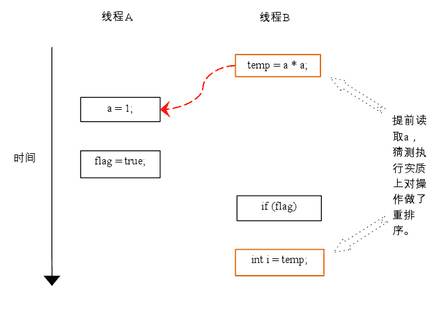

# Java 内存模型

（Java Memory Model，JMM）

## JMM 与硬件内存结构的结构关系

### JMM 内存结构

#### 堆栈


thread stack 存储对象的方法中的：

- 基本类型参数
- 基本类型局部变量
- 引用类型

heap 存储：

- 包装类
- 对象
- 对象的成员变量（无论什么类型）
- 静态类变量

#### 可见性


thread stack 内的数据只能自身线程访问。

heap 中的对象可以多个线程共同引用以及共享访问。

### 硬件内存结构


现代计算机通常有2个或更多CPU。 其中一些CPU也可能有多个内核。

多个 CPU 可以真正并行运行一些线程。

每个 CPU 都有一组寄存器以及 CPU 缓存系统。

对主存的读写：

- 当 CPU 访问主存时，它会将部分主存读入其 CPU 缓存。 它甚至可以将部分缓存读入其内部寄存器，然后对其执行操作。 
- 当 CPU 将结果写回主存时，它会将值从其内部寄存器刷新到高速缓冲存储器，并在某些时候将值刷新回主存。

### 结构关系


在硬件上，线程堆栈和堆都位于主存储器中，线程堆栈和堆的一部分有时可能存在于 CPU 高速缓存和内部 CPU 寄存器中。 

这样，当对象和变量存储在计算机的不同存储区域中时，可能会出现某些问题， 两个主要问题是：

- 对象共享后的可见性
- 竞态条件

#### 对象共享后的可见性

共享对象最初存储在主存中，然后 CPU 将其读入 CPU 缓存并进行了更改，此时，只要 CPU 缓存尚未刷新回主存，共享对象的更新对其它线程就是不可见的。

下图描绘了该情况。 在左CPU上运行的一个线程将共享对象复制到其CPU缓存中，并将其count变量更改为2.对于在右边的CPU上运行的其他线程，此更改不可见，因为计数更新尚未刷新回主内存中：


要解决此问题，可以使用 **volatile 关键字**，volatile 关键字可以确保直接从主内存读取给定变量，并在更新时立即写回主内存。（volatile 同时会禁止指令重排序）

#### 竞态条件

如果两个或多个线程共享一个对象，并且多个线程更新该共享对象中的变量，则可能会出现竞态。

线程 A 将共享变量读入 CPU 缓存并 + 1，线程 B 将共享变量读入 CPU 缓存并 + 1，如果这些增量是按先后顺序执行的，则共享变量将增加两次并将原始值 + 2写回主存储器。

但是，两个增量同时执行而没有适当的同步，无论线程A和B中哪一个将其更新后的计数版本写回主存储器，更新的值将仅比原始值高 1 。


要解决此问题，可以使用 **synchronized 块**，同步块保证在任何给定时间只有一个线程可以进入代码的给定关键部分。 同步块还保证在同步块内访问的所有变量都将从主存储器中读入，当线程退出同步块时，所有更新的变量将立即刷新回主存储器，无论变量是不是声明为 volatile 。

## 重排序

在执行程序时为了提高性能，编译器和处理器常常会对指令做重排序。

重排序分三种类型（又分两类）：

- 编译器重排序

	- 编译器优化的重排序（1）

		编译器在不改变单线程程序语义的前提下，可以重新安排语句的执行顺序。

- 处理器重排序

	- 指令级并行的重排序（2）

		现代处理器（CPU）采用了指令级并行技术（Instruction-Level Parallelism， ILP）来将多条指令重叠执行。如果不存在数据依赖性，处理器可以改变语句对应机器指令的执行顺序。

	- 内存系统的重排序（3）

		CPU 使用缓存和读 / 写缓冲区，缓冲区可以临时保存向内存写入的数据。写缓冲区可以保证指令流水线持续运行，可以避免由于处理器停顿下来等待向内存写入数据而产生的延迟。


以上重排序都可能会导致多线程程序出现内存可见性问题。

- 对于编译器重排序

	JMM 的编译器重排序规则会禁止特定类型的编译器重排序（不是所有的编译器重排序都要禁止）。

- 对于处理器重排序

	JMM 的处理器重排序规则会要求 java 编译器在生成指令序列时，插入特定类型的内存屏障（memory barriers，intel 称之为 memory fence）指令，通过内存屏障指令来禁止特定类型的处理器重排序（不是所有的处理器重排序都要禁止）。

JMM 属于语言级的内存模型，它屏蔽了不同的编译器和不同的处理器内存模型的差异，为程序员提供一个一致的内存模型和一致的内存可见性保证。

### 数据依赖性

如果两个操作访问同一个变量，且这两个操作中有一个为写操作，此时这两个操作之间就存在数据依赖性。数据依赖分下列三种类型：

| 名称   | 代码示例     | 说明                           |
| ------ | ------------ | ------------------------------ |
| 写后读 | a = 1;b = a; | 写一个变量之后，再读这个位置。 |
| 写后写 | a = 1;a = 2; | 写一个变量之后，再写这个变量。 |
| 读后写 | a = b;b = 1; | 读一个变量之后，再写这个变量。 |

上面三种情况，只要重排序两个操作的执行顺序，程序的执行结果将会被改变。

编译器和处理器在重排序时，会遵守单个处理器中执行的指令序列和单个线程中执行的操作的数据依赖性，不会改变存在数据依赖关系的两个操作的执行顺序，但不同处理器之间和不同线程之间的数据依赖性不被考虑。

### as-if-serial 语义

as-if-serial 指：不管怎么重排序（编译器和处理器为了提高并行度），（单线程但 CPU）程序的执行结果不能被改变，与序列化下执行结果一直。

对于下面计算圆面积的代码示例：

```java
double pi  = 3.14;    //A
double r   = 1.0;     //B
double area = pi * r * r; //C
```

其中，C 依赖于 A，C 也依赖于 B ，但 A、B 没有依赖，可以自由调换 A、B 的顺序。

### 重排序对多线程的影响

```java
class ReorderExample {
    int a = 0;
    boolean flag = false;

    public void writer() {
        a = 1;                   //1
        flag = true;             //2
    }

    Public void reader() {
        if (flag) {                //3
            int i =  a * a;        //4
            ……
        }
    }
}
```

其中，flag 变量是个标记，用来标识变量 a 是否已被写入。

这里假设有两个线程 A 和 B，A 首先执行 writer() 方法，随后 B 线程接着执行 reader() 方法。

由于操作 1 和操作 2 没有数据依赖关系，编译器和处理器可以对这两个操作重排序；同样，操作 3 和操作 4 没有数据依赖关系，编译器和处理器也可以对这两个操作重排序。

当操作 1 和操作 2 重排序时：


如上图所示，操作 1 和操作 2 做了重排序，程序执行时：

1. 线程 A 首先写标记变量 flag
2. 随后线程 B 读 flag ，条件判断为真
3. 线程 B 读取变量 a，此时，变量 a 还根本没有被线程 A 写入，在这里多线程程序的语义被重排序破坏了。

当操作 3 和操作 4 重排序时：



如上图所示，操作 3 和操作 4 做了重排序，程序执行时：

1. 在程序中，操作 3 和操作 4 存在控制依赖关系，这可能会影响指令序列执行的并行度，编译器和处理器会采用猜测（Speculation）执行来克服控制相关性对并行度的影响。以处理器的猜测执行为例，执行线程 B 的处理器可以提前读取并计算 a*a，然后把计算结果临时保存到一个名为重排序缓冲（reorder buffer ROB）的硬件缓存中
2. 当接下来操作 3 的条件判断为真时，就把提前计算的结果写入变量 i 中，排序在这里破坏了多线程程序的语义。

在单线程程序中，对存在控制依赖的操作重排序，不会改变执行结果（这也是 as-if-serial 语义允许对存在控制依赖的操作做重排序的原因）；但在多线程程序中，对存在控制依赖的操作重排序，可能会改变程序的执行结果。

