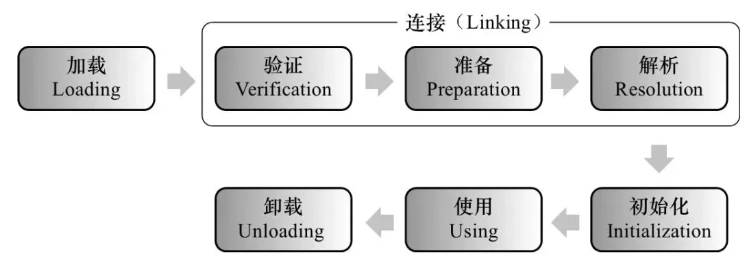
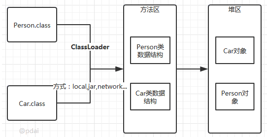
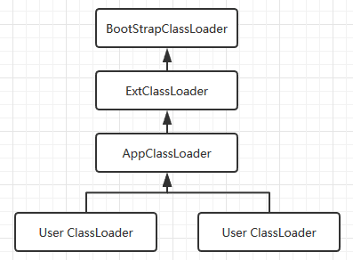

# Java 类加载机制

## 类的生命周期

类加载过程包括五个阶段：

1. 加载

	查找并加载类的二进制数据。

2. 验证

	确保被加载的类的正确性。

3. 准备

	为类的静态变量分配内存，并初始化为默认值。

4. 解析

	把类中的符号引用转换为直接引用。

5. 初始化

	为类的静态变量赋予正确的初始值。

注意：

- 验证，准备，解析阶段统称为连接。
- 解析阶段的顺序不是确定的，它在某些情况下可以在初始化之后开始，这是为了支持Java语言的运行时绑定(也称为动态绑定或晚期绑定)。
- 这五个阶段是按顺序开始，而不是按顺序进行或完成，这些阶段通常都是互相交叉地混合进行的，通常在一个阶段执行的过程中调用或激活另一个阶段。



### 加载

在加载阶段，JVM 查找并加载类的二进制数据，需要完成以下三件事：

- 通过一个类的全限定名来获取其定义的二进制字节流。
- 将这个字节流所代表的静态存储结构转化为方法区的运行时数据结构。
- 在Java堆中生成一个代表这个类的java.lang.Class对象，作为对方法区中这些数据结构的访问入口。



加载阶段（准确地说，是加载阶段获取类的二进制字节流的动作）是可控性最强的阶段，因为开发人员可以使用系统提供的类加载器来完成加载，也可以自定义自己的类加载器来完成加载。

类加载器并不需要等到某个类被“首次主动使用”时再加载它，JVM规范允许类加载器在预料某个类将要被使用时就预先加载它，如果在预先加载的过程中遇到了.class文件缺失或存在错误，类加载器必须在程序首次主动使用该类时才报告错误(LinkageError错误)，如果这个类一直没有被程序主动使用，那么类加载器就不会报告错误。

### 验证

为了确保 Class 文件的字节流中包含的信息符合当前虚拟机的要求，并且不会危害虚拟机自身的安全，验证阶段会完成 4 个阶段的检验动作:

- `文件格式验证`

	验证字节流是否符合Class文件格式的规范；例如: 是否以`0xCAFEBABE`开头、主次版本号是否在当前虚拟机的处理范围之内、常量池中的常量是否有不被支持的类型。

- `元数据验证`

	对字节码描述的信息进行语义分析(注意: 对比`javac`编译阶段的语义分析)，以保证其描述的信息符合Java语言规范的要求；例如: 这个类是否有父类，除了`java.lang.Object`之外。

- `字节码验证`

	通过数据流和控制流分析，确定程序语义是合法的、符合逻辑的。

- `符号引用验证`

	确保解析动作能正确执行。

验证阶段是非常重要的，但不是必须的，它对程序运行期没有影响，如果所引用的类会产生反复验证，那么可以考虑采用`-Xverifynone`参数来关闭大部分的类验证措施，以缩短虚拟机类加载的时间。

### 准备

准备阶段是正式为类变量分配内存并设置类变量初始值的阶段，这些内存都将在方法区中分配。

对于该阶段有以下几点需要注意:

- 这时候进行内存分配的仅包括类变量(`static`)，而不包括实例变量，实例变量会在对象实例化时随着对象一块分配在Java堆中。
- 这里所设置的初始值通常情况下是数据类型默认的零值(如`0`、`0L`、`null`、`false`等缺省值)，而不是被在Java代码中被显式地赋予的值（默认值）。
- 假设一个类变量的定义为: `public static int value = 3`；那么变量value在准备阶段过后的初始值为`0`，而不是`3`，因为这时候尚未开始执行任何Java方法，而把value赋值为3的`put static`指令是在程序编译后，存放于类构造器`<clinit>()`方法之中的，所以把value赋值为3的动作将在初始化阶段才会执行。

同时：

- 对于同时被`static`和`final`修饰的常量，必须在声明的时候就为其显式地赋值，否则编译时不通过；而只被final修饰的常量则既可以在声明时显式地为其赋值，也可以在类初始化时显式地为其赋值，总之，在使用前必须为其显式地赋值，系统不会为其赋予默认零值。
- 对于同时被 final 和 static 修饰的 ConstantValue 属性，在准备阶段被初始化为 ConstValue 属性所指定的值。假设类变量被定义为: ` public static final int value = 3；`编译时Javac将会为value生成ConstantValue属性，在准备阶段虚拟机就会根据ConstantValue的设置将value赋值为3。可以理解为`static final`常量在编译期就将其结果放入了调用它的类的常量池中

### 解析

解析阶段是虚拟机将常量池内的符号引用替换为直接引用的过程。

解析动作主要针对`类`或`接口`、`字段`、`类方法`、`接口方法`、`方法类型`、`方法句柄`和`调用点`限定符7类符号引用进行。

- 符号引用

	就是变量标识符，对象名，函数名，字面量等描述 Java 语言中实体的方式。

- 直接引用

	就是直接指向目标的指针、相对偏移量或一个间接定位到目标的句柄。

### 初始化

JVM 负责对类进行初始化，主要对类变量进行初始化。

对类变量进行初始值设定有两种方式：

- 声明类变量是指定初始值。
- 使用静态代码块为类变量指定初始值。

JVM初始化步骤：

- 假如这个类还没有被加载和连接，则程序先加载并连接该类
- 假如该类的直接父类还没有被初始化，则先初始化其直接父类
- 假如类中有初始化语句，则系统依次执行这些初始化语句

类初始化时机：只有当对类主动使用的时候才会导致类的初始化，类的主动使用包括以下六种:

- 创建类的实例，也就是new的方式
- 访问某个类或接口的静态变量，或者对该静态变量赋值
- 调用类的静态方法
- 反射（如 `Class.forName("com.pdai.jvm.Test")`）
- 初始化某个类的子类，则其父类也会被初始化
- Java虚拟机启动时被标明为启动类的类(Java Test)，直接使用java.exe命令来运行某个主类

### 使用

方法区存储：

- 类元数据

	包括类的全限定名、修饰符、父类信息、接口信息、字段和方法的描述、构造方法等。

- 运行时常量池

	包括编译时生成的常量，如字符串常量、数值常量和符号引用。

- 静态变量

	类的静态变量在方法区中存储。

- 方法字节码

	包括类中方法的字节码指令。

堆区存储：

- 对象实例

	Java 中的所有对象和数组实例都存储在堆区。

### 卸载

Java 虚拟机将结束生命周期的几种情况：

- 执行了System.exit()方法
- 程序正常执行结束
- 程序在执行过程中遇到了异常或错误而异常终止
- 由于操作系统出现错误而导致Java虚拟机进程终止

## 类加载器

类加载器的层次不是通过继承的方式，而是采用组合的方式实现：



其中：

- 启动类加载器（Bootstrap ClassLoader）

	负责加载存放在 JDK\jre\lib(JDK代表JDK的安装目录，下同)下，或被-Xbootclasspath参数指定的路径中的，并且能被虚拟机识别的类库(如rt.jar，所有的java.*开头的类均被Bootstrap ClassLoader加载)。

	- 启动类加载器由 C++ 实现，无法被 Java 程序直接引用。（获取其引用时会返回 null）

- 扩展类加载器（Extension ClassLoader）

	该加载器由`sun.misc.Launcher$ExtClassLoader`实现，它负责加载JDK\jre\lib\ext目录中，或者由java.ext.dirs系统变量指定的路径中的所有类库(如javax.*开头的类)。

	- 开发者可以直接使用扩展类加载器。

- 应用程序类加载器（Application ClassLoader）

	该类加载器由`sun.misc.Launcher$AppClassLoader`来实现，它负责加载用户类路径(ClassPath)所指定的类。

	- 开发者可以直接使用该类加载器，如果应用程序中没有自定义过自己的类加载器，一般情况下这个就是程序中默认的类加载器。

应用程序都是由这三种类加载器互相配合进行加载的，如果有必要，还可以加入自定义的类加载器。

JVM 自带的 ClassLoader 只从本地文件系统加载标准的java class文件，因此如果编写了自己的ClassLoader，可以做到如下几点:

- 在执行非置信代码之前，自动验证数字签名。
- 动态地创建符合用户特定需要的定制化构建类。
- 从特定的场所取得 java class，例如数据库中和网络中。

## JVM 类加载机制

JVM 的类加载机制有几点内容：

- 全盘负责

	当一个类加载器负责加载某个Class时，该Class所依赖的和引用的其他Class也将由该类加载器负责载入，除非显式使用另外一个类加载器来载入。

- 父类委托

	先让父类加载器试图加载该类，只有在父类加载器无法加载该类时才尝试从自己的类路径中加载该类。

- 缓存机制

	缓存机制将会保证所有加载过的Class都会被缓存，当程序中需要使用某个Class时，类加载器先从缓存区寻找该Class，只有缓存区不存在，系统才会读取该类对应的二进制数据，并将其转换成Class对象，存入缓存区。这就是为什么修改了Class后，必须重启 JVM（刷新缓存）后，程序的修改才会生效。

- 双亲委派机制（父类委派，超类委派）

	如果一个类加载器收到了类加载的请求，它首先不会自己去尝试加载这个类，而是把请求委托给父加载器完成，依次向上，因此，所有的类加载请求最终都应该被传递到顶层的启动类加载器中，只有当父加载器在它的搜索范围中没有找到所需的类时，即无法完成该加载，子加载器才会尝试自己去加载该类。

双亲委派机制的运作：

1. 当AppClassLoader加载一个class时，它首先不会自己去尝试加载这个类，而是把类加载请求委派给父类加载器ExtClassLoader去完成。
2. 当ExtClassLoader加载一个class时，它首先也不会自己去尝试加载这个类，而是把类加载请求委派给BootStrapClassLoader去完成。
3. 如果BootStrapClassLoader加载失败(例如在$JAVA_HOME/jre/lib里未查找到该class)，会使用ExtClassLoader来尝试加载；
4. 若ExtClassLoader也加载失败，则会使用AppClassLoader来加载，如果AppClassLoader也加载失败，则会报出异常ClassNotFoundException。

双亲委派机制的代码实现：

```java
public Class<?> loadClass(String name)throws ClassNotFoundException {
            return loadClass(name, false);
    }
    protected synchronized Class<?> loadClass(String name, boolean resolve)throws ClassNotFoundException {
            // 首先判断该类型是否已经被加载
            Class c = findLoadedClass(name);
            if (c == null) {
                //如果没有被加载，就委托给父类加载或者委派给启动类加载器加载
                try {
                    if (parent != null) {
                         //如果存在父类加载器，就委派给父类加载器加载
                        c = parent.loadClass(name, false);
                    } else {
                    //如果不存在父类加载器，就检查是否是由启动类加载器加载的类，通过调用本地方法native Class findBootstrapClass(String name)
                        c = findBootstrapClass0(name);
                    }
                } catch (ClassNotFoundException e) {
                 // 如果父类加载器和启动类加载器都不能完成加载任务，才调用自身的加载功能
                    c = findClass(name);
                }
            }
            if (resolve) {
                resolveClass(c);
            }
            return c;
        }
```

双亲委派机制的优势：

- 避免类的重复加载

	这是双亲委派机制最直接的好处。由于类的加载请求是按照层次结构进行传递的，因此每个类只会被加载一次，避免了重复加载同一个类。（避免子类加载后，父类又加载一次）

- 提高类加载的效率

	由于类的加载请求是按照层次结构进行传递的，因此每个类只会被加载一次。当一个类被一个类加载器加载后，它的父类加载器就不需要再次尝试加载它。这样可以减少重复的查找和加载操作，提高了类加载的效率。

- 保证Java应用程序的安全性和稳定性

	通过双亲委派机制，Java应用程序中的核心类库只能由根加载器进行加载，而无法被其他非核心的类加载器进行非法修改或替换。