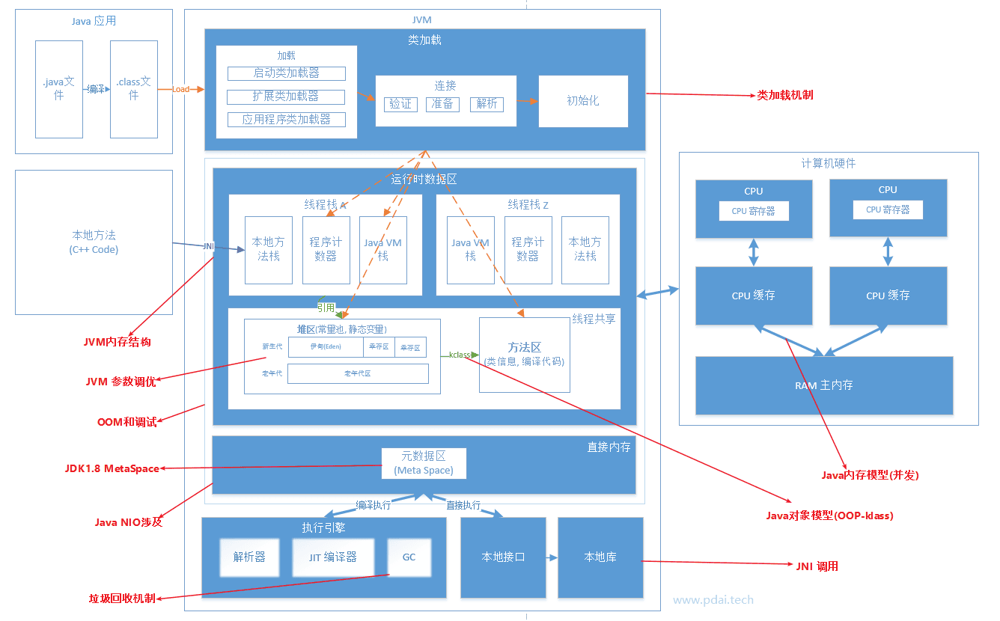
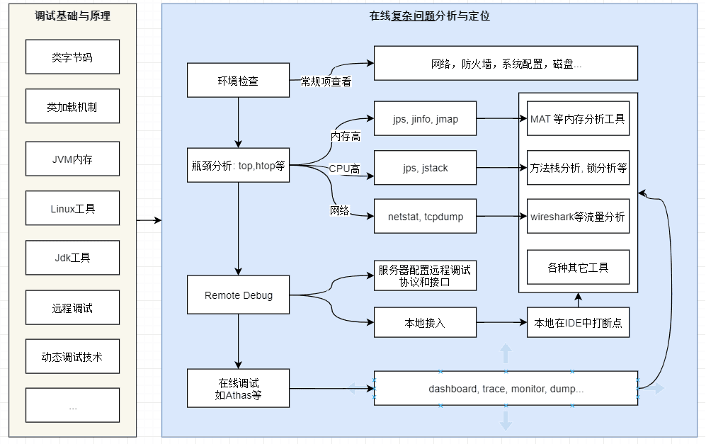

# JVM

（Java Virtual Machine，JVM，Java 虚拟机）

- Java 是一种编译型语言。
- 字节码是一种”解释型语言“，由 JVM 解释执行。
	- 一些重复的字节码操作会先编译好存储下来，用于复用。
	- 如果因为 Java 编译成的字节码解释执行就说 Java 是一种解释型语言的话，那么所有语言都可以是解释型语言，因为所有语言最终都会转换成机器码解释执行。

不同的虚拟机实现方式上有差别，常见的虚拟机是 sun 的 HotSpot ，不同版本也有差别，主要是 jdk1.8 。

## 架构总览

调优：

