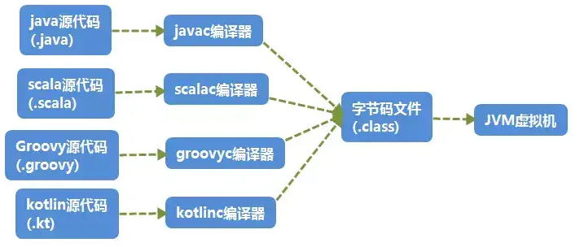
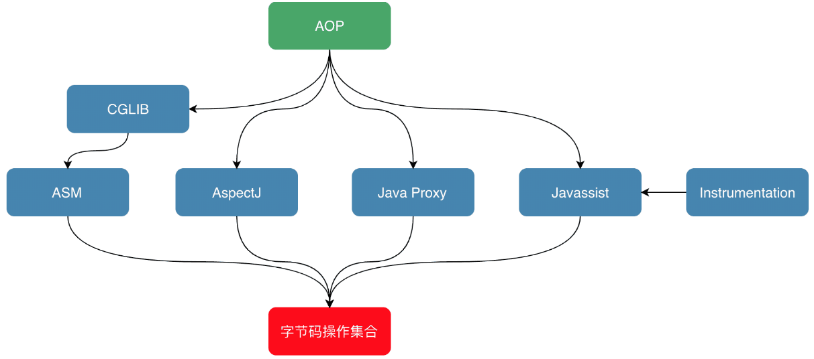
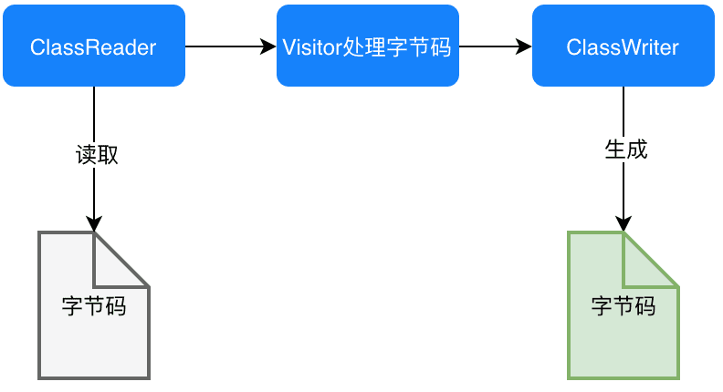
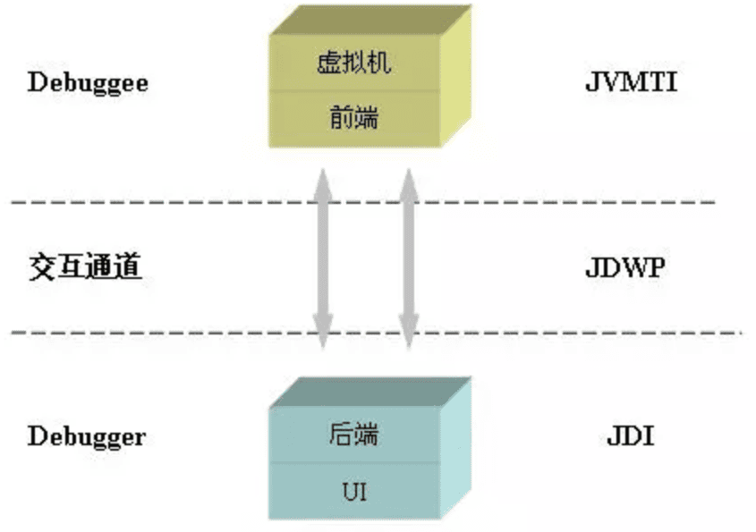

# 字节码

- JVM 将 Java 编译为字节码，然后解释执行。
- JVM 不只支持 Java，还支持 Groovy, Scala, Koltin 等语言。



## 字节码文件

class 文件是一个二进制文件。

### 数据类型

字节码文件包含了以下类型的数据：

- 魔数

	class 文件开头 4 个字节的值称为魔数，用于确定这个文件是一个 class 文件。

	- class 文件的魔数值为 `0xCAFEBABE`（咖啡宝贝）。
	- 光靠扩展名识别文件类型是不严谨的， jpg，jpeg 等文件也有魔数。

- 常量池

	存储变量和方法的属性、类型和名称等信息。

- 访问标志

	表示该 class 的属性和访问类型，比如 class 是类还是接口，是否是 public ，是否被标记为 final 。

- 类索引，父类索引，接口索引

	描述类继承关系，接口继承关系，接口实现关系。

- 字段表属性

	描述接口或类中声明的变量的作用域、数据类型，是否静态（static），是否可变（final）等。

- 方法表属性

	描述接口或类的方法的类型、作用域等信息。

- 属性表属性

	用于描述某些场景专有的信息，比如字段表中特殊的属性，方法表中特殊的属性等。

### 反编译后的语义

示例：

```java
//Main.java
public class Main {
    
    private int m;
    
    public int inc() {
        return m + 1;
    }
}
```

生成字节码：（javac）

```shell
javac Main.java
```

反编译字节码：（javap）

```shell
javap -verbose -p Main.class
```

结果：

```java
Classfile /E:/JavaCode/TestProj/out/production/TestProj/com/rhythm7/Main.class
  Last modified 2018-4-7; size 362 bytes
  MD5 checksum 4aed8540b098992663b7ba08c65312de
  Compiled from "Main.java"
public class com.rhythm7.Main
  minor version: 0
  major version: 52
  flags: ACC_PUBLIC, ACC_SUPER
Constant pool:
   #1 = Methodref          #4.#18         // java/lang/Object."<init>":()V
   #2 = Fieldref           #3.#19         // com/rhythm7/Main.m:I
   #3 = Class              #20            // com/rhythm7/Main
   #4 = Class              #21            // java/lang/Object
   #5 = Utf8               m
   #6 = Utf8               I
   #7 = Utf8               <init>
   #8 = Utf8               ()V
   #9 = Utf8               Code
  #10 = Utf8               LineNumberTable
  #11 = Utf8               LocalVariableTable
  #12 = Utf8               this
  #13 = Utf8               Lcom/rhythm7/Main;
  #14 = Utf8               inc
  #15 = Utf8               ()I
  #16 = Utf8               SourceFile
  #17 = Utf8               Main.java
  #18 = NameAndType        #7:#8          // "<init>":()V
  #19 = NameAndType        #5:#6          // m:I
  #20 = Utf8               com/rhythm7/Main
  #21 = Utf8               java/lang/Object
{
  private int m;
    descriptor: I
    flags: ACC_PRIVATE

  public com.rhythm7.Main();
    descriptor: ()V
    flags: ACC_PUBLIC
    Code:
      stack=1, locals=1, args_size=1
         0: aload_0
         1: invokespecial #1                  // Method java/lang/Object."<init>":()V
         4: return
      LineNumberTable:
        line 3: 0
      LocalVariableTable:
        Start  Length  Slot  Name   Signature
            0       5     0  this   Lcom/rhythm7/Main;

  public int inc();
    descriptor: ()I
    flags: ACC_PUBLIC
    Code:
      stack=2, locals=1, args_size=1
         0: aload_0
         1: getfield      #2                  // Field m:I
         4: iconst_1
         5: iadd
         6: ireturn
      LineNumberTable:
        line 8: 0
      LocalVariableTable:
        Start  Length  Slot  Name   Signature
            0       7     0  this   Lcom/rhythm7/Main;
}
SourceFile: "Main.java"
```

#### 头部信息

包含：Class 文件当前所在位置，最后修改时间，文件大小，MD5值，编译自哪个文件，类的全限定名，jdk次版本号，主版本号，以及类的访问标志如下:

| 标志名称       | 标志值 | 含义                                                         |
| -------------- | ------ | ------------------------------------------------------------ |
| ACC_PUBLIC     | 0x0001 | 是否为Public类型                                             |
| ACC_FINAL      | 0x0010 | 是否被声明为final，只有类可以设置                            |
| ACC_SUPER      | 0x0020 | 是否允许使用invokespecial字节码指令的新语义．                |
| ACC_INTERFACE  | 0x0200 | 标志这是一个接口                                             |
| ACC_ABSTRACT   | 0x0400 | 是否为abstract类型，对于接口或者抽象类来说，次标志值为真，其他类型为假 |
| ACC_SYNTHETIC  | 0x1000 | 标志这个类并非由用户代码产生                                 |
| ACC_ANNOTATION | 0x2000 | 标志这是一个注解                                             |
| ACC_ENUM       | 0x4000 | 标志这是一个枚举                                             |

#### 常量池

常量池主要存放两大类常量：

- 字面量（Literal）
	- 文本字符串
	- final 常量
- 符号引用（Symbolic References）
	- 类和接口的全限定名（Fully Qualified Name）
	- 字段的名称和类型描述符（Descriptor）
	- 方法的名称和类型描述符

字节码需要数据支持，通常这种数据会很大以至于不能直接存到字节码里，所以存到常量池，这个字节码包含了指向常量池的引用。

JVM 是采用动态链接，字段和方法在运行时从常量池中取出，然后计算出真正的内存入口地址。

对于：

```java
#1 = Methodref          #4.#18         // java/lang/Object."<init>":()V
#4 = Class              #21            // java/lang/Object
#7 = Utf8               <init>
#8 = Utf8               ()V
#18 = NameAndType        #7:#8          // "<init>":()V
#21 = Utf8               java/lang/Object
```

第一个常量是一个方法定义，指向了第4和第18个常量。以此类推查看第4和第18个常量。最后可以拼接成第一个常量右侧的注释内容:

```java
java/lang/Object."<init>":()V
```

这是该类的实例构造器的声明，由于Main类没有重写构造方法，所以调用的是父类的构造方法。此处也说明了Main类的直接父类是Object。 该方法默认返回值是V, 也就是 void，无返回值。

第二个常量是一个字段，同理可得注释内容：

```java
#2 = Fieldref           #3.#19         // com/rhythm7/Main.m:I
#3 = Class              #20            // com/rhythm7/Main
#5 = Utf8               m
#6 = Utf8               I
#19 = NameAndType        #5:#6          // m:I
#20 = Utf8               com/rhythm7/Main
```

字节码中数据类型的描述为：

| 标识字符 | 含义                                       |
| -------- | ------------------------------------------ |
| B        | 基本类型byte                               |
| C        | 基本类型char                               |
| D        | 基本类型double                             |
| F        | 基本类型float                              |
| I        | 基本类型int                                |
| J        | 基本类型long                               |
| S        | 基本类型short                              |
| Z        | 基本类型boolean                            |
| V        | 特殊类型void                               |
| L        | 对象类型，以分号结尾，如Ljava/lang/Object; |

对于数组类型，每一位使用一个前置的`[`字符来描述，如定义一个`java.lang.String[][]`类型的维数组，将被记录为`[[Ljava/lang/String;`

#### 字段

```java
private int m;
  descriptor: I
  flags: ACC_PRIVATE
```

此处声明了一个私有变量 m，类型为 int，返回值为 int。

#### 方法

```java
public com.rhythm7.Main();
   descriptor: ()V
   flags: ACC_PUBLIC
   Code:
     stack=1, locals=1, args_size=1
        0: aload_0
        1: invokespecial #1                  // Method java/lang/Object."<init>":()V
        4: return
     LineNumberTable:
       line 3: 0
     LocalVariableTable:
       Start  Length  Slot  Name   Signature
           0       5     0  this   Lcom/rhythm7/Main;
```

这里是构造方法：Main()，返回值为void, 公开方法。

code 中：

- stack

	操作数栈的最大深度。

	- 操作数栈在运行时压入参数、局部变量以及临时变量。
	- JVM 运行时会根据这个值来分配栈帧(Frame)，这里为 1（压入 this 这个隐藏参数）。

- locals

	局部变量所需的存储空间，单位为 Slot，Slot 是虚拟机为局部变量分配内存时所使用的最小单位，为 4 个字节大小。

	- 方法参数(包括实例方法中的隐藏参数this)，显示异常处理器的参数(try catch中的catch块所定义的异常)，方法体中定义的局部变量都需要使用局部变量表来存放。
	- locals 的大小并不一定等于所有局部变量所占的 Slot 之和，因为局部变量中的 Slot 是可以重用的。

- args_size

	方法参数的个数，本例是 1，因为每个实例方法都会有一个隐藏参数 this 。

- attribute_info

	方法体内容，0,1,4为字节码"行号"，具体意义略。

	- 该段代码的意思是将第一个引用类型本地变量（this）推送至栈顶，然后执行该类型的实例方法（`#1`），也就是常量池存放的第一个变量，也就是注释里的`java/lang/Object."":()V`, 然后执行返回语句，结束方法。

- LineNumberTable

	描述源码行号与字节码行号(字节码偏移量)之间的对应关系。

- LocalVariableTable

	描述帧栈中局部变量与源码中定义的变量之间的关系。

	- start 表示该局部变量在哪一行开始可见
	- length 表示可见行数
	- Slot 代表所在帧栈位置
	- Name 是变量名称
	- Signature 是类型签名

同理可以分析 Main 类中的另一个方法"inc()":

方法体内的内容是：将this入栈，获取字段#2并置于栈顶, 将int类型的1入栈，将栈内顶部的两个数值相加，返回一个int类型的值。

## 字节码增强技术

字节码增强技术是一类对现有字节码进行修改或者动态生成全新字节码文件的技术。

以 AOP 功能的实现为例：



### ASM

ASM 可以按照字节码文件的格式要求修改字节码文件，主要用于 Cglib，热部署，修改其它 jar 包中的类。



ASM 主要有两套修改字节码的 API：

- Core API

	无需读取类的整个结构，使用流式的方法处理字节码文件。节约内存，但编程难度较大。使用访问者模式修改字节码文件。

	- ClassReader

		用于读取已经编译好的.class文件。

	- ClassWriter

		用于重新构建编译后的类，如修改类名、属性以及方法，也可以生成新的类的字节码文件。

	- 各种 Visitor 类

		如上所述，CoreAPI根据字节码从上到下依次处理，对于字节码文件中不同的区域有不同的Visitor，比如用于访问方法的MethodVisitor、用于访问类变量的FieldVisitor、用于访问注解的AnnotationVisitor等。如果要实现AOP，重点要使用的是 MethodVisitor 。

- Tree API

	一次读取整个类的结构，消耗内存多，但是编程比较简单。通过各种 Node 类来映射字节码的各个区域。

### Javassist

利用 Javassist 实现字节码增强时，可以无须关注字节码刻板的结构，其优点就在于编程简单。直接使用java编码的形式，而不需要了解虚拟机指令，就能动态改变类的结构或者动态生成类。

有以下四个重要的类：

- CtClass（compile-time class）

	编译时类信息，它是一个class文件在代码中的抽象表现形式，可以通过一个类的全限定名来获取一个CtClass对象，用来表示这个类文件。

- ClassPool

	从开发视角来看，ClassPool是一张保存CtClass信息的HashTable，key为类名，value为类名对应的CtClass对象。当我们需要对某个类进行修改时，就是通过pool.getCtClass(“className”)方法从pool中获取到相应的CtClass。

- CtMethod

	类中的方法。

- CtField

	类中的属性。

### Instrument

instrument 是一个 JVM 提供的可以修改已加载的运行时的类的类库。

### JVMTI & Agent & Attach API

JVM 不允许在运行时动态重载一个类的，但如果 JVM 启动时开启了 JPDA（Java Platform Debugger Architecture），那么类是允许被重新加载的。

在这种情况下，已被加载的旧版本类信息可以被卸载，然后重新加载新版本的类。JDPA其实是一套用于调试Java程序的标准，任何JDK都必须实现该标准。

JPDA 将调试体系分为三部分，并规定了三者之间的通信接口，三部分由低到高分别是：

- Java 虚拟机工具接口（JVMTI）
- Java 调试协议（JDWP）
- Java 调试接口（JDI）



Agent 是 JVMTI 的一种实现，Agent 有两种启动方式：

- 一是随Java进程启动而启动，经常见到的java -agentlib就是这种方式；
- 二是运行时载入，通过 attach API，将模块（jar包）动态地Attach到指定进程id的Java进程内。
