# Java IO

从数据形式上，IO 类可以大致分为：

- 字节流（计算机信息的最简存储和传输形式）
	- InputStream
	- OutputStream
- 字符流（较适于人看的表现形式）
	- Reader
	- Writer

编码方式：

- GBK 编码中，中文字符占 2 个字节，英文字符占 1 个字节；
- UTF-8 编码中，中文字符占 3 个字节，英文字符占 1 个字节；
- UTF-16be 编码中，中文字符和英文字符都占 2 个字节。

Java 使用双字节编码 UTF-16be，这不是指 Java 只支持这一种编码方式，而是说 char 这种类型使用 UTF-16be 进行编码。char 类型占 16 位，也就是两个字节，Java 使用这种双字节编码是为了让一个中文或者一个英文都能使用一个 char 来存储。

## IO 装饰者模式

以 InputStream 为例，

- InputStream 是抽象组件；
- FileInputStream 是 InputStream 的子类，属于具体组件，提供了字节流的输入操作；
- BufferedInputStream 属于抽象装饰者，装饰者用于装饰组件，为组件提供额外的功能。例如 BufferedInputStream 为 FileInputStream 提供缓存的功能。

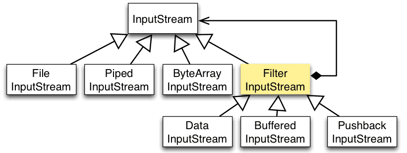

实例化一个具有缓存功能的字节流对象时，只需要在 FileInputStream 对象上再套一层 BufferedInputStream 对象即可。

```java
FileInputStream fileInputStream = new FileInputStream(filePath);
BufferedInputStream bufferedInputStream = new BufferedInputStream(fileInputStream);
```

DataInputStream 装饰者提供了对更多数据类型进行输入的操作，比如 int、double 等基本类型。

## IO 常见类

- 磁盘操作: File

	File 类可以用于表示文件和目录的信息，但是它不表示文件的内容。

- 字节操作: InputStream 和 OutputStream

- 字符操作: Reader 和 Writer

- 对象操作: Serializable

	- 序列化: ObjectOutputStream.writeObject()
	- 反序列化: ObjectInputStream.readObject()

	- 不会对静态变量进行序列化，因为序列化只是保存对象的状态，静态变量属于类的状态。

	- 序列化的类需要实现 Serializable 接口，它只是一个标准，没有任何方法需要实现，Java 规定必须使用它表名可序列化。

	- transient 关键字可以使一些属性不会被序列化。

		ArrayList 中存储数据的数组 elementData 是用 transient 修饰的，因为这个数组是动态扩展的，并不是所有的空间都被使用，因此就不需要所有的内容都被序列化。通过重写序列化和反序列化方法，使得可以只序列化数组中有内容的那部分数据。(`private transient Object[] elementData;`)

- 网络操作

	- InetAddress: 用于表示网络上的硬件资源，即 IP 地址；

	- URL: 统一资源定位符。

		可以直接从 URL 中读取字节流数据。

	- Sockets: 使用 TCP 协议实现网络通信；

	- Datagram: 使用 UDP 协议实现网络通信。

## Unix IO 模型

对于一个套接字上的输入操作：

1. 等待数据报（datagram）从网络到达，存储在内核的缓冲区中。
2. 将数据从内核缓冲区复制到应用进程缓冲区。

Unix 下有五种 I/O 模型:

- 阻塞式 I/O（blocking I/O）

- 非阻塞式 I/O（nonblocking I/O）

- I/O 复用（I/O Multiplexing）

	select 和 poll 。

- 信号驱动式 I/O（Signal-driven I/O，SIGIO）

- 异步 I/O（asynchronous I/O，AIO）

### 阻塞式 I/O

应用进程被阻塞，直到数据复制到应用进程缓冲区中才返回。

recvfrom 函数是一个系统调用，用于将 Socket 接收到的数据复制到应用进程的缓冲区 buf 中。

```c
ssize_t recvfrom(int sockfd, void *buf, size_t len, int flags, struct sockaddr *src_addr, socklen_t *addrlen);
```

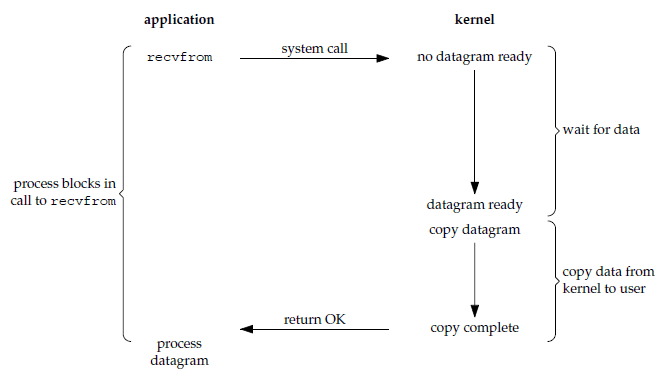

在阻塞的过程中，其它程序还可以执行，因此不消耗 CPU 时间，这种模型的执行效率会比较高。

### 非阻塞式 I/O

应用进程执行系统调用之后，内核返回一个错误码，应用进程可以继续执行，但是需要不断的执行系统调用来获知 I/O 是否完成，这种方式称为轮询（polling）。

错误码可有两个：

- EAGAIN（Error Again）

	表示 “Resource temporarily unavailable”（资源暂时不可用），再尝试（again）获取可能会成功。

- EWOULDBLOCK（Error Would Block）

	表示  “Operation would block”（操作会阻塞），直到资源可用。

- 相关：

	- Error 是 UNIX 的错误码的一种命名约定。
	- EWOULDBLOCK 是 EAGIN 的别名。

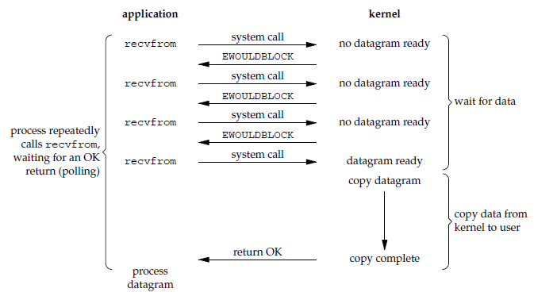

轮询导致 CPU 要处理更多的系统调用，因此这种模型是比较低效的。

### I/O 复用

使用 select 或者 poll 等待数据，并且可以等待多个套接字中的任何一个变为可读，这一过程会被阻塞，当某一个套接字可读时返回。之后再使用 recvfrom 把数据从内核复制到进程中。

它可以让单个进程具有处理多个 I/O 事件的能力。又被称为 Event Driven I/O，即事件驱动 I/O。

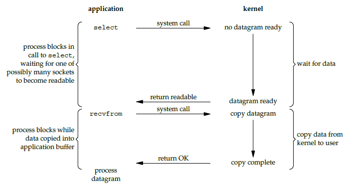

如果一个 Web 服务器没有 I/O 复用，那么每一个 Socket 连接都需要创建一个线程去处理。如果同时有几万个连接，那么就需要创建相同数量的线程。并且相比于多进程和多线程技术，I/O 复用不需要进程线程创建和切换的开销，系统开销更小。

### 信号驱动式 I/O

应用进程使用 `sigaction` 系统调用，内核立即返回，应用进程可以继续执行，也就是说等待数据阶段的应用进程是非阻塞的。

内核在数据到达完成时向应用进程发送 SIGIO 信号，应用进程收到之后在信号处理程序中调用 recvfrom 将数据从内核复制到应用进程中。

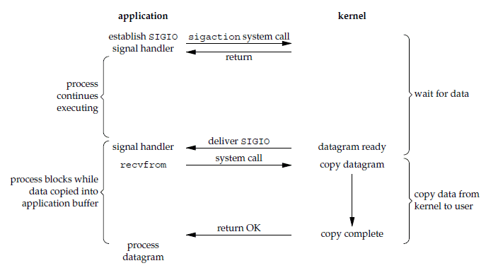

相比于非阻塞式 I/O 的轮询方式，信号驱动 I/O 的 CPU 利用率更高。

### 异步 I/O

进行 aio_read 系统调用会立即返回，应用进程继续执行，不会被阻塞，内核会在所有操作完成之后向应用进程发送信号，由 signal handler 处理。

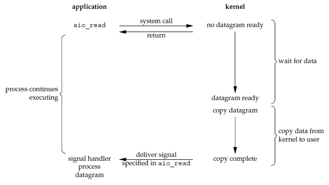

异步 I/O 与信号驱动 I/O 的区别在于，异步 I/O 的信号是通知应用进程 I/O 完成，而信号驱动 I/O 的信号是通知应用进程可以开始 I/O。

### 五大 IO 比较

- 同步 I/O

	这几种方式应用进程在数据从内核复制到应用进程这个过程中都会被阻塞，都有应用程序与内核同步执行的阶段。

	- 阻塞式 I/O
	- 非阻塞式 I/O
	- I/O 复用
	- 信号驱动 I/O 

- 异步 I/O

	不会阻塞

这里的同步 IO 指「read 系统调用 - 内核数据准备好 - 内核数据复制到用户态（read 返回数据）」这个 IO 过程是串行的，用户进程和内核在这个过程中同步执行的。

虽然非阻塞式 I/O 和信号驱动 I/O 在等待数据阶段不会阻塞，但是在之后的将数据从内核复制到应用进程这个过程仍然会阻塞，仍然有同步过程。

补充：

- 串行，并行：步骤，阶段，流程的状态表示。
- 同步，异步：两个对象或多个对象的执行时的相互关系。

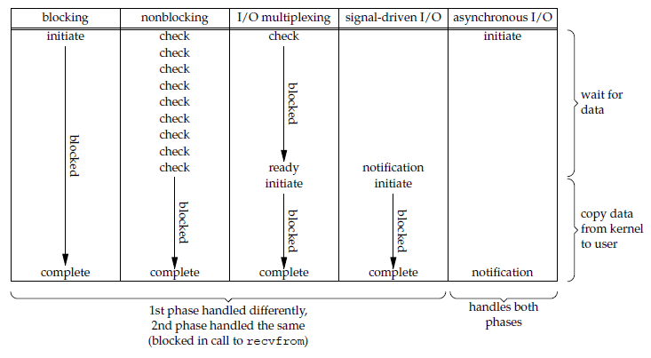

其中，前四种 I/O 模型的主要区别在于第一个阶段，而第二个阶段都是将数据从内核复制到应用进程中，应用进程会被阻塞。

## Java BIO

（Blocking IO，BIO）也就是 Java 传统的 IO 。

### 单线程

传统网络通信方式都是阻塞模式的，即:

- 客户端向服务器端发出请求后，客户端会一直等待(不会再做其他事情)，直到服务器端返回结果或者网络出现问题。
- 服务器端同样的，当在处理某个客户端A发来的请求时，另一个客户端B发来的请求会等待，直到服务器端的这个处理线程完成上一个处理。、

问题：

服务器一次只能处理一个客户端请求，当处理完成并返回后(或者异常时)，才能进行第二次请求的处理，这在高并发场景下无法接受。

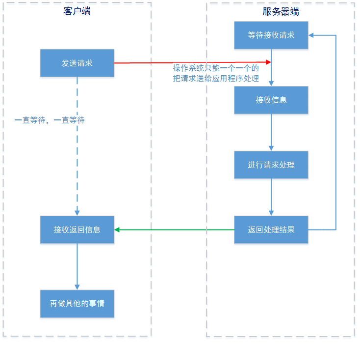

### 多线程

上面说的情况是服务器只有一个线程的情况，如果服务端有多个线程：

- 当服务器收到客户端X的请求后，(读取到所有请求数据后)将这个请求送入一个独立线程进行处理，然后主线程继续接受客户端Y的请求。
- 客户端一侧，也可以使用一个子线程和服务器端进行通信。这样客户端主线程的其他工作就不受影响了，当服务器端有响应信息的时候再由这个子线程通过 监听模式/观察模式(等其他设计模式)通知主线程。

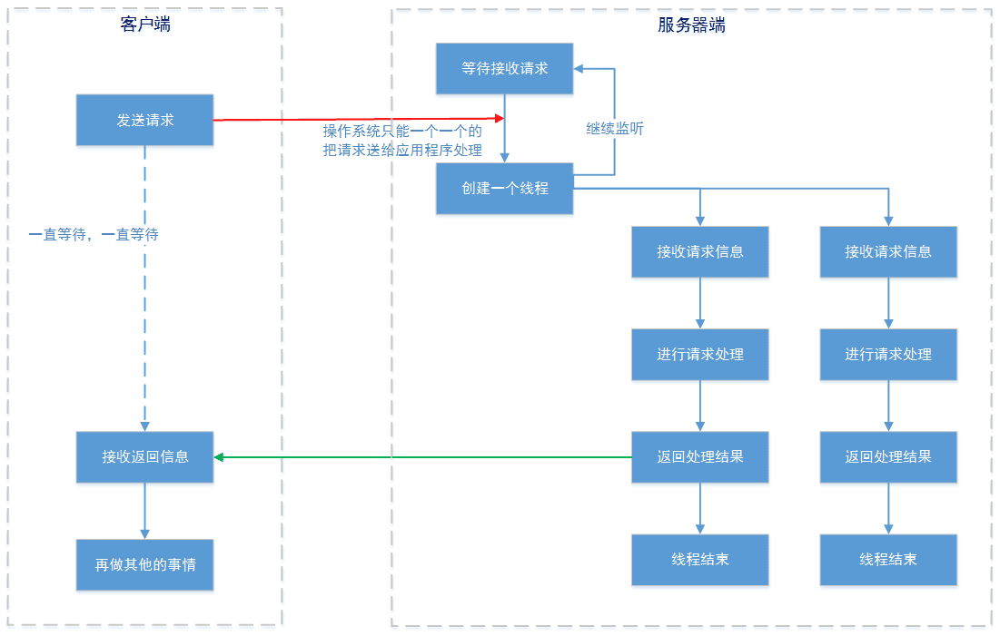

局限性仍然存在：

- 虽然在服务器端请求的处理交给了一个独立线程进行，但是操作系统通知accept()的方式还是只能一个请求一个请求进行。
- 在linux系统中，可以创建的线程是有限的，并且线程越多，CPU切换所需的时间也就越长，用来处理真正业务的需求也就越少。
- 创建一个线程是有较大的资源消耗的，JVM创建一个线程的时候，即使这个线程不做任何的工作，JVM都会分配一个默认为128K 的堆栈空间；当然也可以使用ThreadPoolExecutor线程池来缓解线程的创建问题，但是又会造成BlockingQueue积压任务的持续增加，同样消耗了大量资源。
- 如果应用程序大量使用长连接的话，线程是不会关闭的，这样系统资源的消耗更容易失控。

### 性能瓶颈所在

BIO 的问题关键不在于是否使用了多线程(包括线程池)处理这次请求，而在于 accept()、read() 这两个操作系统的操作是被阻塞的。

## IO 多路复用

IO 多路复用也叫多路复用 IO，主要用于多个 socket 建立连接后，消息事件（通信事件，IO 事件）高并发的场景。

它的实现主要包括四种: `select`、`poll`、`epoll`、`kqueue`。

| IO模型 | 相对性能 | 关键思路                   | 操作系统      |
| ------ | -------- | -------------------------- | ------------- |
| select | 较高     | Reactor（反应器）          | windows/Linux |
| poll   | 较高     | Reactor                    | Linux         |
| epoll  | 高       | Reactor / Proactor         | Linux         |
| kqueue | 高       | Proactor（主动器，前摄器） | Linux         |

注意：

- Linux 下使用epoll模拟异步IO，因为 Linux 没有Windows下的IOCP技术提供真正的异步IO 支持。
- 目前 Java 还不支持 kqueue 。

多路复用IO技术最适用的是“高并发”场景，所谓高并发是指1毫秒内至少同时有上千个连接请求准备好，其他情况下多路复用IO技术发挥不出来它的优势。

### Socket 基本通信模型

#### 单进程模型

socket 通过 IP 地址和 Port 通信。

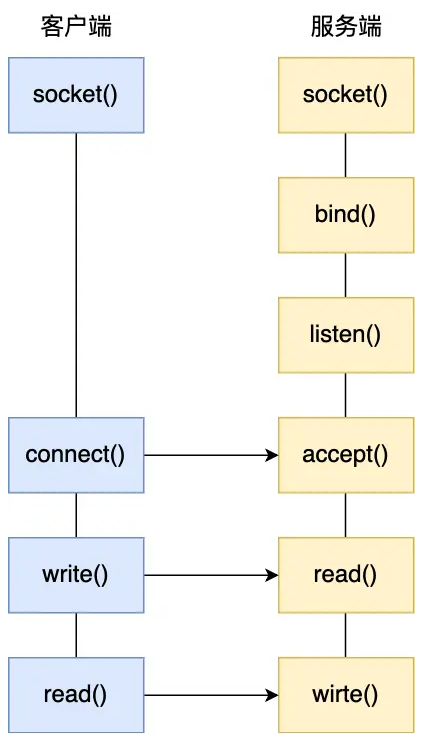

这种连接建立的过程是同步阻塞的，当一个连接建立好后进行业务中的 IO 事件（消息通信）时，其它客户端无法与服务端连接。

#### 多进程模型

要让服务端同时支持多个客户端，可以使用多进程模型：

1. 服务器的主进程监听客户端连接（使用监听 socket）
2. 一但有连接建立，就创建一个子进程处理 IO 事件（使用已连接 socket）。
	- 子进程会复制父进程的文件描述符，所以会有监听 socket 的副本作为已连接 socket 。

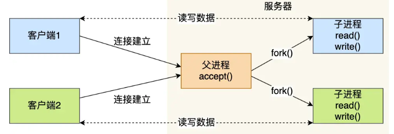

缺点：

- 高并发场景下，会有大量 IO 事件需要处理，一个子进程只负责一个连接的 IO 事件，那么多个连接会消耗大量资源，并发度也不够高。
- 进程切换包括了：虚拟内存、栈、全局变量等用户空间的资源，还包括了内核堆栈、寄存器等内核空间的资源，切换开销大。

#### 多线程模型

用一个线程负责一个连接的 IO 事件。

- 单进程中可以运行多个线程，同进程里的线程可以共享进程的部分资源，比如文件描述符列表、进程空间、代码、全局数据、堆、共享库等。
- 共享些资源在上下文切换时不需要切换，而只需要切换线程的私有数据、寄存器等不共享的数据，切换开销小。

于是有多线程模型：

1. 服务器主进程监听 socket 。

2. 一但有连接建立，就创建一个子线程处理 IO 事件

	- 因为子线程共享主进程（父线程）的文件描述符，所以建立连接后，主进程需要返回监听 socket 的副本给子线程，让子线程有自己的已连接 socket 。

3. 可以进一步使用线程池来避免线程的频繁创建和销毁

	- 提前创建若干个线程放入线程池。

	- 当有新连接建立时，将这个已连接的 socket 放入到一个队列里。

	- 然后线程池里的线程负责从队列中取出「已连接 socket 」进行处理。

		需要注意的是，这个队列是全局的，每个线程都会操作，为了避免多线程竞争，线程在操作这个队列前要加锁。

	- 这使得线程可以进行一定程度的复用，只需要获取新的已连接 socket ，就可以处理别的连接的业务。

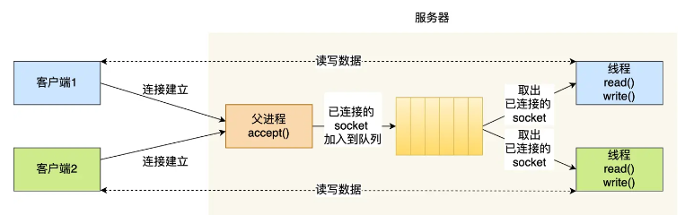

缺点：

- 一个线程负责一个连接的 IO 事件，能够支持的 IO 并发量还是不够高。

### 消息事件的 IO 复用

建立连接后，如果一个进程（线程）只负责一个连接的 IO 事件（IO 请求），那么无法满足高并发场景的需求。

IO 多路复用对多个请求并发地复用一个进程（线程），进而可用使用一个进程（线程）同时应对多个连接的 IO 请求。

select/poll/epoll 是内核提供给用户态的多路复用系统调用。

进程可以通过一个系统调用函数从内核中获取多个事件。

在获取事件时，先把已连接 socket 的（文件 描述符）传给内核，再由内核返回该 socket 收到的事件，然后在用户态中再处理这些连接对应的请求。

#### select

1. select 将 socket 都放在一个文件描述符集合（使用一个 Bit 数组表示文件描述符集合）然后交给内核，等待内核返回这些 socket 的事件。
2. 内核只能采用遍历集合的方式将某些 socket（由 IO 事件）标记为可读或可写。（遍历为 $O(n)$）
3. 内核返回事件结果，这时需要将文件描述符集合拷贝到用户态。
4. 用户态需要再遍历集合找到有事件的 socket ，然后处理。

select 方式的缺点：

- 需要遍历 2 次 socket（的文件描述符）集合，一次在内核态，一次用户态。
- 需要 2 次集合的拷贝，一次在用户态到内核态，一次内核态到用户态。
- select 使用固定长度的 Bit 数组表示文件描述符集合，默认只支持 0 ~ 1023 的文件描述符。

#### poll

poll 使用链表表示文件描述符集合，没有文件描述符的数量限制，其它流程与 select 相同，也存在 2 次遍历和 2 次拷贝。

#### epoll

epoll 解决了 select 和 poll 存在的问题。

- epoll 在内核里使用红黑树来维护所有待检测的文件描述符

	- 只需要将需要监控的 socket（的文件描述符）传入，加入红黑树即可（增删改 $O(\log n)$），而无需大量拷贝。
	- 有事件到达时，可以直接查找到事件对应的 socket ，而无需遍历文件描述符集合。

- epoll 使用事件驱动机制，内核中维护一个链表记录就绪事件

	当某个 socket 有事件时，内核同时将其加入到就绪事件列表中。

	- 可以直接返回所有有事件发生的 socket ，而无需通过遍历找出它们
	- 同时，也无需再次复制文件描述符集合。

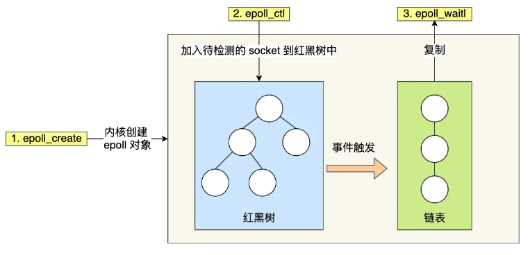

epoll 可以高效地同时监听大量 socket ，同时监听数目可以达到系统进程的最大文件描述符数目。

epoll 支持两种触发方式：

- 边缘触发（edge-triggered，ET）

	IO 事件发生时只通知一次，需要程序员一次性不断读取数据，直到读完阻塞。（写同理）

- 水平触发（level-triggered，LT）

	IO 事件发生时先通知一次，程序员可以读取数据，后续仍然可以查询数据是否读完，是否仍然可读。（写同理）

边缘触发效率更高，因为可以减少系统调用的次数（查询是否可读写）。

select/poll 只有水平触发模式，epol 默认的触发模式是水平触发，但是可以根据应用场景设置为边缘触发模式。

#### 应用场景

##### select

select 的 timeout 参数精度为 1ns，而 poll 和 epoll 为 1ms，因此 select 更加适用于实时要求更高的场景，比如核反应堆的控制。

select 可移植性更好，几乎被所有主流平台所支持。

##### poll

poll 没有最大描述符数量的限制，如果平台支持并且对实时性要求不高，应该使用 poll 而不是 select。

需要同时监控小于 1000 个描述符，就没有必要使用 epoll，因为这个应用场景下并不能体现 epoll 的优势。

需要监控的描述符状态变化多，而且都是非常短暂的，也没有必要使用 epoll。因为 epoll 中的所有描述符都存储在内核中，造成每次需要对描述符的状态改变都需要通过 epoll_ctl() 进行系统调用，频繁系统调用降低效率。并且epoll 的描述符存储在内核，不容易调试。

##### epoll

只需要运行在 Linux 平台上，并且有非常大量的描述符需要同时轮询，而且这些连接最好是长连接。

## 高性能网络设计模式

高性能网络模式也属于一种设计模式。

Socket 基本通信模型是面向过程的，高性能网络模式基于面向对象的思想，为 IO 多路复用进行了一层封装。

同时，在 Reactor 模式和 Proactor 模式扩展了事件的含义，将事件分为两种：

- 连接事件

	建立连接的事件。

- 读写事件

	消息通信的 IO 事件。

注意，IO 多路复用的 select，poll 和 epoll 主要用于消息通信事件的高并发，是在已经建立了 socket 连接的基础上，两种模式只是使用了扩展后的概念，内部仍然是基于 IO 多路复用。

### Reactor 模式

Reactor 模式也叫 Dispatch 模式。

Reactor 模式是灵活多变的，可以应对不同的业务场景：

- Reactor 的数量可以只有一个，也可以有多个。
- 处理资源池可以是单个进程（线程），也可以是多个进程（线程）。

将上面的两个因素排列组设一下，理论上就可以有 4 种方案选择：

- 单 Reactor - 单进程（线程）

- 单 Reactor - 多进程（线程）

	「单 Reactor - 多进程」信息共享没有「单 Reactor - 多线程」方便，实际没有应用。

- 多 Reactor - 单进程（线程）

	比单 Reactor - 单进程（线程）方案显然没有性能优势，没有被实际应用。

- 多 Reactor - 多进程（线程）

方案具体使用进程还是线程，取决于编程语言和平台：

- Java 一般使用线程，比如 Netty 。（Java 基于 JVM，每个程序都是 JVM 创建的线程）
- C 语言使用进程和线程都可以，例如 Nginx 使用的是进程，Memcache 使用的是线程。

#### 单 Reactor - 单进程（线程）

一般来说，C语言实现的是「单 Reactor 单进程」的方案，因为C语编写完的程序，运行后就是一个独立的进程，不需要在进程中再创建线程。

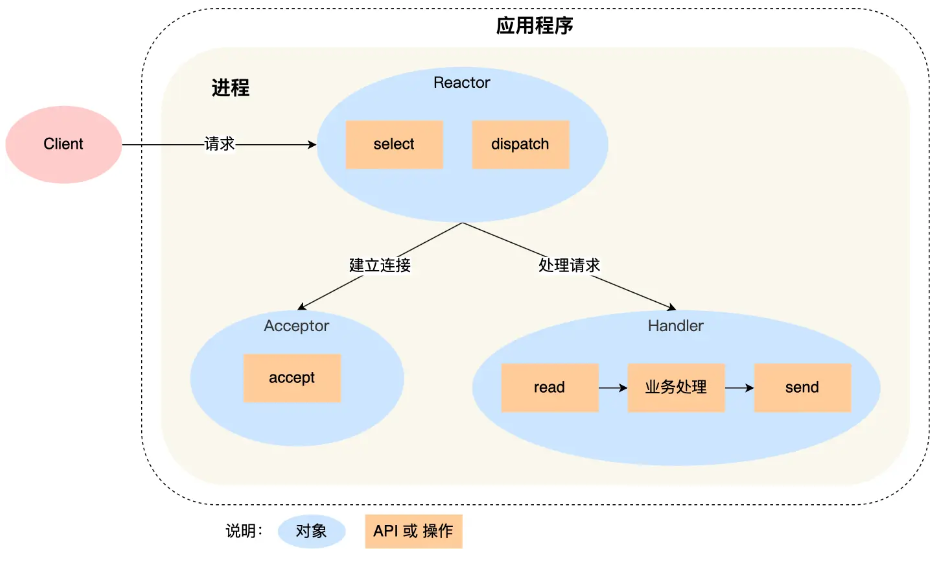

其中，进程里有三个对象：

- Reactor

	监听和分发事件（包括连接事件和消息事件）

	- 利用了 select 系统调用（IO 多路复用接口），也可以切换成 poll 或 epoll 等。
	- dispatch 用于分发事件。
		- 如果是连接建立事件，则交由 Acceptor 对象使用 accept 方法建立连接，对每个连接使用一个 Handler 对象处理消息事件。
		- 如果是消息事件，则交由当前连接对应的 Handler 对象处理。

- Acceptor

	建立连接。

- Handler

	处理业务以及读写通信。

优点：

- 该方案所有工作都在一个进程里完成，实现简单，不用考虑进程通信，也不用考虑多进程竞争。

缺点：

- 只有一个进程，无法利用多核 CPU 的性能。
- Handle 对象在处理业务时，整个进程无法处理其它连接事件，如果业务处理时间较长，可能造成响应延迟。

单 Reactor - 单进程（线程）不适合计算密集场景，只适合业务处理非常快速的场景。

Redis 是由 C 语言实现的，在 Redis 6.0版本之前采用的正是「单 Reactor 单进程，的方案，因为 Redis 业务处理主要是在内存中完成，操作的速度是很快的，性能瓶颈不在CPU 上，所以 Redis 对于命令的处理是单进程的方案。

#### 单 Reactor - 多进程（线程）

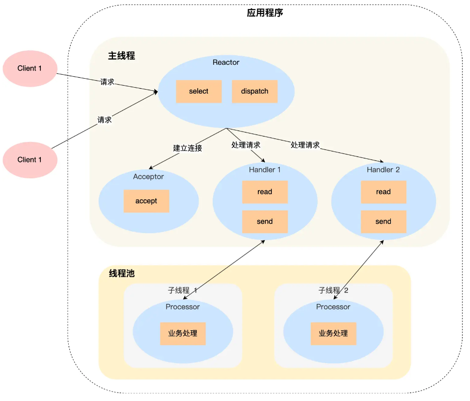

其中：

- Handler 对象不再负责业务处理，只负责对应连接的数据的收发。
- 业务交由子线程 Processor 进行处理。

优点：

- 能够充分利用多核 CPU 。

缺点：

- 需要控制子线程对共享资源的访问。（进行线程同步）
- 对于「单 Reactor」的模式，一个 Reactor 对象在主线程中承担所有事件的监听和响应，在面对瞬间高并发的场景时，容易成为性能瓶颈发生的地方。

事实上，「单 Reactor - 多进程」比「单 Reactor - 多线程」实现起来更麻烦，因为要考虑子进程和父进程的双向通信，并且父进程还得知道子进程要将数据发送给哪个客户端；而多线程间可以共享数据，虽然要额外考虑并发问题，但是这远比进程间通信的复杂度低得多，因此实际应用中也看不到「单 Reactor 多进程」的模式。

#### 多 Reactor - 多进程（线程）

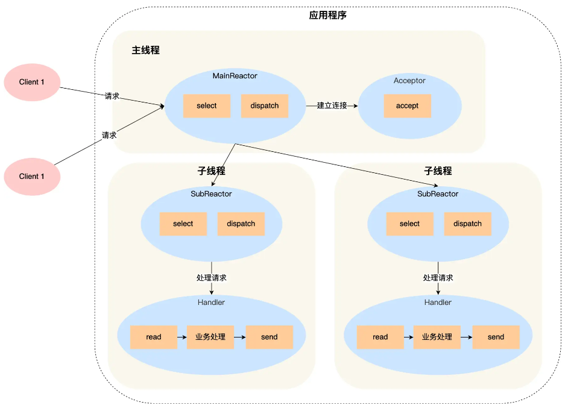

其中：

- 主线程的 MainReactor 对象分发事件，连接建立事件交由 Acceptor 建立连接，并将连接交由子线程 SubReactor 。
- 子线程的 SubReactor  监听 MainReactor 分发的连接，对每个连接使用一个 Handler 对象处理消息事件。
- 一个 SubReactor 可以同时监听多个连接。

优点：

- 「多 Reactor - 多进程（线程）」看起来方案复杂，但实现起来简单
	- 主线程和子线程分工明确，主线程只负责接收新连接，子线程负责完成后续的业务处理。
	- 主线程和子线程的交互很简单，主线程只需要把新连接传给子线程，子线程无须返回数据，直接就可以在子线程将处理结果发送给客户端。

应用情况：

- Netty 和 Memcache 都采用了「多 Reactor 多线程」的方案。
- Nginx 采用了「多 Reactor 多进程」方案，与标准方案有少许差异，差异如下：
	- 主进程只用来初始化 socket ，不使用 MainReactor 来 accept 连接。
	- 由子进程的 Reactor 来 accept 连接，并通过锁来控制一次只有一个子进程进行 accept（防止出现惊群现象）。
	- 子进程 accept 连接后，就放到自己的 Reactor 进行业务处理，不再分发到子进程。

### Proactor 模式

（“Pro actor”，注意 “pro” 这个前缀）

- Reactor 是非阻塞同步网络模式

	应用进程需要处理就绪可读写 IO 事件，需要主动读写数据（读取过程是同步的）。

- Proactor 是异步网络模式

	应用进程直接处理已完成的 IO 事件，读写数据由系统内核完成，应用进程可以直接处理读写完成后的数据。

异步 IO 比同步 IO 性能更好，因为异步 IO 的「内核数据准备好」和「数据从内核空间拷贝到用户空间」这两个过程中，应用进程都不用等待。

Reactor 和 Proactor，都是一种基于「事件分发」的网络编程模式，区别在于 Reactor 模式是基于「待完成」的 IO 事件，而 Proactor 模式则是基于「已完成」的 IO 事件。

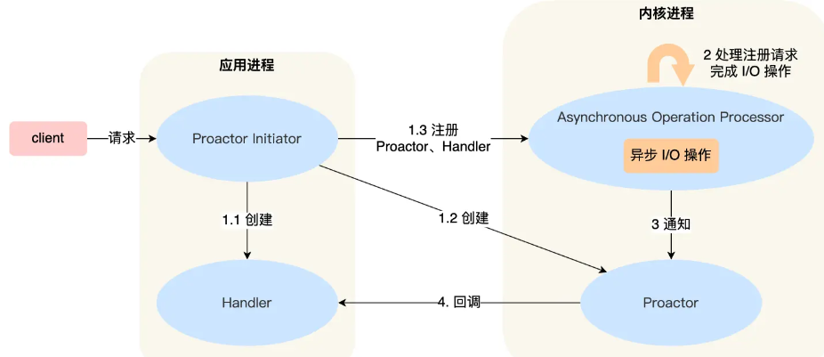

其中：

- Proactor Initiator 负责
	- 创建 Handler 和 Proactor 对象。
	- 将 Handler 和 Proactor 的信息发送给 Asynchronous Operation Processor 。
- Asynchronous Operation Processor 负责
	- 注册和维护 Handler 和 Proactor 的信息，应用进程通过 Handler 发起 read 或 write 。
	- 完成 IO 操作，完成后通知 Proactor 。
- Proactor 根据不同类型回调不同的 Handler 进行业务处理。（建立连接或处理消息）
- Handler 完成业务处理。

可惜的是，在 Linux 下的异步 IO 是不完善的，aio 系列函数是由 POSIX 定义的异步操作接口，尚未受真正的操作系统级别支持，只是在用户空间模拟出来的异步，并且仅仅支持基于本地文件的 aio 异步操作，网络编程中的 socket 是不支持的，这也使得基于 Linux 的高性能网络程序都是使用 Reactor 方案。

而 Windows 里实现了一套完整的支持 socket 的异步编程接口，这套接口就是 IOCP，是由操作系统级别实现的异步 IO，真正意义上异步 IO，因此在 Windows 里实现高性能网络程序可以使用效率更高的 Proactor 方案。

## Java NIO

（New IO，NIO）

Java NIO 为不同操作系统的 IO 多路复用提供了统一的抽象和不同的实现支持。

另外，使用 JAVA NIO 进行功能实现，相对于传统的 Socket 套接字实现要复杂一些，所以实际应用中，需要根据自己的业务需求进行技术选择。

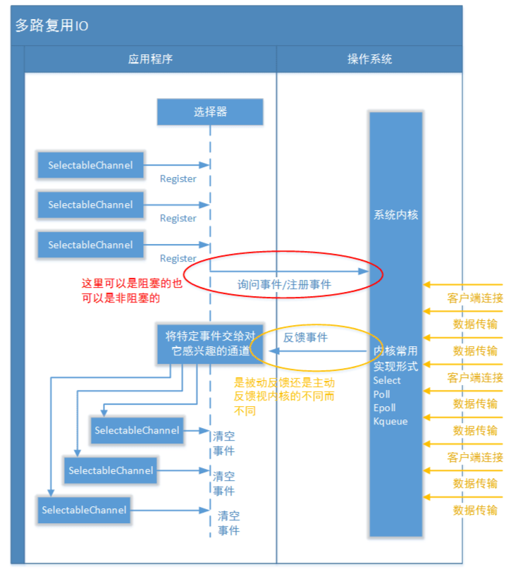

### 块式

I/O（传统 Java IO）与 NIO 最重要的区别是数据打包和传输的方式：

- I/O 以流的方式处理数据
	- 面向流的 I/O 一次处理一个字节数据。
	- 一个输入流产生一个字节数据，一个输出流消费一个字节数据。
	- 为流式数据创建过滤器非常容易，链接几个过滤器，以便每个过滤器只负责复杂处理机制的一部分。
	- 不利的一面是，面向流的 I/O 通常相当慢。
- NIO 以块的方式处理数据
	- 面向块的 I/O 一次处理一个数据块，按块处理数据比按流处理数据要快得多。
	- 但是面向块的 I/O 缺少一些面向流的 I/O 所具有的优雅性和简单性。

同时：

- I/O 是阻塞的，NIO 是非阻塞的。

### 通道 Channel

NIO 用通道（Channel）取代流：

- 流只能在一个方向上移动。
	- 一个流必须是 InputStream 或者 OutputStream 的子类。
- 通道是双向的，可以用于读、写或者同时用于读写。
	- 通道包括以下类型:
		- FileChannel: 从文件中读写数据；
		- DatagramChannel: 通过 UDP 读写网络中数据；
		- SocketChannel: 通过 TCP 读写网络中数据；
		- ServerSocketChannel: 可以监听新进来的 TCP 连接，对每一个新进来的连接都会创建一个 SocketChannel。

### 缓冲区 Buffer

发送数据到通道先放到缓冲区中，从通道读取数据也是先读到缓冲区中。

缓冲区实质上是一个数组，但它不仅仅是一个数组。缓冲区提供了对数据的结构化访问，而且还可以跟踪系统的读/写进程。

缓冲区包括以下类型：

- ByteBuffer
- CharBuffer
- ShortBuffer
- IntBuffer
- LongBuffer
- FloatBuffer
- DoubleBuffer

通过缓冲区实现了块式读写。

### 选择器 Selector

NIO 能够在网络通信中实现非阻塞 IO 。

NIO 实现了 IO 多路复用中的 Reactor 模型，使用一个选择器线程（Selector）通过轮询的方式去监听多个 Channel 上的事件，从而让一个线程就可以处理多个 Channel 。

通过配置监听的 Channel 为非阻塞，那么当 Channel 上的 IO 事件还未到达时，就不会进入阻塞状态一直等待，而是继续轮询其它 Channel，找到 IO 事件已经到达的 Channel 执行。

因为创建和切换线程的开销很大，因此使用一个线程来处理多个 Channel 获得多个事件，而不是一个线程处理一个 Channel 获得一个事件具有更好的性能。

只有 Socket Channel 才能配置为非阻塞，而 FileChannel 不能，为 FileChannel 配置非阻塞也没有意义。

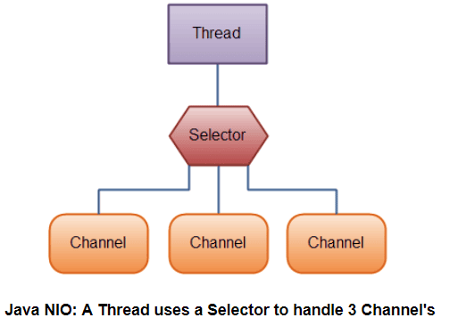

## Java AIO

异步 IO 采用“订阅-通知”模式，即应用程序向操作系统注册IO监听，然后继续做自己的事情。当操作系统发生IO事件，并且准备好数据后，再主动通知应用程序，触发相应的函数。

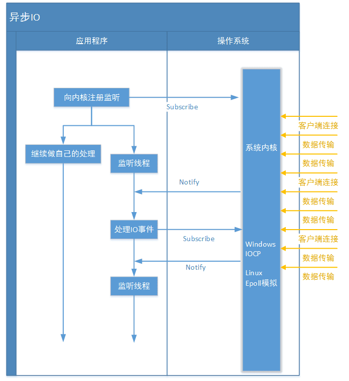

和同步IO一样，异步IO也是由操作系统进行支持的。

- 微软的 windows 系统提供了一种异步 IO 技术: IOCP（I/O Completion Port，I/O 完成端口）。
- Linux 由于没有这种异步 IO 技术，所以使用的是 epoll 对异步 IO 进行模拟。

在 JAVA AIO 框架中，由于应用程序不是“轮询”方式，而是订阅-通知方式，所以不再需要“selector”(选择器)了，改由 channel 通道直接到操作系统注册监听。

JAVA AIO框架中，只实现了两种网络IO通道：

- AsynchronousServerSocketChannel（服务器监听通道）
- AsynchronousSocketChannel（socket套接字通道）

但是无论哪种通道他们都有独立的 fileDescriptor(文件标识符)、attachment(附件，附件可以使任意对象，类似“通道上下文”)，并被 SocketChannelReadHandler 类实例引用。

## Netty

Netty是一个高性能、异步事件驱动的NIO框架，提供了对TCP、UDP和文件传输的支持。

作为当前最流行的NIO框架，Netty在互联网领域、大数据分布式计算领域、游戏行业、通信行业等获得了广泛的应用，一些业界著名的开源组件也基于Netty构建，比如 zookeeper 等。

为什么需要 Netty ？

- 虽然 JAVA NIO 和 JAVA AIO 框架提供了 多路复用IO/异步IO的支持，但是并没有提供上层“信息格式”的良好封装。例如前两者并没有提供针对 Protocol Buffer、JSON这些信息格式的封装，但是 Netty 框架提供了这些数据格式封装(基于责任链模式的编码和解码功能)。
- 要编写一个可靠的、易维护的、高性能的(注意它们的排序)NIO/AIO 服务器应用。除了框架本身要兼容实现各类操作系统的实现外。更重要的是它应该还要处理很多上层特有服务，例如: 客户端的权限、还有上面提到的信息格式封装、简单的数据读取。这些 Netty 框架都提供了相应的支持。
- api 简单，开发门槛低。
- 与其它业界主流的NIO框架对比，netty的综合性能最优
