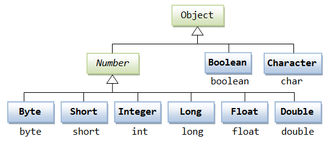
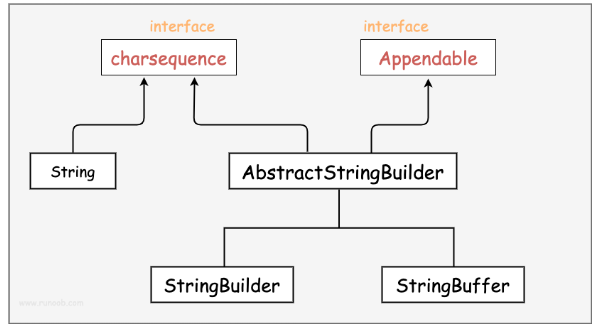
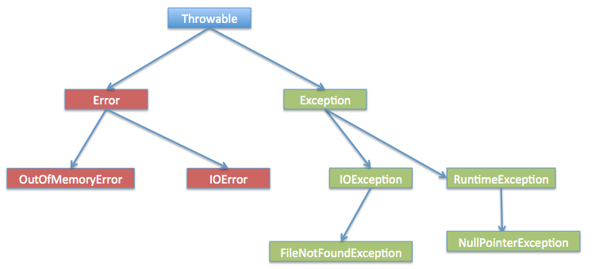

# Java SE 常用库

详细语法可见：[Java 教程 | 菜鸟教程](https://www.runoob.com/java/java-tutorial.html)。

java 的大部分语言特性都在 java.lang 和 java.util 包内。

## 基本类

- Number 数字包装类
- Character 字符包装类



包装类的比较运算需要使用函数。

- Math 基本数学计算类
- String 字符串类

创建格式化字符串：

```java
// 输出到 stdout
System.out.printf("浮点型变量的值为 " +
                  "%f, 整型变量的值为 " +
                  " %d, 字符串变量的值为 " +
                  "is %s", floatVar, intVar, stringVar);

// 输出到字符串变量
String fs;
fs = String.format("浮点型变量的值为 " +
                   "%f, 整型变量的值为 " +
                   " %d, 字符串变量的值为 " +
                   " %s", floatVar, intVar, stringVar);
```

- StringBuffer 和 StringBuilder 类

	操作可修改字符串。

	- StringBuilder 的方法不是线程安全的（不能并发访问）。（重要区别）
	- StringBuilder 一般快于 StringBuffer 。



- 原生数组

```java
int[] arr = {1, 2, 3};
Integer[] arr = new Integer[];
Integer[] arr = new Integer[n];
```

- Date 类

  封装当前的日期与时间，基于从 1970 年 1 月 1 日 00:00:00 GMT 起的毫秒数。

  - SimpleDateFormat 类

  	格式化日期。`parse()` 方法可以解析字符串到时间。

- Calendar 类

  一个抽象类，定义了比 Date 更多的功能，包括提取，计算等。

  - `getInstance()` 方法返回 GregorianCalendar 类的实例。

```java
Calendar c = Calendar.getInstance();   // 默认是当前日期
```

- Java 8 中的日期时间：

	- LocalDate 类
	- LocalTime 类
	- LocalDateTime 类
	- ZonedDateTime 类
	
- Scanner 类

  读取用户输入数据。

```java
next() 方法
nextLine() 方法
nextxxx() 方法，其中，xxx 表示某个数据类型
```

- java.util.regex 包，包含 Pattern 和 Matcher 类，用于处理正则表达式
- 高精度
	- BigInteger
	- BigDecimal

## 文件 IO 体系

- 路径

	- Path 类

		文件系统的文件路径

	- URL 类

		网络资源定位符

- 文件

  - File 类

    操作文件和目录。

  - Files 类

- 流操作
	- 字节流
		- InputStream 类

		- OutputStream 类
	- 字符流
		- Reader 类
		- Writer 类

网络文件的读取必须通过流，因为网络传输是流式的。

### 项目中的路径

Spring 的 Resource 下的文件在打包时会被自动打包到 jar 包里的 `BOOT-INF/classes/` 路径下（称为“类路径”），打包后的这些文件在磁盘上没有真实路径，而是位于 jar 文件内部的虚拟路径。

若要使路径在项目中和打包后都可用，可以采用以下方法：

- 使用 ClassPathResource 类。

```java
ClassPathResource resource = new ClassPathResource("file.txt");
InputStream inputStream = resource.getInputStream();
```

- 使用 ResourceLoader 类。

```java
@Autowired
private ResourceLoader resourceLoader;

Resource resource = resourceLoader.getResource("classpath:file.txt");
InputStream inputStream = resource.getInputStream();
```

- 如果只需要读取资源文件的内容，可以使用 `@Value` 注解直接将文件内容注入到属性中。

```java
@Value("classpath:file.txt")
private org.springframework.core.io.Resource resourceFile;

byte[] bytes = Files.readAllBytes(Paths.get(resourceFile.getURI()));
return new String(bytes);
```

其中，`classpath:` 这个前缀：

- 在项目中表示 resource 目录。
- 在 jar 包中表示 `BOOT-INF/classes/` 类目录。

## 异常处理

- 检查性异常

  最具代表的检查性异常是用户错误或问题引起的异常，这是程序员无法预见的。例如要打开一个不存在文件时，一个异常就发生了，这些异常在编译时不能被简单地忽略。

- 运行时异常

	运行时异常是可能被程序员避免的异常。与检查性异常相反，运行时异常可以在编译时被忽略。

- 错误

  错误不是异常，而是脱离程序员控制的问题。错误在代码中通常被忽略。例如，当栈溢出时，一个错误就发生了，它们在编译时无法被检查到。

所有异常类是从 java.lang.Exception 类继承的子类。

Exception 类和 Error 类是 Throwable 类的子类。

异常类有两个主要的子类：IOException 类和 RuntimeException 类。



## 集合框架

见单独笔记。

## 泛型

java 中泛型标记符：

- E 

	Element (在集合中使用，因为集合中存放的是元素)

- T

	 Type（Java 类）

- K

	Key（键）

- V 

	Value（值）

- N

	Number（数值类型）

- ?

	表示不确定的 java 类型

## 流

流式风格将要处理的元素集合看作一种流， 流在管道中传输，在管道的节点上进行中间操作（intermediate operation） 比如筛选， 排序，聚合等，然后由最终操作（terminal operation）得到最终结果。

- 元素是特定类型的对象，形成一个队列。 Java 中的 Stream 并不会存储元素，而是按需计算。

- 数据源

	流的来源。 可以是集合，数组，I/O channel， 产生器 generator 等。

- 聚合操作

	类似 SQL 语句一样的操作， 比如 filter, map, reduce, find, match, sorted 等。

### 生成流

```
stream()
为集合创建串行流。

parallelStream()
为集合创建并行流。
将对流的处理改为可以在多 CPU 核心上进行的并行处理。
```

### 处理

```
forEach

map

filter

limit

sorted
```

### 规约 聚合

- Collectors 类

	规定最终结果的格式，表现类型，属性。

```
.collect(Collectors.toList());
转换为 List 。
 
.collect(Collectors.joining(", "));
以 "，" 分隔，拼接字符串。
```

Java 16 开始，转换为 List 为例，可以直接写 `.toList()` 而不是 `.collect(Collectors.toList())` 。

### 统计

一些统计结果的收集器可以用来对 int、double、long 等基本类型产生统计结果。

```java
List<Integer> numbers = Arrays.asList(3, 2, 2, 3, 7, 3, 5);
 
IntSummaryStatistics stats = numbers.stream().mapToInt((x) -> x).summaryStatistics();
 
System.out.println("列表中最大的数 : " + stats.getMax());
System.out.println("列表中最小的数 : " + stats.getMin());
System.out.println("所有数之和 : " + stats.getSum());
System.out.println("平均数 : " + stats.getAverage());
```

