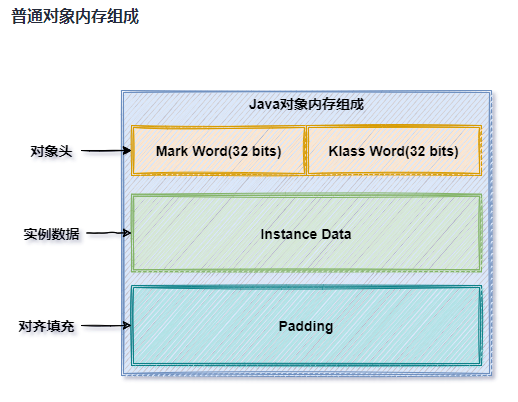
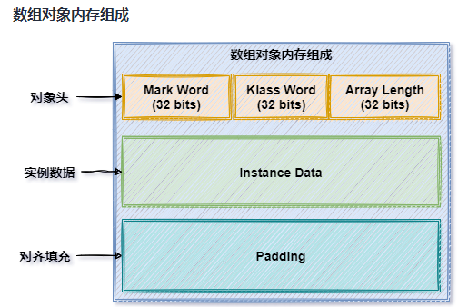
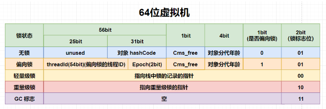
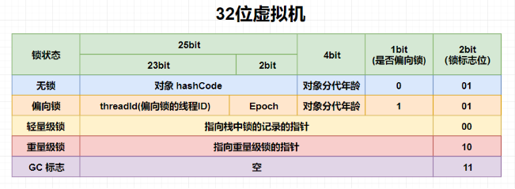
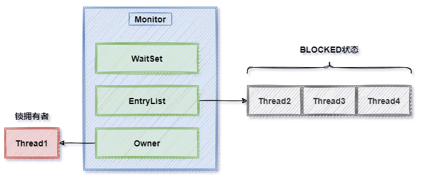
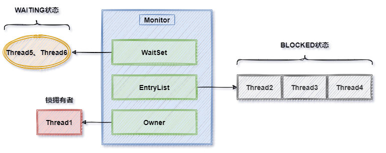
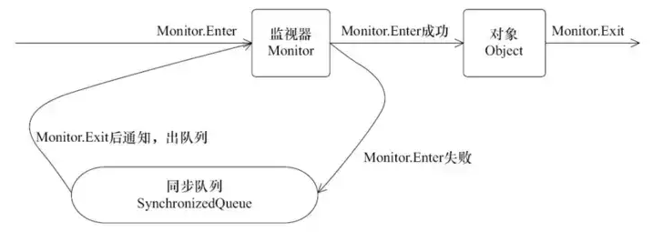

# Java 并发基础

建议复习的引用：

- [Java 并发理论基础](https://pdai.tech/md/java/thread/java-thread-x-theorty.html)
- [Java 线程基础](https://pdai.tech/md/java/thread/java-thread-x-thread-basic.html)
- [Java 中所有的锁](https://pdai.tech/md/java/thread/java-thread-x-lock-all.html)

- [关键字: synchronized 详解](https://pdai.tech/md/java/thread/java-thread-x-key-synchronized.html)

补充问题：

为什么 wait() notify() notifyAll() 是 Object 的方法，而 sleep() 是 Thread 的静态方法？因为：

- wait 等函数用于线程间的通信和相互控制，每个对象定义了线程的执行逻辑，这样可以通过多个对象控制多个线程。
- sleep 只作用于当前线程（多核时也是当前线程），当前线程肯定已获取（已知），所以可以用静态方法。

要注意：

- 线程
- 对象和实例
- 锁的数量

之间的关系。

CAS（Compare and Swap）是一条 CPU 的原子指令，基于硬件实现，用于保证单个变量修改的原子性：

- CAS 操作需要输入两个数值，一个旧值(期望操作前的值)和一个新值，在操作期间先比较下在旧值有没有发生变化，如果没有发生变化，才交换成新值，发生了变化则不交换。
- 如果值发生了变化，那么可能有其它线程在操作，可以选择自旋等待或者阻塞等待等操作。

## 关键字

### synchronized

synchronized 相对于 Lock 类的缺陷：

- 效率低

	锁的释放情况少，只有代码执行完毕或者异常结束才会释放锁；试图获取锁的时候不能设定超时，不能中断一个正在使用锁的线程，相对而言，Lock 可以中断和设置超时。

- 不够灵活

	加锁和释放的时机单一，每个锁仅有一个单一的条件(某个对象)，相对而言，Lock 的读写锁更加灵活。

- 无法知道是否成功获得锁

	相对而言，Lock 可以拿到是否成功获取的状态。

- 加锁条件单一

	Synchronized 加锁只与一个条件(是否获取锁)相关联，不灵活，后来 Condition 与 Lock 的结合解决了这个问题。

synchronized 是通过软件（JVM）实现的，简单易用，但使用的时候需要注意：

- 锁对象不能为空，因为锁的信息都保存在对象头里。
- 作用域不宜过大，影响程序执行的速度，控制范围过大，编写代码也容易出错。
- 避免死锁
- 在能选择的情况下，优先用 java.util.concurrent 包中的各种各样的类，如果不用该包下的类，尽量使用 synchronized 关键字，因为代码量少，可以避免出错。
- synchronized 实际上是非公平的，新来的线程有可能立即获得监视器，而在等待区中等候已久的线程可能再次等待，这样有利于提高性能，但是也可能会导致饥饿现象。

#### synchronized 锁的四种状态

在 JVM 控制下，它会随着竞争情况逐渐升级。锁可以升级但是不可以降级，目的是为了保证获取锁和释放锁的效率：

- 无锁

	- 当有某个线程访问同步块时升级为偏向锁。（锁膨胀）

- 偏向锁

	通过 Mark Word 存储锁偏向的线程ID，以后该线程在进入和退出同步块时不需要进行CAS操作来加锁和解锁。

	- 在有其它线程来竞争时，升级为轻量级锁。（锁膨胀）

- 轻量级锁

	通过 CAS 操作和自旋解决加锁问题，避免线程阻塞和唤醒而影响性能。

	- 一般自旋锁失败（默认四次）或自适应自旋锁超过限度时，升级为重量级锁。（锁膨胀）

- 重量级锁

	将除了拥有锁的线程以外的线程都阻塞。

##### 对象头

以 32 位虚拟机为例（64 位地址长度不同）

Java 对象在内存中由三部分组成：

- 对象头（Header）

	占8个字节共64位（数组对象头与普通对象头不同，数组对象头12个字节共96位）。

- 实例数据（Instance Data）

	存储对象的实际数据，大小与实际数据大小一致；

- 对齐填充（Padding）

	是可选项，用于将内存对齐为8字节的整数倍。

其中：

- Mark Word 用于存放 Monitor 的地址。
- Klass Word 用于存放实例对象所属的 Class 对象的指针（地址）。

##### Mark Word

Java 对象在不同的状态下，Mark Word 存储的值会发生变化。

在 64 位的虚拟机中：

在 32 位的虚拟机中：

其中：

- 初始状态（无锁状态）

  存储的是对象的hashcode、GC分代年龄、是否偏向锁和锁标志位。

- 偏向锁

	会记录偏向的线程的线程 ID 。

- 轻量级锁

	栈中存放轻量的锁记录。

- 重量级锁

  对象会关联一个 Monitor

GC 标记表示对象可回收。

#### synchronized 实现原理 - Monitor

Monitor 是：

- Monitor 从 Java 层面称为监视器锁，是实现 synchronized 关键字的机制。
- 从操作系统层面称为管程，由操作系统实现。
- Monitor 不是 Java 对象，是操作系统实现的功能组件，JVM 会使用该组件。
- Monitor 与 Java 对象相关联，被 synchronized 修饰的代码区域归属的类或实例会与一个 Monitor 相关联。

##### Monitor 结构

Monitor 由三部分组成：

- Owner

	用于记录当前 Monitor 的所属线程。

- EntryList

	一个链表结构，用于记录阻塞在当前锁对象上的线程。

- WaitSet

	用于记录获取锁之后由于等待其它线程准备资源而进入 Waiting 状态的线程，资源准备好后该线程会获取锁或者进入 EntryList 。

- Monitor 中有锁计数器，支持锁拥有者线程的重入。

当对象锁发生锁竞争时，在同一时刻只有一个线程能够获取到锁，其他线程会进入阻塞（BLOCKED）状态，并进入 EntryList 中等待锁释放后被唤醒，再次参与锁竞争（非公平）：

当对象获取到锁之后，由于某些资源并未准备完成，需要等待其他线程去准备资源，此时线程会通过 wait() / notify() 等方法进入等待/通知模式，在这种情况下线程释放锁之后会进入 WaitSet，当其他线程准备好资源之后会通知 WaitSet 中等待的线程，WaitSet 中的线程会进入到 EntryList 中，重新参与锁竞争：

##### 字节码指令

在被 synchronized 修饰的代码区域的字节码前后，JVM 会使用 monitorenter 和 monitorexit 指令：

- monitorenter

	关联一个操作系统Monitor对象，替换LOCK对象的Mark Word为Monitor地址。

- monitorexit

	还原Mark Word，将Monitor对象指针替换为monitorenter 加锁时保存在Monitor对象中的数据，如hashcode、分代年龄等数据；同时唤醒等待在EntryList中阻塞等待的线程。

### volatile

作用：

- 防重排序
- 修改共享变量后立刻将值从缓存刷新到内存。（线程缓存（也叫线程工作内存），CPU 缓存）
- 保证变量的单次读/写操作的原子性。
	- `i++` 是读、写两次操作，使用 volatile 不能保证其原子性，可以通过 AtomicInteger 或者  Synchronized 来保证自增操作的原子性。
	- long 和 double 类中类型的变量包含高32位和低32位两部分，因此单次读写不是原子性的，但目前各种 JVM 都把 64 位数据的读写操作作为原子操作来对待，所以不写 volatile 也可以保证其单次读写原子性。

## JUC 概述

`java.util.concurrent`（JUC）包含主要包含：

- Lock 框架和 Tools 类

- Collections

	并发集合

- Atomic

	原子类

- Executors

	线程池
