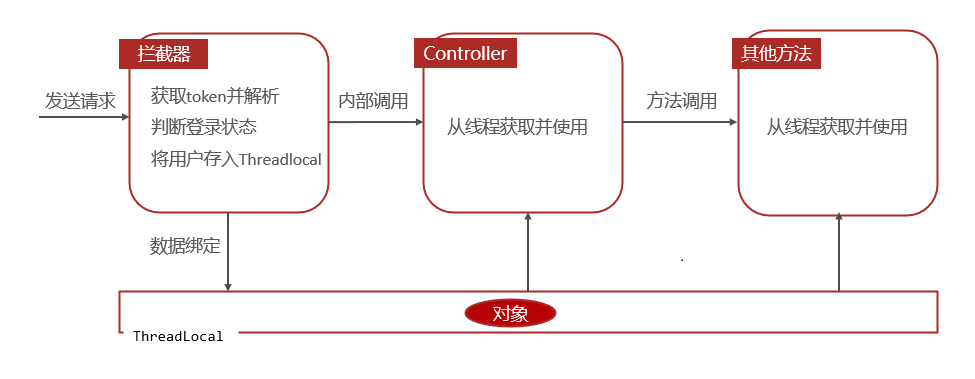

# 多线程

每一个 Java 线程都有一个调度优先级，是 1 （Thread.MIN_PRIORITY ） 到 10 （Thread.MAX_PRIORITY ）的整数。

默认情况下，每一个线程都会分配一个优先级 NORM_PRIORITY（5）。

注意线程优先级不能绝对保证线程执行的顺序，而且非常依赖于平台。

## 创建线程

### 通过实现 Runnable 接口来创建线程

```java
class RunnableDemo implements Runnable {
   private Thread t;
   private String threadName;
   
   RunnableDemo( String name) {
      threadName = name;
      System.out.println("Creating " +  threadName );
   }
   
   public void run() {
      System.out.println("Running " +  threadName );
      try {
         for(int i = 4; i > 0; i--) {
            System.out.println("Thread: " + threadName + ", " + i);
            // 让线程睡眠一会
            Thread.sleep(50);
         }
      }catch (InterruptedException e) {
         System.out.println("Thread " +  threadName + " interrupted.");
      }
      System.out.println("Thread " +  threadName + " exiting.");
   }
   
   public void start () {
      System.out.println("Starting " +  threadName );
      if (t == null) {
         t = new Thread (this, threadName);
         t.start ();
      }
   }
}
 
public class TestThread {
 
   public static void main(String args[]) {
      RunnableDemo R1 = new RunnableDemo( "Thread-1");
      R1.start();
      
      RunnableDemo R2 = new RunnableDemo( "Thread-2");
      R2.start();
   }   
}
```

其中：

- Thread 的 start 方法使得 Java 虚拟机调用该线程的 run 方法。
- run 方法中的代码会作为一个子线程内的主要代码运行。

### 通过继承 Thread 来创建线程

继承类必须重写 run() 方法，该方法是新线程的入口点。它也必须调用 start() 方法才能执行。

该方法尽管被列为一种多线程实现方式，但是本质上是实现了 Runnable 接口的一个实例。

```java
class ThreadDemo extends Thread {
   private Thread t;
   private String threadName;
   
   ThreadDemo( String name) {
      threadName = name;
      System.out.println("Creating " +  threadName );
   }
   
   public void run() {
      System.out.println("Running " +  threadName );
      try {
         for(int i = 4; i > 0; i--) {
            System.out.println("Thread: " + threadName + ", " + i);
            // 让线程睡眠一会
            Thread.sleep(50);
         }
      }catch (InterruptedException e) {
         System.out.println("Thread " +  threadName + " interrupted.");
      }
      System.out.println("Thread " +  threadName + " exiting.");
   }
   
   public void start () {
      System.out.println("Starting " +  threadName );
      if (t == null) {
         t = new Thread (this, threadName);
         t.start ();
      }
   }
}
 
public class TestThread {
 
   public static void main(String args[]) {
      ThreadDemo T1 = new ThreadDemo( "Thread-1");
      T1.start();
      
      ThreadDemo T2 = new ThreadDemo( "Thread-2");
      T2.start();
   }   
}
```

### 通过 Callable 和 Future 创建线程

1. 创建 Callable 接口的实现类，并实现 call() 方法，该 call() 方法将作为线程执行体，并且有**返回值**。

2. 创建 Callable 实现类的实例，使用 FutureTask 类来包装 Callable 对象，该 FutureTask 对象封装了该 Callable 对象的 call() 方法的返回值。

3. 使用 FutureTask 对象作为 Thread 对象的 target 创建并启动新线程。

4. 调用 FutureTask 对象的 get() 方法来获得子线程执行结束后的返回值。

```java
public class CallableThreadTest implements Callable<Integer> {
    public static void main(String[] args)  
    {  
        CallableThreadTest ctt = new CallableThreadTest();  
        FutureTask<Integer> ft = new FutureTask<>(ctt);  
        for(int i = 0;i < 100;i++)  
        {  
            System.out.println(Thread.currentThread().getName()+" 的循环变量i的值"+i);  
            if(i==20)  
            {  
                new Thread(ft,"有返回值的线程").start();  
            }  
        }  
        try  
        {  
            System.out.println("子线程的返回值："+ ft.get());  
        } catch (InterruptedException e)  
        {  
            e.printStackTrace();  
        } catch (ExecutionException e)  
        {  
            e.printStackTrace();  
        }  
  
    }
    @Override  
    public Integer call() throws Exception  
    {  
        int i = 0;  
        for(;i<100;i++)  
        {  
            System.out.println(Thread.currentThread().getName()+" "+i);  
        }  
        return i;  
    }  
}
```

### 三种方式对比

- 采用实现 Runnable 接口的方式
	- 只是实现了  Runnable 接口，还可以继承其它类。
- 采用继承 Thread 类的方式
	- 编写简单，如果需要访问当前线程，则无需使用 Thread.currentThread() 方法，直接使用 this 即可获得当前线程。
	- Java 只能单继承，不能继承其它类。
- 采用实现 Runnable、Callable 接口的方式
	- 有返回值。（由于 Callable）
	- 线程类只是实现了 Runnable 接口或 Callable 接口，还可以继承其他类。

## ThreadLocal

ThreadLocal 并不是一个Thread，而是 Thread 的局部变量。

ThreadLocal 为每个线程提供单独一份存储空间，具有线程隔离的效果，只有在线程内才能获取到对应的值，线程外则不能访问。

在一个线程中，横跨若干方法调用，需要传递的对象，我们通常称之为上下文（Context），它是一种状态，可以是用户身份、任务信息等。

可用于在一个线程内的不同函数间传递 Context 。

常用方法：

- public void set(T value) 

	设置当前线程的线程局部变量的值

- public T get()

	返回当前线程所对应的线程局部变量的值

- public void remove() 

	移除当前线程的线程局部变量

考虑，当新增员工时，想要记录是谁新增了员工信息，即记录当前操作者的 id ，方式如下：

- 拦截器可以获取请求的 jwt ，同时从 jwt 中获取当前登录的员工的 id 信息。
- 将用户 id 存储到 ThreadLocal ，然后在 service 中获取后保存的数据库。



1. 写一个封装 ThreadLocal 操作的工具类：

类中存储了需要传递的数据，已经存储获取的方法。

```java
package com.sky.context;

public class BaseContext {

    public static ThreadLocal<Long> threadLocal = new ThreadLocal<>();   // 通常以静态字段初始化

    public static void setCurrentId(Long id) {
        threadLocal.set(id);
    }

    public static Long getCurrentId() {
        return threadLocal.get();
    }

    public static void removeCurrentId() {
        threadLocal.remove();
    }

}
```

2. 在拦截器中解析出当前登录员工id，并放入线程局部变量中。

```java
package com.sky.interceptor;

/**
 * jwt令牌校验的拦截器
 */
@Component
@Slf4j
public class JwtTokenAdminInterceptor implements HandlerInterceptor {

    @Autowired
    private JwtProperties jwtProperties;

    /**
     * 校验jwt
     *
     * @param request
     * @param response
     * @param handler
     * @return
     * @throws Exception
     */
    public boolean preHandle(HttpServletRequest request, HttpServletResponse response, Object handler) throws Exception {
        
		//.............................
       
        //2、校验令牌
        try {
            //.................
            Claims claims = JwtUtil.parseJWT(jwtProperties.getAdminSecretKey(), token);
            Long empId = Long.valueOf(claims.get(JwtClaimsConstant.EMP_ID).toString());
            log.info("当前员工id：", empId);
            /////将用户id存储到ThreadLocal////////
            BaseContext.setCurrentId(empId);
            ////////////////////////////////////
            //3、通过，放行
            return true;
        } catch (Exception ex) {
            //......................
        }
    }
}
```

3. 在 Service 中获取线程局部变量中的值

```java
	/**
     * 新增员工
     *
     * @param employeeDTO
     */
    public void save(EmployeeDTO employeeDTO) {
        //.............................

        //设置当前记录创建人id和修改人id
        employee.setCreateUser(BaseContext.getCurrentId());//目前写个假数据，后期修改
        employee.setUpdateUser(BaseContext.getCurrentId());

        employeeMapper.insert(employee);
    }
```

