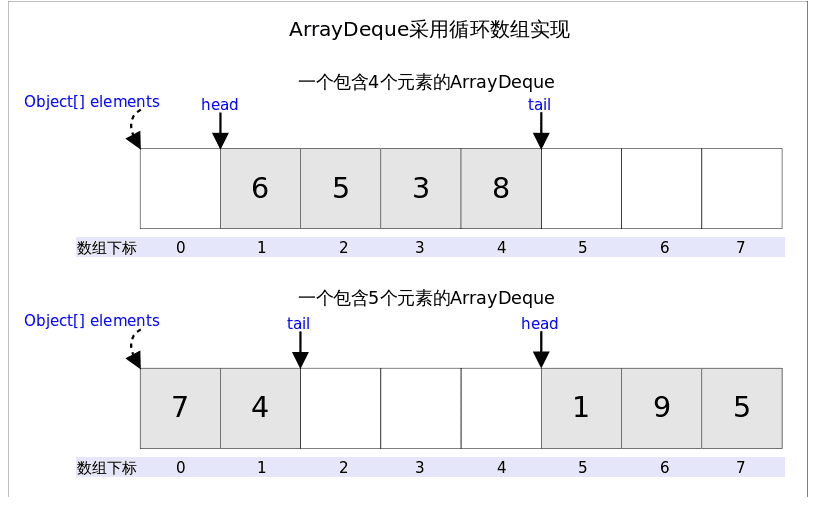
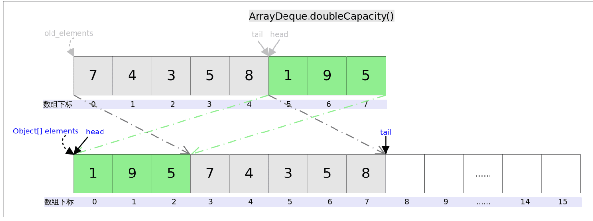
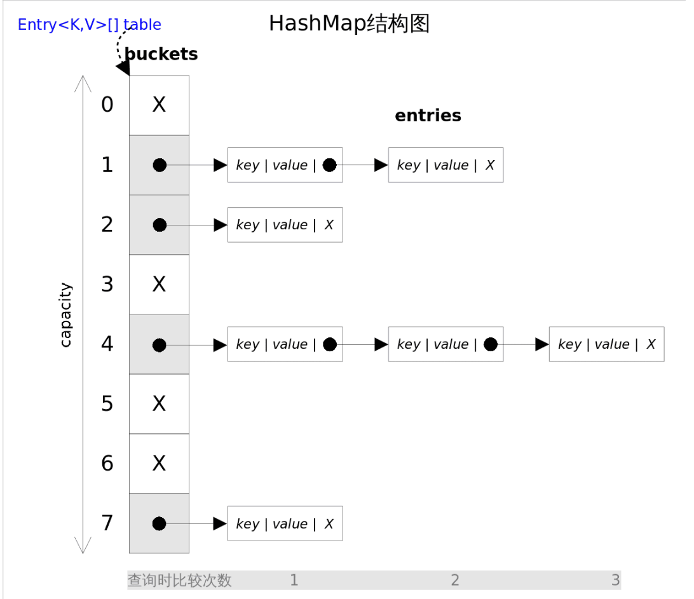
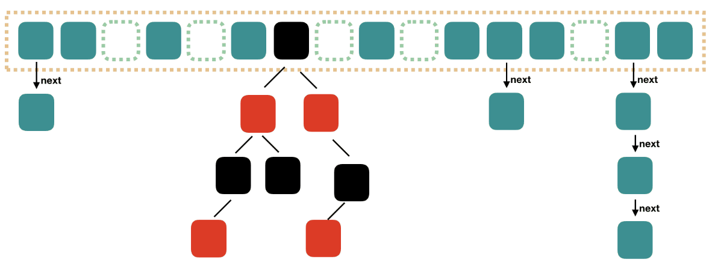
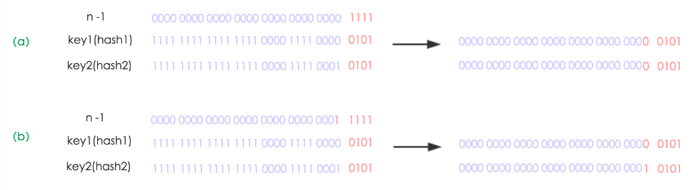
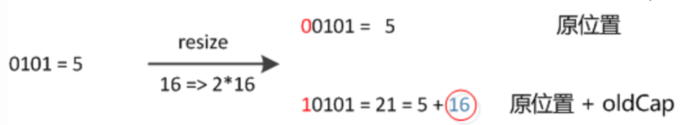
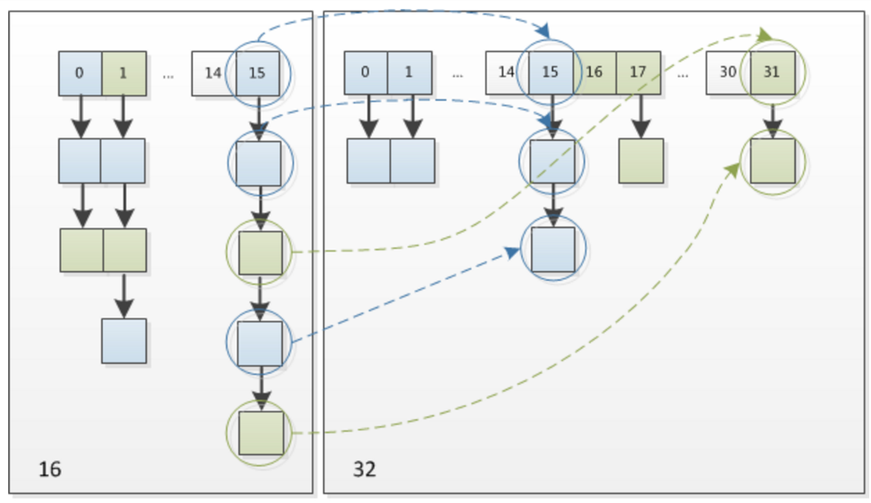
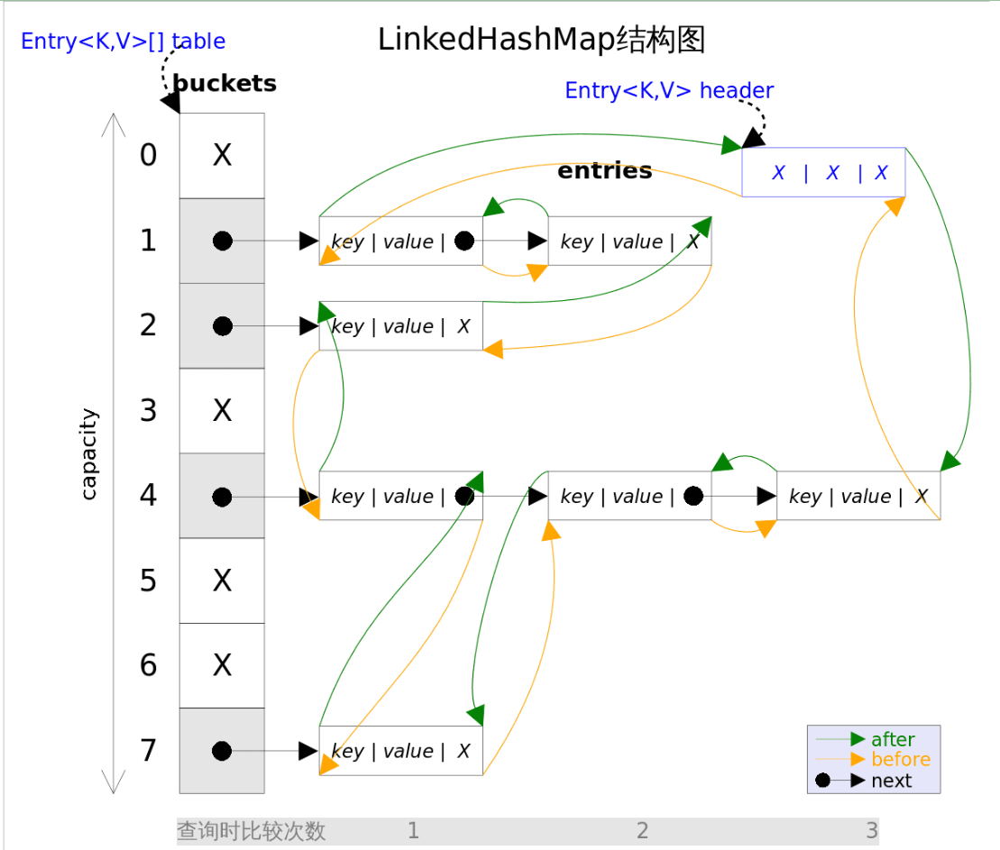
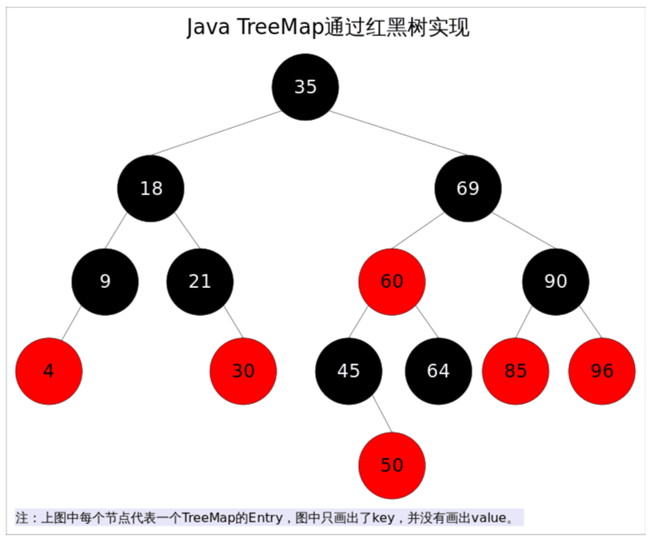

## 容器框架

也称 Java 集合框架（Java Collections Framework，JCF）（包括 Map 相关的类）

其中的一些接口和抽象类可以用于自定义容器。

Java 的容器框架基于 Java 泛型，也就是说，容器存储的对象引用都是 Object ，其取元素方法在取出元素引用时会进行类型转换。


## 总览

### Collection（接口）

Collection 接口定义一组不唯一，无序的对象。

- Set（接口）

	Set 接口定义一组唯一，无序的对象。

	- TreeSet

		有序集合，基于红黑树，不允许重复元素。

	- HashSet

		无序集合，基于 HashMap 。

	- LinkedHashSet

		基于 LinkedList 实现的有序集合，链表用于记录元素的插入顺序，哈希表用于保证元素的唯一性。

	- SortedSet

		有序的 Set ，可指定 Comparator 。

- List（接口）

	列表，注意不是“链表”。

	- Arrays

		静态数组，不可变大小。

	- ArrayList

		动态数组，可变大小。

	- LinkedList

		双向链表。

	- SingletonList

		单元素不可变列表。

- Queue（接口）

	Java 没有 Queue 类，只有 Queue 接口，可用 ArrayDeque（性能更高）或 LinkedList 代替。

	- LinkedList

		LinkedList 实现了 Queue 接口，可将其作为 Queue 使用（其它接口类似），使用时：`Queue<String> queue = new LinkedList<>();`

	- Deque（接口）
	
		- ArrayDeque
		
		  通过循环数组实现的双端队列。
	
	- PriorityQueue
	
	  优先队列，亦是 Heap（堆） 。

### Map（接口）

- TreeMap

	有序映射，基于红黑树。

- HashMap

	无序映射，基于 HashTable 。

- HashTable

	哈希表。

- LinkedHashMap

	基于 LinkedList 实现的有序 HashMap 。

- SortedMap

	有序 Map（key 有序）。

- WeakHashMap

	使用弱密钥的 HashMap 。

- IdentityHashMap

	一种特殊的哈希表实现，使用"引用相等"（而不是"对象相等"）判断键的唯一性，当且仅当两个键引用同一个对象时，它们被认为是相等的。

### 传统遗留

- Enumeration（接口）（已被迭代器取代）

	枚举，定义了一种从数据结构中取回连续元素的方式，主要方法为 `nextElement `，用来取得下一个元素。

- BitSet

	位集合，数组大小会自动增大。

- Vector

	向量，类似于原生数组，数组大小会动态变化。是同步访问的。

- Stack（不建议使用）

	栈，基于 Vector 。可用 ArrayDeque（性能更高）或 LinkedList 代替。

- Dictionary（已弃用）

	字典，是一个抽象类，定义了键映射到值的数据结构。

- HashTable

	哈希表，原始 Dictionary 的具体实现，Java 2 对其进行了重构，实现了 Map 接口。支持同步访问。

- Properties 

	属性，表示了一个持久的属性集，属性列表中每个键及其对应值都是一个字符串，常用于存储程序的配置信息。继承自 HashTable 。

### 辅助

- 集合算法

	Collections 接口。

- 迭代器

	Literator 接口，ListIterator 接口。

	- Java 迭代器是一种单向遍历机制，只能从前往后遍历集合中的元素，不能往回遍历。
	- 在使用迭代器遍历集合时，不能直接修改集合中的元素，而是需要使用迭代器的 remove() 方法来删除当前元素。

- 比较器

	Comparator 接口。

## 通用知识

### fail-fast

[一文彻底弄懂fail-fast、fail-safe机制（带你撸源码）fail-fast 机制是Java集合(Collec - 掘金](https://juejin.cn/post/6879291161274482695)

fail-fast （快速失败）机制是一种错误机制。

在用迭代器遍历一个集合对象时，如果遍历过程中对集合结构进行了修改（增加、删除）（没有 update，只是针对容器的结构），则会立即抛出 Concurrent Modification Exception（并发修改异常）（单线程和多线程时都可能发生），避免错误代码继续执行。

但它的实现不能保证所有该情况下（在遍历中修改集合结构）的行为都会产生该异常。

增强 for 循环相当于使用迭代器。

为了安全使用，建议使用迭代器的 remove() 方法或计数 for 循环进行手动控制。

### fail-safe

典型的采用 fail-safe 机制的容器是 CopyOnWriteArrayList ，它采用写时复制：

- 在修改元素时，会复制出新的容器进行修改，没有被读时再同步到原容器。（本质是同时维护两份容器）
- 原容器可以任意并发读，因为原容器在读时不会被更改。
- 添加的时候需要加锁，否则多线程写的时候会复制出多个副本。（同时维护多份容器）
- CopyOnWrite 容器只能保证数据的最终一致性，不能保证数据的实时一致性，不能保证写入的数据马上能读到。

## List

### ArrayList

底层通过 Java 原生数组实现。

ArrayList 没有实现同步(synchronized)，如果需要多个线程并发访问，用户可以手动同步，也可使用 Vector 替代。

有容量 capacity ，具有自动扩容机制，每次扩容时会拷贝旧数组，新数组的容量是旧数组的 1.5 倍。

#### remove 方法

删除时需要将删除点之后的元素向前移动一个位置。

注意，为了让 GC 起作用，必须显式的为 capacity 中空缺的位置（当前最后一个位置）赋`null`值。

```java
public E remove(int index) {
    rangeCheck(index);
    modCount++;
    E oldValue = elementData(index);
    int numMoved = size - index - 1;
    if (numMoved > 0)
        System.arraycopy(elementData, index+1, elementData, index, numMoved);
    elementData[--size] = null; //清除该位置的引用，让GC起作用
    return oldValue;
}
```

**有了垃圾收集器（GC）并不意味着一定不会有内存泄漏**，对象能否被GC的依据是是否还有引用指向它，上面代码中如果不手动赋`null`值，除非对应的位置被其他元素覆盖，否则原来的对象就一直不会被回收。

### LinkedList

LinkedList 同时实现了 List 接口和 Deque 接口，可以作为 Queue ，也可以作为 Stack ，

为追求效率，LinkedList 没有实现同步(synchronized)，如果需要多个线程并发访问，可以先采用 `Collections.synchronizedList()` 方法对其进行包装。

底层采用双端链表实现，没有额外头尾结点，也叫哑元（Dummy）结点。

#### add 方法

需要先查找元素，当所需 index 大于 size 的一半时，从末尾开始找，反之从开头开始找。

#### clear 方法

为了让GC更快可以回收放置的元素，将node之间的引用关系赋空。

```java
/**
 * Removes all of the elements from this list.
 * The list will be empty after this call returns.
 */
public void clear() {
    // Clearing all of the links between nodes is "unnecessary", but:
    // - helps a generational GC if the discarded nodes inhabit
    //   more than one generation
    // - is sure to free memory even if there is a reachable Iterator
    for (Node<E> x = first; x != null; ) {
        Node<E> next = x.next;
        x.item = null;
        x.next = null;
        x.prev = null;
        x = next;
    }
    first = last = null;
    size = 0;
    modCount++;
}
```

### Stack & Queue

Stack 和 Queue 的方法有两套，在发生错误时，一套抛出异常，一套返回 null 。

### ArrayDeque

ArrayDeque 底层通过数组实现，为了满足可以同时在两端插入或删除元素的需求，该数组还必须是循环的，即循环数组（circular array），该数组的任何一点都可能被看作起点或者终点。

ArrayDeque 是非线程安全的（not thread-safe），当多个线程同时使用的时候，需要手动同步。

ArrayDeque 不允许放入`null`元素。



其中，head 指向第一个元素，tail 是超尾指针。

ArrayDeque 具有自动扩容机制，每次为原数组的 2 倍：



其中，复制需要两次，一次 head 右边的元素，一次 head 左边的元素。

### PriorityQueue

PriorityQueue 不允许放入`null`元素。

PriorityQueue 底层通过基于数组实现的堆实现。

## Set

### TreeSet

TreeSet 基于 TreeMap 封装实现，将一个 Object 对象作为 value 进行占位。（适配器模式）

```java
// TreeSet是对TreeMap的简单包装
public class TreeSet<E> extends AbstractSet<E>
    implements NavigableSet<E>, Cloneable, java.io.Serializable
{
	......
    private transient NavigableMap<E,Object> m;
    // Dummy value to associate with an Object in the backing Map
    private static final Object PRESENT = new Object();
    public TreeSet() {
        this.m = new TreeMap<E,Object>();// TreeSet里面有一个TreeMap
    }
    ......
    public boolean add(E e) {
        return m.put(e, PRESENT)==null;
    }
    ......
}
```

### HashSet

HashSet 基于 HashMap 封装实现，将一个 Object 对象作为 value 进行占位：（适配器模式）

```java
//HashSet是对HashMap的简单包装
public class HashSet<E>
{
	......
	private transient HashMap<E,Object> map;//HashSet里面有一个HashMap
    // Dummy value to associate with an Object in the backing Map
    private static final Object PRESENT = new Object();
    public HashSet() {
        map = new HashMap<>();
    }
    ......
    public boolean add(E e) {//简单的方法转换
        return map.put(e, PRESENT)==null;
    }
    ......
}
```

### LinkedHashSet

LinkedHashSet 基于 LinkedHashMap 封装实现，将一个 Object 对象作为 value 进行占位。（适配器模式）

### WeakHashSet（不存在）

Java Collections 工具类的 `Collections.newSetFromMap(Map<E,Boolean> map)` 方法可以将任何 Map 包装成一个 Set，可以用如下方法得到一个 WeakHashSet ：

```java
// 将WeakHashMap包装成一个Set
Set<Object> weakHashSet = Collections.newSetFromMap(
        new WeakHashMap<Object, Boolean>());
```

其中，`newSetFromMap()`方法只是对传入的 Map 做了简单包装:

```java
// Collections.newSetFromMap()用于将任何Map包装成一个Set
public static <E> Set<E> newSetFromMap(Map<E, Boolean> map) {
    return new SetFromMap<>(map);
}

private static class SetFromMap<E> extends AbstractSet<E>
    implements Set<E>, Serializable
{
    private final Map<E, Boolean> m;  // The backing map
    private transient Set<E> s;       // Its keySet
    SetFromMap(Map<E, Boolean> map) {
        if (!map.isEmpty())
            throw new IllegalArgumentException("Map is non-empty");
        m = map;
        s = map.keySet();
    }
    public void clear()               {        m.clear(); }
    public int size()                 { return m.size(); }
    public boolean isEmpty()          { return m.isEmpty(); }
    public boolean contains(Object o) { return m.containsKey(o); }
    public boolean remove(Object o)   { return m.remove(o) != null; }
    public boolean add(E e) { return m.put(e, Boolean.TRUE) == null; }
    public Iterator<E> iterator()     { return s.iterator(); }
    public Object[] toArray()         { return s.toArray(); }
    public <T> T[] toArray(T[] a)     { return s.toArray(a); }
    public String toString()          { return s.toString(); }
    public int hashCode()             { return s.hashCode(); }
    public boolean equals(Object o)   { return o == this || s.equals(o); }
    public boolean containsAll(Collection<?> c) {return s.containsAll(c);}
    public boolean removeAll(Collection<?> c)   {return s.removeAll(c);}
    public boolean retainAll(Collection<?> c)   {return s.retainAll(c);}
    // addAll is the only inherited implementation
    ......
}
```

## Map

### HashMap

HashMap 实现了 Map 接口，即允许放入`key`为`null`的元素（只有一个），也允许插入`value`为`null`的元素（可有多个）。

HashMap 没有实现同步，此外跟`Hashtable`大致相同。

HashMap 采用的连表为单链表。

HashMap 不保证元素顺序，根据需要该容器可能扩容，元素的顺序也会被重新打散，因此不同时间迭代同一个 HashMap 的顺序可能会不同。（TreeMap 保证顺序）

哈希表有两种冲突处理方式：

- 开放地址方式(Open addressing)
- 冲突链表方式(Separate chaining with linked lists)（Java7  HashMap 采用）



#### put 方法

插入前先查找，看是否存在，在链表上的插入方式为头插法。（JDK 1.8 使用尾插法）

#### 重写 equal 方法

HashMap 和 HashSet 需要注意两个方法：（自定义对象要重载这两个方法）

- `hashCode()`

	决定了对象被放到哪个 bucket 。

- `equals()`

	当发生哈希冲突时，使用该方法判断对象相等性。

HashMap在比较元素时，会先通过hashCode进行比较，相同的情况下再通过equals进行比较。

所以 equals相等的两个对象，hashCode一定相等。hashCode相等的两个对象，equals不一定相等（比如散列冲突的情况）

#### Java 8 HashMap

Java 8 中，HashMap 引入了红黑树，由数组 + 链表 + 红黑树组成。

为了降低哈希冲突时在链表中的查找开销（$O(n)$），在 Java 8 中：

- 当链表元素达到 8 个时，链表会转换为红黑树，查找复杂度降低到 $O(\log n)$ 。
- 当数量小于 6 时，会将红黑树转换回链表。



其中，哈希表中的数据非常多，应当已经扩容了，不过该图只是用于演示结构。

数据结点：

- Java7 中使用 Entry 表示

	包含 key，value，hash 和 next 这四个属性。

- Java8 中

	一样是四个属性。

	- 链表使用 Node 。
	- 红黑树使用 TreeNode 。
	- 根据数组元素中，第一个节点数据类型是 Node 还是 TreeNode 来判断该位置下是链表还是红黑树的。

#### 扩容机制

HashMap 有两个重要参数：

- 初始容量（inital capacity）

	指定了初始`table`的大小。

- 负载系数（load factor）

	指定自动扩容的临界值，当entry（包括链表或红黑树上的 entry）的总数量超过 `capacity*load_factor` 时，容器将自动扩容。

hashMap默认的负载因子是0.75，即如果hashmap中的元素个数超过了总容量75%，则会触发扩容。

扩容分为两个步骤：

1. 建立新的哈希表，长度为原来的 2 倍。
2. 将旧哈希表的元素移动到新的哈希表中。

##### 扩容时 table index 的变化

[参考](https://tech.meituan.com/2016/06/24/java-hashmap.html)

在 JDK1.7，所有的 key 需要重新哈希确定新的 table index；

在 JDK1.8，所有的 Key 的 table index 执行以下的快速变化：

假设 hash 函数对 key 计算出的 hash 值会在对 table length 取模（确保其在 table 范围内）后成为 table index 。（与实际源码原理相近）

因为是 2 次幂的扩展（2 倍），元素的位置要么是在原位置，要么是在原位置再移动2次幂的位置，示例如下：



其中：

- n 为 table 的长度
- 图（a）表示扩容前。
- 图（b）表示扩容后。
- 灰色二进制部分为 key 的值（key1，key2）
- 红色二进制部分为 key 在 hash 后的 hash 值（hash1，hash2）。
- hash 值与 n 取模后成为 table index，这相当于与 n - 1 进行按位与运算。

元素在重新计算 hash 之后，因为 n 变为 2 倍，那么 n - 1 的范围在高位多 1 bit(红色)，因此新的 index 可能发生两种变化：



其中，16 为旧 table 容量。

因此，HashMap 在扩容时，不需要像 JDK1.7 那样重新 hash，只需要判断 key 对应的 hash 值新增的那个 bit 是 1 还是 0，是 0 则 index 不变，是 1 则 index 变成“原索引+oldCap” 。

这个设计既省去了重新计算 hash 值的时间，而且同时，由于新增的1bit是0还是1可以认为是随机的，因此resize的过程，均匀的把之前的冲突的节点分散到新的bucket了，降低了冲突的概率。

下图为 16 扩充为 32 的 resize 示意图：



### LinkedHashMap

LinkedHashMap 实现了 Map 接口，即允许放入`key`为`null`的元素，也允许插入`value`为`null`的元素。

LinkedHashMap  同时满足 HashMap 和 Linked List 的某些特性，可将 LinkedHashMap 看作采用 Linked List 增强的 HashMap 。



LinkedHashMap  在 HashMap 的基础上，采用一个双向链表将所有单链表的 entry 链接起来，用来保证元素的迭代顺序与插入顺序一致（记录元素的插入顺序）。

其中的双向链表有一个哑元 header 指向其头部。

遍历元素时，HashMap 需要遍历 Table 和各链表（迭代时间与 table 大小有关），但 LinkedHashMap  只需要从 header 开始遍历双向链表即可（迭代时间只与 entry 个数有关）。

LinkedHashMap 是非同步的（not synchronized），以保证性能，多线程环境下需要手动同步。

可以手动包装成（wrapped）同步的：

```java
Map m = Collections.synchronizedMap(new LinkedHashMap(...));
```

#### put 方法

- 从`table`的角度看，新的`entry`需要插入到对应的`bucket`里，当有哈希冲突时，采用头插法将新的`entry`插入到冲突链表的头部。
- 从`header`的角度看，新的`entry`需要插入到双向链表的尾部。

#### remove 方法

- 从`table`的角度看，需要将该`entry`从对应的`bucket`里删除，如果对应的冲突链表不空，需要修改冲突链表的相应引用。
- 从`header`的角度来看，需要将该`entry`从双向链表中删除，同时修改链表中前面以及后面元素的相应引用。

#### LinkedHashMap 经典用法

使用 LinkedHashMap 可以轻松实现 FIFO（First-In-First-Out）替换策略的缓存（缓存需要 Map 功能）。

LinkedHashMap 有一个方法 `protected boolean removeEldestEntry(Map.Entry<K,V> eldest)`，该方法用于告诉 Map 是否要删除“最老”的Entry，也就是最早插入的 Entry，如果返回`true`，该 entry 就会被删除。

在每次插入新元素的之后，LinkedHashMap 会自动询问 removeEldestEntry() 是否要删除最老的元素。

这样只需要在子类中重载该方法，当元素个数超过一定数量时让 removeEldestEntry() 返回true，就能够实现一个固定大小的 FIFO 策略的缓存。

### TreeMap

TreeMap 实现了 SortedMap 接口，也就是说会按照 `key` 的大小对 Map 中的元素进行排序，`key` 大小的评判可以通过其本身的自然顺序(natural ordering)，也可以通过构造时传入的比较器(Comparator)。

TreeMap 底层通过红黑树(Red-Black tree) 实现，也就意味着`containsKey()`, `get()`, `put()`, `remove()`都有着`log(n)`的时间复杂度。

TreeMap 是一个独立的红黑树，key 和 value 都存储在树结点中，不用计算 Hash 函数。



TreeMap 是非同步的(not synchronized)，多线程环境下可以手动同步或者包装（wrapped）成同步：

```java
SortedMap m = Collections.synchronizedSortedMap(new TreeMap(...));
```

红黑树是一种近似平衡的二叉查找树。

### WeakHashMap

WeakHashMap 中的 entry 可能被 GC 自动删除，即使没有手动调用 remove 或 clear 方法。

WeakHashMap 特别适用于需要缓存的场景，在缓存场景下，由于内存是有限的，不能缓存所有对象；对象缓存命中可以提高系统效率，但缓存MISS也不会造成错误，因为可以通过计算重新得到。

- 弱引用（Weak Reference）

	虽然弱引用可以用来访问对象，但进行垃圾回收时弱引用并不会被考虑在内，仅有弱引用指向的对象仍然会被GC回收。

- 强引用（Strong Reference）

	一般使用的引用。

WeakHashMap 内部通过弱引用管理 `entry` ，将一对`key, value`放入到 WeakHashMap 里并不能避免该`key`值被GC回收，除非在 WeakHashMap 之外还有对该`key`的强引用。

## 线程安全

### util 包

为保证性能，`java.util` 包中大部分类都是非线程安全的。

其中线程安全的类主要有 2 个：

- Vector

	线程安全的动态数组，内部方法都经过 synchronized 修饰。

- HashTable（建议用 ConcurrentHashMap）

	线程安全的哈希表，加锁方法是给每个方法加上 synchronized 关键字。

	- 这样加锁锁住的是整个 Table 对象，开销大。
	- 不支持 null 键和值。

### concurrent 包

`java.util.concurrent` 包提供的都是线程安全的集合：

并发 Map ：

- ConcurrentHashMap

	与 HashTable 的主要区别是二者加锁粒度的不同。

	- 在 JDK 1.7 ，加分段锁（Segment 锁），每个 Segment 含有整个 table 的一部分，这样不同分段之间的并发操作就互不影响。
	- 在 JDK 1.8 ，改为直接在 table 元素上加锁，进一步减小了并发冲突的概率。

- ConcurrentSkipListMap

并发 Set ：

- ConcurrentSkipListSet

	是 ConcurrentSkipListMap 的封装。

- CopyOnWriteArraySet

	通过动态数组实现，功能上相当于线程安全的 HashSet（通过散列表实现）。

并发 List ：

- CopyOnWriteArrayList

	当进行写操作（add，set 等）时，使用 Lock 锁做同步处理，拷贝出一个新数组，对新数组进行修改，然后用新数组替换旧数组。

并发 Queue：

- ConcurrentLinkedQueue

	它通过无锁的方式(CAS)，实现了高并发状态下的高性能。

	- 一般性能好于 BlockingQueue 。

- BlockingQueue

	BlockingQueue 的主要功能不在于提高高并发性能，而在于简化多线程间的数据共享。

	- 采用读写阻塞等待的机制
		- 消费者消费空队列时阻塞。
		- 生产者装入满队列时阻塞。

并发 Deque：

- LinkedBlockingDeque

	没有进行读写锁的分离，因此同一时间只能有一个线程对其进行操作。

- ConcurrentLinkedDeque

