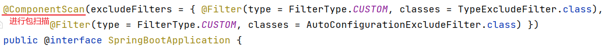

# Spring Boot 原理

## Bean 管理

### 获取 Bean

Spring Boot 项目在启动时会自动创建 IOC 容器(也称为 Spring容器)，并且在启动的过程当中自动地将 bean 对象都创建好（会受到作用域及延迟初始化影响，这里主要针对于默认的单例非延迟加载的bean 而言）。

可以使用 @Component 以及它的三个衍生注解（@Controller、@Service、@Repository）来声明 IOC 容器中的 bean 对象。

应用程序在运行时需要依赖什么 bean 对象，进行依赖注入就可以了。

Spring 容器提供了一些方法，可以主动从 IOC 容器中获取到 bean 对象（非注入），有 3 种常用方式：

1. 根据 name 获取 bean

	~~~java
	Object getBean(String name)
	~~~

2. 根据类型获取 bean

	~~~java
	<T> T getBean(Class<T> requiredType)
	~~~

3. 根据 name 和类型获取 bean

	~~~java
	<T> T getBean(String name, Class<T> requiredType)
	~~~

- 要从 IOC 容器中来获取 bean 对象，需要获取 IOC 容器对象，可以直接将 IOC 容器对象注入进来。

测试类：

~~~java
@Spring BootTest
class SpringBootWebConfig2ApplicationTests {

    @Autowired
    private ApplicationContext applicationContext; // 注入 IOC 容器对象

    //获取bean对象
    @Test
    public void testGetBean(){
        //根据bean的名称获取
        DeptController bean1 = (DeptController) applicationContext.getBean("deptController");
        System.out.println(bean1);   // 打印地址

        //根据bean的类型获取
        DeptController bean2 = applicationContext.getBean(DeptController.class);
        System.out.println(bean2);

        //根据bean的名称 及 类型获取
        DeptController bean3 = applicationContext.getBean("deptController", DeptController.class);
        System.out.println(bean3);
    }
}
~~~

### 第三方 Bean

- 如果是在项目当中我们自己定义的类，想将这些类交给IOC容器管理，直接使用 @Component 以及它的衍生注解来声明就可以。
- 如果类不是我们自己编写的，而是我们引入的第三方依赖当中提供的，需要编写 config 类。

以第三方的 dom4j 为例，想要使用 dom4j 中的 SAXReader 类。

引入对应依赖：

```xml
<!--Dom4j-->
<dependency>
    <groupId>org.dom4j</groupId>
    <artifactId>dom4j</artifactId>
    <version>2.1.3</version>
</dependency>
```

直接依赖注入 SAXReader 类是不可行的，因为第三方提供的类是只读的，无法在第三方类上添加 @Component 注解或衍生注解。

#### 方式一（不推荐）

在启动类上添加 @Bean 标识的方法：

```java
@Spring BootApplication
public class SpringBootWebConfig2Application {

    public static void main(String[] args) {
        SpringApplication.run(SpringBootWebConfig2Application.class, args);
    }

    //声明第三方bean
    @Bean //将当前方法的返回值对象交给IOC容器管理, 成为IOC容器bean
    public SAXReader saxReader(){
        return new SAXReader();
    }
}
```

以上在启动类中声明第三方 Bean 的作法，不建议使用（项目中要保证启动类的纯粹性）。

#### 方式二

在配置类中定义 @Bean 标识的方法：

配置类：

```java
@Configuration //配置类  (在配置类当中对第三方bean进行集中的配置管理)
public class CommonConfig {

    //声明第三方bean
    @Bean //将当前方法的返回值对象交给IOC容器管理, 成为IOC容器bean
          //通过@Bean注解的name/value属性指定bean名称, 如果未指定, 默认是方法名
    public SAXReader reader(DeptService deptService){
        System.out.println(deptService);
        return new SAXReader();
    }

}
```

在方法上加上一个@Bean注解，Spring 容器在启动时会自动调用这个方法，并将方法的返回值声明为  Spring 容器当中的 Bean 对象。

注意：

- 通过 @Bean 注解的 name 或value 属性可以声明 bean 的名称，如果不指定，默认 bean 的名称就是方法名。

- 如果第三方 bean 需要依赖其它 bean 对象，直接在 bean 定义方法中设置形参即可，容器会根据类型自动装配（此时相当于 setter 注入）。

## 起步依赖与自动配置

Spring 框架的繁琐主要体现在两个地方：

1. 在 pom.xml 中依赖配置比较繁琐，在项目开发时，需要自己去找到对应的依赖，还需要找到依赖它所配套的依赖以及对应版本，否则就会出现版本冲突问题。
2. 在使用 Spring 框架进行项目开发时，需要在 Spring 的配置文件中做大量的配置，这就造成 Spring 框架入门难度较大，学习成本较高。


> 基于 Spring 存在的问题，官方在 Spring 框架 4.0 版本之后，又推出了一个全新的框架：Spring Boot。
>
> 通过 Spring Boot 来简化 Spring 框架的开发(是简化不是替代)。我们直接基于 Spring Boot 来构建 Java 项目，会让我们的项目开发更加简单，更加快捷。

Spring Boot 框架之所以使用起来比 Spring 更简单更快捷，是因为 Spring Boot 框架底层提供了两个非常重要的功能：一个是起步依赖，一个是自动配置。


> 通过Spring Boot所提供的起步依赖，就可以大大的简化pom文件当中依赖的配置，从而解决了Spring框架当中依赖配置繁琐的问题。
>
> 通过自动配置的功能就可以大大的简化框架在使用时bean的声明以及bean的配置。我们只需要引入程序开发时所需要的起步依赖，项目开发时所用到常见的配置都已经有了，我们直接使用就可以了。

### 起步依赖

如果没有使用 Spring Boot，用的是 Spring 框架进行 web 程序的开发，此时我们就需要引入 web 程序开发所需要的一些依赖。


> spring-webmvc 依赖：这是 Spring 框架进行 web 程序开发所需要的依赖
>
> servlet-api 依赖：Servlet 基础依赖
>
> jackson-databind 依赖：JSON 处理工具包
>
> 如果要使用 AOP，还需要引入 aop 依赖、aspect 依赖
>

项目中所引入的这些依赖，还需要保证版本匹配，否则就可能会出现版本冲突问题。

如果我们使用了 Spring Boot，就不需要像上面这么繁琐的引入依赖了。

只需要引入一个依赖就可以了，那就是 web 开发的起步依赖：springboot-starter-web：


引入一个 web 开发的起步依赖后，web 开发所需要的所有的依赖就都有了。

这主要依靠 Maven 的依赖传递：（起步依赖的原理就是 Maven 的依赖传递）

> - 在Spring Boot给我们提供的这些起步依赖当中，已提供了当前程序开发所需要的所有的常见依赖(官网地址：https://docs.spring.io/spring-boot/docs/2.7.7/reference/htmlsingle/#using.build-systems.starters)。
>
> - 比如：springboot-starter-web，这是web开发的起步依赖，在web开发的起步依赖当中，就集成了web开发中常见的依赖：json、web、webmvc、tomcat等。我们只需要引入这一个起步依赖，其他的依赖都会自动的通过Maven的依赖传递进来。

### 自动配置

配置类使用 @Configuration 注解，而 @Configuration 底层就是 @Component ，配置类最终也是 SpringIOC 容器当中的一个 bean 对象。

在 Spring Boot 项目当中，引入对应的依赖后，**自动配置机制**将依赖的 jar 包当中所提供的 bean 以及配置类自动加载到当前项目的 SpringIOC 容器当中。

当想要使用这些配置类中生成的 bean 对象时，使用 @Autowired 自动注入即可。

那么自动配置如何将依赖的 jar 包当中所提供的 bean 以及配置类自动加载到当前项目的 SpringIOC 容器当中？

#### 问题描述

要使 bean 对象生效，需要：

- 在类上添加 @Component 注解声明 bean 对象。
- 还需要保证 @Component 注解能被 Spring 的组件扫描到。

考虑：

- Spring Boot 项目中的 @SpringBootApplication 注解，具有包扫描的作用，但是它只会扫描启动类所在的当前包以及子包。 

而对于第三方包：

- 第三方包往往不在启动类所在的当前包以及子包，会扫描不到。
	- 假设当前包：com.itheima， 第三方依赖中提供的包：com.example

#### 解决方案一

使用 @ComponentScan 在启动类上设置组件扫描：

```java
@SpringBootApplication
@ComponentScan({"com.itheima","com.example"}) //指定要扫描的包
public class SpringBootWebConfig2Application {
    public static void main(String[] args) {
        SpringApplication.run(SpringBootWebConfig2Application.class, args);
    }
}
```

当需要引入大量的第三方的依赖时，就需要在启动类上配置N多要扫描的包，这种方式会很繁琐，而且这种大面积的扫描性能也比较低。

Spring Boot 中并没有采用以上这种方案。

#### 解决方案二

使用 @Import 导入。（在启动类上用导入。）

导入形式主要有以下几种：

1. 导入普通类
2. 导入配置类
3. 导入 ImportSelector 接口实现类

##### 导入普通类

先导入普通类，然后可以注入该类：

```java
@Import(TokenParser.class) //导入的类会被Spring加载到IOC容器中
@SpringBootApplication
public class WebConfig2Application {
    public static void main(String[] args) {
        SpringApplication.run(SpringBootWebConfig2Application.class, args);
    }
}
```

##### 导入配置类

导入后可以对配置类的方法返回的类进行注入：

- 配置类编码

~~~java
@Configuration
public class HeaderConfig {
    @Bean
    public HeaderParser headerParser(){
        return new HeaderParser();
    }

    @Bean
    public HeaderGenerator headerGenerator(){
        return new HeaderGenerator();
    }
}
~~~

- 启动类上导入

~~~java
@Import(HeaderConfig.class) //导入配置类
@SpringBootApplication
public class SpringBootWebConfig2Application {
    public static void main(String[] args) {
        SpringApplication.run(SpringBootWebConfig2Application.class, args);
    }
}
~~~

- 测试类中测试

~~~java
@SpringBootTest
public class AutoConfigurationTests {
    @Autowired
    private ApplicationContext applicationContext;

    @Test
    public void testHeaderParser(){
        System.out.println(applicationContext.getBean(HeaderParser.class));
    }

    @Test
    public void testHeaderGenerator(){
        System.out.println(applicationContext.getBean(HeaderGenerator.class));
    }
    
    //省略其他代码...
}
~~~

##### 导入 ImportSelector 接口实现类

导入后可以注入该接口内指定的类。

- ImportSelector 接口实现类编码

~~~java
public class MyImportSelector implements ImportSelector {
    public String[] selectImports(AnnotationMetadata importingClassMetadata) {
        //返回值字符串数组（数组中封装了全限定名称的类）
        return new String[]{"com.example.HeaderConfig"};
    }
}
~~~

- 启动类上导入

~~~java
@Import(MyImportSelector.class) //导入ImportSelector接口实现类
@SpringBootApplication
public class SpringBootWebConfig2Application {

    public static void main(String[] args) {
        SpringApplication.run(SpringBootWebConfig2Application.class, args);
    }
}
~~~

#### 解决方案三

方案二中的方法，要引入一个第三方依赖时，还要知道第三方依赖中有哪些配置类和哪些 Bean 对象，对程序员不友好。

对于第三方依赖，依赖中到底有哪些 bean 和配置类，第三方依赖自身最清楚。

比较常见的方案就是第三方依赖给我们提供一个注解，这个注解一般都以 @EnableXxxx 开头，注解中封装的就是 @Import 注解。

使用第三方依赖提供的 @EnableXxxxx 注解：

- 第三方依赖中提供的注解

~~~java
@Retention(RetentionPolicy.RUNTIME)
@Target(ElementType.TYPE)
@Import(MyImportSelector.class)//指定要导入哪些bean对象或配置类
public @interface EnableHeaderConfig { 
}
~~~

- 在使用时只需在启动类上加上 @EnableXxxxx 注解即可

~~~java
@EnableHeaderConfig  //使用第三方依赖提供的Enable开头的注解
@SpringBootApplication
public class SpringBootWebConfig2Application {
    public static void main(String[] args) {
        SpringApplication.run(SpringBootWebConfig2Application.class, args);
    }
}
~~~

方案三的这种方式会更方便更优雅，这也是 Spring Boot 所采用的方式。

#### 原理

##### 源码

要搞清楚Spring Boot的自动配置原理，要从Spring Boot启动类上使用的核心注解@SpringBootApplication开始分析：


在@SpringBootApplication注解中包含了：

- 元注解
- @SpringBootConfiguration
- @EnableAutoConfiguration
- @ComponentScan

我们先来看第一个注解：@SpringBootConfiguration


> @SpringBootConfiguration注解上使用了@Configuration，表明Spring Boot启动类就是一个配置类。
>
> @Indexed注解，是用来加速应用启动的（不用关心）。


接下来再看@ComponentScan注解：



> @ComponentScan注解是用来进行组件扫描的，扫描启动类所在的包及其子包下所有被@Component及其衍生注解声明的类。
>
> Spring Boot启动类，之所以具备扫描包功能，就是因为包含了@ComponentScan注解。


最后我们来看看@EnableAutoConfiguration注解（自动配置核心注解）：


> 使用@Import注解，导入了实现ImportSelector接口的实现类。
>
> AutoConfigurationImportSelector类是ImportSelector接口的实现类。

##### 小结

自动配置原理源码入口就是@SpringBootApplication注解，在这个注解中封装了3个注解，分别是：

- @SpringBootConfiguration
	- 声明当前类是一个配置类
- @ComponentScan
	- 进行组件扫描（Spring Boot中默认扫描的是启动类所在的当前包及其子包）
- @EnableAutoConfiguration
	- 封装了@Import注解（Import注解中指定了一个ImportSelector接口的实现类）
		- 在实现类重写的selectImports()方法，读取当前项目下所有依赖jar包中META-INF/spring.factories、META-INF/spring/org.springframework.boot.autoconfigure.AutoConfiguration.imports两个文件里面定义的配置类（配置类中定义了@Bean注解标识的方法）。

当Spring Boot程序启动时，就会加载配置文件当中所定义的配置类，并将这些配置类信息(类的全限定名)封装到String类型的数组中，最终通过@Import注解将这些配置类全部加载到Spring的IOC容器中，交给IOC容器管理。

##### @Conditional

配置类中的 bean 并不会全部注册到 Spring 的 IOC 容器中。

可以使用以 Conditional 开头的注解设置条件装配。

@Conditional注解：

- 作用：按照一定的条件进行判断，在满足给定条件后才会注册对应的bean对象到Spring的IOC容器中。
- 位置：方法、类
- @Conditional本身是一个父注解，派生出大量的子注解：
	- @ConditionalOnClass：判断环境中有指定的字节码文件，才注册bean到IOC容器。
	- @ConditionalOnMissingBean：判断环境中没有指定的bean(类型或名称)，才注册bean到IOC容器。
	- @ConditionalOnProperty：判断配置文件中有指定的属性和值，才注册bean到IOC容器。

示例：

- @ConditionalOnClass注解

~~~java
@Configuration
public class HeaderConfig {

    @Bean
    @ConditionalOnClass(name="io.jsonwebtoken.Jwts")//环境中存在指定的这个类，才会将该bean加入IOC容器
    public HeaderParser headerParser(){
        return new HeaderParser();
    }
    
    //省略其他代码...
}
~~~

- @ConditionalOnMissingBean注解

~~~java
@Configuration
public class HeaderConfig {

    @Bean
    @ConditionalOnMissingBean //不存在该类型的bean，才会将该bean加入IOC容器
    public HeaderParser headerParser(){
        return new HeaderParser();
    }
    
    //省略其他代码...
}
~~~

再次修改@ConditionalOnMissingBean注解：

~~~java
@Configuration
public class HeaderConfig {

    @Bean
    @ConditionalOnMissingBean(name="deptController2")//不存在指定名称的bean，才会将该bean加入IOC容器
    public HeaderParser headerParser(){
        return new HeaderParser();
    }
    
    //省略其他代码...
}
~~~

- @ConditionalOnProperty注解（这个注解和配置文件（比如 application.yml 文件）当中配置的属性有关系）

先在application.yml配置文件中添加如下的键值对：

~~~yaml
name: itheima
~~~

在声明bean的时候就可以指定一个条件@ConditionalOnProperty

~~~java
@Configuration
public class HeaderConfig {

    @Bean
    @ConditionalOnProperty(name ="name",havingValue = "itheima")//配置文件中存在指定属性名与值，才会将bean加入IOC容器
    public HeaderParser headerParser(){
        return new HeaderParser();
    }

    @Bean
    public HeaderGenerator headerGenerator(){
        return new HeaderGenerator();
    }
}
~~~

### 自定义 starter

在Spring Boot项目中，一般都会将这些公共组件封装为Spring Boot当中的starter，也就是我们所说的起步依赖。


> Spring Boot官方starter命名： spring-boot-starter-xxxx
>
> 第三组织提供的starter命名：  xxxx-spring-boot-starter

可以直接在 Spring Boot 程序中使用依赖中的自动配置的 bean 对象。

在自定义一个起步依赖starter的时候，按照规范需要定义两个模块：

1. starter模块（进行依赖管理[把程序开发所需要的依赖都定义在starter起步依赖中]）
2. autoconfigure模块（自动配置）

> 将来在项目当中进行相关功能开发时，只需要引入一个起步依赖就可以了，因为它会将autoconfigure自动配置的依赖给传递下来。