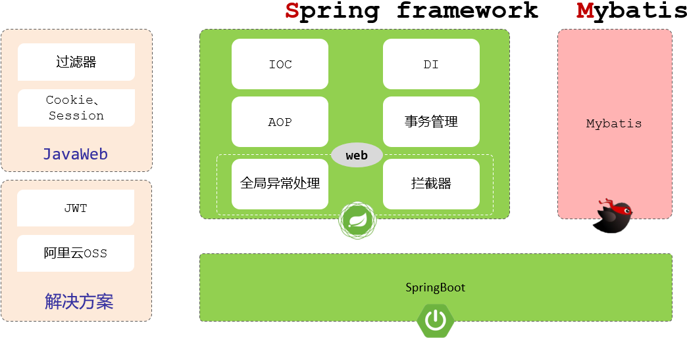
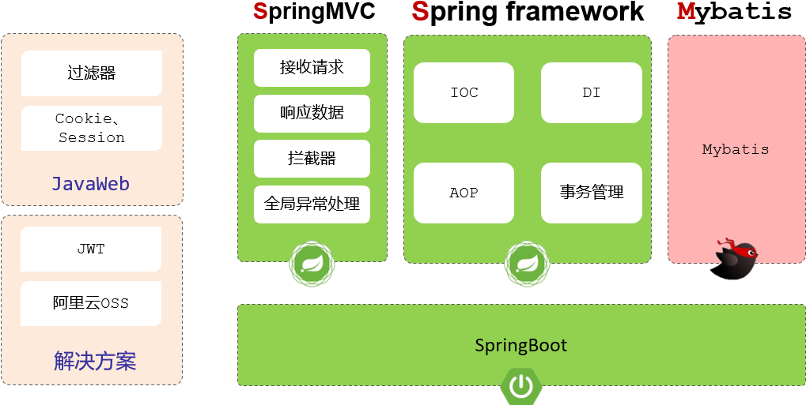

# Spring Boot

Spring Boot 基于 Spring，主要是自动化 Spring 配置，简化 Spring 操作（Boot 表示“鞋子”，“启动”，主要提供了一种快捷使用 Spring 的方式）。

- Spring Boot 使用嵌入式的 Servlet 容器（例如 Tomcat、Jetty 或 Undertow 等），应用无需打成 WAR 包 。
- Spring Boot 提供了一系列的“starter”项目对象模型（POMS）来简化 Maven 配置。

## Spring Boot Web & SSM

其中的技术功能：

- 传统的 JavaWeb 提供了
	- Filter 过滤器
	- Cookie
	- Session
- Spring Framework 提供的核心功能
	- IOC 控制反转（DI 依赖注入）
	- AOP 面向切面编程
	- 事务管理
	- 全局异常处理
	- 拦截器
- Mybatis 是一个持久层的框架，用来操作数据库。
- JWT令牌、阿里云OSS对象存储服务，是现在企业项目中常见的一些解决方案。

Spring 框架的 web 开发模块，称为：SpringMVC ：

- SpringMVC 不是一个单独的框架，它是 Spring 框架的一部分。
- 是 Spring 框架中的 web 开发模块，是用来简化原始的 Servlet 程序开发的（属于传统 Java Web）。

- 俗称的 SSM = SpringMVC + Spring Framework + Mybatis

基于传统的 SSM 框架进行整合开发项目会比较繁琐，而且效率也比较低，所以在现在的企业项目开发当中，基本上都是直接基于 SpringBoot 整合  SSM 进行项目开发的。

