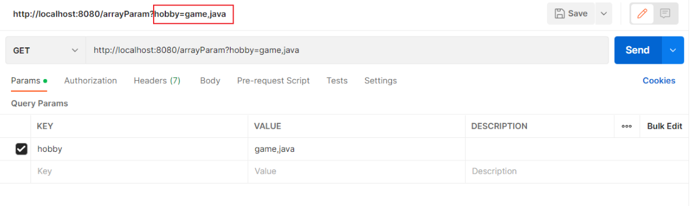

# 请求与响应

可以使用网页的 [Spring Initializr](https://start.spring.io/) 初始化 spring boot 项目，然后用 IDEA 打开。

Sprig Boot web 在起步依赖（spring-boot-starter-web）中内嵌了 Tomcat web 服务器，可以直接使用。

对于 BS 架构（Browser/Server），主要包含：

- 请求
- 后端
- 响应


- Postman

	一个接口测试工具，可以模拟浏览器请求，方便在前后端分类开发时测试后端代码。

## 请求路径

一个完整的请求路径，应该是类上 @RequestMapping 的 value 属性 + 方法上的 @RequestMapping 的 value 属性：


## 请求参数

以下均为 Spring Boot 中的参数接收方式。

### 简单参数

简单参数也叫 query 参数。

用形参接收请求参数：

```java
@RestController
public class RequestController {
    // http://localhost:8080/simpleParam?name=Tom&age=10
    // 第1个请求参数： name=Tom   参数名:name，参数值:Tom
    // 第2个请求参数： age=10     参数名:age , 参数值:10
    
    @RequestMapping("/simpleParam")
    public String simpleParam(String name , Integer age ){//形参名和请求参数名保持一致
        System.out.println(name+"  :  "+age);
        return "OK";
    }
}
```

如果需要形参和请求参数不一致，可以使用 `@RequestParam` ：

```java
// @RequestParam("name", required = True)
// 默认 required = True

@RestController
public class RequestController {
    // http://localhost:8080/simpleParam?name=Tom&age=20
    // 请求参数名：name
    // 指定形参名为：username

    //springboot方式
    @RequestMapping("/simpleParam")
    public String simpleParam(@RequestParam("name") String username , Integer age ){
        System.out.println(username+"  :  "+age);
        return "OK";
    }
}
```

### 实体参数

将请求参数封装到一个实体类对象中，需要请求参数名与实体类的属性名相同。


#### 简单实体对象

定义 POJO 实体类：（Plain Old Java Object，POJO）

```java
public class User {
    private String name;
    private Integer age;

    public String getName() {
        return name;
    }

    public void setName(String name) {
        this.name = name;
    }

    public Integer getAge() {
        return age;
    }

    public void setAge(Integer age) {
        this.age = age;
    }

    @Override
    public String toString() {
        return "User{" +
                "name='" + name + '\'' +
                ", age=" + age +
                '}';
    }
}
```

Controller 方法：

```java
@RestController
public class RequestController {
    //实体参数：简单实体对象
    @RequestMapping("/simplePojo")
    public String simplePojo(User user){
        System.out.println(user);
        return "OK";
    }
}
```

- 未匹配的形参会被赋为 null 。
- 未匹配的请求参数会被忽略。

#### 复杂实体对象

复杂实体对象指，在实体类中有属性也是实体对象类型。


需要：请求参数名与形参对象属性名相同，按照对象层次结构关系接收嵌套实体类属性参数。

定义POJO实体类：

- Address实体类

```java
public class Address {
    private String province;
    private String city;

    public String getProvince() {
        return province;
    }

    public void setProvince(String province) {
        this.province = province;
    }

    public String getCity() {
        return city;
    }

    public void setCity(String city) {
        this.city = city;
    }

    @Override
    public String toString() {
        return "Address{" +
                "province='" + province + '\'' +
                ", city='" + city + '\'' +
                '}';
    }
}
```

- User实体类

```java
public class User {
    private String name;
    private Integer age;
    private Address address; //地址对象

    public String getName() {
        return name;
    }

    public void setName(String name) {
        this.name = name;
    }

    public Integer getAge() {
        return age;
    }

    public void setAge(Integer age) {
        this.age = age;
    }

    public Address getAddress() {
        return address;
    }

    public void setAddress(Address address) {
        this.address = address;
    }

    @Override
    public String toString() {
        return "User{" +
                "name='" + name + '\'' +
                ", age=" + age +
                ", address=" + address +
                '}';
    }
}
```

Controller方法：

```java
@RestController
public class RequestController {
    //实体参数：复杂实体对象
    @RequestMapping("/complexPojo")
    public String complexPojo(User user){
        System.out.println(user);
        return "OK";
    }
}
```

### 多值参数

有时，一个参数可能包含多个值，它的 url 有两种表现。

- 表现 1


- 表现 2



有两种接收方式：

- 数组
- 集合

注意对比它们的 Controller 方法的形参类型。

#### 数组

Controller方法：

```java
@RestController
public class RequestController {
    //数组集合参数
    @RequestMapping("/arrayParam")
    public String arrayParam(String[] hobby){
        System.out.println(Arrays.toString(hobby));
        return "OK";
    }
}
```

#### 集合

Controller 方法：

```java
@RestController
public class RequestController {
    //数组集合参数
    @RequestMapping("/listParam")
    public String listParam(@RequestParam List<String> hobby){
        System.out.println(hobby);
        return "OK";
    }
}
```

### 日期参数

日期类型的参数在进行封装时，需要通过 `@DateTimeFormat` ，以及其 pattern 属性来设置日期的格式。


Controller 方法：

```java
@RestController
public class RequestController {
    //日期时间参数
   @RequestMapping("/dateParam")
    public String dateParam(@DateTimeFormat(pattern = "yyyy-MM-dd HH:mm:ss") LocalDateTime updateTime){
        System.out.println(updateTime);
        return "OK";
    }
}
```

### JSON 参数

- json 格式的数据需要放在 web 请求的 body 中。
- 在 Controller 中使用实体类进行封装
	- json 数据键名与形参对象属性名相同，定义POJO类型形参即可接收参数。
	- 需要使用 @RequestBody 标识，将 JSON 数据映射到形参的实体类对象中（JSON 中的 key 和实体类中的属性名保持一致）


实体类：Address

```java
public class Address {
    private String province;
    private String city;
    
	// 省略GET , SET 方法
}
```

实体类：User

```java
public class User {
    private String name;
    private Integer age;
    private Address address;
    
    // 省略GET , SET 方法
}    
```

Controller方法：

```java
@RestController
public class RequestController {
    // JSON 参数
    @RequestMapping("/jsonParam")
    public String jsonParam(@RequestBody User user){
        System.out.println(user);
        return "OK";
    }
}
```

### 路径参数

请求参数一般：

- 放在 body 中（POST 请求）
- 或在 url 后面通过 `?key=value` 形式传递（GET 请求）

目前，也可以：

- 直接在 url 中传递参数（路径参数）

例如：

```
http://localhost:8080/user/1		
http://localhost:880/user/1/0
```

接收路径参数：

- 使用 `{…}` 标识该路径参数。
- 使用 `@PathVariable` 获取路径参数。
- 该方法也可以传递多个路径参数


Controller方法：

```java
@RestController
public class RequestController {
    //路径参数
    @RequestMapping("/path/{id}")
    public String pathParam(@PathVariable Integer id){
        System.out.println(id);
        return "OK";
    }
}
```

## 响应数据

### @ResponseBody

使用 `@ResponseBody`注解可以将 controller 方法 return 的结果响应给浏览器。

`@ResponseBody注解`：

- 类型：方法注解、类注解
- 位置：书写在 Controller 类的方法上或类上
	- 类上有 `@RestController` 注解或 `@ResponseBody` 注解时，表示当前类下所有的方法返回值都做为响应数据。
- 作用：将方法返回值直接响应给浏览器
  - 如果返回值类型是实体对象/集合，将会转换为 JSON 格式后再响应给浏览器

对于以下情况：

```java
@RestController
public class HelloController {
    @RequestMapping("/hello")
    public String hello(){
        System.out.println("Hello World ~");
        return "Hello World ~";
    }
}
```

以上我们所书写的Controller中，只在类上添加了@RestController注解、方法添加了@RequestMapping注解，并没有使用@ResponseBody注解，怎么给浏览器响应呢？

- `@RestController` 是一个组合注解。

	`@RestController = @Controller + @ResponseBody `

@RestController源码：

```java
@Target({ElementType.TYPE})   //元注解（修饰注解的注解）
@Retention(RetentionPolicy.RUNTIME)  //元注解
@Documented    //元注解
@Controller   
@ResponseBody 
public @interface RestController {
    @AliasFor(
        annotation = Controller.class
    )
    String value() default "";
}
```

demo 代码：

```java
@RestController
public class ResponseController {
    //响应字符串
    @RequestMapping("/hello")
    public String hello(){
        System.out.println("Hello World ~");
        return "Hello World ~";
    }
    //响应实体对象
    @RequestMapping("/getAddr")
    public Address getAddr(){
        Address addr = new Address();//创建实体类对象
        addr.setProvince("广东");
        addr.setCity("深圳");
        return addr;
    }
    //响应集合数据
    @RequestMapping("/listAddr")
    public List<Address> listAddr(){
        List<Address> list = new ArrayList<>();//集合对象
        
        Address addr = new Address();
        addr.setProvince("广东");
        addr.setCity("深圳");

        Address addr2 = new Address();
        addr2.setProvince("陕西");
        addr2.setCity("西安");

        list.add(addr);
        list.add(addr2);
        return list;
    }
}
```

上面 demo 代码的各请求返回的数据格式没有统一规范。

### 统一返回格式


定义一个统一的返回格式，包含：

- 响应状态码：当前请求是成功，还是失败

- 状态码信息：给页面的提示信息

- 返回的数据：给前端响应的数据（字符串、对象、集合）


定义在一个实体类 Result 来包含以上信息，代码如下：（可用 lombok 简写）

```java
public class Result {
    private Integer code;// 响应码，1 代表成功; 0 代表失败
    private String msg;  // 响应码 描述字符串
    private Object data; // 返回的数据

    public Result() { }
    public Result(Integer code, String msg, Object data) {
        this.code = code;
        this.msg = msg;
        this.data = data;
    }

    public Integer getCode() {
        return code;
    }

    public void setCode(Integer code) {
        this.code = code;
    }

    public String getMsg() {
        return msg;
    }

    public void setMsg(String msg) {
        this.msg = msg;
    }

    public Object getData() {
        return data;
    }

    public void setData(Object data) {
        this.data = data;
    }

    // 增删改 成功响应(不需要给前端返回数据，只需要返回状态)
    public static Result success(){
        return new Result(1,"success",null);
    }
    // 查询 成功响应(把查询结果做为返回数据响应给前端)
    public static Result success(Object data){
        return new Result(1,"success",data);
    }
    // 失败响应
    public static Result error(String msg){
        return new Result(0,msg,null);
    }
}
```

统一返回格式的 Controller 代码：

```java
@RestController
public class ResponseController { 
    //响应统一格式的结果
    @RequestMapping("/hello")
    public Result hello(){
        System.out.println("Hello World ~");
        //return new Result(1,"success","Hello World ~");
        return Result.success("Hello World ~");
    }

    //响应统一格式的结果
    @RequestMapping("/getAddr")
    public Result getAddr(){
        Address addr = new Address();
        addr.setProvince("广东");
        addr.setCity("深圳");
        return Result.success(addr);
    }

    //响应统一格式的结果
    @RequestMapping("/listAddr")
    public Result listAddr(){
        List<Address> list = new ArrayList<>();

        Address addr = new Address();
        addr.setProvince("广东");
        addr.setCity("深圳");

        Address addr2 = new Address();
        addr2.setProvince("陕西");
        addr2.setCity("西安");

        list.add(addr);
        list.add(addr2);
        return Result.success(list);
    }
}
```

