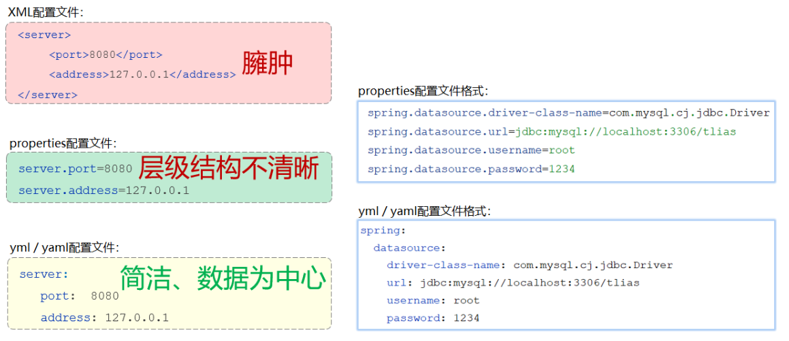
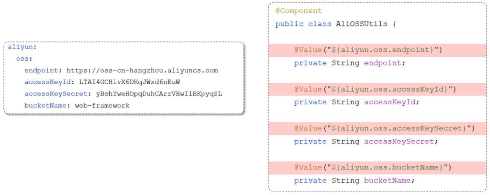
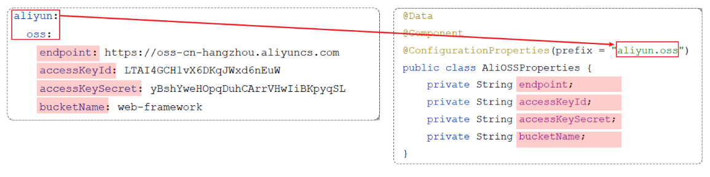

## 配置文件

配置文件中的路径尽量使用绝对路径，否则可能在打包后出现问题。

### 参数配置化

一些到处可以用到的系统参数可以写在配置文件中。

比如将文件上传到阿里云 OSS 对象存储服务时，需要调用 AliOSSUtils 工具类，其需要一些参数：

- endpoint       //阿里云OSS域名
- accessKeyID    //用户身份ID
- accessKeySecret   //用户密钥
- bucketName      //存储空间的名字

可以将这些参数写在 properties 配置文件中：

```properties
#自定义的阿里云OSS配置信息
aliyun.oss.endpoint=https://oss-cn-hangzhou.aliyuncs.com
aliyun.oss.accessKeyId=LTAI4GCH1vX6DKqJWxd6nEuW
aliyun.oss.accessKeySecret=yBshYweHOpqDuhCArrVHwIiBKpyqSL
aliyun.oss.bucketName=web-tlias
```

AliOSSUtils 工具类为：

```java
@Component
public class AliOSSUtils {
    /*以下4个参数没有指定值（默认值：null）*/
    private String endpoint;
    private String accessKeyId;
    private String accessKeySecret;
    private String bucketName;

    //省略其他代码...
}
```

application.properties 是 springboot 项目默认的配置文件。

springboot 程序在启动时会默认读取 application.properties 配置文件。

使用 @Value 注解可以获取配置文件中的数据。

```java
@Component
public class AliOSSUtils {

    @Value("${aliyun.oss.endpoint}")
    private String endpoint;
    
    @Value("${aliyun.oss.accessKeyId}")
    private String accessKeyId;
    
    @Value("${aliyun.oss.accessKeySecret}")
    private String accessKeySecret;
    
    @Value("${aliyun.oss.bucketName}")
    private String bucketName;
 	
 	//省略其他代码...
 }   
```

### yml 配置文件

springboot 项目支持多种配置方式，除了支持 properties 配置文件以外，还支持 yml 类型的配置文件

yml 格式的配置文件，后缀名有两种：

- yml （推荐）
- yaml

常见配置文件格式对比：



其中，同样的配置数据，yml 格式有以下特点：

- 容易阅读
- 容易与脚本语言交互
- 以数据为核心，重数据轻格式

yml 配置文件的基本语法：

- 大小写敏感
- 数值前边必须有空格，作为分隔符
- 使用缩进表示层级关系，缩进时，不允许使用Tab键，只能用空格（idea中会自动将Tab转换为空格）
- 缩进的空格数目不重要，只要相同层级的元素左侧对齐即可
- `#`表示注释，从这个字符一直到行尾，都会被解析器忽略

yml 文件中常见的数据格式：

1. 定义对象或Map集合
2. 定义数组、list或set集合

```yml
# 对象/Map集合
user:
  name: zhangsan
  age: 18
  password: 123456
  
# 数组/List/Set集合
hobby: 
  - java
  - game
  - sport
```

其中，以 `age: 18`  为例，冒号后必须要有空格。

### @ConfigurationProperties

分析下代码当中可能存在的问题：



直接通过@Value注解来注入配置数据，这种方式本身没有什么问题，但当需要注入的属性较多(例：需要20多个参数数据)，写起来就会比较繁琐。

在 Spring 中给我们提供了一种简化方式，可以直接将配置文件中配置项的值自动注入到对象的属性中。

Spring 提供的简化方式：

1. 需要创建一个实现类，且实体类中的属性名和配置文件当中key的名字必须要一致

	> 比如：配置文件当中叫endpoints，实体类当中的属性也得叫endpoints，另外实体类当中的属性还需要提供 getter / setter方法

2. 需要将实体类交给Spring的IOC容器管理，成为IOC容器当中的bean对象

3. 在实体类上添加`@ConfigurationProperties`注解，并通过perfect属性来指定配置参数项的前缀



需要引入依赖：

```xml
<dependency>
    <groupId>org.springframework.boot</groupId>
    <artifactId>spring-boot-configuration-processor</artifactId>
</dependency>
```

对比 ：

- @Value 注解只能一个一个的进行外部属性的注入。

- @ConfigurationProperties 可以批量的将外部的属性配置注入到bean对象的属性中。

如果要注入的属性非常的多，并且还想做到复用，就可以定义这么一个bean对象。通过 configuration properties 批量的将外部的属性配置直接注入到 bin 对象的属性当中。在其他的类当中，要想获取到注入的属性，直接注入 bin 对象，然后调用 get 方法，就可以获取到对应的属性值了。

### 配置参数优先级

在 SpringBoot 项目中，常见的属性配置方式有 5 种：

- 3 种配置文件

	建议一个项目只使用一种格式的配置文件。

	- application.properties
	- application.yml
	- application.yaml（等价于 application.yml）

- 2 种外部属性的配置

	- Java 系统属性
	- 命令行参数

它们的优先级从高到低为：

1. 命令行参数（格式：--key=value）
2. java 系统属性（格式： -Dkey=value）
3. application.properties
4. application.yml
5. application.yaml
