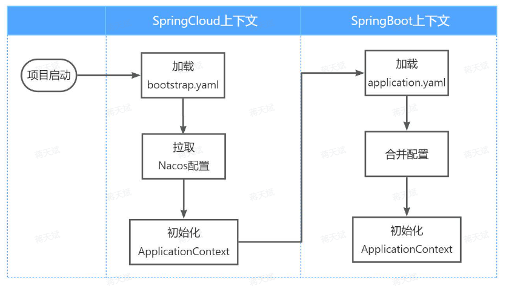
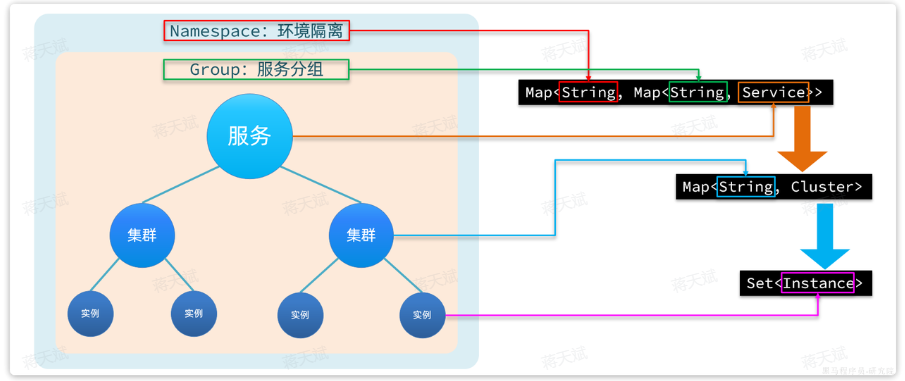

# Nacos

Nacos（Dynamic Naming and Configuration Service）是一个云原生应用的动态服务发现、配置管理和服务管理平台，用于发现、配置和管理微服务。

## 服务管理（服务治理）

### 服务注册

服务提供者在 nacos 注册服务。

1. 引入依赖

```xml
<!--nacos 服务注册与发现-->
<dependency>
    <groupId>com.alibaba.cloud</groupId>
    <artifactId>spring-cloud-starter-alibaba-nacos-discovery</artifactId>
</dependency>
```

2. 在服务的 yaml 文件中配置 nacos 地址

```yaml
spring:
  application:
    name: item-service # 服务名称
  cloud:
    nacos:
      server-addr: host:8848 # nacos地址，默认端口为 8848
```

3. nacos 配置好后，启动服务实例即可被 nacos 管理。

### 服务发现

服务消费者在 nacos 订阅服务。

1. 引入依赖

	服务发现除了要引入 nacos 依赖以外，由于还需要负载均衡，因此要引入 SpringCloud 提供的 LoadBalancer 依赖。

```xml
<!--nacos 服务注册与发现-->
<dependency>
    <groupId>com.alibaba.cloud</groupId>
    <artifactId>spring-cloud-starter-alibaba-nacos-discovery</artifactId>
</dependency>

<!--loadbalanncer 依赖-->
<dependency>
    <groupId>org.springframework.cloud</groupId>
    <artifactId>spring-cloud-starter-loadbalancer</artifactId>
</dependency>
```

2. 配置 nacos 地址。
3. 发现并调用服务，可以使用 DiscoveryClient 类，注入即可使用其获取实例信息。

发送 http 请求调用服务：（被调用的服务需要实现 Controller 方法）

```java
List<ServiceInstance> instances = discoveryClient.getInstances("item-service");   // 通过服务名获取
ServiceInstance instance = instances.get(RandomUtil.randomInt(instances.size()));   // 手写一个随机负载均衡

// 利用RestTemplate发起http请求，得到http的响应
ResponseEntity<List<ItemDTO>> response = restTemplate.exchange(
        instance.getUri() + "/items?ids={ids}",
        HttpMethod.GET,
        null,
        new ParameterizedTypeReference<List<ItemDTO>>() {
        },
        Map.of("ids", CollUtil.join(itemIds, ","))
);
```

一般使用 OpenFeign 简化这个发送 http 请求进行远程调用的过程。

## 配置管理

### 共享配置

1. 在 Nacos 中建立共享配置文件。

	图形化编辑即可，略。

2. 拉取配置。

SpringCloud 在初始化应用上下文的时候会：

1. 先读取一个名为`bootstrap.yaml`(或者`bootstrap.properties`)的文件。

	为了在项目引导阶段就可以读取nacos中的配置，需要将 nacos 地址配置到 `bootstrap.yaml` 中，

2. 继续读取 `application.yaml` ，合并配置，继续初始化应用上下文。



依赖：

```xml
  <!--nacos配置管理-->
  <dependency>
      <groupId>com.alibaba.cloud</groupId>
      <artifactId>spring-cloud-starter-alibaba-nacos-config</artifactId>
  </dependency>
  <!--读取bootstrap文件-->
  <dependency>
      <groupId>org.springframework.cloud</groupId>
      <artifactId>spring-cloud-starter-bootstrap</artifactId>
  </dependency>
```

cart-service 的 `bootstrap.yaml` 配置示例：

```yaml
spring:
  application:
    name: cart-service # 服务名称
  profiles:
    active: dev
  cloud:
    nacos:
      server-addr: localhost:8848 # nacos地址
      config:
        file-extension: yaml # 文件后缀名
        shared-configs: # 共享配置
          - dataId: shared-jdbc.yaml # 共享mybatis配置
          - dataId: shared-log.yaml # 共享日志配置
          - dataId: shared-swagger.yaml # 共享日志配置
```

### 配置热更新

实现动态读取配置，无需重启服务。

1. 在 nacos 控制台编辑配置文件

```yaml
hm:
  cart:
    maxAmount: 1 # 购物车商品数量上限
```

2. 设置属性配置类

```java
@Data
@Component
@ConfigurationProperties(prefix = "hm.cart")
public class CartProperties {
    private Integer maxAmount;
}
```

3. 注入该类即可使用动态配置文件的变量。

### 动态路由

#### 监听 Nacos 配置变更

监听方式可参见：[官网 SDK](https://nacos.io/zh-cn/docs/sdk.html)

示例代码：

```java
String serverAddr = "{serverAddr}";
String dataId = "{dataId}";
String group = "{group}";
// 1.创建ConfigService，连接Nacos
Properties properties = new Properties();
properties.put("serverAddr", serverAddr);
ConfigService configService = NacosFactory.createConfigService(properties);
// 2.读取配置
String content = configService.getConfig(dataId, group, 5000);
// 3.添加配置监听器
configService.addListener(dataId, group, new Listener() {
        @Override
        public void receiveConfigInfo(String configInfo) {
        // 配置变更的通知处理
                System.out.println("recieve1:" + configInfo);
        }
        @Override
        public Executor getExecutor() {
                return null;
        }
});
```

其中：

- 创建 ConfigService 的目的是连接到 Nacos 。
- receiveConfigInfo 编写配置变更的通知处理逻辑。

由于我们采用了`spring-cloud-starter-alibaba-nacos-config`自动装配，因此`ConfigService`已经在`com.alibaba.cloud.nacos.NacosConfigAutoConfiguration` 中的 `NacosConfigManager`  中自动创建好了，因此，只要`NacosConfigManager`就等于拿到了`ConfigService` 。

项目第一次启动时不仅仅需要添加监听器，也需要读取配置，因此建议使用以下 API：

```java
String getConfigAndSignListener(
    String dataId, // 配置文件id
    String group, // 配置组，走默认
    long timeoutMs, // 读取配置的超时时间
    Listener listener // 监听器
) throws NacosException;
```

#### 更新路由

需要用到 RouteDefinitionWriter 更新路由配置：

```Java
public interface RouteDefinitionWriter {
        /**
     * 更新路由到路由表，如果路由id重复，则会覆盖旧的路由
     */
        Mono<Void> save(Mono<RouteDefinition> route);
        /**
     * 根据路由id删除某个路由
     */
        Mono<Void> delete(Mono<String> routeId);

}
```

RouteDefinition 即表示 id， predicates，filters，uri 等路由信息。

为了方便 configInfo 字符串的解析，建议动态路由的配置文件使用 Json 格式。

#### 示例代码

```java
@Slf4j
@Component
@RequiredArgsConstructor
public class DynamicRouteLoader {

    private final RouteDefinitionWriter writer;
    private final NacosConfigManager nacosConfigManager;

    // 路由配置文件的id和分组
    private final String dataId = "gateway-routes.json";
    private final String group = "DEFAULT_GROUP";
    // 保存更新过的路由id
    private final Set<String> routeIds = new HashSet<>();

    @PostConstruct   // 初始化 Bean 后设置 Listener
    public void initRouteConfigListener() throws NacosException {
        // 1.注册监听器并首次拉取配置
        String configInfo = nacosConfigManager.getConfigService()
                .getConfigAndSignListener(dataId, group, 5000, new Listener() {
                    @Override
                    public Executor getExecutor() {
                        return null;
                    }

                    /**
                     * @param configInfo: A String of the config file.
                     */
                    @Override
                    public void receiveConfigInfo(String configInfo) {
                        updateConfigInfo(configInfo);
                    }
                });
        // 2.首次启动时，需要更新一次配置
        updateConfigInfo(configInfo);
    }

    private void updateConfigInfo(String configInfo) {
        log.debug("监听到路由配置变更，{}", configInfo);
        // 1.反序列化
        List<RouteDefinition> routeDefinitions = JSONUtil.toList(configInfo, RouteDefinition.class);
        // 2.更新前先清空旧路由
        // 2.1.清除旧路由
        for (String routeId : routeIds) {
            writer.delete(Mono.just(routeId)).subscribe();
        }
        routeIds.clear();
        // 2.2.判断是否有新的路由要更新
        if (CollUtils.isEmpty(routeDefinitions)) {
            // 无新路由配置，直接结束
            return;
        }
        // 3.更新路由
        routeDefinitions.forEach(routeDefinition -> {
            // 3.1.更新路由
            writer.save(Mono.just(routeDefinition)).subscribe();
            // 3.2.记录路由id，方便将来删除
            routeIds.add(routeDefinition.getId());
        });
    }
}
```

## 环境隔离

### 隔离层级

企业实际开发中，往往会搭建多个运行环境，例如：

- 开发环境
- 测试环境
- 预发布环境
- 生产环境

这些不同环境之间的服务和数据之间需要隔离。

有的企业会开发多个项目，共享 nacos 集群，此时，这些项目之间也需要把服务和数据隔离。

nacos 提供了环境隔离功能，提供了以下隔离层次：

- namespace（默认为 public）

	相互隔离。

- group（默认的为`DEFAULT_GROUP`）

	namespace 又分为若干 group，相互隔离。

- 具体项目内容

	- Service

		服务名（用于服务注册发现时）。

	- DataId

		配置名（用于配置管理时）。

### 分级模型

nacos 的分级模型表明了 nacos 的注册表结构。

在一些大型应用中，同一个服务可以部署很多实例。而这些实例可能分布在全国各地的不同机房。由于存在地域差异，网络传输的速度会有很大不同，因此在做服务治理时需要区分不同机房的实例。

任何一个微服务的实例在注册到Nacos时，都会生成以下几个信息，用来确认当前实例的身份，从外到内依次是：

- namespace

	命名空间

- group

	分组

- service

	服务名

- cluster

	集群（不同机房）

- instance

	实例，包含 ip 和端口



