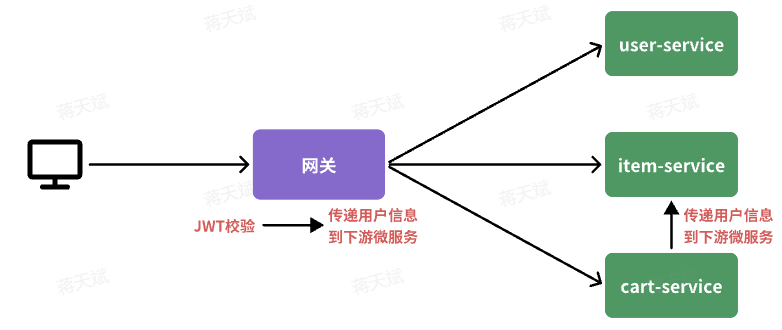
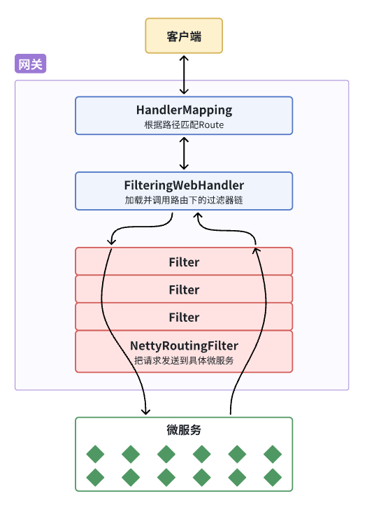
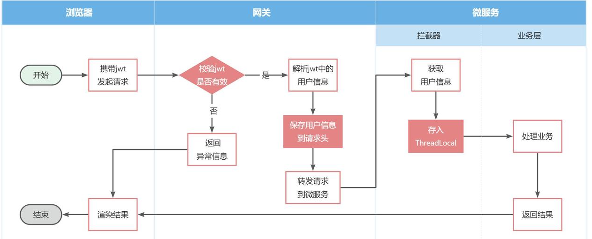
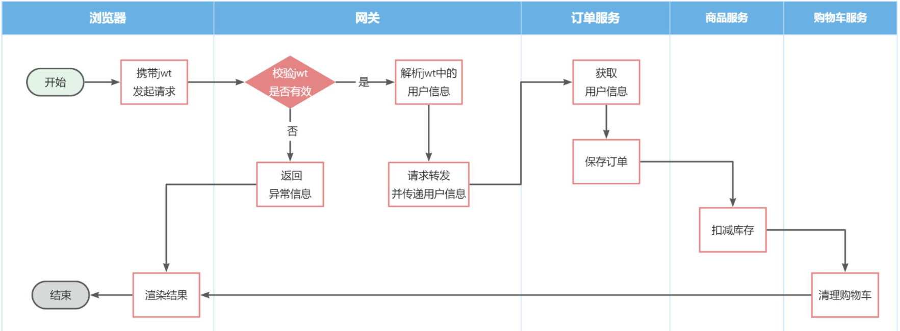
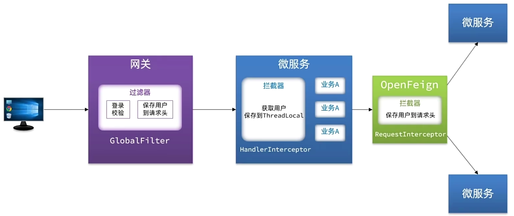

# SpringCloudGateway

SpringCloudGateway 用于搭建微服务网关。

## 基本配置

1. 将网关作为一个 module 。
2. 引入依赖。
3. 配置 `application.yaml`。

基本配置实例：

```yaml
server:
  port: 8080   # 服务需要的端口号
spring:
  application:
    name: gateway
  cloud:
    nacos:
      server-addr: 192.168.150.101:8848   # nacos 的入口
    gateway:
      routes:   # 网关的路由规则
        - id: item # 路由规则id，自定义，唯一
          uri: lb://item-service # 路由的目标服务，lb代表负载均衡，会从注册中心拉取服务列表
          predicates: # 路由断言，判断当前请求是否符合当前规则，符合则路由到目标服务
            - Path=/items/**,/search/** # 这里是以请求路径作为判断规则
        - id: cart
          uri: lb://cart-service
          predicates:
            - Path=/carts/**
```

路由规则主要有四个属性：（更多语法和配置项见官网）

- `id`：路由的唯一标示，字符串类型。
- `predicates`：路由断言，即是匹配条件。
- `filters`：路由过滤器，可以对路由断言之后的请求依据一定条件进一步过滤和处理。
- `uri`：路由目标地址，`lb://`代表负载均衡，从注册中心获取目标微服务的实例列表，并且负载均衡选择一个访问。

predicates 常见类型：

| **名称**   | **说明**                       | **示例**                                                     |
| :--------- | :----------------------------- | :----------------------------------------------------------- |
| After      | 是某个时间点后的请求           | - After=2037-01-20T17:42:47.789-07:00[America/Denver]        |
| Before     | 是某个时间点之前的请求         | - Before=2031-04-13T15:14:47.433+08:00[Asia/Shanghai]        |
| Between    | 是某两个时间点之前的请求       | - Between=2037-01-20T17:42:47.789-07:00[America/Denver], 2037-01-21T17:42:47.789-07:00[America/Denver] |
| Cookie     | 请求必须包含某些cookie         | - Cookie=chocolate, ch.p                                     |
| Header     | 请求必须包含某些header         | - Header=X-Request-Id, \d+                                   |
| Host       | 请求必须是访问某个host（域名） | - Host=**.somehost.org,**.anotherhost.org                    |
| Method     | 请求方式必须是指定方式         | - Method=GET,POST                                            |
| Path       | 请求路径必须符合指定规则       | - Path=/red/{segment},/blue/**                               |
| Query      | 请求参数必须包含指定参数       | - Query=name, Jack或者- Query=name                           |
| RemoteAddr | 请求者的ip必须是指定范围       | - RemoteAddr=192.168.1.1/24                                  |
| weight     | 权重处理                       |                                                              |

## 网关登录校验

单体架构时只需要完成一次用户登录、身份校验，就可以在所有业务中获取到用户信息。

而在微服务情况下，每个微服务都独立部署，不再共享数据，也就意味着每个微服务都需要做登录校验，这显然不可取。

### 鉴权思路

可以利用网关对请求进行鉴权：

- 在网关和用户服务中保存秘钥，不必在其它服务中保存密钥。
- 在网关开发登录校验功能。



其中：

- 网关路由是配置好的，请求转发是 Gateway 的内部代码，在转发之前做登录校验需要使用过滤器。
- 网关校验 JWT 后，要将用户信息传递给微服务，可以将用户信息设置在请求头中。（网关设置请求头）
- 微服务之间也会相互调用，这种调用不经过网关，也可以将用户信息设置在请求头中，设置主体不同。（服务设置请求头）

### 网关过滤器

#### 应用结构



其中：

- HandlerMapping
	- 为进入网关的客户端请求匹配路由规则（`Route`），然后将请求交给`WebHandler`去处理。
- FilteringWebHandler
	- 操作当前路由下需要执行的过滤器链（`Filter chain`），然后按照顺序逐一执行 Filter 。
- Filter
	- Filter 内部的逻辑分为 pre 和 post 两部分，分别会在请求路由到微服务**之前**和**之后**被执行。
- NettyRoutingFilter
	- 每个 Filter 的 pre 逻辑执行完后，请求将被 NettyRoutingFilter 路由到微服务。
- 微服务返回结果后，再倒序执行 Filter 的 post 部分的逻辑。

#### 类型

网关过滤器链中的过滤器有两种：

- GatewayFilter

	路由过滤器，作用范围比较灵活，可以是任意指定的路由 Route 。 

- GlobalFilter

	全局过滤器，作用范围是所有路由，不可配置。

`FilteringWebHandler`在处理请求时，会将`GlobalFilter`装饰为`GatewayFilter`，然后放到同一个过滤器链中，排序以后依次执行。

`Gateway` 内置的 `GatewayFilter` 过滤器使用时无需编码，只要在 yaml 文件中简单配置即可（有三十多种）。

添加请求头可以使用 `AddRequestHeaderGatewayFilterFacotry`，配置示例如下：

```yaml
spring:
  cloud:
    gateway:
      routes:
      - id: test_route
        uri: lb://test-service
        predicates:
          -Path=/test/**
        filters:   # 过滤器
          - AddRequestHeader=key, value # 逗号之前是请求头的key，逗号之后是value
```

#### 自定义过滤器

##### 自定义 GatewayFilter

自定义`GatewayFilter`不是直接实现`GatewayFilter`，而是实现`AbstractGatewayFilterFactory`。最简单的方式是这样的：

```Java
@Component
public class PrintAnyGatewayFilterFactory extends AbstractGatewayFilterFactory<Object> {
    @Override
    public GatewayFilter apply(Object config) {
        return new GatewayFilter() {
            @Override
            public Mono<Void> filter(ServerWebExchange exchange, GatewayFilterChain chain) {
                // 获取请求
                ServerHttpRequest request = exchange.getRequest();
                // 编写过滤器逻辑
                System.out.println("过滤器执行了");
                // 放行
                return chain.filter(exchange);
            }
        };
    }
}
```

配置文件：

```YAML
spring:
  cloud:
    gateway:
      default-filters:
            - PrintAny # 此处直接以自定义的GatewayFilterFactory类名称前缀类声明过滤器
```

还可以支持动态配置参数：

```Java
@Component
public class PrintAnyGatewayFilterFactory // 父类泛型是内部类的Config类型
                extends AbstractGatewayFilterFactory<PrintAnyGatewayFilterFactory.Config> {

    @Override
    public GatewayFilter apply(Config config) {
        // OrderedGatewayFilter是GatewayFilter的子类，包含两个参数：
        // - GatewayFilter：过滤器
        // - int order值：值越小，过滤器执行优先级越高
        return new OrderedGatewayFilter(new GatewayFilter() {
            @Override
            public Mono<Void> filter(ServerWebExchange exchange, GatewayFilterChain chain) {
                // 获取config值
                String a = config.getA();
                String b = config.getB();
                String c = config.getC();
                // 编写过滤器逻辑
                System.out.println("a = " + a);
                System.out.println("b = " + b);
                System.out.println("c = " + c);
                // 放行
                return chain.filter(exchange);
            }
        }, 100);
    }

    // 自定义配置属性，成员变量名称很重要，下面会用到
    @Data
    static class Config{
        private String a;
        private String b;
        private String c;
    }
    // 将变量名称依次返回，顺序很重要，将来读取参数时需要按顺序获取
    @Override
    public List<String> shortcutFieldOrder() {
        return List.of("a", "b", "c");
    }
        // 返回当前配置类的类型，也就是内部的Config
    @Override
    public Class<Config> getConfigClass() {
        return Config.class;
    }

}
```

配置文件：

```YAML
spring:
  cloud:
    gateway:
      default-filters:
            - PrintAny=1,2,3 # 注意，这里多个参数以","隔开，将来会按照shortcutFieldOrder()方法返回的参数顺序依次复制
```

#### 自定义 GlobalFilter

自定义 GlobalFilter 只需要直接实现 GlobalFilter ，但无法设置动态参数：

```Java
@Component
public class PrintAnyGlobalFilter implements GlobalFilter, Ordered {
    @Override
    public Mono<Void> filter(ServerWebExchange exchange, GatewayFilterChain chain) {
        // 编写过滤器逻辑
        System.out.println("未登录，无法访问");
        // 放行
        // return chain.filter(exchange);

        // 拦截
        ServerHttpResponse response = exchange.getResponse();
        response.setRawStatusCode(401);
        return response.setComplete();
    }

    @Override
    public int getOrder() {
        // 过滤器执行顺序，值越小，优先级越高
        return 0;
    }
}
```

### 登录校验实现示例

```Java
package com.hmall.gateway.filter;

import com.hmall.common.exception.UnauthorizedException;
import com.hmall.common.utils.CollUtils;
import com.hmall.gateway.config.AuthProperties;
import com.hmall.gateway.util.JwtTool;
import lombok.RequiredArgsConstructor;
import org.springframework.boot.context.properties.EnableConfigurationProperties;
import org.springframework.cloud.gateway.filter.GatewayFilterChain;
import org.springframework.cloud.gateway.filter.GlobalFilter;
import org.springframework.core.Ordered;
import org.springframework.http.server.reactive.ServerHttpRequest;
import org.springframework.http.server.reactive.ServerHttpResponse;
import org.springframework.stereotype.Component;
import org.springframework.util.AntPathMatcher;
import org.springframework.web.server.ServerWebExchange;
import reactor.core.publisher.Mono;

import java.util.List;

@Component
@RequiredArgsConstructor
@EnableConfigurationProperties(AuthProperties.class)
public class AuthGlobalFilter implements GlobalFilter, Ordered {

    private final JwtTool jwtTool;

    private final AuthProperties authProperties;

    private final AntPathMatcher antPathMatcher = new AntPathMatcher();

    @Override
    public Mono<Void> filter(ServerWebExchange exchange, GatewayFilterChain chain) {
        // 1.获取Request
        ServerHttpRequest request = exchange.getRequest();
        // 2.判断是否不需要拦截
        if(isExclude(request.getPath().toString())){
            // 无需拦截，直接放行
            return chain.filter(exchange);
        }
        // 3.获取请求头中的token
        String token = null;
        List<String> headers = request.getHeaders().get("authorization");
        if (!CollUtils.isEmpty(headers)) {
            token = headers.get(0);
        }
        // 4.校验并解析token
        Long userId = null;
        try {
            userId = jwtTool.parseToken(token);
        } catch (UnauthorizedException e) {
            // 如果无效，拦截
            ServerHttpResponse response = exchange.getResponse();
            response.setRawStatusCode(401);
            return response.setComplete();
        }

        // TODO 5.如果有效，传递用户信息
        System.out.println("userId = " + userId);
        
        // 6.放行
        return chain.filter(exchange);
    }

    private boolean isExclude(String antPath) {
        for (String pathPattern : authProperties.getExcludePaths()) {
            if(antPathMatcher.match(pathPattern, antPath)){
                return true;
            }
        }
        return false;
    }

    @Override
    public int getOrder() {
        return 0;
    }
}
```

### 微服务获取用户

网关发送请求到微服务依然采用 `Http` 请求，因此可以将用户信息以请求头的方式传递到下游微服务。

微服务内部可能很多地方都需要用到登录用户信息，因此可以利用 SpringMVC 的拦截器来实现登录用户信息获取，并存入ThreadLocal 。



注意：

- 网关向微服务发送 http 请求时需要将用户信息保存到请求头。
- 微服务向微服务发送 http 请求（通过 OpenFeign）时也需要将用户信息保存到请求头，才能在微服务间传递信息。
- 拦截器在请求进入某个微服务时获取用户信息。

### OpenFeign 传递用户

以下单业务为例：



其中，下单的过程中，需要调用商品服务扣减库存，调用购物车服务清理用户购物车，而清理购物车时必须知道当前登录的用户身份。

微服务之间调用是基于 OpenFeign 来实现的，并不是我们自己发送的请求。

为了让每一个由 OpenFeign 发起的请求自动携带登录用户信息，需要使用 Feign 提供的一个拦截器接口：`feign.RequestInterceptor` ：

```java
public interface RequestInterceptor {

  /**
   * Called for every request. 
   * Add data using methods on the supplied {@link RequestTemplate}.
   */
  void apply(RequestTemplate template);
}
```

在配置类中添加一个 Bean 即可：

```java
@Bean
public RequestInterceptor userInfoRequestInterceptor(){
    return new RequestInterceptor() {
        @Override
        public void apply(RequestTemplate template) {
            // 获取登录用户
            Long userId = UserContext.getUser();
            if(userId == null) {
                // 如果为空则直接跳过
                return;
            }
            // 如果不为空则放入请求头中，传递给下游微服务
            template.header("user-info", userId.toString());
        }
    };
}
```

### 网关登录校验总结



其中：

- 过滤器

	登录校验，获取用户信息到请求头。

	- 在网关内

- 拦截器 A

	获取用户信息到 ThreadLocal 。

	- 网关到微服务，微服务到微服务
	- 拦截点是请求到达微服务时。

- 拦截器 B

	获取用户信息到请求头。

	- 微服务到微服务
	- 拦截点是微服务发出请求时。
