# 基本概念

## 架构对比

### 单体架构

（monolithic structure）

整个项目中所有功能模块都在一个工程中开发；项目部署时需要对所有模块一起编译、打包；项目的架构设计、开发模式都非常简单。

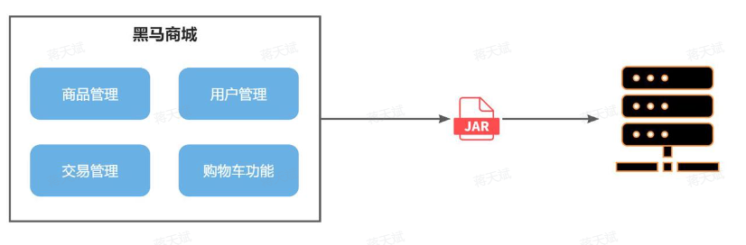

当项目规模较小时，这种模式上手快，部署、运维也都很方便，因此早期很多小型项目都采用这种模式。

随着项目的业务规模越来越大，团队开发人员也不断增加，问题：

- 团队协作成本高

	多人协作开发同一个项目，由于所有模块都在一个项目中，不同模块的代码之间物理边界模糊，最终要把功能合并到一个分支时可能要解决复杂的冲突。

- 调试和测试困难

	大型的单体架构项目往往一次编译要数十分钟，调试和测试十分耗时。

- 系统发布效率低

	任何模块变更都需要发布整个系统，而系统发布过程中需要多个模块之间制约，需要对比各种文件，任何一处出现问题都会导致发布失败，往往一次发布需要数十分钟甚至数小时。

- 系统可用性差

	单体架构各个功能模块是作为一个服务部署，相互之间会互相影响，一些热点功能会耗尽系统资源，挤占其它服务的可用空间。

### 微服务

（microservice structure）

将单体架构中的功能模块从单体应用中拆分出来，独立部署为多个服务。

其服务单元需要满足：

- 单一职责

	一个微服务负责一部分业务功能，并且其核心数据不依赖于其它模块。

- 团队自治

	每个微服务都有自己独立的开发、测试、发布、运维人员，团队人员规模不超过10人。

- 服务自治

	每个微服务都独立打包部署，访问自己独立的数据库。并且要做好服务隔离，避免对其它服务产生影响。

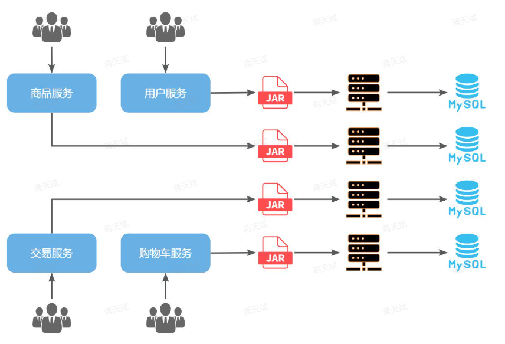

解决单体架构的问题：

- 对于团队协作成本高

	由于服务拆分，每个服务代码量大大减少，参与开发的后台人员在1~3名，协作成本大大降低。

- 调试和测试困难

	只需要针对单一服务模块进行调试和测试即可。

- 对于系统发布效率低

	每个服务都是独立部署，当有某个服务有代码变更时，只需要打包部署该服务即可。

- 对于系统可用性差

	每个服务独立部署，并且做好服务隔离，使用自己的服务器资源，不会影响到其它服务。

## Spring Cloud

Spring Cloud 是一整个微服务技术栈，Spring Cloud 整合了多家公司的微服务组件，并指定了统一的标准。

Spring Cloud 依托于 Spring Boot 的自动装配（依赖管理）能力，大大降低了其项目搭建、组件使用的成本。

## Spring Cloud Alibaba

Spring Cloud Alibaba 是阿里巴巴结合自身的微服务实践开源的微服务全家桶，包括：

- Nacos

	一个更轻量级、易于使用的服务发现和配置管理平台。Nacos 提供了服务注册与发现、配置管理、动态 DNS 服务等功能。

- Sentinel

	一个流量控制组件，主要用于分布式系统的熔断、限流、降级、容错等。它可以帮助你保障系统的高可用性。

- RocketMQ

	阿里巴巴开源的高性能分布式消息中间件，提供可靠的消息队列服务，支持事务消息、顺序消息等功能。

- Dubbo

	一个高性能的 Java RPC 框架，适用于分布式服务架构。Spring Cloud Alibaba 通过对 Dubbo 的集成，提供了分布式 RPC 服务的支持。

- Spring Cloud Gateway

	通过 Spring Cloud Gateway，用户可以实现 API 网关功能，支持路由、过滤、负载均衡等多种功能。

- Seata

	一个分布式事务解决方案，支持微服务架构中的全局事务管理，保证多个微服务之间的数据一致性。

- Alibaba Cloud OSS

	阿里云对象存储服务 (OSS) 的 Spring Cloud 集成，可以轻松实现文件存储的服务。

- Spring Cloud Alibaba Config

	用于分布式应用配置管理的组件，支持集中式配置管理，并与 Nacos 等服务集成。

- Spring Cloud Alibaba Consul

	与 Consul 集成，用于服务发现和健康检查。

## 工程结构

一般微服务项目有两种不同的工程结构：

- 完全解耦

	每一个微服务都创建为一个独立的工程，甚至可以使用不同的开发语言来开发，项目完全解耦。

	- 优点：服务之间耦合度低
	- 缺点：每个项目都有自己的独立仓库，管理起来比较麻烦

- Maven聚合

	整个项目为一个 Project，每个微服务是其中的一个 Module

	- 优点：项目代码集中，管理和运维方便
	- 缺点：服务之间耦合，编译时间较长

## 注册中心

不同微服务间通过 RPC 协议（Remote Produce Call Protocol）进行服务调用。

RPC 的实现方式举例：

- 直接基于 Http 协议

	这种方式不关心服务提供者的具体技术实现，只要对外暴露 Http 接口，更符合微服务的需要。

- Dubbo 框架

	Dubbo 是一个 RPC 框架，也是一个 RPC 协议，还支持 Triple 等 RPC 协议。

但单纯在微服务间互相调用 RPC 无法应对多服务实例的负载均衡以及实例宕机。

注册中心统一管理需要调用的服务：

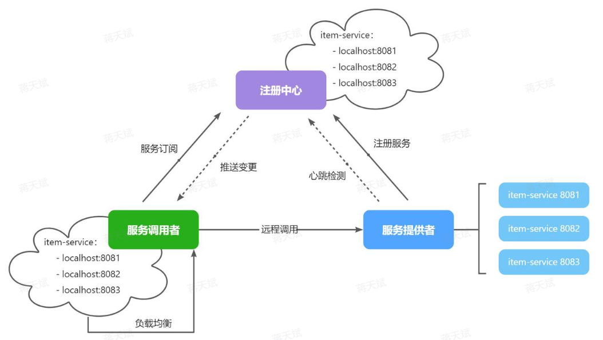

其中：

- 服务调用者
	- 服务启动时就会注册自己的服务信息（服务名、IP、端口）到注册中心
	- 调用者可以从注册中心订阅想要的服务，获取服务对应的实例列表（1个服务可能多实例部署）
	- 调用者自己对实例列表进行负载均衡，挑选调用的实例
- 服务提供者
	- 定期向注册中心报告自己的健康状态（心跳请求），当注册中心长时间收不到提供者的心跳时，会认为该实例宕机，将其从服务的实例列表中剔除。
	- 当服务有新实例启动时，会发送注册服务请求，其信息会被记录在注册中心的服务实例列表。
	- 当注册中心服务列表变更时，会主动通知微服务，更新本地服务列表。

目前开源的注册中心框架有很多，国内比较常见的有：

- Eureka

	Netflix公司出品，目前被集成在SpringCloud当中，一般用于Java应用。

- Nacos

	Alibaba公司出品，目前被集成在SpringCloudAlibaba中，一般用于Java应用。

- Consul

	HashiCorp公司出品，目前集成在SpringCloud中，不限制微服务语言。

## 网关

每个微服务有不同的入口，即地址和端口。

如果前端直接调用各个微服务，那么会产生问题：

- 多入口

	前端请求不同数据时要访问不同的入口。

- 服务配置更新

	前端无法调用 nacos，无法实时更新服务列表。

- 鉴权

	需要在多个微服务间完成用户登录、身份校验，传递用户信息。

使用网关能够解决上述问题。

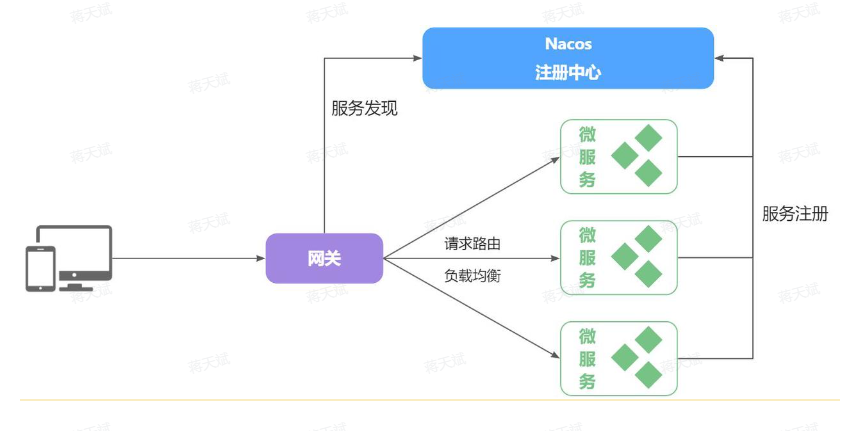

微服务网关：

- 前端请求不能直接访问微服务，而是要请求网关，将网关作为前端统一访问入口，微服务间不用再鉴权，只需要传递用户信息。
- 网关可以统一为前端请求选择去向（路由），并做负载均衡，然后发送到各微服务（转发）。
- 网关可以做安全控制，即登录身份校验。（校验）
- 网关可以实时更新服务列表。（配置热更新）

SpringCloud 提供了两种网关实现方案：

- Netflix Zuul：早期实现，阻塞式编程，目前已经淘汰。
- SpringCloudGateway：基于 Spring 的 WebFlux 技术，支持响应式编程，吞吐能力更强。

## 配置中心

多个微服务间存在大量的配置：

- 网关路由在配置文件中写死了，如果变更必须重启微服务。
- 某些业务配置在配置文件中写死了，每次修改都要重启服务。
- 每个微服务都有很多重复的配置，维护成本高。

Nacos 可以提供配置管理服务：

- 微服务共享的配置在 Nacos 控制台修改配置后，Nacos 会将配置变更推送给相关的微服务，并且无需重启即可生效。（配置热更新）
- 网关的路由配置也可以基于 Nacos 实现无需重启网关即可修改路由配置。（动态路由）

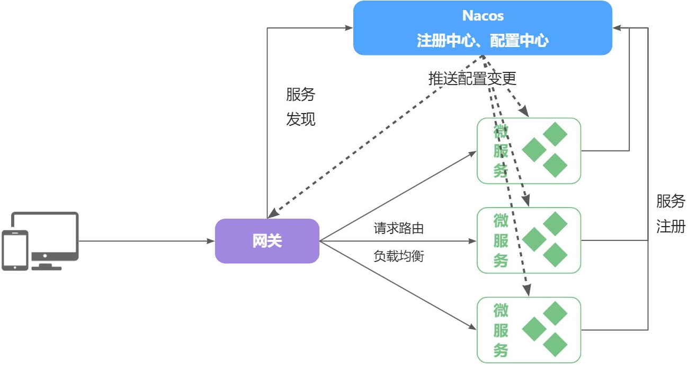

## 服务保护

国内使用较多的服务保护技术是 Spring Cloud Alibaba 的 Sentinel 。

另一个常见的是 Spring Cloud Netflix 的 Hystrix 。

主要对比如下：

| Sentinel       | Hystrix                                        |                               |
| -------------- | ---------------------------------------------- | ----------------------------- |
| 隔离策略       | 信号量隔离                                     | 线程池隔离/信号量隔离         |
| 熔断降级策略   | 基于慢调用比例或异常比例                       | 基于失败比率                  |
| 实时指标实现   | 滑动窗口                                       | 滑动窗口（基于 RxJava）       |
| 规则配置       | 支持多种数据源                                 | 支持多种数据源                |
| 扩展性         | 多个扩展点                                     | 插件的形式                    |
| 基于注解的支持 | 支持                                           | 支持                          |
| 限流           | 基于 QPS，支持基于调用关系的限流               | 有限的支持                    |
| 流量整形       | 支持慢启动、匀速排队模式                       | 不支持                        |
| 系统自适应保护 | 支持                                           | 不支持                        |
| 控制台         | 开箱即用，可配置规则、查看秒级监控、机器发现等 | 不完善                        |
| 常见框架的适配 | Servlet、Spring Cloud、Dubbo、gRPC 等          | Servlet、Spring Cloud Netflix |

### 雪崩问题

（也叫级联失败问题）

假设有购物车服务，假如购物车服务的查询商品服务业务并发较高，占用过多 Tomcat 连接，可能会导致依赖购物车服务的其它服务的所有接口响应时间增加，延迟变高，甚至是长时间阻塞直至查询失败。

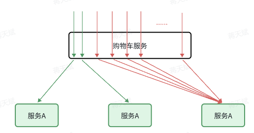

同时，依赖购物车的服务，以及依赖服务的服务也可能出现问题，从而导致整个集群出现大面积的服务不可用：

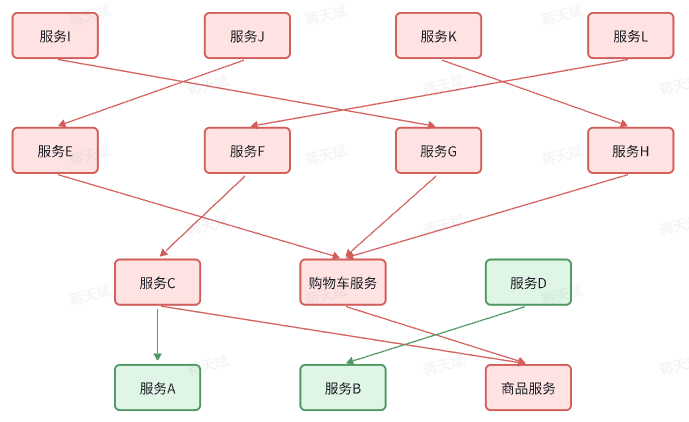

### 常见服务保护方案

以下方案或多或少都会导致服务的体验上略有下降：

- 请求限流

	降低了并发上限。

- 线程隔离

	降低了可用资源数量。

- 服务熔断

	降低了服务的完整度，部分服务变的不可用或弱可用。

因此这些方案都属于**服务降级方案**。

#### 请求限流

设置限流器，限制或控制接口访问的并发流量，避免服务因流量激增而出现故障。

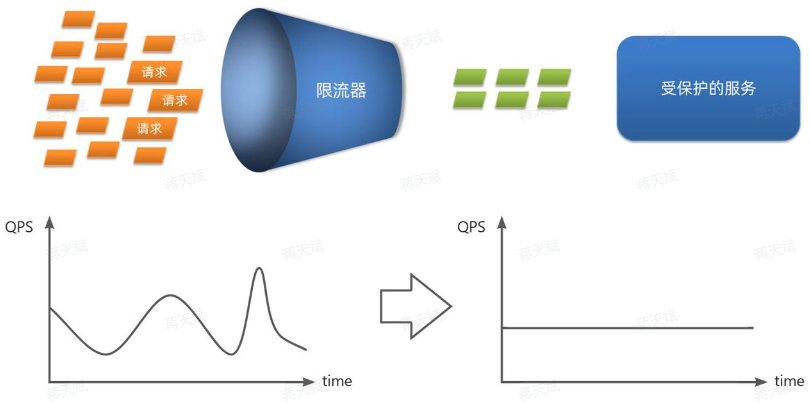

#### 线程隔离

为了避免某个接口故障或压力过大导致整个服务不可用，我们可以限定每个接口可以使用的资源范围，也就是将其“隔离”起来：

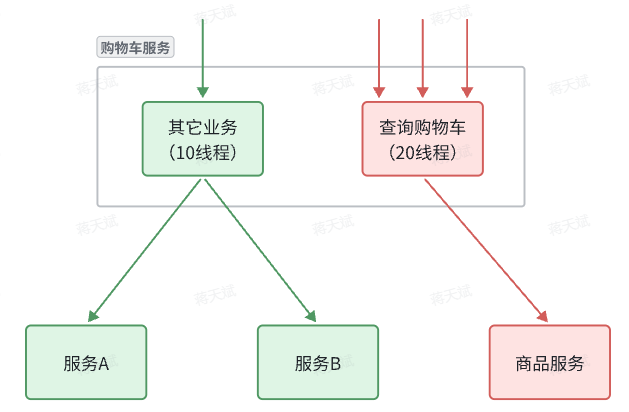

其中，即便查询购物车的请求因为商品服务出现故障而堆积请求，也不会导致服务器的线程资源被耗尽，不会影响到其它业务。

##### 隔离方式

线程隔离有两种方式实现：

- 线程池隔离（Hystix 默认方式）

	给每个服务调用业务分配一个线程池，利用线程池本身的线程数量上限实现隔离效果。

	- 优点：支持主动超时（线程池功能），支持异步调用（由线程池建立新的异步线程进行调用）。
	- 缺点：线程池的额外开销大。
	- 场景：低扇出。

- 信号量隔离（Sentinel 默认方式）

	不创建线程池，而是计数器模式，记录业务使用的线程数量，达到信号量上限时，禁止新的对该服务的请求。

	- 优点：轻量，无额外开销。
	- 缺点：不支持主动超时，不支持异步调用。
	- 场景：高频调用，高扇出。

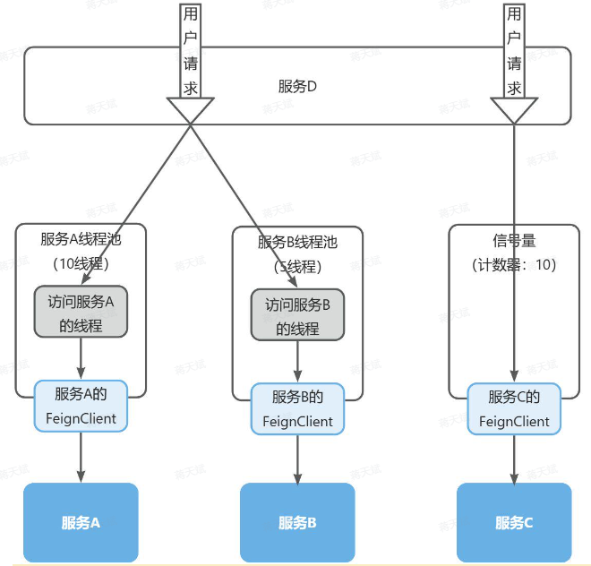

#### 服务熔断

线程隔离虽然避免了雪崩问题，但故障服务（商品服务）依然会拖慢购物车服务（服务调用方）的接口响应速度。

而且商品查询的故障依然会导致查询购物车功能出现故障，购物车业务也变的不可用了。

服务熔断包含两部分：

- 异常统计，熔断

	统计服务提供方的异常请求比例，当比例过高表明该接口会影响到其它服务，应该拒绝调用该接口，转而直接走 fallback 。

- 降级处理（fallback）

	访问熔断后的服务则直接抛出异常，或返回友好提示或默认数据。

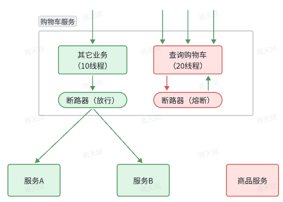

#### 计数算法

在请求限流和服务熔断中，都需要计数功能。

##### 固定窗口计数

固定窗口计数法：

- 将时间划分为多个窗口，窗口时间跨度称为`Interval`，本例中为1000ms；
- 每个窗口维护1个计数器，每有1次请求就将计数器`+1`。限流就是设置计数器阈值，本例为3，图中红线标记。
- 如果计数器超过了限流阈值，则超出阈值的请求都被丢弃。

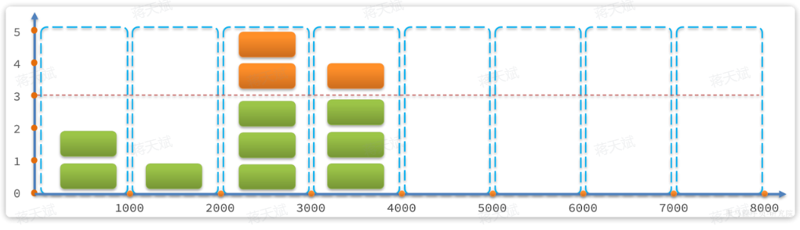

其中：

- 第1、2秒，请求数量都小于3，没问题。
- 第3秒，请求数量为5，超过阈值，超出的请求被拒绝。

当请求集中在窗口边缘时：

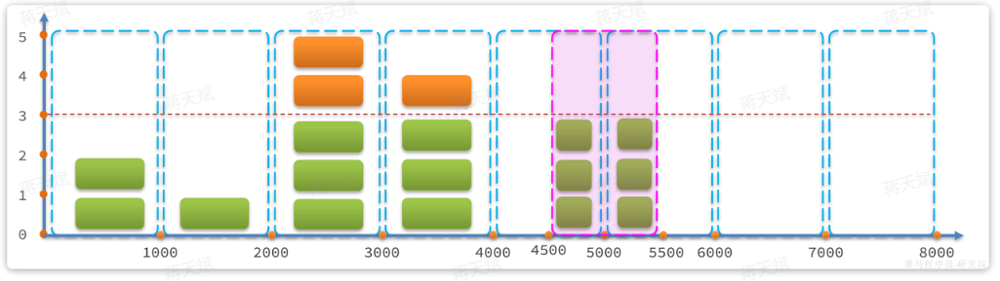

其中：

- 如果第5秒的三次请求都是在4.5 到 5 秒之间进来；第6秒的请求是在 5 到 5.5之间进来。那么从第4.5~5.之间就有6次请求，也就是说每秒的QPS达到了6，远超阈值。

##### 滑动窗口计数

（是 sentinel 的默认方式）

滑动窗口计数以当前时间之前的多个小粒度窗口的合并作为一个大的滑动窗口，从而提升计数精度：

- 窗口时间跨度`Interval`大小固定，例如1秒。
- 时间区间跨度为`Interval / n` ，例如n=2，则时间区间跨度为500ms 。
- 窗口会随着当前请求所在时间`currentTime`移动，窗口范围从`currentTime-Interval`时刻之后的第一个时区开始，到`currentTime`所在时区结束。（大窗口会滑动，滑动变化单位为小窗口）

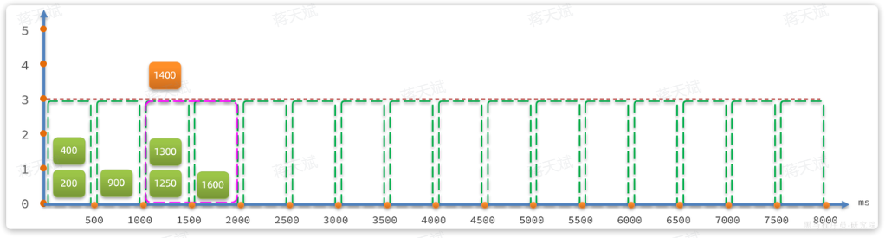

滑动窗口法的小窗口跨度越小，精度越高，请求集中在窗口边缘时超过计数阈值的概率越小。

##### 令牌桶算法

（Sentinel 中的热点参数限流正是基于令牌桶算法实现的）

思路：

- 以固定的速率生成令牌，存入令牌桶中，如果令牌桶满了以后，多余令牌丢弃
- 请求进入后，必须先尝试从桶中获取令牌，获取到令牌后才可以被处理
- 如果令牌桶中没有令牌，则请求等待或丢弃
- 令牌可以直接是一个计数器。

令牌桶算法类似于滑动窗口计数，假设生成令牌的时间间隔是 10 ms，则相当于大窗口的跨度是 10 ms 。

当请求集中在大窗口边缘时，令牌桶算法也可能存在请求数量（令牌数量）突然超过阈值的情况：

- 因此令牌桶算法的令牌数量设置不能设置为最大上限，而因设置为小于上限的一个较小的值，比如一半（相当于小窗口大小）。
- 但上限设置得较小会导致一般情况下令牌数量较少，浪费服务资源。

##### 漏桶算法

（sentinel 的限流的排队等待功能正是基于漏桶算法实现的）

漏桶算法与令牌桶相似，但在设计上更适合应对并发波动较大的场景，以解决令牌桶中的问题。

思路：

- 请求到达后不是直接处理，而是先放入一个队列（漏桶）。
- 而后以固定的速率从队列中取出并处理请求。

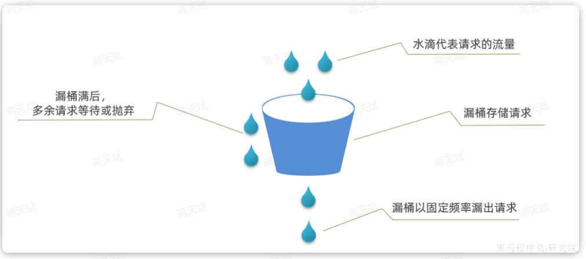

漏桶的优势就是**流量整型**，无论并发量如何波动，请求通过漏桶时都会以稳定的速率被处理。

sentinel 的令牌桶实现方式：

- 桶的容量取决于 **QPS 阈值**和等待的**最大超时时间**。
- 假设阈值 QPS = 5，最大超时时间为 2000 ms 。
- 每个请求进入漏桶时都会计算预期等待执行时间
	- `预期等待执行时间 = 当前时间漏桶的水滴量 * 阈值对应的单位请求处理时间`
- 如果预期等待执行时间大于最大超时时间，则会拒绝新的请求。

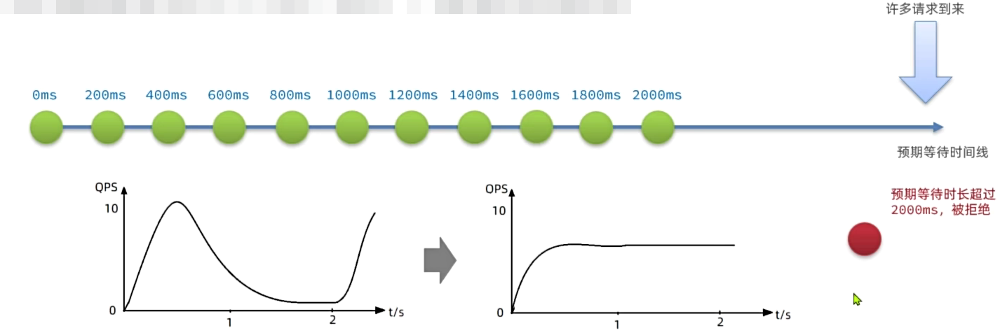

## 分布式事务

分布式事务，就是指不是在单个服务或单个数据库架构下，产生的事务，例如：

- 跨数据源的分布式事务
- 跨服务的分布式事务
- 综合情况

假设有一个下单服务：

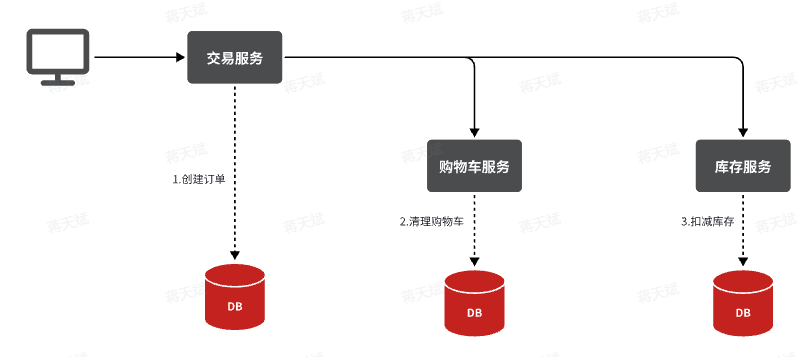

它涉及的订单、购物车、商品这三个不同的微服务，而每个微服务都有自己独立的数据库，因此下单过程中就会跨多个数据库完成业务。

每个微服务都会执行自己的本地事务：

- 交易服务：下单事务
- 购物车服务：清理购物车事务
- 库存服务：扣减库存事务

事务类型：

- 分支事务

	每个微服务的本地事务。

- 全局事务

	多个关联的分支事务构成一个全局事务。

每个单体事务虽然满足 ACID 特征，但全局事务跨多个服务、多个数据源，不能直接保证 ACID 特性，不能保证统一回滚。

解决分布式事务常用阿里巴巴的 Seata 框架。

## 消息队列

（Message Queue， MQ）

### 同步调用

以**余额支付功能**为例。

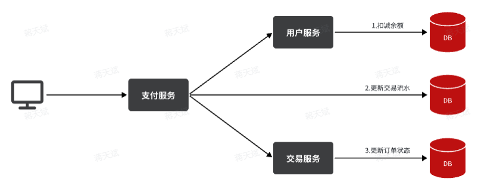

如果采用基于 OpenFeign 的同步调用，需要依次执行三步：

1. 支付服务需要先调用用户服务完成余额扣减。
2. 然后支付服务自己要更新支付流水单的状态。
3. 然后支付服务调用交易服务，更新业务订单状态为已支付。

问题：

- 扩展性差

	随着产品的功能增多，支付业务需要改动代码以调用越来越多的服务。

- 性能下降

	同步调用的整个业务的响应时长就是每次远程调用的执行时长之和，大量同步调用会导致长时间阻塞。

- 级联失败

	当部分非核心的服务，如交易服务、通知服务出现故障时，整个事务都会回滚，导致交易失败。

	- 假设用户余额充足，扣款已经成功，此时我们应该确保支付流水单更新为已支付，而不应该因为短信通知、更新订单状态失败而回滚整个事务。

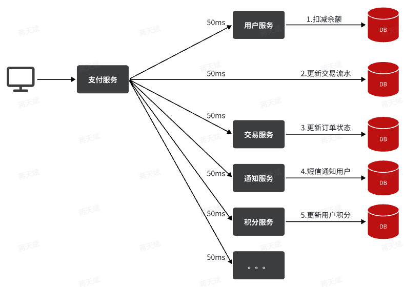

### 异步调用

异步调用可以采用消息通知的方式实现。

一般包含三个角色：

- 消息发送者

	投递消息的人，服务的请求者。

- 消息 Broker

	管理、暂存、转发消息。

- 消息接收者

	接收和处理消息的人，服务提供方。

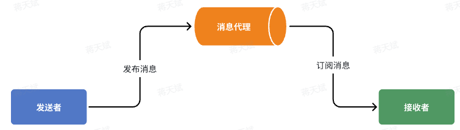

在异步调用中：

- 发送者不再直接同步调用接收者的业务接口，而是发送一条消息投递给消息Broker。
- 接收者根据自己的需求从消息Broker那里订阅消息。
- 每当发送方发送消息后，接受者都能获取消息并处理。

以余额支付业务为例：

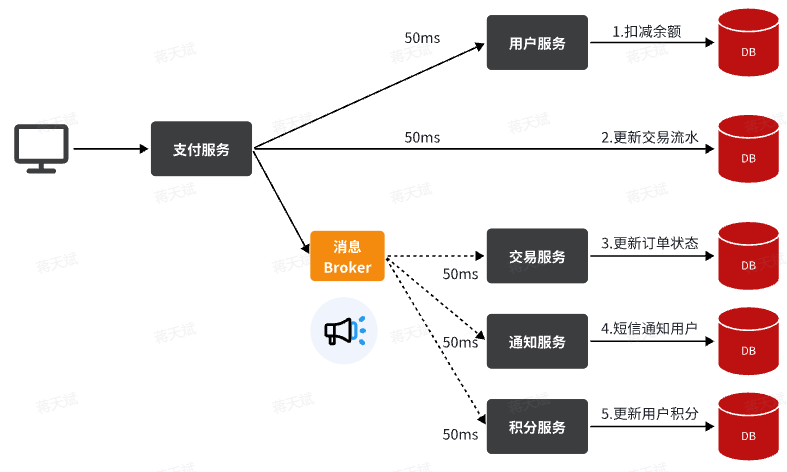

异步调用的优势：

- 耦合度更低

	除了扣减余额、更新支付流水单状态以外，其它调用逻辑改为发送一条消息到Broker。相关的微服务都可以订阅消息通知，一旦消息到达Broker，则会分发给每一个订阅了的微服务，处理各自的业务。

- 性能更好

	所有订阅者的服务可以并行处理，不阻塞。

- 业务拓展性强

	添加新的业务只需订阅消息即可。

- 故障隔离，避免级联失败

	不管是交易服务、通知服务，还是积分服务，他们的业务与支付关联度低。现在采用了异步调用，解除了耦合，他们即便执行过程中出现了故障，也不会影响到支付服务。

异步通信的缺点：

- 完全依赖于Broker的可靠性、安全性和性能。
- 架构复杂，后期维护和调试麻烦。

### 常见消息队列技术

常见 MQ 实现：

- ActiveMQ（几乎淘汰）
- RabbitMQ（中小公司大量使用）
- RocketMQ（Bug 较多）
- Kafka（适合并发超高的项目）

|            | RabbitMQ                | ActiveMQ                       | RocketMQ   | Kafka      |
| ---------- | ----------------------- | ------------------------------ | ---------- | ---------- |
| 公司/社区  | Rabbit                  | Apache                         | 阿里       | Apache     |
| 开发语言   | Erlang                  | Java                           | Java       | Scala&Java |
| 协议支持   | AMQP，XMPP，SMTP，STOMP | OpenWire,STOMP，REST,XMPP,AMQP | 自定义协议 | 自定义协议 |
| 可用性     | 高                      | 一般                           | 高         | 高         |
| 单机吞吐量 | 一般                    | 差                             | 高         | 非常高     |
| 消息延迟   | 微秒级                  | 毫秒级                         | 毫秒级     | 毫秒以内   |
| 消息可靠性 | 高                      | 一般                           | 高         | 一般       |

