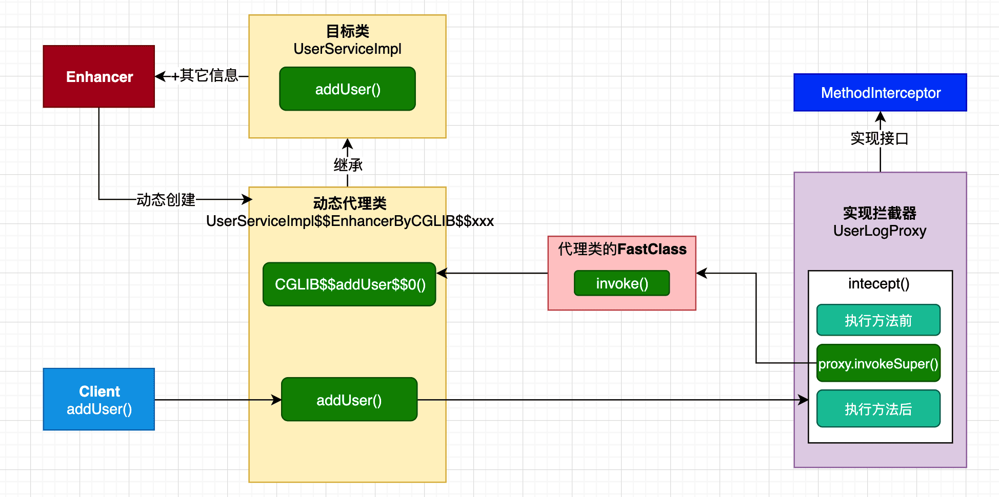

# AOP 实现原理

- 代理（Proxy）

	为另一个对象提供一个替身或占位符以控制对这个对象的访问。

- 动态代理（Dynamic Prox）

	在程序运行期创建目标对象的代理对象，并对目标对象中的方法进行功能性增强。

用目标类的引用去引用代理对象，就可以在不修改原目标类引用代码的基础上，动态调用代理类的方法。

## 基于 Cglib 对方法的动态代理

### 示例

以下是基于 Cglib 代理的一个简化流程，Spring 封装了这个代理流程以实现 AOP 。

假设有：

```java
public class User {   // 实体类
    
}

public class UserServiceImpl {   // 目标类（被代理类）
    
    public void addUser() {   // 目标方法（被代理方法）
        // do something
    }
}
```

需要实现 MethodInterceptor 接口，并指定代理目标类 target ：

```java
package tech.pdai.springframework.proxy;

import java.lang.reflect.Method;

import net.sf.cglib.proxy.Enhancer;
import net.sf.cglib.proxy.MethodInterceptor;
import net.sf.cglib.proxy.MethodProxy;

/**
 * This class is for proxy demo.
 *
 * @author pdai
 */
public class UserLogProxy implements MethodInterceptor {

    /**
     * 业务类对象，供代理方法中进行真正的业务方法调用
     */
    private Object target;

    public Object getUserLogProxy(Object target) {
        //给业务对象赋值
        this.target = target;
        //创建加强器，用来创建动态代理类
        Enhancer enhancer = new Enhancer();
        //为加强器指定要代理的业务类（即：为下面生成的代理类指定父类）
        enhancer.setSuperclass(this.target.getClass());
        //设置回调：对于代理类上所有方法的调用，都会调用CallBack，而Callback则需要实现intercept()方法进行拦
        enhancer.setCallback(this);
        // 创建动态代理类对象并返回
        return enhancer.create();
    }

    // 实现回调方法
    @Override
    public Object intercept(Object obj, Method method, Object[] args, MethodProxy proxy) throws Throwable {
        // log - before method
        System.out.println("[before] execute method: " + method.getName());

        // call method
        Object result = proxy.invokeSuper(obj, args);

        // log - after method
        System.out.println("[after] execute method: " + method.getName() + ", return value: " + result);
        return null;
    }
}
```

使用代理对象：

```java
package tech.pdai.springframework;

import tech.pdai.springframework.proxy.UserLogProxy;
import tech.pdai.springframework.service.UserServiceImpl;

/**
 * Cglib proxy demo.
 *
 * @author pdai
 */
public class ProxyDemo {

    public static void main(String[] args) {
        // proxy
        UserServiceImpl userService = (UserServiceImpl) new UserLogProxy().getUserLogProxy(new UserServiceImpl());

        // call methods
        userService.addUser();
    }
}
```

### 图解



其中：

- Enhancer 根据目标类的信息创建代理类。
- Cglib 生成的代理类是目标类的子类。
- UserLogProxy 表示编写代理的业务类，也即拦截器（MethodInterceptor）的接口实现，在拦截方法 `intercept（）`中编写增强语句。
- `UserServiceImpl$$EnhancerByCGLIB$$xxx` 是自动生成的代理类文件，可在项目中找到。
- Client（指用户）要进行 addUser 行为于是调用代理类的 addUser() 方法，并被拦截器的 intercept() 方法拦截。
- 特别的，`proxy.invokeSuper()` 表示调用代理对象的父类中的代理方法，这个过程没有使用 FastClass 机制，由代理类的 FastClass invoke 目标类的方法。

注意：

final 方法和 static 方法不能被子类覆盖，所以不能被代理。

### FastClass

FastClass 类似于反射中的 Class 类，都是描述类的信息。

FastClass 将委托类（A 类）的方法签名转换为一个 index ，然后通过 FastClasss 的`invoke(instanceOfA, index, args)`（需要一个 A 的实例以及 index）就可以实现类似反射的运行时动态调用方法的功能，这个机制比反射快。

对比：

- java 反射机制调用方法需要经过一系列的权限验证、通过 native 方法请求 jvm 去方法区查找方法定义、以及最后的 invoke 仍然可能要通过 JNI 调用 native 方法。
- FastClass 机制则跟调用一个普通的方法调用没有太大区别、只是多了一步根据 index 判断调用委托类的哪个方法这一步骤、性能损耗基本没有。

示例：

```java
public class test10 {
　　//这里，tt可以看作目标对象，fc可以看作是代理对象；首先根据代理对象的getIndex方法获取目标方法的索引，
　　//然后再调用代理对象的invoke方法就可以直接调用目标类的方法，避免了反射
    public static void main(String[] args){
        Test tt = new Test();
        Test2 fc = new Test2();
        int index = fc.getIndex("f()V");
        fc.invoke(index, tt, null);
    }
}

class Test{
    public void f(){
        System.out.println("f method");
    }
    
    public void g(){
        System.out.println("g method");
    }
}
class Test2{
    // 根据索引调用方法
    public Object invoke(int index, Object o, Object[] args){
        Test t = (Test) o;
        switch(index){
        case 1:
            t.f();
            return null;
        case 2:
            t.g();
            return null;
        }
        return null;
    }
    //这个方法对Test类中的方法建立索引
    public int getIndex(String signature){
        switch(signature.hashCode()){
        case 3078479:
            return 1;
        case 3108270:
            return 2;
        }

/** 相当于：
        switch (sign){
            case "service1":
                return 1;
            case "service2":
                return 2;
        }
*/

        return -1;
    }
}
```

## 基于 JDK 对接口的动态代理

（对接口实现方法的动态代理）

### 示例

假设有：

```java
public class User {   // 实体类
    
}

public interface IUserService {   // 目标接口（被代理的接口）
    void addUser();
}

public class UserServiceImpl implements IUserService {   // 目标类（被代理的类）
    @Override
    public void addUser() {
        // do something
    }
}
```

代理类如下：

```java
package tech.pdai.springframework.proxy;

import tech.pdai.springframework.service.IUserService;
import tech.pdai.springframework.service.UserServiceImpl;

import java.lang.reflect.InvocationHandler;
import java.lang.reflect.Method;
import java.lang.reflect.Proxy;
import java.util.Arrays;

/**
 * This class is for proxy demo.
 *
 * @author pdai
 */
public class UserLogProxy {

    /**
     * proxy target
     */
    private IUserService target;

    /**
     * init.
     *
     * @param target target
     */
    public UserLogProxy(UserServiceImpl target) {
        super();
        this.target = target;
    }

    /**
     * get proxy.
     *
     * @return proxy target
     */
    public IUserService getLoggingProxy() {
        IUserService proxy;
        ClassLoader loader = target.getClass().getClassLoader();
        Class[] interfaces = new Class[]{IUserService.class};
        InvocationHandler h = new InvocationHandler() {
            /**
             * proxy: 代理对象
             * method: 正在被调用的方法
             * args: 调用方法传入的参数
             */
            @Override
            public Object invoke(Object proxy, Method method, Object[] args) throws Throwable {
                String methodName = method.getName();
                // log - before method
                System.out.println("[before] execute method: " + methodName);

                // call method
                Object result = null;
                try {
                    // 前置通知
                    result = method.invoke(target, args);
                    // 返回通知, 可以访问到方法的返回值
                } catch (NullPointerException e) {
                    e.printStackTrace();
                    // 异常通知, 可以访问到方法出现的异常
                }
                // 后置通知. 因为方法可以能会出异常, 所以访问不到方法的返回值

                // log - after method
                System.out.println("[after] execute method: " + methodName + ", return value: " + result);
                return result;
            }
        };
        /**
         * loader: 代理对象使用的类加载器.
         * interfaces: 指定代理对象的类型. 即代理代理对象中可以有哪些方法.
         * h: 当具体调用代理对象的方法时, 应该如何进行响应, 实际上就是调用 InvocationHandler 的 invoke 方法
         */
        proxy = (IUserService) Proxy.newProxyInstance(loader, interfaces, h);
        return proxy;
    }

}
```

使用代理：（指定代理目标并执行）

```java
package tech.pdai.springframework;

import tech.pdai.springframework.proxy.UserLogProxy;
import tech.pdai.springframework.service.IUserService;
import tech.pdai.springframework.service.UserServiceImpl;

/**
 * Jdk proxy demo.
 *
 * @author pdai
 */
public class ProxyDemo {

    /**
     * main interface.
     *
     * @param args args
     */
    public static void main(String[] args) {
        // proxy
        IUserService userService = new UserLogProxy(new UserServiceImpl()).getLoggingProxy();

        // call method
        userService.addUser();
    }
}
```

### 解释

JDK 动态代理基于 JDK 提供的工具类 Proxy 实现。

代理业务类（UserLogProxy）中实现了 InvocationHandler 类，并重写了其 invoke 方法（增强的逻辑在 invoke 方法中），然后使用 InvocationHandler、接口、以及关联某个目标类的 loader，来生成目标类的代理类 Proxy ，可见：

```java
proxy = (IUserService) Proxy.newProxyInstance(loader, interfaces, h);   // h --> InvocationHandler 
return proxy;
```

从而，每个目标类实例都有一个关联的 Proxy ，此对象包含了 InvocationHandler ，增强的语句在 InvocationHandler 的 invoke 方法中。

### Proxy 类的生成

JDK 动态代理需要的 Proxy 类是由 sun.misc.ProxyGenerator 生成的。

其生成的逻辑为：

```java
/**
    * Generate a proxy class given a name and a list of proxy interfaces.
    *
    * @param name        the class name of the proxy class
    * @param interfaces  proxy interfaces
    * @param accessFlags access flags of the proxy class
*/
public static byte[] generateProxyClass(final String name,
                                        Class<?>[] interfaces,
                                        int accessFlags)
{
    ProxyGenerator gen = new ProxyGenerator(name, interfaces, accessFlags);
    final byte[] classFile = gen.generateClassFile();
    ...
}
```

generateClassFile 方法如下：

```java
/**
    * Generate a class file for the proxy class.  This method drives the
    * class file generation process.
    */
private byte[] generateClassFile() {

    /* 第一步：将所有方法包装成ProxyMethod对象 */
    
    // 将Object类中hashCode、equals、toString方法包装成ProxyMethod对象
    addProxyMethod(hashCodeMethod, Object.class);
    addProxyMethod(equalsMethod, Object.class);
    addProxyMethod(toStringMethod, Object.class);

    // 将代理类接口方法包装成ProxyMethod对象
    for (Class<?> intf : interfaces) {
        for (Method m : intf.getMethods()) {
            addProxyMethod(m, intf);
        }
    }

    // 校验返回类型
    for (List<ProxyMethod> sigmethods : proxyMethods.values()) {
        checkReturnTypes(sigmethods);
    }

    /* 第二步：为代理类组装字段，构造函数，方法，static初始化块等 */
    try {
        // 添加构造函数，参数是InvocationHandler
        methods.add(generateConstructor());

        // 代理方法
        for (List<ProxyMethod> sigmethods : proxyMethods.values()) {
            for (ProxyMethod pm : sigmethods) {

                // 字段
                fields.add(new FieldInfo(pm.methodFieldName,
                    "Ljava/lang/reflect/Method;",
                        ACC_PRIVATE | ACC_STATIC));

                // 上述ProxyMethod中的方法
                methods.add(pm.generateMethod());
            }
        }

        // static初始化块
        methods.add(generateStaticInitializer());

    } catch (IOException e) {
        throw new InternalError("unexpected I/O Exception", e);
    }

    if (methods.size() > 65535) {
        throw new IllegalArgumentException("method limit exceeded");
    }
    if (fields.size() > 65535) {
        throw new IllegalArgumentException("field limit exceeded");
    }

    /* 第三步：写入class文件 */

    /*
        * Make sure that constant pool indexes are reserved for the
        * following items before starting to write the final class file.
        */
    cp.getClass(dotToSlash(className));
    cp.getClass(superclassName);
    for (Class<?> intf: interfaces) {
        cp.getClass(dotToSlash(intf.getName()));
    }

    /*
        * Disallow new constant pool additions beyond this point, since
        * we are about to write the final constant pool table.
        */
    cp.setReadOnly();

    ByteArrayOutputStream bout = new ByteArrayOutputStream();
    DataOutputStream dout = new DataOutputStream(bout);

    try {
        /*
            * Write all the items of the "ClassFile" structure.
            * See JVMS section 4.1.
            */
                                    // u4 magic;
        dout.writeInt(0xCAFEBABE);
                                    // u2 minor_version;
        dout.writeShort(CLASSFILE_MINOR_VERSION);
                                    // u2 major_version;
        dout.writeShort(CLASSFILE_MAJOR_VERSION);

        cp.write(dout);             // (write constant pool)

                                    // u2 access_flags;
        dout.writeShort(accessFlags);
                                    // u2 this_class;
        dout.writeShort(cp.getClass(dotToSlash(className)));
                                    // u2 super_class;
        dout.writeShort(cp.getClass(superclassName));

                                    // u2 interfaces_count;
        dout.writeShort(interfaces.length);
                                    // u2 interfaces[interfaces_count];
        for (Class<?> intf : interfaces) {
            dout.writeShort(cp.getClass(
                dotToSlash(intf.getName())));
        }

                                    // u2 fields_count;
        dout.writeShort(fields.size());
                                    // field_info fields[fields_count];
        for (FieldInfo f : fields) {
            f.write(dout);
        }

                                    // u2 methods_count;
        dout.writeShort(methods.size());
                                    // method_info methods[methods_count];
        for (MethodInfo m : methods) {
            m.write(dout);
        }

                                        // u2 attributes_count;
        dout.writeShort(0); // (no ClassFile attributes for proxy classes)

    } catch (IOException e) {
        throw new InternalError("unexpected I/O Exception", e);
    }

    return bout.toByteArray();
}
```

主要分为三步：

1. 准备工作，将所有方法包装成 ProxyMethod 对象，包括 Object 类中 hashCode、equals、toString 方法，以及被代理的接口中的方法。
2. 为代理类添加字段，构造函数，方法，static 初始化块等。
3. 写入 class 文件。

sun.misc.ProxyGenerator 类中有一个配置参数 `sun.misc.ProxyGenerator.saveGeneratedFiles`，可以通过这个参数将生成的 Proxy类保存在本地，比如设置为 true 执行后，生成的文件如下：

```java
//
// Source code recreated from a .class file by IntelliJ IDEA
// (powered by FernFlower decompiler)
//

package com.sun.proxy;

import java.lang.reflect.InvocationHandler;
import java.lang.reflect.Method;
import java.lang.reflect.Proxy;
import java.lang.reflect.UndeclaredThrowableException;
import java.util.List;
import tech.pdai.springframework.service.IUserService;

// 所有类和方法都是final类型的
public final class $Proxy0 extends Proxy implements IUserService {
    private static Method m1;
    private static Method m2;
    private static Method m0;
    private static Method m3;

    // 构造函数注入 InvocationHandler
    public $Proxy0(InvocationHandler var1) throws  {
        super(var1);
    }

    public final boolean equals(Object var1) throws  {
        try {
            return (Boolean)super.h.invoke(this, m1, new Object[]{var1});
        } catch (RuntimeException | Error var3) {
            throw var3;
        } catch (Throwable var4) {
            throw new UndeclaredThrowableException(var4);
        }
    }

    public final String toString() throws  {
        try {
            return (String)super.h.invoke(this, m2, (Object[])null);
        } catch (RuntimeException | Error var2) {
            throw var2;
        } catch (Throwable var3) {
            throw new UndeclaredThrowableException(var3);
        }
    }

    public final int hashCode() throws  {
        try {
            return (Integer)super.h.invoke(this, m0, (Object[])null);
        } catch (RuntimeException | Error var2) {
            throw var2;
        } catch (Throwable var3) {
            throw new UndeclaredThrowableException(var3);
        }
    }

    public final void addUser() throws  {
        try {
            super.h.invoke(this, m3, (Object[])null);
        } catch (RuntimeException | Error var2) {
            throw var2;
        } catch (Throwable var3) {
            throw new UndeclaredThrowableException(var3);
        }
    }

    static {
        try {
            // 初始化 methods, 1个IUserService接口中的方法，3个Object中的接口
            m1 = Class.forName("java.lang.Object").getMethod("equals", Class.forName("java.lang.Object"));
            m2 = Class.forName("java.lang.Object").getMethod("toString");
            m0 = Class.forName("java.lang.Object").getMethod("hashCode");
            m3 = Class.forName("tech.pdai.springframework.service.IUserService").getMethod("addUser");
        } catch (NoSuchMethodException var2) {
            throw new NoSuchMethodError(var2.getMessage());
        } catch (ClassNotFoundException var3) {
            throw new NoClassDefFoundError(var3.getMessage());
        }
    }
}
```

要点：

- ProxyGenerator 创建了 `$Proxy0` 类，该类继承了 Proxy 类，实现了目标接口。（`public final class $Proxy0 extends Proxy implements IUserService {`）
- 由 static 初始化块初始化接口方法： 1 个 IUserService 接口中的方法，3 个 Object 中的接口方法。
- 由构造函数注入 InvocationHandler 。
- 执行的时候，Proxy 调用 InvocationHandler 的 invoke 方法，执行我们自定义的 invoke 方法。

### SpringAOP 中 JDK 代理的实现

在 JdkDynamicAopProxy 中，代理的创建使用 getProxy 方法，其直接调用 JDK 中 Proxy.newProxyInstance() 方法将 classloader 和被代理的接口方法传入：

```java
@Override
public Object getProxy() {
    return getProxy(ClassUtils.getDefaultClassLoader());
}

@Override
public Object getProxy(@Nullable ClassLoader classLoader) {
    if (logger.isTraceEnabled()) {
        logger.trace("Creating JDK dynamic proxy: " + this.advised.getTargetSource());
    }
    return Proxy.newProxyInstance(classLoader, this.proxiedInterfaces, this);
}
```

InvocationHandler.invoke 的实现如下：

```java
/**
    * Implementation of {@code InvocationHandler.invoke}.
    * <p>Callers will see exactly the exception thrown by the target,
    * unless a hook method throws an exception.
    */
@Override
@Nullable
public Object invoke(Object proxy, Method method, Object[] args) throws Throwable {
    Object oldProxy = null;
    boolean setProxyContext = false;

    TargetSource targetSource = this.advised.targetSource;
    Object target = null;

    try {
        // 执行的是equal方法
        if (!this.equalsDefined && AopUtils.isEqualsMethod(method)) {
            // The target does not implement the equals(Object) method itself.
            return equals(args[0]);
        }
        // 执行的是hashcode方法
        else if (!this.hashCodeDefined && AopUtils.isHashCodeMethod(method)) {
            // The target does not implement the hashCode() method itself.
            return hashCode();
        }
        // 如果是包装类，则dispatch to proxy config
        else if (method.getDeclaringClass() == DecoratingProxy.class) {
            // There is only getDecoratedClass() declared -> dispatch to proxy config.
            return AopProxyUtils.ultimateTargetClass(this.advised);
        }
        // 用反射方式来执行切点
        else if (!this.advised.opaque && method.getDeclaringClass().isInterface() &&
                method.getDeclaringClass().isAssignableFrom(Advised.class)) {
            // Service invocations on ProxyConfig with the proxy config...
            return AopUtils.invokeJoinpointUsingReflection(this.advised, method, args);
        }

        Object retVal;

        if (this.advised.exposeProxy) {
            // Make invocation available if necessary.
            oldProxy = AopContext.setCurrentProxy(proxy);
            setProxyContext = true;
        }

        // Get as late as possible to minimize the time we "own" the target,
        // in case it comes from a pool.
        target = targetSource.getTarget();
        Class<?> targetClass = (target != null ? target.getClass() : null);

        // 获取拦截链
        List<Object> chain = this.advised.getInterceptorsAndDynamicInterceptionAdvice(method, targetClass);

        // Check whether we have any advice. If we don't, we can fallback on direct
        // reflective invocation of the target, and avoid creating a MethodInvocation.
        if (chain.isEmpty()) {
            // We can skip creating a MethodInvocation: just invoke the target directly
            // Note that the final invoker must be an InvokerInterceptor so we know it does
            // nothing but a reflective operation on the target, and no hot swapping or fancy proxying.
            Object[] argsToUse = AopProxyUtils.adaptArgumentsIfNecessary(method, args);
            retVal = AopUtils.invokeJoinpointUsingReflection(target, method, argsToUse);
        }
        else {
            // We need to create a method invocation...
            MethodInvocation invocation =
                    new ReflectiveMethodInvocation(proxy, target, method, args, targetClass, chain);
            // Proceed to the joinpoint through the interceptor chain.
            retVal = invocation.proceed();
        }

        // Massage return value if necessary.
        Class<?> returnType = method.getReturnType();
        if (retVal != null && retVal == target &&
                returnType != Object.class && returnType.isInstance(proxy) &&
                !RawTargetAccess.class.isAssignableFrom(method.getDeclaringClass())) {
            // Special case: it returned "this" and the return type of the method
            // is type-compatible. Note that we can't help if the target sets
            // a reference to itself in another returned object.
            retVal = proxy;
        }
        else if (retVal == null && returnType != Void.TYPE && returnType.isPrimitive()) {
            throw new AopInvocationException(
                    "Null return value from advice does not match primitive return type for: " + method);
        }
        return retVal;
    }
    finally {
        if (target != null && !targetSource.isStatic()) {
            // Must have come from TargetSource.
            targetSource.releaseTarget(target);
        }
        if (setProxyContext) {
            // Restore old proxy.
            AopContext.setCurrentProxy(oldProxy);
        }
    }
}
```

