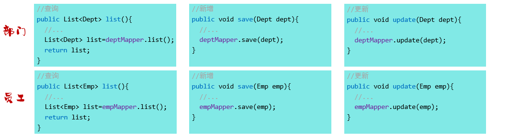

# AOP

## 概念

 AOP 是 spring 框架的第二大核心。

（Aspect Oriented Programming，AOP，面向切面编程，面向方面编程）

本质上就是面向特定方法编程。

假设要统计一些方法的运行时间：



如果在每个业务方法的开头结尾都添加代码会很麻烦，且难以维护：


AOP 可以在不改动这些原始方法的基础上，针对特定的方法进行功能的增强（无侵入性: 解耦）。

使用切面可以优雅地完成这个功能：


AOP 是 Spring 框架的高级技术，底层使用动态代理机制，实现在管理 bean 对象的过程中，对特定的方法进行编程(功能增强)。

AOP 常见的应用场景如下：

- 统计分析方法运行时间
- 记录系统的操作日志
- 权限控制
- 事务管理
	- Spring 事务管理的底层是通过 AOP 实现的。
	- 只要添加 @Transactional 注解之后，AOP 程序自动会在原始方法运行前开启事务，在原始方法运行完毕之后提交或回滚事务。

AOP 面向切面编程的一些优势：

- 代码无侵入

	没有修改原始的业务方法，就已经对原始的业务方法进行了功能的增强或者是功能的改变

- 减少了重复代码

- 提高开发效率

- 维护方便

AOP 是一种代码设计思想，可以用动态代理、过滤器，拦截器等技术实现。

- OOP 面向对象编程，针对业务处理过程的实体及其属性和行为进行抽象封装，以获得更加清晰高效的逻辑单元划分。
- AOP 则是针对业务处理过程中的切面进行提取，它所面对的是处理过程的某个步骤或阶段，以获得逻辑过程中的各部分之间低耦合的隔离效果。


## 基本使用

导入依赖：

```xml
<dependency>
    <groupId>org.springframework.boot</groupId>
    <artifactId>spring-boot-starter-aop</artifactId>
</dependency>
```

定义统计方法时间的切面：

```java
@Component
@Aspect //当前类为切面类
@Slf4j
public class TimeAspect {

    @Around("execution(* com.itheima.service.*.*(..))") 
    public Object recordTime(ProceedingJoinPoint pjp) throws Throwable {
        //记录方法执行开始时间
        long begin = System.currentTimeMillis();

        //执行原始方法
        Object result = pjp.proceed();

        //记录方法执行结束时间
        long end = System.currentTimeMillis();

        //计算方法执行耗时
        log.info(pjp.getSignature()+"执行耗时: {}毫秒",end-begin);

        return result;
    }
}
```

注意：

- Spring AOP

	只能切入有 Bean 容器管理的对象的方法。

- Aspectjrt 和 Aspectweaver

	在 Spring AOP 的基础上进行了升级，包括支持任何方法。

额外引入依赖：

```xml
Aspectweaver 包含了 Aspectjrt ，只需引入 Aspectweaver 。

<dependency>
　　<groupId>aspectj</groupId>
　　<artifactId>aspectjweaver</artifactId>
　　<version>1.9.5</version>
</dependency>
```

## 核心概念

- JoinPoint（连接点）

	连接点指的是可以被 AOP 控制的方法，同时也封装了连接点方法在执行时的相关信息。


- PointCut（切入点）

	连接点的匹配条件。


- Advice（通知）

	AOP 在每个连接点上施加的重复的逻辑，也就是施加的共性的功能。

	- 通知仅会在切入点匹配的方法执行时被应用。


- Aspect（切面）

	通知和对应的切入点构成一个切面。

	- 通过切面就能够描述当前 aop 程序需要针对于哪个原始方法，在什么时候执行什么样的操作。
	- 切面所在的类，一般称为**切面类**（添加 @Aspect 注解的类）


- Target（目标对象）

	目标对象即通知所应用的对象（即连接点所属的对象）。

Spring 的 AOP 基于动态代理技术实现，程序运行时会自动基于动态代理技术为目标对象生成一个对应的代理对象，在代理对象中对目标对象的原始方法进行功能增强：


- 引入（inter-type declaration）

	也称为内部类型声明，为已有的类添加额外的新的字段或方法。

- 织入（Weaving）

	把切面连接到其它的应用程序类型或者对象上，并创建一个被通知的对象。这些可以在编译时（例如使用AspectJ编译器），类加载时和运行时完成。（Spring和其他纯Java AOP框架一样，在运行时完成织入）

## 通知类型

| 注解            | 名称       | 执行时刻                                                     |
| --------------- | ---------- | ------------------------------------------------------------ |
| @Around         | 环绕通知   | 此注解标注的通知方法在目标方法前、后都被执行                 |
| @Before         | 前置通知   | 此注解标注的通知方法在目标方法前被执行                       |
| @After          | 后置通知   | 此注解标注的通知方法在目标方法后被执行，无论是否有异常都会执行 |
| @AfterReturning | 返回后通知 | 此注解标注的通知方法在目标方法后被执行，有异常不会执行       |
| @AfterThrowing  | 异常后通知 | 此注解标注的通知方法发生异常后执行                           |

注意：

- @Around 环绕通知需要自己调用 ProceedingJoinPoint.proceed() 来让原始方法执行，其他通知不需要考虑目标方法执行。
- @Around 环绕通知方法的返回值，必须使用 Object 来接收原始方法的返回值。

通知示例代码：

```java
@Slf4j
@Component
@Aspect
public class MyAspect1 {
    //前置通知
    @Before("execution(* com.itheima.service.*.*(..))")
    public void before(JoinPoint joinPoint){
        log.info("before ...");

    }

    //环绕通知
    @Around("execution(* com.itheima.service.*.*(..))")
    public Object around(ProceedingJoinPoint proceedingJoinPoint) throws Throwable {
        log.info("around before ...");

        //调用目标对象的原始方法执行
        Object result = proceedingJoinPoint.proceed();
        
        //原始方法如果执行时有异常，环绕通知中的后置代码不会再执行
        
        log.info("around after ...");
        return result;
    }

    //后置通知
    @After("execution(* com.itheima.service.*.*(..))")
    public void after(JoinPoint joinPoint){
        log.info("after ...");
    }

    //返回后通知（程序在正常执行的情况下，会执行后置通知）
    @AfterReturning("execution(* com.itheima.service.*.*(..))")
    public void afterReturning(JoinPoint joinPoint){
        log.info("afterReturning ...");
    }

    //异常通知（程序在出现异常的情况下，执行的后置通知）
    @AfterThrowing("execution(* com.itheima.service.*.*(..))")
    public void afterThrowing(JoinPoint joinPoint){
        log.info("afterThrowing ...");
    }
}
```

其中，每一个注解里面都指定了切入点表达式，而且这些切入点表达式都一模一样。

存在了大量的重复性的切入点表达式时，可以使用抽取功能。

## 抽取

Spring 提供了 @PointCut 注解，作用是将公共的切入点表达式抽取出来，需要用到时引用该切入点表达式即可：

```java
@Slf4j
@Component
@Aspect
public class MyAspect1 {

    //切入点方法（公共的切入点表达式）
    @Pointcut("execution(* com.itheima.service.*.*(..))")
    private void pt(){

    }

    //前置通知（引用切入点）
    @Before("pt()")
    public void before(JoinPoint joinPoint){
        log.info("before ...");

    }

    //环绕通知
    @Around("pt()")
    public Object around(ProceedingJoinPoint proceedingJoinPoint) throws Throwable {
        log.info("around before ...");

        //调用目标对象的原始方法执行
        Object result = proceedingJoinPoint.proceed();
        //原始方法在执行时：发生异常
        //后续代码不在执行

        log.info("around after ...");
        return result;
    }

    //后置通知
    @After("pt()")
    public void after(JoinPoint joinPoint){
        log.info("after ...");
    }

    //返回后通知（程序在正常执行的情况下，会执行的后置通知）
    @AfterReturning("pt()")
    public void afterReturning(JoinPoint joinPoint){
        log.info("afterReturning ...");
    }

    //异常通知（程序在出现异常的情况下，执行的后置通知）
    @AfterThrowing("pt()")
    public void afterThrowing(JoinPoint joinPoint){
        log.info("afterThrowing ...");
    }
}
```

其中，抽取相当于使用了一个没有什么操作的方法，即 `pt()` ，包装了连接点，然后让切人点匹配这个方法（`pt()`）。

注意：

- 切入点方法满足 Java 类方法的使用权限
	- 当切入点方法使用 private 修饰时，仅能在当前切面类中引用该表达式。
	- 当外部其他切面类中也要引用当前类中的切入点表达式，就需要把 private 改为 public 。


外部引用时的语法为：

```java
@Slf4j
@Component
@Aspect
public class MyAspect2 {
    //引用MyAspect1切面类中的切入点表达式
    @Before("com.itheima.aspect.MyAspect1.pt()")
    public void before(){
        log.info("MyAspect2 -> before ...");
    }
}
```

## 通知顺序

如果定义了多个切面类，而多个切面类中多个切入点都匹配到了同一个目标方法。

此时当目标方法在运行的时候，这多个切面类当中的这些通知方法都会运行。

它们的顺序依据：

- 默认依**切面类的类名**的字典序升序**嵌套执行**。
- 可以使用 Spring 提供的 @Order 注解控制通知执行的顺序。

@Order 使用示例：

```java
@Slf4j
@Component
@Aspect
@Order(2)  //切面类的执行顺序（前置通知：数字越小先执行; 后置通知：数字越小越后执行）
public class MyAspect2 {
    //前置通知
    @Before("execution(* com.itheima.service.*.*(..))")
    public void before(){
        log.info("MyAspect2 -> before ...");
    }

    //后置通知 
    @After("execution(* com.itheima.service.*.*(..))")
    public void after(){
        log.info("MyAspect2 -> after ...");
    }
}
```

```java
@Slf4j
@Component
@Aspect
@Order(3)  //切面类的执行顺序（前置通知：数字越小先执行; 后置通知：数字越小越后执行）
public class MyAspect3 {
    //前置通知
    @Before("execution(* com.itheima.service.*.*(..))")
    public void before(){
        log.info("MyAspect3 -> before ...");
    }

    //后置通知
    @After("execution(* com.itheima.service.*.*(..))")
    public void after(){
        log.info("MyAspect3 ->  after ...");
    }
}
```

## 切入点表达式

常见形式：

- execution(……)：根据方法的签名来匹配


- @annotation(……) ：根据注解匹配


### execution

execution 主要根据方法的返回值、包名、类名、方法名、方法参数等信息来匹配，语法为：

```
execution(访问修饰符  返回值  包名.类名.方法名(方法参数) throws 异常)
```

其中：

- 访问修饰符

	可省略（比如: public、protected）

- 包名.类名

	可省略

- throws 异常

	可省略（注意是方法上声明抛出的异常，不是实际抛出的异常）

可以使用通配符：

- `*` ：单个独立的任意符号，可以通配任意返回值、包名、类名、方法名、任意类型的一个参数，也可以通配包、类、方法名的一部分

- `..` ：多个连续的任意符号，可以通配任意层级的包，或任意类型、任意个数的参数

#### 示例

- 省略方法的修饰符号 

	~~~java
	execution(void com.itheima.service.impl.DeptServiceImpl.delete(java.lang.Integer))
	~~~

- 使用`*`代替返回值类型

	~~~java
	execution(* com.itheima.service.impl.DeptServiceImpl.delete(java.lang.Integer))
	~~~

- 使用`*`代替包名（一层包使用一个`*`）

	~~~java
	execution(* com.itheima.*.*.DeptServiceImpl.delete(java.lang.Integer))
	~~~

- 使用`..`省略包名

	~~~java
	execution(* com..DeptServiceImpl.delete(java.lang.Integer))    
	~~~

- 使用`*`代替类名

	~~~java
	execution(* com..*.delete(java.lang.Integer))   
	~~~

- 使用`*`代替方法名

	~~~java
	execution(* com..*.*(java.lang.Integer))   
	~~~

- 使用 `*` 代替参数

	```java
	execution(* com.itheima.service.impl.DeptServiceImpl.delete(*))
	```

- 使用`..`省略参数

	~~~java
	execution(* com..*.*(..))
	~~~

- 根据业务需要，可以使用 且（&&）、或（||）、非（!） 来组合比较复杂的切入点表达式。

	```java
	execution(* com.itheima.service.DeptService.list(..)) || execution(* com.itheima.service.DeptService.delete(..))
	```


#### 书写建议

- 所有业务方法名在命名时尽量规范，方便切入点表达式快速匹配。

	如：查询类方法都是 find 开头，更新类方法都是 update 开头

	~~~java
	//业务类
	@Service
	public class DeptServiceImpl implements DeptService {
	    
	    public List<Dept> findAllDept() {
	       //省略代码...
	    }
	    
	    public Dept findDeptById(Integer id) {
	       //省略代码...
	    }
	    
	    public void updateDeptById(Integer id) {
	       //省略代码...
	    }
	    
	    public void updateDeptByMoreCondition(Dept dept) {
	       //省略代码...
	    }
	    //其他代码...
	}
	~~~

	~~~java
	//匹配DeptServiceImpl类中以find开头的方法
	execution(* com.itheima.service.impl.DeptServiceImpl.find*(..))
	~~~

- 描述切入点方法通常基于接口描述，而不是直接描述实现类，增强拓展性

	~~~java
	execution(* com.itheima.service.DeptService.*(..))
	~~~

- 在满足业务需要的前提下，尽量缩小切入点的匹配范围。

	如：包名匹配尽量不使用 ..，使用 * 匹配单个包

	~~~java
	execution(* com.itheima.*.*.DeptServiceImpl.find*(..))
	~~~


### @annotation

如果要匹配多个无规则的方法，比如：list() 和 delete() 这两个方法，execution 就不方便了。

可以使用 @annotation 进行匹配。

两种用法：

- 匹配到被 @annotation 指定的注解标注的方法（标注为类则是类中的全部方法）。
- 自定义注解，然后用 @annotation 。

#### 示例

自定义注解：MyLog

~~~java
@Target(ElementType.METHOD)
@Retention(RetentionPolicy.RUNTIME)
public @interface MyLog {
}
~~~

将 MyLog 标注到指定方法上。

切面类：

```java
@Slf4j
@Component
@Aspect
public class MyAspect6 {
    //针对list方法、delete方法进行前置通知和后置通知

    //前置通知
    @Before("@annotation(com.itheima.anno.MyLog)")
    public void before(){
        log.info("MyAspect6 -> before ...");
    }

    //后置通知
    @After("@annotation(com.itheima.anno.MyLog)")
    public void after(){
        log.info("MyAspect6 -> after ...");
    }
}
```

## 连接点

在 Spring 中用 JoinPoint 抽象了连接点，用它可以获得方法执行时的相关信息，如目标类名、方法名、方法参数等。

- 对于@Around通知，获取连接点信息只能使用 ProceedingJoinPoint 类型。

- 对于其他四种通知，获取连接点信息只能使用 JoinPoint，它是 ProceedingJoinPoint 的父类型。

## Spring AOP 和 AspectJ

AspectJ 是一个 java 实现的 AOP 框架，它能够对 java 代码进行 AOP 编译（一般在编译期进行），让 java 代码具有 AspectJ 的 AOP 功能（当然需要特殊的编译器）

AspectJ 是目前实现最成熟，功能最丰富的 AOP 框架，并与java程序完全兼容。

- AspectJ 是更强的 AOP 框架，是实际意义的 AOP 标准。

- Spring为何不写类似AspectJ的框架？
	- Spring AOP使用纯Java实现, 它不需要专门的编译过程, 它一个**重要的原则就是无侵入性（non-invasiveness）**。
	- Spring的开发小组相信无论是基于代理（proxy-based）的框架如Spring AOP或者是成熟的框架如AspectJ都是很有价值的，他们之间应该是**互补而不是竞争的关系**。
- Spring小组喜欢@AspectJ注解风格更胜于Spring XML配置
	- 所以在Spring 2.0使用了和AspectJ 5 **一样的注解**，并使用AspectJ来做**切入点解析和匹配**。
	- 但是，**AOP在运行时仍旧是纯的Spring AOP**，并不依赖于AspectJ的编译器或者织入器（weaver）。

AspectJ可以做Spring AOP干不了的事情，**它是AOP编程的完全解决方案，Spring AOP则致力于解决企业级开发中最普遍的AOP**（方法织入）。

| Spring AOP                                       | AspectJ                                                      |
| ------------------------------------------------ | ------------------------------------------------------------ |
| 在纯 Java 中实现                                 | 使用 Java 编程语言的扩展实现                                 |
| 不需要单独的编译过程                             | 除非设置 LTW，否则需要 AspectJ 编译器 (ajc)                  |
| 只能使用运行时织入                               | 运行时织入不可用。支持编译时、编译后和加载时织入             |
| 功能不强-仅支持方法级编织                        | 更强大 - 可以编织字段、方法、构造函数、静态初始值设定项、最终类/方法等......。 |
| 只能在由 Spring 容器管理的 bean 上实现           | 可以在所有域对象上实现                                       |
| 仅支持方法执行切入点                             | 支持所有切入点                                               |
| 代理是由目标对象创建的, 并且切面应用在这些代理上 | 在执行应用程序之前 (在运行时) 前, 各方面直接在代码中进行织入 |
| 比 AspectJ 慢多了                                | 更好的性能                                                   |
| 易于学习和应用                                   | 相对于 Spring AOP 来说更复杂                                 |

如果不需要非常强和严格的效率要求，建议用简单的 Spring AOP 。

### Spring AOP 的织入

对于 Spring AOP：

- 接口（接口的实现方法）使用 java 动态代理

	JDK 动态代理只能对接口进行代理。

- 非接口（类方法）使用 Cglib 代理。

	CGLIB （Code Generator Library）代码生成库，相比于 JDK 动态代理功能更强大，它主要通过对字节码的操作以控制对象的访问。

### AspectJ 的织入

织入：AspectJ 应用到 java 代码的过程，也就是 aspect(切面)应用到目标函数(类)的过程。

- 动态织入

	在运行时动态地将要增强的代码织入到目标类中。

	- 这样往往是通过动态代理技术完成的：
		- Java JDK 的动态代理(Proxy，底层通过反射实现)
		- CGLIB 的动态代理(底层通过继承实现)
		- Spring AOP 采用的就是基于运行时增强的代理技术。

- 静态织入

	通过编译器修改代码实现。

	- 编译期织入（Compile-time weaving）： 如类 A 使用 AspectJ 添加了一个属性，类 B 引用了它，这个场景就需要编译期的时候就进行织入，否则没法编译类 B 。

	* 编译后织入（Post-compile weaving）： 在已经生成了 .class 文件，或已经打成 jar 包后织入。

	- 类加载后织入（Load-time weaving）： 加载类的时候进行织入。

ApectJ 采用的就是静态织入，最主要的方式是编译期织入，在这个期间使用AspectJ的acj编译器(类似javac)把aspect类编译成class字节码后，在java目标类编译时织入，即先编译aspect类再编译目标类：


