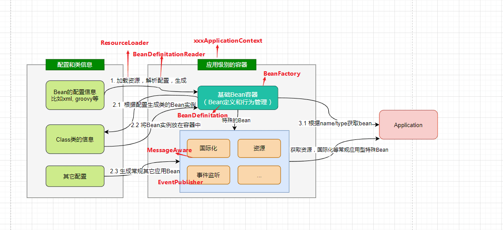
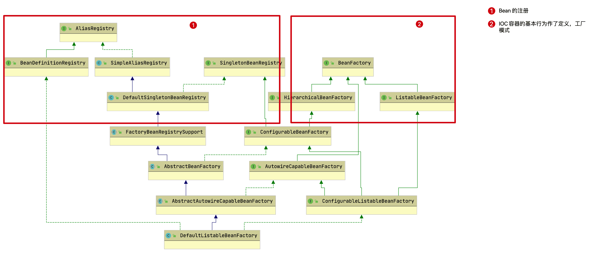
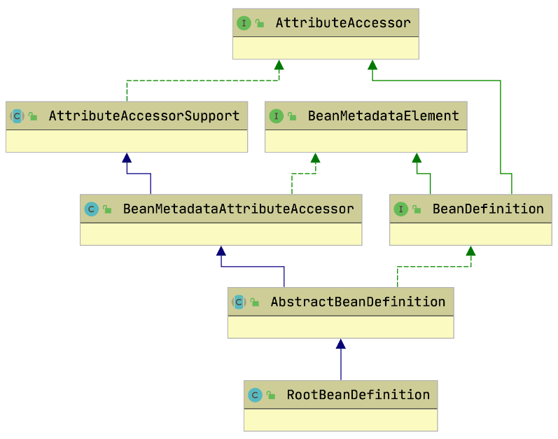
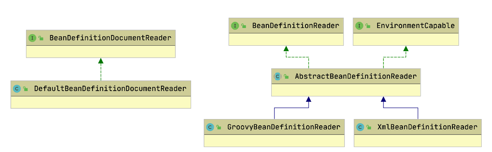
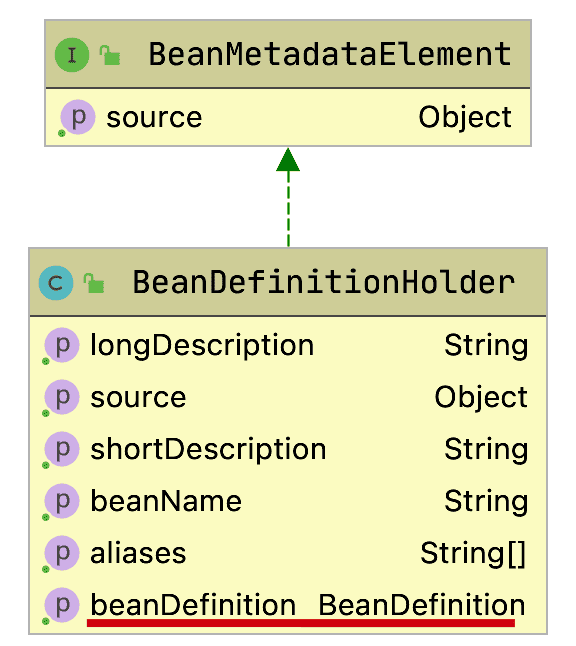
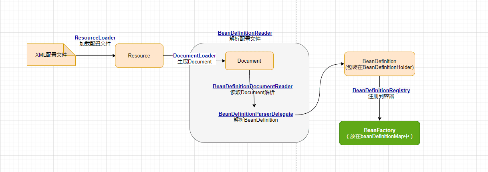
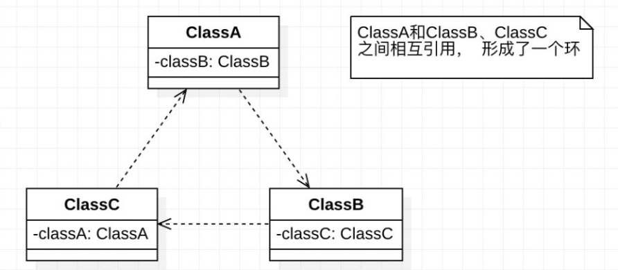

# IOC 实现原理

## IOC 设计结构

IOC 容器应当具备的主体功能：



- 加载Bean的配置（比如xml配置） 

	比如不同类型资源的加载，解析成生成统一Bean的定义

- 根据Bean的定义加载生成Bean的实例，并放置在Bean容器中 

	比如Bean的依赖注入，Bean的嵌套，Bean存放（缓存）等

- 除了基础Bean外，还有针对常规企业级业务的特别Bean 

	比如国际化Message，事件Event等生成特殊的类结构去支撑

- 对容器中的Bean提供统一的管理和调用。

	比如用工厂模式管理，提供方法根据名字/类的类型等从容器中获取Bean

### IOC 容器功能



BeanFactory 作为最顶层的一个接口类，它使用工厂模式定义了 IOC 容器的基本功能，包括：

- 获取 Bean 。
- 查找 Bean 。
- 判断 Bean 类型。
- Bean 的别名管理。

BeanFactory 有三个子接口：ListableBeanFactory、HierarchicalBeanFactory 和 AutowireCapableBeanFactory ，进一步定义了不同功能的 BeanFactory 。

进一步地，BeanFactory 还有更多层级的子孙接口，这主要是为了**对对象在 Spring 内部的传递和转化过程，进行数据访问限制**。

包括以下接口：

- ListableBeanFactory

	- 该接口定义了访问容器中 Bean 基本信息的若干方法，如查看Bean 的个数、获取某一类型 Bean 的配置名、查看容器中是否包括某一 Bean 等方法；

- HierarchicalBeanFactory

	- 父子级联 IoC 容器的接口，子容器可以通过接口方法访问父容器； 
	- 通过 HierarchicalBeanFactory 接口， Spring 的 IoC 容器可以建立父子层级关联的容器体系，子容器可以访问父容器中的 Bean，但父容器不能访问子容器的 Bean。
	- Spring 使用父子容器实现了很多功能，比如在 Spring MVC 中，展现层 Bean 位于一个子容器中，而业务层和持久层的 Bean 位于父容器中。这样，展现层 Bean 就可以引用业务层和持久层的 Bean，而业务层和持久层的 Bean 则看不到展现层的 Bean。

- ConfigurableBeanFactory

	它定义了设置类装载器、属性编辑器、容器初始化后置处理器等方法，对 IoC 容器的可定制性进行了增强。

- ConfigurableListableBeanFactory

	ListableBeanFactory 和 ConfigurableBeanFactory 的融合；

- AutowireCapableBeanFactory

	定义了将容器中的 Bean 按某种规则（如按名字匹配、按类型匹配等）进行自动装配的方法。

### Bean 的注册（配置）

- Bean 的各种 Registry 定义了 Bean 的各种注册方式
- BeanDefinitionRegistry 
	- Spring 配置文件中每一个`<bean>`节点元素在 Spring 容器里都通过一个 BeanDefinition 对象表示，它描述了 Bean 的配置信息。
	- BeanDefinitionRegistry 接口提供了向容器手工注册 BeanDefinition 对象的方法。

### Bean 的定义与相互关系

- BeanDefinition

	Bean 对象在 Spring 的实现中是以 BeanDefinition 来描述的，其定义了各种 Bean 对象及其相互的关系。



- BeanDefinitionReader

	是 BeanDefinition 的解析器。

	- Bean 的解析过程非常复杂，功能被分的很细，因为这里需要被扩展的地方很多，必须保证有足够的灵活性，以应对可能的变化。
	- Bean 的解析主要是对 Spring 配置文件的解析。



- BeanDefinitionHolder

	是 BeanDefination 的包装类，用来存储 BeanDefinition，name 以及 aliases 等，对 BeanDefinition 提供功能辅助。



### ApplicationContext

ApplicationContext（应用上下文）接口类定义了一个 Bean 管理（BeanFactory）和其它辅助功能的完整功能封装，从而让用户更好地利用 BeanFactory 到它们的应用中，包含：

- IOC 容器（BeanFactory）

	核心。

- 资源访问

	对不同方式的 Bean 配置（即资源）进行加载。(实现 ResourcePatternResolver 接口)

- 国际化

	支持信息源，可以实现国际化。（实现 MessageSource 接口）

- 应用事件

	支持应用事件。(实现 ApplicationEventPublisher 接口)

ApplicationContext 是一个 component（Bean）的 container 。

#### ApplicationContext 接口设计


- HierarchicalBeanFactory 和 ListableBeanFactory：
	- ApplicationContext 继承了 HierarchicalBeanFactory 和 ListableBeanFactory 接口。
	- 在此基础上，还通过其它的接口扩展了 BeanFactory 的功能。

- ApplicationEventPublisher
	- 让容器拥有发布应用上下文事件的功能，包括容器启动事件、关闭事件等。
	- 实现了 ApplicationListener 事件监听接口的 Bean 可以接收到容器事件 ， 并对事件进行响应处理 。
	- 在抽象实现类  AbstractApplicationContext 中，有一个 ApplicationEventMulticaster，它负责保存所有监听器，以便在容器产生上下文事件时通知事件的监听者。
- MessageSource
	- 为应用提供 i18n 国际化消息访问的功能，适应不同的语言和地区的需要。（i18n 其来源是英文单词 internationalization 的首末字符 i 和 n，18 为中间的字符数）
- ResourcePatternResolver
	- 所有 ApplicationContext 实现类都实现了类似于 PathMatchingResourcePatternResolver 的功能，可以通过带前缀的 Ant 风格的资源文件路径装载 Spring 的配置文件。
- LifeCycle
	- 该接口是 Spring 2.0 加入的，该接口提供了 start() 和 stop() 等方法，主要用于控制异步处理过程。
	- 在具体使用时，该接口同时被 ApplicationContext 和具体 Bean 实现， ApplicationContext 会将 start/stop 的信息传递给容器中所有实现了该接口的 Bean，以达到管理和控制 JMX、任务调度等目的。

#### ApplicationContext 接口实现


依据 Bean 是否需要刷新分为两大类：

- GenericApplicationContext
	- 初始化的时候就创建容器，不会刷新。

- AbstractRefreshableApplicationContext
	- AbstractRefreshableApplicationContext 及子类的每次 refresh 都是先清除已有(如果不存在就创建)的容器，然后再重新创建。

依据加载源（比如 xml, groovy, annotation 等），衍生出各种 ApplicationContext ，比如：

- FileSystemXmlApplicationContext

	从文件系统下的一个或多个xml配置文件中加载上下文定义，也就是从系统路径中加载xml配置文件。

- ClassPathXmlApplicationContext

	从类路径下的一个或多个xml配置文件中加载上下文定义，适用于xml配置的方式。

- AnnotationConfigApplicationContext

	从一个或多个基于java的配置类中加载上下文定义，适用于java注解的方式。

- ConfigurableApplicationContext

	扩展于 ApplicationContext，它新增加了两个主要的方法： refresh() 和 close()，让 ApplicationContext 具有启动、刷新和关闭应用上下文的能力。

## IOC 初始化过程

以下说明 Spring 将资源配置（以 xml 配置为例）通过加载，解析，生成 BeanDefination 并注册到 IoC 容器中的过程。

### 入口

对于xml配置的Spring应用，实例化一个 ClasspathXmlApplicationContext 即可创建一个 IoC 容器，从其构造函数开始即可：

```java
ApplicationContext context = new ClassPathXmlApplicationContext("aspects.xml", "daos.xml", "services.xml");
```

### refresh

Spring IoC 容器对 Bean 定义资源的载入从 refresh() 函数开始：

```java
@Override
public void refresh() throws BeansException, IllegalStateException {
    synchronized (this.startupShutdownMonitor) {
        StartupStep contextRefresh = this.applicationStartup.start("spring.context.refresh");

        // Prepare this context for refreshing.
        prepareRefresh();

        // Tell the subclass to refresh the internal bean factory.
        ConfigurableListableBeanFactory beanFactory = obtainFreshBeanFactory();

        // Prepare the bean factory for use in this context.
        prepareBeanFactory(beanFactory);

        try {
            // Allows post-processing of the bean factory in context subclasses.
            postProcessBeanFactory(beanFactory);

            StartupStep beanPostProcess = this.applicationStartup.start("spring.context.beans.post-process");
            // Invoke factory processors registered as beans in the context.
            invokeBeanFactoryPostProcessors(beanFactory);

            // Register bean processors that intercept bean creation.
            registerBeanPostProcessors(beanFactory);
            beanPostProcess.end();

            // Initialize message source for this context.
            initMessageSource();

            // Initialize event multicaster for this context.
            initApplicationEventMulticaster();

            // Initialize other special beans in specific context subclasses.
            onRefresh();

            // Check for listener beans and register them.
            registerListeners();

            // Instantiate all remaining (non-lazy-init) singletons.
            finishBeanFactoryInitialization(beanFactory);

            // Last step: publish corresponding event.
            finishRefresh();
        }

        catch (BeansException ex) {
            if (logger.isWarnEnabled()) {
                logger.warn("Exception encountered during context initialization - " +
                        "cancelling refresh attempt: " + ex);
            }

            // Destroy already created singletons to avoid dangling resources.
            destroyBeans();

            // Reset 'active' flag.
            cancelRefresh(ex);

            // Propagate exception to caller.
            throw ex;
        }

        finally {
            // Reset common introspection caches in Spring's core, since we
            // might not ever need metadata for singleton beans anymore...
            resetCommonCaches();
            contextRefresh.end();
        }
    }
}
```

该函数运用了典型的钩子函数的应用方式：

- 将具体的初始化加载方法插入到钩子方法之间。
- 将初始化的阶段封装，用来记录当前初始化到什么阶段；常见的设计是 `xxxPhase/xxxStage` 。
- 资源加载初始化有失败等处理，必然是 `try/catch/finally` 。


### 概览

IOC 容器初始化的基本步骤：



其中：

- Document 对象是配置文件内数据的对象表示。
- BeanFactory 使用 beanDefinitionMap（类型为 `ConcurrentHashMap<String, Object>`）存储 （beanName， beanDefinition）的键值对。

## Bean 的实例化

### 获取 Bean

可以通过 getBean 方法基于 bean 名字，Class 类型和显式参数来获取 bean ：

```java
Object getBean(String name) throws BeansException;    
Object getBean(String name, Class requiredType) throws BeansException;    
Object getBean(String name, Object... args) throws BeansException;
<T> T getBean(Class<T> requiredType) throws BeansException;
<T> T getBean(Class<T> requiredType, Object... args) throws BeansException;
```

其中，可变参数 args 表示匹配该 Bean 的某个构造函数的参数列表的显式参数。

以使用 name 获取 bean 为例，大致流程如下：

1. 从 beanDefinitionMap 得到 BeanDefinition 。

2. 从 BeanDefinition 中得到 bean 的相关信息，如 beanClassName，和 Bean 的类定义引用。

3. 通过反射初始化 beanClassName 对应的 bean 实例 instance 。

	- 构造函数从 BeanDefinition 的 getConstructorArgumentValues() 方法获取

	- 属性值从 BeanDefinition 的 getPropertyValues() 方法获取

4. 返回 beanName 对应的 bean instance 。

注意：BeanDefinition 还有该 Bean 是否是单例的信息，如果是无参构造函数的实例则可以到缓存中，下次获取这个单例的实例时可以直接从缓存中获取，如果获取不到再通过上述步骤获取。

### 循环依赖

实例化 Bean 的过程中可能存在循环依赖问题。

即几个对象间包含各自的引用，形成了类似死锁的环形引用结构的情况，如下：



创建 Bean 的过程可能涉及多个步骤，在实例化 Bean 时，需要先实例化其依赖的 Bean（包含的继承的 Bean）。

Spring 在创建 Bean 后会将它的 beanName 放进 alreadyCreated 集合中，表示该 Bean 正在实例化，在实例化完毕后会移除该 beanName 。

如果在创建 Bean 时发现 beanName 已经在 alreadyCreated 集合中，则会抛出 BeanCurrentlyInCreationException 异常，表示循环依赖。

#### 三级缓存

Spring 设置了三级缓存用以解决单例模式下的循环依赖：

```java
/** Cache of singleton objects: bean name --> bean instance */
private final Map<String, Object> singletonObjects = new ConcurrentHashMap<String, Object>(256);
 
/** Cache of early singleton objects: bean name --> bean instance */
private final Map<String, Object> earlySingletonObjects = new HashMap<String, Object>(16);

/** Cache of singleton factories: bean name --> ObjectFactory */
private final Map<String, ObjectFactory<?>> singletonFactories = new HashMap<String, ObjectFactory<?>>(16);
```

作用：

- 一级缓存 singletonObjects

	单例对象缓存池（也称为单例池），已经初始化完毕的对象。（属性赋值完毕）

- 二级缓存 earlySingletonObjects

	存放已经创建但尚未完成实例化的 Bean 对象。

	- 在 Bean 被 AOP 代理的情况下，每次调用 `ObjectFactory#getObject()`  都会产生新的代理对象，这不满足 singleton 的原则，先从二级缓存取得已经产生的同一个代理对象，可以防止多次从三级缓存获取到多个不同的代理对象。

- 三级缓存 singletonFactories

	单例工厂（ObjectFactory）的缓存池。

	- 如果 Bean 被 AOP 代理，则 `ObjectFactory#getObject()` 会返回 Bean 的 AOP 代理对象。

	- 如果没有被代理，返回一般的 Bean 对象。

	- 为什么缓存 ObjectFactory 而不是 Bean？

		因为 Bean 由 ObjectFactory 产生，此时 Bean 刚刚创建，只能在 ObjectFactory 中获取。

如果没有 AOP，那么只需要第一级和第三级缓存（共两级）就能解决单例循环依赖。

#### 三种基本的循环依赖

假设有 A，B 两个循环依赖的类。（多个类也可以循环依赖）

- A 包含 B
- B 包含 A

依据所依赖的 Bean 的注入方式的不同，主要有三种循环依赖的情况。

##### setter 注入，field 注入 - singleton 循环依赖（默认方式）

A 的 setter 依赖 B，B 的 setter 依赖 A 。

此时 Bean 的初始化（initialization）过程包含两步：

1. 实例化。（instantiation）
2. 属性赋值。（通过 setter）

Spring 默认是 singleton 模式，Spring 也只解决了单例模式下的循环依赖（包括 setter 注入和 field 注入）。

实例化 Bean 的过程：

1. 假设 Spring 先创建 A，将 A 放进 alreadyCreated ，A 的构造函数结束，但尚未通过 setter 属性赋值，此时 A 的引用（earlyBeanReference）已经能定位到堆中的对象。
2. Spring 调用 A 的 setter 进行属性赋值，发现 A 依赖 B，开始创建 B，将 B 放进 alreadyCreated ， B 的构造函数结束，此时 B 的引用已经能定位到堆中的对象。
3. Spring 调用 B 的 setter 进行属性赋值，发现 B 依赖 A，尝试从缓存中获取 A 。
  1. 从 singletonObjects 中获取，没有 A（A 已经实例化，但尚未属性赋值，即初始化未完毕）。
  1. 从 earlySingletonObjects 获取，可能没有 A （A 没有被 AOP 代理的时）。
  1. 从 singletonFactories 中获取，通过 ObjectFactory 获取 A 的引用（能定位到堆中的对象），获取到后将 A 提升到 earlySingletonObjects 中。
4. 已经获取到 A 的引用，B 的属性赋值完成（将 A 的引用赋给 B 中的 A 的引用），即 B 的初始化完成，B 进入 singletonObjects 。
5. 继续 A 的属性赋值，能够获取到 B 的引用，继而 A 初始化完成。

##### 构造器注入 - 参数循环依赖

A 的构造函数依赖 B ，B 的构造函数依赖 A 。

此时 Bean 的初始化（initialization）过程只包含一步：

1. 在实例化过程中调用构造函数。

实例化 Bean 的过程：

1. 假设 Spring 先创建 A ，将 A 放进 alreadyCreated 。
2. 由于 A 依赖 B，从 A 的构造函数中开始创建 B，将 B 放进 alreadyCreated 。
3. 由于 B 依赖 A，从 B 的构造函数中开始创建 A，A 还在 alreadyCreated 中，说明 A 的构造函数尚未结束，A 尚未实例化完毕，报 BeanCurrentlyInCreationException 的异常，注入失败。

注意，执行构造函数时，还来不及将当前类放到三级缓存中，所以 Spring 没有解决构造器的循环依赖。

##### setter 注入 - prototype 循环依赖

Spring 没有解决 prototype 的循环依赖。

Spring 在 prototype 模式下，每一次获取的 Bean 都是新的 Bean ，没有进行旧 Bean 的缓存。

如果要解决 prototype 的循环依赖，需要比 singleton 模式更复杂的缓存措施：

- 要存储实例级的 Bean 与 Bean 的依赖关系。（使用 Bean 的名称可以建立映射关系）
- 缓存所有产生过的 Bean 。
- 依据依赖关系从缓存中找到对应 Bean 。

#### 解决循环依赖的方式

循环主要应当在设计和编码上避免，如果实在产生了循环依赖，可以使用以下方法解决：

- 使用 @Lazy 注解，延迟加载。
- 使用 @DependsOn 注解，指定加载先后关系。
- 修改文件名称，改变循环依赖类的加载顺序

##### @Lazy

延迟加载。

假设 A 依赖 B，@Lazy 注解会为 B 生成一个代理对象，初始化到 B 时，即使 B 没有初始化好，也可以直接返回代理对象进行占位，延迟 B 的初始化，从而使得 A 完成初始化。

后续在 A 使用 B 时，B 才会初始化。

- 解决构造器的依赖

	将 @Lazy 注解添加到被依赖的 Bean 的构造器上。

- setter 的 singleton 循环依赖

	将 @Lazy 注解添加到被依赖的 Bean 的 setter 上。

（实际上，@Lazy 的使用位置和 @Autowired 的使用位置相同）

##### @DependsOn

@DependsOn 指定该 Bean 依赖哪些 Bean ，IOC 会先注册指定的依赖的 Bean 或组件。

##### 文件名称与依赖类的加载顺序

IOC 按字典序注册各文件对应的 Bean，可以通过改变文件名称和依赖类的名称来改变 Bean 的初始化顺序，从而解决一些循环依赖。

## Bean 的生命周期

Spring 只管理单例模式 Bean 的**完整**生命周期，对于 prototype 的 bean ，Spring 在创建好交给使用者后则不会再管理其后续的生命周期。


其中：

- BeanPostProcesor 和 Aware 都是接口，其内的紫色或蓝色是接口中的方法。
- 图中的 Aware 相关接口只列出了一部分用于举例。

图中的方法可以划分为：

- Bean 自身的方法

- Bean 级生命周期接口方法

	包括 BeanNameAware、BeanFactoryAware、ApplicationContextAware 等，也包括 InitializingBean 和 DiposableBean 这些接口的方法（可以被 @PostConstruct 和 @PreDestroy 注解替代）。

- 容器级生命周期接口方法

	包括 InstantiationAwareBeanPostProcessor 和 BeanPostProcessor 这两个接口，一般称它们的实现类为“后处理器”。

- 工厂后处理器接口方法（也是容器级）

	包括 AspectJWeavingEnabler, ConfigurationClassPostProcessor, CustomAutowireConfigurer 等，在应用上下文装配配置文件之后立即调用。

