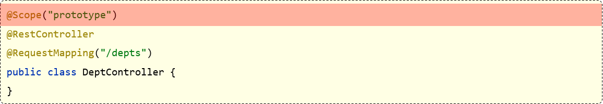

# IOC 容器

（控制反转，Inversion of Control，IOC）

- Spring 框架管理 Bean 的创建工作，即由用户管理Bean转变为框架管理Bean（设计思想）

	这就是控制反转。

- Spring 框架托管创建的Bean放在哪里呢？ （实现基座）

	这便是 IoC Container 。

- Spring 框架为了更好让用户配置Bean，必然会引入不同方式来配置Bean（Bean 的设定）

	这便是xml配置，Java配置，注解配置等支持。

- Spring 框架既然接管了Bean的生成（Bean 生命周期）

	必然需要管理整个 Bean 的生命周期。

- 应用程序代码从Ioc Container中获取依赖的Bean，注入到应用程序中（获取 IOC 中的 Bean）

	这个过程叫依赖注入(Dependency Injection，DI) ； 

	- 控制反转是通过依赖注入实现的，它们是同一个概念的不同角度描述，就是IoC是设计思想，DI是实现方式

- 在依赖注入时，有哪些方式呢？（使用 Bean 的方式）

	@Autowired, @Resource, @Qualifier... 

- 同时 Bean 之间存在依赖（Bean 与 Bean 的关系）

	可能存在先后顺序问题，以及循环依赖问题等。

IOC 容器可以将 Spring 的三层架构解耦。

## IOC 配置的三种方式（Bean 的设定）

### xml 配置

将bean 的信息配置到 xml 文件里，通过 Spring 加载文件来创建 bean 。

这种方式出现很多早前的SSM项目中，第三方类库或者一些配置工具类都以这种方式进行配置，主要原因是由于第三方类不支持Spring注解。

- **优点**： 可以使用于任何场景，结构清晰，通俗易懂
- **缺点**： 配置繁琐，不易维护，枯燥无味，扩展性差

配置示例如下：

```xml
<?xml version="1.0" encoding="UTF-8"?>
<beans xmlns="http://www.springframework.org/schema/beans"
       xmlns:xsi="http://www.w3.org/2001/XMLSchema-instance"
       xsi:schemaLocation="http://www.springframework.org/schema/beans
 http://www.springframework.org/schema/beans/spring-beans.xsd">
    <!-- services -->
    <bean id="userService" class="tech.pdai.springframework.service.UserServiceImpl">
        <property name="userDao" ref="userDao"/>
        <!-- additional collaborators and configuration for this bean go here -->
    </bean>
    <!-- more bean definitions for services go here -->
</beans>
```

### Java 配置

将类的创建交给一个 JavcConfig 类完成，Spring 只负责维护和管理。

采用纯 Java 代码创建方式，本质上就是把在 XML 中的配置声明转移到 Java 配置类中。

- **优点**：适用于任何场景，配置方便，因为是纯Java代码，扩展性高，十分灵活
- **缺点**：由于是采用Java类的方式，声明不明显，如果大量配置，可读性比较差

示例：

1. 创建一个配置类， 添加@Configuration注解声明为配置类
2. 创建方法，方法上加上@bean，该方法用于创建实例并返回，该实例创建后会交给spring管理，方法名建议与实例名相同（首字母小写）。注：实例类不需要加任何注解

```java
/**
 * @author pdai
 */
@Configuration
public class BeansConfig {

    /**
     * @return user dao
     */
    @Bean("userDao")
    public UserDaoImpl userDao() {
        return new UserDaoImpl();
    }

    /**
     * @return user service
     */
    @Bean("userService")
    public UserServiceImpl userService() {
        UserServiceImpl userService = new UserServiceImpl();
        userService.setUserDao(userDao());
        return userService;
    }
}
```

### 注解配置

通过在类上加注解的方式，来声明一个类交给 Spring 管理。

Spring 会自动扫描带有 @Component，@Controller，@Service，@Repository 这四个注解的类，然后帮我们创建并管理，前提是需要先配置 Spring 的注解扫描器。

- **优点**：开发便捷，通俗易懂，方便维护。
- **缺点**：具有局限性，对于一些第三方资源，无法添加注解。只能采用 XML 或 JavaConfig 的方式配置。

示例：

```java
/**
 * @author pdai
 */
@Service
public class UserServiceImpl {

    /**
     * user dao impl.
     */
    @Autowired
    private UserDaoImpl userDao;

    /**
     * find user list.
     *
     * @return user list
     */
    public List<User> findUserList() {
        return userDao.findUserList();
    }
}
```

## 依赖注入的三种方式（获取 Bean）

以下只说明基于注解配置的 Bean 的依赖注入。

注意，Bean 可以是任何 java 对象，包括接口类。

当注入的 Bean 是接口类时：（有些人称其为接口注入方式）

- 需要具体指定注入的类的类名称。
- 或者直接注入所有实现了该接口的类（放在一个容器中）。

Spring 的常见依赖注入的方式有三种：

- 属性注入（Field Injection）
- Setter 注入（Setter Injection）
- 构造方法注入（Constructor Injection）

### 属性注入

在属性上使用注解：

```java
@RestController
public class UserController {
    // 属性对象
    @Autowired
    private UserService userService;

    @RequestMapping("/add")
    public UserInfo add(String username, String password) {
        return userService.add(username, password);
    }
}
```

优点：

- 使用简单。

缺点：

- 功能性问题

	无法将注入的对象的引用设置 final；

	- java 中的 final 引用只能在初始化时直接赋值。
	- IOC 在运行时，无法动态地将 Bean 赋值给一个 final 引用。
	- 网上说的“无法注入不可变的对象”是不严谨的说法，不是对象不可变，而是 final 引用不可变。

```java
@RestController
public class UserController {
    // 属性对象
    @Autowired
    private final UserService userService;   // Error

    @RequestMapping("/add")
    public UserInfo add(String username, String password) {
        return userService.add(username, password);
    }
}
```

- 通用性问题

	只能适应于 IoC 容器。

	- 该代码只能用于 IOC，不能用于非 IOC 的框架，不便于移植代码。

- 设计原则问题

	更容易违背类的单一设计原则（单一职责原则）。

	- 属性注入使用简单，容易滥用，导致在一个类中同时注入太多的对象，使得类的功能与其它类的耦合度太高。

### Setter 注入

在 set 函数上使用注解：

```java
@RestController
public class UserController {
    
    private UserService userService;

    // Setter 注入
    @Autowired
    public void setUserService(UserService userService) {
        this.userService = userService;
    }

    @RequestMapping("/add")
    public UserInfo add(String username, String password) {
        return userService.add(username, password);
    }
}
```

优点：

- 完全符合单一职责的设计原则
	- 因为每一个 Setter 只针对一个对象。

缺点：

- 不能动态注入不可变引用（final 修饰的引用）

```java
@RestController
public class UserController {
    
    private final UserService userService;   // use final

    // Setter 注入
    @Autowired
    public void setUserService(UserService userService) {
        this.userService = userService;   // Error!
    }

    @RequestMapping("/add")
    public UserInfo add(String username, String password) {
        return userService.add(username, password);
    }
}
```

- 注入的对象可被修改

	Setter 注入提供了 setXXX 的方法，可以随时通过调用 setXXX 方法来改变被注入的引用。

### 构造方法注入

使用构造函数注入：

```java
@RestController
public class UserController {
    
    private UserService userService;   // 可以在这行使用 final

    // 构造方法注入
    @Autowired
    public UserController(UserService userService) {
        this.userService = userService;
    }

    @RequestMapping("/add")
    public UserInfo add(String username, String password) {
        return userService.add(username, password);
    }
}
```

其中，如果只有一个构造函数，@Autowired 可以省略。

优点：

1. 可将对象注入不可变引用；

2. 注入对象不会被修改；

	构造函数只在初始化时执行一次。

3. 注入对象会被完全初始化；

	构造方法是在对象创建之初执行的，因此被注入的对象在使用之前，会被构造函数完全初始化。

4. 通用性更好。

	无论是 IoC 框架还是非 IoC 框架，构造方法注入的代码都是通用的。

## Bean 作用域

默认情况下，IOC 中的 bean 对象是单例的，也就是说，IOC 容器当中的 bean 对象只有一个。

但可以将 bean对象设置为非单例的（每次获取的 bean 都是一个新对象）

| **作用域**  | **说明**                                                   |
| ----------- | ---------------------------------------------------------- |
| singleton   | （默认）容器内同名称的 bean 只对应同一个实例（单例）       |
| prototype   | 每次使用该 bean 时会创建新的实例（原型作用域，多例作用域） |
| request     | 每个请求范围内会创建新的实例（请求作用域）                 |
| session     | 每个会话范围内会创建新的实例（会话作用域）                 |
| application | 每个应用范围内会创建新的实例（应用全局作用域）             |

其中，reuqest，session 和 application 只适用于 Spring MVC 。

可以使用 @Scope 注解设置 bean 作用域：



默认的 singleton 的 bean，在容器启动时被创建，可以使用 @Lazy 注解指定延迟加载，使得第一次使用 bean 对象时，才会在 IOC 容器中创建 bean 对象。

实际开发当中，绝大部分的 Bean 是单例的，也就是说绝大部分 Bean 不需要配置 scope 属性。
