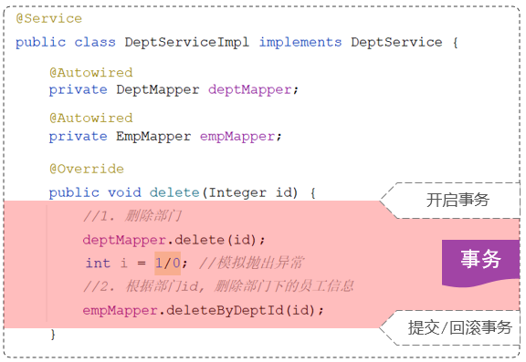
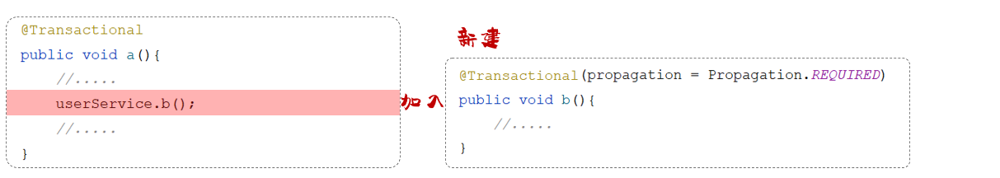
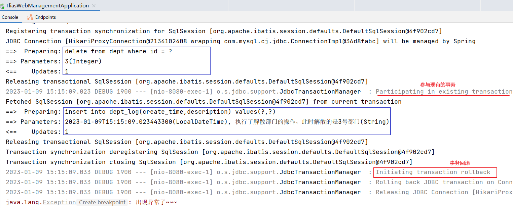

# 事务管理

事务是一组操作的集合，它是一个不可分割的工作单位。

事务会把所有的操作作为一个整体，一起向数据库提交或者是撤销操作请求。所以这组操作要么同时成功，要么同时失败。

事务的操作主要有三步：

1. 开启事务（一组操作开始前，开启事务）：start transaction / begin ;
2. 提交事务（这组操作全部成功后，提交事务）：commit ;
3. 回滚事务（中间任何一个操作出现异常，回滚事务）：rollback ;

注意：

- 多个查询的业务可以不声明为事务。
- 含有修改的业务要声明为事务。

## 场景

假设要删除一个部门，删除部门的同时，要把员工表内属于该部门的员工也都删除。

步骤：

- 根据ID删除部门数据
- 根据部门ID删除该部门下的员工

考虑以下 service ：

```java
@Slf4j
@Service
public class DeptServiceImpl implements DeptService {
    @Autowired
    private DeptMapper deptMapper;

    @Autowired
    private EmpMapper empMapper;


    //根据部门id，删除部门信息及部门下的所有员工
    @Override
    public void delete(Integer id){
        //根据部门id删除部门信息
        deptMapper.deleteById(id);
        
        //模拟：异常发生
        int i = 1/0;

        //删除部门下的所有员工信息
        empMapper.deleteByDeptId(id);   
    }
}
```

其中：

- 先执行根据id删除部门的操作，这步执行完毕，数据库表 dept 中的数据就已经删除了。
- 执行 1/0 操作，抛出异常
- 抛出异常之前，下面所有的代码都不会执行了，根据部门ID删除该部门下的员工，这个操作也不会执行 。

这造成了数据的不一致。

需要让解散部门中涉及到的两个业务操作，要么全部成功，要么全部失败。

可以通过事务来实现，因为一个事务中的多个业务操作，要么全部成功，要么全部失败。



## @Transactional

#### 基本使用

作用：

- 在当前方法执行开始之前开启事务，方法执行完毕之后提交事务。
- 如果这个方法执行的过程当中出现了异常，就会进行事务的回滚操作。
- 一般会在业务层当中来控制事务，因为在业务层当中，一个业务功能可能会包含多个数据访问的操作。
- 在业务层来控制事务，我们就可以将多个数据访问操作控制在一个事务范围内。

书写位置：

- 方法

	当前方法交给 spring 进行事务管理。

- 类

	当前类中所有的方法都交由 spring 进行事务管理。

- 接口

	接口下所有的实现类中所有的方法都交给 spring 进行事务管理。

在业务方法 delete 上加上 @Transactional 来控制事务：

```java
@Slf4j
@Service
public class DeptServiceImpl implements DeptService {
    @Autowired
    private DeptMapper deptMapper;

    @Autowired
    private EmpMapper empMapper;

    
    @Override
    @Transactional  //当前方法添加了事务管理
    public void delete(Integer id){
        //根据部门id删除部门信息
        deptMapper.deleteById(id);
        
        //模拟：异常发生
        int i = 1/0;

        //删除部门下的所有员工信息
        empMapper.deleteByDeptId(id);   
    }
}
```

可以在 application.yml （将 application.properties 改为 yml 格式，也可将下列配置改为 properties 格式）配置文件中开启事务管理日志：

```yml
# spring 事务管理日志
logging:
  level:
    org.springframework.jdbc.support.JdbcTransactionManager: debug
```

#### rollbackFor

如果在模拟异常的位置上直接抛出 Exception 异常（编译时异常），而不是除 0 的算数运算异常（运行时异常）。

```java
@Transactional
public void delete(Integer id) throws Exception {
        //根据部门id删除部门信息
        deptMapper.deleteById(id);
        
        //模拟：异常发生
        if(true){
            throw new Exception("出现异常了~~~");
        }

        //删除部门下的所有员工信息
        empMapper.deleteByDeptId(id);   
}
```

其中，在 service 中向上抛出一个 Exception 编译时异常之后，由于是 controller 调用 service ，所以在 controller 中要有异常处理代码，此时我们选择在controller 中继续把异常向上抛：

```java
@DeleteMapping("/depts/{id}")
public Result delete(@PathVariable Integer id) throws Exception {
  //日志记录
  log.info("根据id删除部门");
  //调用service层功能
  deptService.delete(id);
  //响应
  return Result.success();
}
```

此时发生了 Exception 异常，但事务依然提交了。

- 默认情况下，只有出现 RuntimeException（运行时异常）才会回滚事务。
- 可以配置 @Transactional 注解的 rollbackFor 属性，指定出现何种异常类型时回滚事务。

如下，配置在编译时异常（Exception）时回滚事务：

```java
@Slf4j
@Service
public class DeptServiceImpl implements DeptService {
    @Autowired
    private DeptMapper deptMapper;

    @Autowired
    private EmpMapper empMapper;

    
    @Override
    @Transactional(rollbackFor=Exception.class)   // 发生 Exception 时也回滚事务
    public void delete(Integer id){
        //根据部门id删除部门信息
        deptMapper.deleteById(id);
        
        //模拟：异常发生
        int num = id/0;

        //删除部门下的所有员工信息
        empMapper.deleteByDeptId(id);   
    }
}
```

#### propagation

@Transactional 注解的 propagation 属性可以用来配置事务的传播行为。

- 事务的传播行为：

	就是当一个事务方法被另一个事务方法调用时，这个事务方法应该如何进行事务控制。
	
	- 事务主要针对数据库操作。

例如，两个事务方法，一个A方法，一个B方法。在这两个方法上都添加了@Transactional注解，就代表这两个方法都具有事务，而在A方法当中又去调用了B方法：



其中，A 方法首先会开启一个事务，在 A 方法当中又调用了 B 方法， B 方法自身也具有事务，B 是加入到 A 方法的事务当中，还是新建一个独立的事务？这个就是事务的传播行为。

可以通过 @Transactional 注解的 propagation 属性来指定传播行为：

| **属性值**    | **含义**                                                     |
| ------------- | ------------------------------------------------------------ |
| REQUIRED      | 【默认值】需要事务，调用方法有事务，则被调用方法加入该事务，无则被调用方法创建新事务 |
| REQUIRES_NEW  | 创建新事务，无论调用方法有无事务，被调用方法总是创建新事务，从而新旧事务的回滚操作相互独立 |
| SUPPORTS      | 支持事务，有则加入，无则在无事务状态中运行                   |
| NOT_SUPPORTED | 不支持事务，在无事务状态下运行,如果当前存在已有事务,则挂起当前事务 |
| MANDATORY     | 必须有事务，否则抛异常                                       |
| NEVER         | 必须没事务，否则抛异常                                       |
| …             |                                                              |

对于这些事务传播行为，一般关注以下两个就可以了：

- REQUIRED

	大部分情况下都是用该传播行为即可。

- REQUIRES_NEW
	
	当不希望事务之间相互影响时，可以使用该传播行为。
	
	- 比如：下订单前需要记录日志，不论订单保存成功与否，都需要保证日志记录是否成功。

##### 案例

需求：

- 解散部门时需要记录操作日志。
- 无论解散部门是否成功，都需要记录日志到日志表。
- 记录日志到日志表这个行为本身就应当作为一个事务（访问数据库）。

记录日志的 service ：

```java
@Service
public class DeptLogServiceImpl implements DeptLogService {

    @Autowired
    private DeptLogMapper deptLogMapper;

    @Transactional //事务传播行为：有事务就加入、没有事务就新建事务
    @Override
    public void insert(DeptLog deptLog) {
        deptLogMapper.insert(deptLog);
    }
}
```

删除部门的 service ：

```java
@Slf4j
@Service
//@Transactional //当前业务实现类中的所有的方法，都添加了spring事务管理机制
public class DeptServiceImpl implements DeptService {
    @Autowired
    private DeptMapper deptMapper;
    
    @Autowired
    private EmpMapper empMapper;

    @Autowired
    private DeptLogService deptLogService;


    //根据部门id，删除部门信息及部门下的所有员工
    @Override
    @Log
    @Transactional(rollbackFor = Exception.class) 
    public void delete(Integer id) throws Exception {
        try {
            //根据部门id删除部门信息
            deptMapper.deleteById(id);
            //模拟：异常
            if(true){
                throw new Exception("出现异常了~~~");
            }
            //删除部门下的所有员工信息
            empMapper.deleteByDeptId(id);
        }finally {
            //不论是否有异常，最终都要执行的代码：记录日志
            DeptLog deptLog = new DeptLog();
            deptLog.setCreateTime(LocalDateTime.now());
            deptLog.setDescription("执行了解散部门的操作，此时解散的是"+id+"号部门");
            //调用其他业务类中的方法
            deptLogService.insert(deptLog);
        }
    }

}
```

假设删除 3 号部门，执行上述代码会：

1. 执行了删除 3 号部门操作
2. 抛出异常
3. 执行了插入部门日志操作
4. 程序捕获到 Exception 异常
5. 执行事务回滚（删除、插入操作因为在一个事务范围内，两个操作都会被回滚）

其中，即使删除失败，记录日志的插入操作也不应当回滚，因为日志回滚了，这次的插入操作就会没有被记录下来。

分析：

- 在执行delete操作时开启了一个事务

- 当执行insert操作时，insert设置的事务传播行是默认值REQUIRED，表示有事务就加入，没有则新建事务

- 此时：delete和insert操作使用了同一个事务，同一个事务中的多个操作，要么同时成功，要么同时失败，所以当异常发生时进行事务回滚，就会回滚delete和insert操作



##### 解决方案

在 DeptLogServiceImpl 类中 insert 方法上，添加 @Transactional(propagation = Propagation.REQUIRES_NEW)

> Propagation.REQUIRES_NEW  ：不论是否有事务，都创建新事务  ，运行在一个独立的事务中。

```java
@Service
public class DeptLogServiceImpl implements DeptLogService {

    @Autowired
    private DeptLogMapper deptLogMapper;

    @Transactional(propagation = Propagation.REQUIRES_NEW)//事务传播行为：不论是否有事务，都新建事务
    @Override
    public void insert(DeptLog deptLog) {
        deptLogMapper.insert(deptLog);
    }
}
```

此时：

1. DeptServiceImpl 中的 delete 方法运行时，会开启一个事务。 
2. 当调用 deptLogService.insert(deptLog)  时，也会创建一个新的事务。
3. 当 insert 方法运行完毕之后，内部事务就已经提交了。 
4. 即使外部的事务出现异常，内部已经提交的事务，也不会回滚了，因为是两个独立的事务。
